# 凯撒旅游全业务场景业财链路与结算核算确认手册

版本：v1.0（全场景财务确认稿）  
编写日期：2026年8月23日  
适用对象：集团财务、业务负责人、产品经理、后端开发、测试、NC 接口负责人  
文档范围：35 个端到端业务案例，完整承接 86 个业财场景  
编写规范：[业财场景确认手册00：编写规范与内容标准](业财场景确认手册00-编写规范与内容标准.md)  

> 模板升级说明：本文件现有案例用于保留35个案例与86个基础场景的承接关系。后续逐场景深化或重写时，统一采用 [财务场景分析与案例编写模板](第三方模型项目资料/06-财务场景分析与案例编写模板.md)，按“场景设定—价格拆解—分阶段流程—余额变化—分层结算—公司与部门结果—五条线核对—NC及反算”十三部分展开。现有十段式不再作为新增详细案例的最高标准。

## 一、这份手册解决什么问题

前七份《业财底座》已经说明主体责任、财务单据、余额、会计事项、NC 和对账规则，但它们仍然是按规则分类说明的。财务要确认系统是否算得清楚，不能只看规则名称，必须看到一笔真实业务从发生到结清的完整账。

本手册改用“实际业务故事”组织内容。每个案例从客户下单或合同签订开始，一直写到客户收款、供应商付款、团期或项目结算、会计事项、NC 推送和期末对账，并用同一组数字贯穿全过程。

本手册与既有文档的关系如下：

| 文档 | 回答的问题 |
|---|---|
| 业财底座01 | 本单由哪个公司销售、收钱、履约、采购、付款和记账 |
| 业财底座02 | 业务中可能出现哪些财务情形 |
| 业财底座03 | 应收、收款、预收、成本、应付、付款等记录之间如何衔接 |
| 业财底座04 | 哪些业务结果需要记账并推送 NC |
| 业财底座05 | 每一段账如何核对、何时可以结算和关账 |
| 业财底座06 | 规则之间是否矛盾、还缺什么 |
| 业财底座07 | 86 个财务情形分别由什么单据、余额、结算、NC 和对账承接 |
| 本手册 | 在一笔真实业务里，上述规则如何共同运行，最终每一分钱停在哪里 |

### 本册的确认边界

本册先确认业务金额、债权债务、收付核销、经营结算和 NC 事项来源。下列内容必须取得凯撒正式制度和 NC 档案后才能定稿：

- 增值税差额扣除、税率、税额和开票口径；
- NC 科目编码、辅助核算档案和凭证类别；
- 收入确认的具体日期规则及暂估应付政策；
- 内部结算价、内部发票和集团合并抵销制度；
- 凭证按日、按单还是按期间汇总的规则。

因此，案例中的金额均按含税业务金额展示；“NC 会计事项”先写清经济影响和所属主体，不虚构具体科目编码。正式确认税务政策后，再把含税金额拆成收入、税额和可扣除项目。

## 二、为什么不是把 86 个场景逐条各写一遍

现有 86 个场景中，有些是一条完整业务模式，例如“OTA 平台月结”；有些是任何业务中都可能插入的处理分支，例如“一笔款支付多个订单”“付款被银行退回”“关账后补成本”。如果把二者都写成独立故事，会重复描述大量相同过程，也看不出它们在一笔业务中怎样组合。

本手册采用两层结构：

1. **端到端业务案例**：从订单或合同开始，贯穿收款、履约、成本、结算、入账和对账。
2. **变化和异常分支**：在主案例的具体节点说明，多付、退款、代收、拒付、跨期等发生后，哪张单据和哪项余额发生变化。

每个原有场景编码必须至少由一个端到端案例承接；同一个案例可以组合多个场景编码。原有 86 个编码不删除，继续作为规则追溯和测试编号。

## 三、端到端案例总目录

### 第一组：客户直接购买与收款

| 案例 | 实际业务故事 | 主要承接的原场景 |
|---|---|---|
| C01 | 同一公司销售并履约标准跟团产品，分定金尾款收款，向供应商预付并在回团后结算 | SC-SALE-001、SC-SALE-002、SC-CASH-001、SC-COST-001、SC-COST-002、SC-COST-006、SC-COST-008、SC-SETTLE-001 |
| C02 | 一个客户一次付款对应多张订单，或一张订单由单位和个人共同付款，并产生多付款 | SC-SALE-003、SC-SALE-004、SC-SALE-005、SC-CASH-006、SC-CASH-007 |
| C03 | 客户通过银行、固定码、门店码、静态码或现金付款，发生待认款、净额到账或实缴差异 | SC-CASH-002、SC-CASH-003、SC-CASH-004、SC-CASH-005、SC-CASH-008、SC-CASH-010、SC-CASH-011、SC-STORE-008 |
| C04 | 客户外币付款，以及客户押金、供应商或渠道保证金收退和扣罚 | SC-CASH-009、SC-CASH-012 |
| C05 | MICE、单团或研学项目按合同阶段收款、按验收阶段确认，并存在学校和家长混合付款 | SC-SALE-006、SC-PRODUCT-008、SC-PRODUCT-009、SC-SETTLE-004 |
| C06 | 订单优惠分别由凯撒、门店、渠道或供应商承担 | SC-SALE-007、SC-CHANNEL-004 |
| C07 | 企业客户或渠道长期欠款，期末计提减值、批准核销后又收回 | SC-SALE-008、SC-SETTLE-013 |

### 第二组：门店销售

| 案例 | 实际业务故事 | 主要承接的原场景 |
|---|---|---|
| C08 | 直营门店销售，总部或所属法人收款，门店只承担业绩和责任归属 | SC-STORE-001 |
| C09 | 加盟门店获客，总部直接与客户收款，月末向门店结算佣金或分润 | SC-STORE-002、SC-STORE-007、SC-SETTLE-008 |
| C10 | 加盟门店先充值预存，再按订单结算价冻结、扣款、退款 | SC-STORE-003 |
| C11 | 加盟门店代收客户款，或在授信额度内账期采购后再向总部付款 | SC-STORE-004、SC-STORE-005 |
| C12 | 集团内独立法人门店向总部采购产品，双方形成内部销售、采购和往来 | SC-STORE-006 |

### 第三组：OTA 和外部分销

| 案例 | 实际业务故事 | 主要承接的原场景 |
|---|---|---|
| C13 | OTA 代收客户款，月结时扣退款和佣金、加平台补贴后净额打款 | SC-CHANNEL-001、SC-CHANNEL-002、SC-SETTLE-007 |
| C14 | 外部分销商按信用额度下单并按账期回款 | SC-CHANNEL-003 |
| C15 | 支付平台在收款后发生拒付、强制退款或扣留滚存保证金 | SC-CHANNEL-005 |

### 第四组：供应商成本、应付与付款

| 案例 | 实际业务故事 | 主要承接的原场景 |
|---|---|---|
| C16 | 普通供应商先服务后出账单，一张账单跨多个团期或多张账单覆盖同一成本范围 | SC-COST-003、SC-COST-004、SC-COST-005、SC-SETTLE-006 |
| C17 | 外币供应商账单和付款产生汇率差异 | SC-COST-007 |
| C18 | 领队、导游、计调或项目经理先借款，现场支出后报销并退回余款 | SC-COST-009 |
| C19 | 包机、切位、包舱、包列或切房固定成本跨多个团期分配，并单列未售损耗 | SC-COST-010 |

### 第五组：专项旅游产品

| 案例 | 实际业务故事 | 主要承接的原场景 |
|---|---|---|
| C20 | 邮轮包船或切舱、专列包列或包铺、团队机票切位或包机的预付、使用和损耗结算 | SC-PRODUCT-001、SC-PRODUCT-002、SC-PRODUCT-003、SC-SETTLE-002 |
| C21 | BSP 散客票出票、IATA 账单结算，或 B2B 航司平台先充值后出票 | SC-PRODUCT-004、SC-PRODUCT-005 |
| C22 | 自由行按采购批次采购，再把酒店、机票等成本分到具体订单 | SC-PRODUCT-006、SC-SETTLE-003 |
| C23 | 签证、保险、接送等单项服务，同时存在服务费和代收代付 | SC-PRODUCT-007、SC-SETTLE-005 |

### 第六组：外采和集团内部多主体业务

| 案例 | 实际业务故事 | 主要承接的原场景 |
|---|---|---|
| C24 | 同一法人不同经营单元共同完成业务，只做内部贡献分配，不形成法人间应收应付 | SC-IC-001 |
| C25 | A 公司对客销售 B 公司自营产品，双方按内部结算价结算 | SC-IC-002 |
| C26 | A 公司对客销售，B 公司负责包装并向体系外供应商采购 | SC-IC-003 |
| C27 | 航服公司向集团内产品公司提供机票，双方形成内部供票结算 | SC-IC-004 |
| C28 | 集团资金公司替业务公司代收或代付，并存在跨期或汇率差异 | SC-IC-005、SC-IC-006、SC-IC-007、SC-SETTLE-009 |
| C29 | 凯撒外采产品后作为主责方全额销售，或仅作为代理方取得佣金 | SC-IC-008、SC-IC-009 |

### 第七组：售后、退款和业务取消

| 案例 | 实际业务故事 | 主要承接的原场景 |
|---|---|---|
| C30 | 订单未收款减价、已收款退差、原路退款、转预存或转到新订单 | SC-AFTER-001、SC-AFTER-002、SC-AFTER-003、SC-AFTER-004、SC-AFTER-005、SC-AFTER-006 |
| C31 | 客户退款同时向供应商追款，或邮轮、专列、机票发生退改和损耗，付款又被银行退回 | SC-AFTER-007、SC-AFTER-008、SC-AFTER-009、SC-AFTER-010 |
| C32 | 发生客户赔偿和保险理赔，或取消出团、不成团、不可抗力导致批量退款及成本损失 | SC-AFTER-011、SC-AFTER-012 |

### 第八组：结算、调整与关账

| 案例 | 实际业务故事 | 主要承接的原场景 |
|---|---|---|
| C33 | 供应商周期对账，核对成本、账单、应付、预付、付款和发票 | SC-SETTLE-006 |
| C34 | 团期或项目已经结算后补收入、补成本，或会计期间关闭后跨期调整 | SC-SETTLE-010、SC-SETTLE-011 |
| C35 | 同一往来单位既是客户又是供应商，经双方协议和审批抵销应收应付 | SC-SETTLE-012 |

### 第九组：NC、对账和关账异常（每个案例共同验证）

本组不是独立业务故事，不再新增 C 编号，而是作为全部 C01—C35 的共同尾部检查：业务单据已生效但未满足入账条件、会计事项待生成凭证、NC 推送失败、NC 已接收未记账、NC 已记账后发现错误、原期间已关账、业务系统与 NC 不一致、内部一方已入账另一方未入账、银行与收款不一致、账单与应付不一致，以及正常余额和关账阻断差异。

说明：普通团期、航次班期、自由行订单、项目研学、单项服务、OTA、门店、供应商和内部交易的结算，分别放在其业务主案例中讲，不再单独复制一遍。C33—C35 只讲无法被主案例吸收的周期对账、结算后调整、跨期和抵销。

## 四、每个案例必须使用的统一写法

每个案例固定按以下十部分编写。财务可以从第 1 部分顺着数字核算到底，开发和测试可以按第 4—10 部分拆出处理规则和验收结果。

| 顺序 | 内容 | 必须回答的问题 |
|---|---|---|
| 1 | 业务故事与采用条件 | 谁购买什么产品，合同怎么约定，为什么属于这个场景 |
| 2 | 参与公司和责任 | 谁签约、销售、收款、履约、采购、付款、开票、确认收入和成本 |
| 3 | 金额条件 | 客户价、优惠、结算价、成本、税费、收付款计划和变化金额是什么 |
| 4 | 主体和债权债务图 | 每个时点谁欠谁多少钱，不能只画资金流 |
| 5 | 按日期发生的完整链路 | 每个业务动作生成什么财务单据，哪项余额增减 |
| 6 | 金额计算 | 应收、实收、预收、应付、实付、收入、成本和毛利怎样算 |
| 7 | 各公司分别看账 | 多法人必须分别列出每家公司的收入、成本、往来和资金余额 |
| 8 | 发票、会计事项与 NC | 客户和供应商发票如何核对，哪个业务结果由哪个公司在什么日期推送，失败或冲销怎样处理 |
| 9 | 结算和对账结果 | 订单、团期、供应商、银行、往来和 NC 最终应该对出什么结果 |
| 10 | 财务确认问题与变化分支 | 哪些政策仍需确认，发生退款、补差、跨期等变化时接哪条规则 |

### 每个案例的三个强制检查式

```text
客户侧：有效应收 = 已核销收款 + 已核销预收/预存 + 已批准抵销/核销 + 期末待收

供应商侧：有效应付 = 已核销付款 + 已冲抵预付 + 已批准抵销 + 期末待付

经营侧：结算收入 - 结算成本 - 单列费用/损失 = 结算贡献
```

多主体业务还必须增加：

```text
内部提供方应收 = 内部接收方应付

集团合并经营结果 = 对外收入 - 对外成本 - 对外费用/损失
```

## 五、案例 C01：同主体标准跟团产品完整链路

### 1. 业务故事与采用条件

凯撒北京公司自行销售并组织“欧洲经典 8 日游”。客户王女士为 4 人下单，合同、客户收款、旅游履约、供应商采购、付款和财务核算都属于凯撒北京公司。订单分定金和尾款收取，出团前向地接社预付，回团后按实际服务确认成本并完成团期结算。

本案例适用于“同一法人对外销售并承担主要履约责任”的标准团。若销售、履约或收付款跨法人，应改用 C25、C26 或 C28。

### 2. 参与公司和责任

| 责任 | 本案例承担方 |
|---|---|
| 客户合同与销售 | 凯撒北京公司 |
| 客户收款与退款 | 凯撒北京公司 |
| 对客开票 | 凯撒北京公司，具体开票时点待税务制度确认 |
| 产品组织与履约 | 凯撒北京公司 |
| 对外采购与供应商付款 | 凯撒北京公司 |
| 收入、成本和往来核算 | 凯撒北京公司账簿 |
| 经营结算范围 | 团期 G20260920，并可下钻订单 O20260001 |

### 3. 金额条件

客户订单：

| 项目 | 金额 |
|---|---:|
| 4 人团费原价 | 96,000 元 |
| 单房差 | 6,000 元 |
| 公司承担优惠 | -2,000 元 |
| 订单确认金额 | 100,000 元 |
| 定金计划 | 30,000 元 |
| 尾款计划 | 70,000 元 |

客户实际支付 105,000 元，其中 100,000 元用于订单，客户确认多付的 5,000 元暂留作后续旅游款，不属于本团收入。

供应商成本：

| 供应商与费用 | 实际成本 | 预付 | 后续付款 |
|---|---:|---:|---:|
| 欧洲地接社 | 40,000 元 | 20,000 元 | 20,000 元 |
| 机票供应商 | 18,000 元 | 0 元 | 18,000 元 |
| 保险供应商 | 2,000 元 | 0 元 | 2,000 元 |
| 合计 | 60,000 元 | 20,000 元 | 40,000 元 |

### 4. 主体和债权债务图

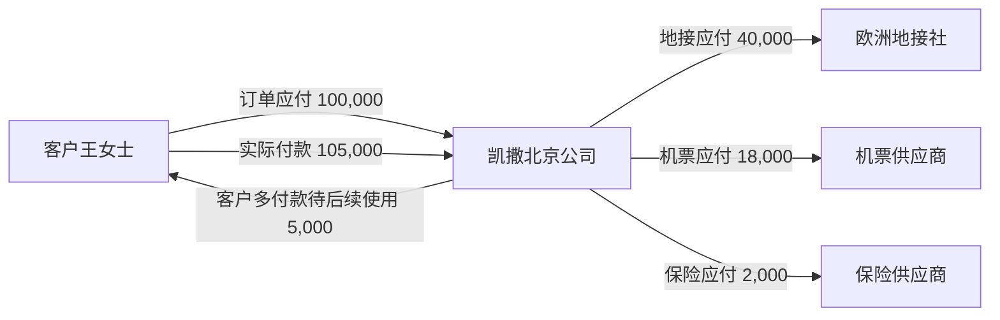

业务完成且全部供应商付款后，客户订单应收和供应商应付均为 0；凯撒北京公司仍对客户承担 5,000 元的预收款义务。

### 5. 按日期发生的完整链路

| 日期 | 实际发生 | 形成或变化的财务记录 | 余额变化 | 能否作为 NC 来源 |
|---|---|---|---|---|
| 8月20日 | 订单确认，约定定金和尾款 | 一张 100,000 元客户应收，含两项收款计划 | 客户应收 +100,000 | 是否形成会计应收按凯撒收入和合同政策判断；订单确认本身不当然推 NC |
| 8月21日 | 客户通过订单支付链接付定金 30,000 元 | 支付交易、到账流水、收款单、应收核销 30,000 元 | 应收由 100,000 降为 70,000 | 资金到账和客户往来变化形成收款会计事项 |
| 9月5日 | 向地接社预付 20,000 元 | 付款申请、付款单、银行回单、供应商预付明细 | 供应商预付 +20,000，银行资金 -20,000 | 预付和银行付款形成会计事项，不确认旅游成本 |
| 9月10日 | 客户支付尾款 75,000 元 | 一条 75,000 元流水；70,000 元核销尾款，5,000 元转客户预收 | 应收降为 0；客户预收 +5,000 | 银行到账 75,000；其中订单收款 70,000、预收 5,000 均需保留来源 |
| 9月20—27日 | 团队实际出行并完成主要履约 | 履约完成记录 | 不直接改变资金余额 | 达到收入确认条件后，形成 100,000 元收入事项，不能把 105,000 元都作为收入 |
| 9月28日 | 业务确认三家供应商实际成本 | 三项实际成本共 60,000 元；形成或转为三项应付 | 应付 +60,000 | 形成成本和应付事项；是否暂估及日期按公司政策 |
| 9月28日 | 地接预付款冲抵地接应付 | 预付冲抵明细 20,000 元 | 地接应付由 40,000 降为 20,000；预付降为 0 | 只结转往来，不重复产生资金付款 |
| 9月30日 | 支付三家供应商剩余 40,000 元 | 三张或按付款批次形成付款单和银行回单 | 应付由 40,000 降为 0；银行资金 -40,000 | 实际付款形成银行资金和供应商往来事项 |
| 9月30日 | 团期业务结算 | 团期结算单：收入 100,000、成本 60,000、毛利 40,000 | 不要求客户预收 5,000 清零 | 结算结果支持收入、成本结转及后续对账，不重复记录已经入账的收付款 |
| 10月10日 | 收到三家供应商合计 60,000 元发票；按客户申请开具 100,000 元旅游服务发票 | 供应商发票分别关联三项成本和应付；客户发票关联订单和收入 | 不因发票到达再次增加成本、应付或收入 | 发票税务事项按公司政策进入 NC；发票不能重复触发原业务金额 |

### 6. 金额计算

客户侧：

```text
订单确认金额 = 96,000 + 6,000 - 2,000 = 100,000
累计有效应收 = 100,000
订单已核销收款 = 30,000 + 70,000 = 100,000
订单期末待收 = 100,000 - 100,000 = 0
客户实际付款 = 30,000 + 75,000 = 105,000
客户预收余额 = 105,000 - 100,000 = 5,000
```

供应商侧：

```text
有效实际成本 = 40,000 + 18,000 + 2,000 = 60,000
有效应付 = 60,000
预付冲抵 = 20,000
后续付款 = 20,000 + 18,000 + 2,000 = 40,000
期末待付 = 60,000 - 20,000 - 40,000 = 0
供应商预付期末余额 = 20,000 - 20,000 = 0
```

经营结果：

```text
团期结算收入 = 100,000
团期结算成本 = 60,000
团期毛利 = 100,000 - 60,000 = 40,000
客户多付 5,000 属于预收款，不增加本团收入和毛利
```

资金与经营结果勾稽：

```text
银行累计流入 = 105,000
银行累计流出 = 20,000 + 40,000 = 60,000
本案例银行净流入 = 45,000
银行净流入 45,000 = 团期毛利 40,000 + 尚欠客户的预收款 5,000
```

### 7. 凯撒北京公司期末账面结果

| 项目 | 期末金额 | 原因 |
|---|---:|---|
| 客户应收 | 0 元 | 订单 100,000 元已全部核销 |
| 客户预收 | 5,000 元 | 客户多付并确认留作后续使用 |
| 供应商应付 | 0 元 | 20,000 元预付冲抵并支付余款 40,000 元 |
| 供应商预付 | 0 元 | 已全部冲抵地接应付 |
| 本案例银行净增加 | 45,000 元 | 收 105,000 元、付 60,000 元 |
| 团期结算收入 | 100,000 元 | 仅含该团有效客户交易金额 |
| 团期结算成本 | 60,000 元 | 三家供应商实际成本 |
| 团期毛利 | 40,000 元 | 收入减成本 |

### 8. 发票、会计事项与 NC

本案例客户发票金额为 100,000 元，只对应订单有效交易金额；客户预收 5,000 元未形成新订单或开票依据前不并入本团发票。三家供应商发票合计 60,000 元，分别与地接、机票、保险成本和应付核对。发票晚于成本确认或付款到达，不改变 9 月实际履约成本；税额抵扣和认证日期按正式税务制度处理。

以下为 NC 应接收的经济事项，不在本稿虚构正式科目编码和税额拆分：

| 会计日期依据 | 核算主体 | 会计事项 | 金额 | NC 处理要点 |
|---|---|---|---:|---|
| 8月21日银行到账日 | 凯撒北京公司 | 银行资金增加、客户预收或客户往来增加 | 30,000 元 | 订单号、客户、流水号可追溯 |
| 9月5日银行付款日 | 凯撒北京公司 | 银行资金减少、供应商预付增加 | 20,000 元 | 供应商、合同、付款申请和回单可追溯 |
| 9月10日银行到账日 | 凯撒北京公司 | 银行资金增加；订单款 70,000 元、客户预收 5,000 元 | 75,000 元 | 同一流水只记一次资金，分配明细合计等于流水金额 |
| 9月27日履约完成日或公司规定日期 | 凯撒北京公司 | 确认旅游业务收入及相关税额 | 含税交易金额 100,000 元 | 正式税额拆分待税务政策；不得把 105,000 元作为收入 |
| 9月28日成本确认日 | 凯撒北京公司 | 确认旅游业务成本和供应商应付 | 60,000 元 | 按供应商和费用明细追溯；发票未到不应导致成本事实消失 |
| 9月28日预付冲抵日 | 凯撒北京公司 | 供应商应付减少、供应商预付减少 | 20,000 元 | 不产生第二次银行付款 |
| 9月30日银行付款日 | 凯撒北京公司 | 供应商应付减少、银行资金减少 | 40,000 元 | 每笔回单与付款单、应付核销一致 |

推送要求：同一会计事项重复提交时，NC 只能保留一个有效结果；NC 返回凭证号和状态后，必须能从凭证反查到订单、团期、供应商账单、付款和银行流水。若已入账事项需要更正，应生成冲销或调整事项，不删除原记录。

### 9. 结算和对账结果

| 对账层次 | 应得结果 |
|---|---|
| 订单与应收 | 订单确认金额 100,000 元 = 有效应收 100,000 元 |
| 收款与核销 | 到账 105,000 元 = 订单核销 100,000 元 + 客户预收 5,000 元 |
| 团期收入 | 纳入团期的有效订单收入 100,000 元 = 团期结算收入 100,000 元 |
| 成本与应付 | 三项实际成本 60,000 元 = 三项有效应付 60,000 元 |
| 应付与付款 | 应付 60,000 元 = 预付冲抵 20,000 元 + 后续付款 40,000 元 |
| 银行 | 客户入账 105,000 元、供应商出账 60,000 元均与银行回单一致 |
| 发票 | 客户开票 100,000 元与订单交易金额一致；供应商发票 60,000 元与三项成本和应付一致；开票和到票不重复生成业务金额 |
| NC | 业务系统各类有效会计事项金额、主体、日期与 NC 有效凭证一致 |
| 期末余额 | 客户应收 0、客户预收 5,000、供应商应付 0、供应商预付 0 |

业务结算可以完成，因为订单收入和实际成本已经确认且差异有依据；客户预收 5,000 元是正常负债，不应为了“结算完成”被强制清零。

### 10. 财务确认问题与变化分支

需财务确认：

1. 标准跟团产品以出团日、回团日还是主要履约完成日确认收入。
2. 供应商账单未到时，是否在回团月暂估应付，次月如何冲回和转正式应付。
3. 公司承担优惠 2,000 元是直接减少交易价格，还是按批准政策另列销售费用。
4. 客户多付款默认进入预收，转为可长期使用的预存是否必须取得客户确认。

变化分支：

- 客户尾款只付 60,000 元：期末订单应收仍有 10,000 元，团期是否允许出行由业务信用规则决定；团期结算不等于应收清零。
- 客户取消或退差：承接 C30，先调整应收和退款义务，再独立处理供应商追款。
- 供应商账单变为 63,000 元但业务只认可 60,000 元：保留账单原额 63,000、争议 3,000、认可 60,000，不覆盖原账单。
- 结算后遗漏 8,000 元成本：承接 C34，原结算保留，新增补充结算和当期调整事项。

## 六、案例 C26：A 公司销售、B 公司包装并向外部供应商采购

> 本节保留三段债权债务和单体/集团结果的摘要。订单价格层次、销售差额、采购返还、全额/净额上缴、优惠积分、三段订单、团期映射和自动结算的财务确认，以[业财场景确认手册02：订单收款与多主体结算深化案例](业财场景确认手册02-订单收款与多主体结算深化案例.md)为准。开发和测试不得只依据本节三个汇总金额实现。

### 1. 业务故事与采用条件

凯撒北京销售公司（简称 A 公司）与客户签约并收款 120,000 元。旅游产品由凯撒目的地公司（简称 B 公司）组织和履约，A、B 按内部结算价 90,000 元结算；B 公司再向体系外地接社采购，实际成本 70,000 元。

本案例存在三段独立关系：客户对 A、A 对 B、B 对外部供应商。任何一段收款或付款都不能直接代替另一段的核销。

### 2. 参与公司和责任

| 责任 | 承担方 |
|---|---|
| 客户签约、销售、收款和对客开票 | A 公司 |
| 对客户承担的责任 | 按本案例假定由 A 公司作为主要责任方，最终应以合同和履约事实确认 |
| 产品组织和旅游履约 | B 公司 |
| 外部供应商采购和付款 | B 公司 |
| A、B 内部结算 | B 向 A 提供旅游产品，B 对 A 收款 |
| 单体账核算 | A、B 分别进入各自 NC 账簿 |
| 集团合并 | 抵销 A 的内部成本与 B 的内部收入，以及双方内部往来 |

### 3. 金额和收付条件

| 项目 | 金额 |
|---|---:|
| A 对客户销售价 | 120,000 元 |
| A 与 B 内部结算价 | 90,000 元 |
| B 对外部供应商实际成本 | 70,000 元 |
| 客户已向 A 付款 | 120,000 元 |
| A 截至结算日已向 B 付款 | 60,000 元 |
| B 截至结算日已向供应商付款 | 50,000 元 |

结算日仍有 A 对 B 内部应付 30,000 元，B 对供应商应付 20,000 元。存在余额不影响业务已经履约和经营结果已经确认。

### 4. 主体和债权债务图

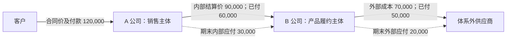

### 5. 按日期发生的完整链路

| 日期 | 实际发生 | A 公司变化 | B 公司变化 | 能否作为 NC 来源 |
|---|---|---|---|---|
| 8月20日 | 客户订单确认 120,000 元 | 形成客户业务应收 120,000 元 | 无 | 会计应收时点按 A 的合同政策判断 |
| 8月21日 | 客户向 A 付款 120,000 元 | 银行资金 +120,000；核销客户应收 | 无 | A 形成收款事项 |
| 8月25日 | A、B 内部业务确认，结算价 90,000 元 | 形成对 B 的内部采购关系 | 形成对 A 的内部销售关系 | 仅业务确认不重复入账；在规定的内部结算时点形成双方对应事项 |
| 9月1日 | B 向供应商预付或付款 50,000 元 | 无 | 银行资金 -50,000；未履约前为预付，履约后可核销应付 | B 形成付款或预付事项 |
| 9月20—27日 | 团队履约完成 | 满足条件时确认对外收入 120,000 和内部采购成本 90,000 | 确认内部收入 90,000 和外部成本 70,000 | A、B 分别形成收入、成本和往来事项 |
| 9月28日 | B 确认供应商账单 70,000 元 | 无 | 对供应商有效应付 70,000；前期 50,000 元付款/预付核销后待付 20,000 | B 形成外部成本、应付及预付冲抵事项 |
| 9月30日 | A 向 B 支付 60,000 元 | 银行资金 -60,000；内部应付由 90,000 降为 30,000 | 银行资金 +60,000；内部应收由 90,000 降为 30,000 | 双方分别形成内部收付款事项，并使用同一内部关联号 |
| 9月30日 | A、B 完成业务结算 | A 单体毛利 30,000 元 | B 单体毛利 20,000 元 | 结算结果支持双方入账与集团抵销，不要求往来清零 |
| 10月5日 | A 对客户开票 120,000 元，B 取得外部供应商发票 70,000 元；A、B 内部票据按集团制度办理 | 客户发票关联 A 的订单和收入 | 供应商发票关联 B 的外部成本和应付 | 发票税务事项分别进入所属主体；不能用 A 的客户发票代替 B 的外部供应商发票 |

### 6. 金额计算

A 公司：

```text
对外收入 = 120,000
内部采购成本 = 90,000
A 单体毛利 = 120,000 - 90,000 = 30,000
A 对 B 期末内部应付 = 90,000 - 60,000 = 30,000
A 本案例银行净流入 = 120,000 - 60,000 = 60,000
```

B 公司：

```text
内部收入 = 90,000
外部成本 = 70,000
B 单体毛利 = 90,000 - 70,000 = 20,000
B 对 A 期末内部应收 = 90,000 - 60,000 = 30,000
B 对供应商期末应付 = 70,000 - 50,000 = 20,000
B 本案例银行净流入 = 60,000 - 50,000 = 10,000
```

集团合并：

```text
抵销内部收入 = 90,000
抵销内部成本 = 90,000
抵销 B 对 A 内部应收 = 30,000
抵销 A 对 B 内部应付 = 30,000
集团对外收入 = 120,000
集团对外成本 = 70,000
集团毛利 = 120,000 - 70,000 = 50,000
集团对外银行净流入 = 客户付款 120,000 - 对外供应商付款 50,000 = 70,000
集团对外银行净流入 70,000 = 集团毛利 50,000 + 尚未支付的外部应付 20,000
```

### 7. 各公司期末账面结果

| 公司 | 对外收入 | 内部收入 | 内部成本 | 对外成本 | 内部应收 | 内部应付 | 外部应付 | 银行净变化 | 单体毛利 |
|---|---:|---:|---:|---:|---:|---:|---:|---:|---:|
| A 公司 | 120,000 | 0 | 90,000 | 0 | 0 | 30,000 | 0 | +60,000 | 30,000 |
| B 公司 | 0 | 90,000 | 0 | 70,000 | 30,000 | 0 | 20,000 | +10,000 | 20,000 |
| 集团合并后 | 120,000 | 0 | 0 | 70,000 | 0 | 0 | 20,000 | +70,000 | 50,000 |

### 8. 发票、会计事项与 NC

A 的客户发票、A—B 内部交易票据、B 的外部供应商发票属于三段不同票据关系，必须分别关联各自交易。表中先按“客户发票 120,000 元、外部供应商发票 70,000 元”展示；A、B 是否开具 90,000 元内部交易发票、开票日期及税额，必须由集团税务和内部结算制度确认。

| 会计事项 | 推送主体 | 金额 | 关键追溯和匹配要求 |
|---|---|---:|---|
| 客户收款 | A 公司 | 120,000 元 | 客户、订单、银行流水 |
| 对外收入确认 | A 公司 | 含税交易金额 120,000 元 | 履约依据、主责方判断、税额待正式拆分 |
| 内部采购成本和对 B 内部应付 | A 公司 | 90,000 元 | 内部业务结算单、B 公司、内部关联号 |
| A 向 B 内部付款 | A 公司 | 60,000 元 | 付款单、银行回单、内部应付核销 |
| 内部销售收入和对 A 内部应收 | B 公司 | 90,000 元 | 与 A 使用相同内部关联号、原币金额和期间 |
| 外部成本和供应商应付 | B 公司 | 70,000 元 | 供应商账单、团期成本、外部供应商 |
| B 对供应商付款或预付冲抵 | B 公司 | 50,000 元 | 付款回单、应付或预付核销 |
| B 收到 A 内部款 | B 公司 | 60,000 元 | 与 A 付款同一内部关联号 |

NC 不能把两家公司合成一张凭证。A、B 各自在自己的核算主体推送；集团合并系统或 NC 合并流程再按交易对方和内部关联号完成抵销。

### 9. 结算和对账结果

| 对账层次 | 应得结果 |
|---|---|
| 客户订单 | A 的客户应收 120,000 元已由客户付款全部核销 |
| A-B 业务 | A 内部成本 90,000 元 = B 内部收入 90,000 元 |
| A-B 往来 | A 对 B 内部应付 30,000 元 = B 对 A 内部应收 30,000 元 |
| B-供应商 | B 外部成本/应付 70,000 元 = 已付 50,000 元 + 待付 20,000 元 |
| 发票 | A 客户发票、A—B 内部票据、B 外部供应商发票分别核对，不跨交易替代；金额和税额按所属主体进入各自 NC |
| 单体经营 | A 毛利 30,000 元，B 毛利 20,000 元 |
| 集团经营 | 对外收入 120,000 元 - 对外成本 70,000 元 = 集团毛利 50,000 元 |
| NC | A、B 双方内部金额、原币、期间、交易对方和内部关联号一致；合并抵销 90,000 元内部损益和 30,000 元内部余额 |

### 10. 财务确认问题与变化分支

需财务确认：

1. A、B 的内部收入和成本在什么业务时点确认，内部结算价由谁审批。
2. A、B 是否需要开具内部交易发票，跨期开票如何对账。
3. A 对客户是否为主要责任方；若实际由 B 对客户承担主要责任，收入列报需要重新判断。
4. 集团合并抵销是在 NC 内完成还是由独立合并系统完成。

变化分支：

- B 公司本身就是自营履约主体且无外部采购：使用 C25，取消 B—外部供应商一段。
- A、B 只是同一法人下的经营单元：使用 C24，不生成法人间应收应付和法定账内部收入成本。
- 客户将款付到集团资金公司：在本案例上叠加 C28，A 的客户债权不变，新增 A—资金公司的代收清算。
- A 公司已结算、B 公司次月才确认成本：双方保留内部在途和期间差异，不回改原始业务日期。

## 七、案例 C13：OTA 月结、退款、佣金、补贴和净额到账

### 1. 业务故事与采用条件

凯撒北京公司在某 OTA 店铺销售自营旅游产品，平台替客户收款。本月已履约订单原额 100,000 元，其中一笔订单发生平台直接退款 10,000 元；平台按协议扣佣金 12,000 元，并向凯撒补贴 2,000 元，最终向凯撒银行账户打款 80,000 元。

本案例假定凯撒对游客承担主要履约责任，平台只是销售和代收渠道。因此凯撒按有效客户交易金额确认收入，平台佣金作为渠道费用；不能用净到账 80,000 元直接作为旅游收入。

### 2. 参与公司和责任

| 责任 | 承担方 |
|---|---|
| 对客旅游合同和主要履约 | 凯撒北京公司 |
| 客户支付介质和代收 | OTA 平台 |
| 平台直接退款执行 | OTA 平台，并须与凯撒售后结果对应 |
| 平台账单、佣金和补贴确认 | 凯撒北京公司与 OTA 按月对账 |
| 收入、渠道费用和渠道应收核算 | 凯撒北京公司 |
| 结算范围 | OTA 平台 + 店铺 + 2026年9月账期，保留订单明细 |

### 3. 金额条件

| 项目 | 金额 | 对平台应结款的影响 |
|---|---:|---:|
| 已履约订单原额 | 100,000 元 | +100,000 元 |
| 平台直接退款 | -10,000 元 | -10,000 元 |
| 平台佣金 | 12,000 元 | -12,000 元 |
| 平台活动补贴 | 2,000 元 | +2,000 元 |
| 平台应打款 | 80,000 元 | 80,000 元 |
| 银行实际到账 | 80,000 元 | 差异 0 元 |

本案例只展示渠道链路。产品实际履约成本仍按团期、订单和供应商链路确认，不因平台净额打款而改变。

### 4. 主体和债权债务图

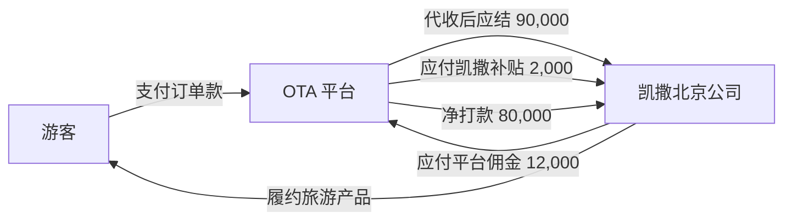

退款后平台代收的有效客户款为 90,000 元。佣金和补贴是凯撒与平台之间的渠道结算项目，不应覆盖游客订单金额。

### 5. 按日期发生的完整链路

| 日期或账期节点 | 实际发生 | 财务记录和余额变化 | 能否作为 NC 来源 |
|---|---|---|---|
| 9月内 | 平台产生并代收订单 100,000 元 | 系统保存每张 OTA 订单和平台订单号；随履约形成渠道应收累计 100,000 元 | 达到收入确认条件的订单形成收入和渠道应收事项 |
| 9月内 | 平台直接向游客退款 10,000 元 | 必须生成或关联凯撒售后单；渠道应收减少 10,000 元 | 形成退款、收入或税额调整事项，按政策和实际退款日处理 |
| 10月3日 | 平台出具 9 月账单 | 账单列示有效订单 90,000、佣金 12,000、补贴 2,000、应打款 80,000 | 账单本身是核对依据；经确认的佣金、补贴和往来调整形成会计事项 |
| 10月5日 | 凯撒确认平台佣金 12,000 元 | 渠道费用 +12,000；对平台渠道应收减少 12,000 | 形成渠道费用和平台往来事项 |
| 10月5日 | 凯撒确认平台补贴 2,000 元 | 对平台渠道应收增加 2,000；补贴性质待政策决定冲减费用或确认其他收益 | 形成补贴和平台往来事项 |
| 10月8日 | 平台净额打款 80,000 元 | 银行资金 +80,000；渠道应收核销 80,000，期末余额 0 | 形成银行收款和平台往来核销事项 |
| 10月8日 | 完成平台账期结算 | 渠道结算单锁定订单、退款、佣金、补贴和到账明细 | 结算不重复确认收入或收款，只汇总已生效结果并支持对账 |
| 10月15日 | 收到平台佣金发票 12,000 元；客户发票按订单和客户申请办理 | 平台佣金发票关联渠道费用和平台账单；客户发票关联原订单 | 发票税务事项按公司政策处理，不改变 80,000 元银行到账和 90,000 元有效客户交易 |

### 6. 金额计算

```text
有效客户交易金额 = 100,000 - 10,000 = 90,000
平台应结客户款 = 90,000
扣除佣金后余额 = 90,000 - 12,000 = 78,000
加平台补贴后应打款 = 78,000 + 2,000 = 80,000
实际到账 = 80,000
渠道结算差异 = 80,000 - 80,000 = 0
```

按本案例的主要责任方假设：

```text
凯撒旅游业务含税交易金额 = 90,000
平台佣金/渠道费用 = 12,000
平台补贴 = 2,000（最终列作费用冲减还是其他收益，待财务政策确认）
渠道链路净贡献 = 90,000 - 12,000 + 2,000 = 80,000
```

渠道链路净贡献不是团期最终毛利；还必须扣除该产品对应的供应商实际成本。

### 7. 凯撒北京公司期末账面结果

| 项目 | 期末金额 | 说明 |
|---|---:|---|
| OTA 渠道应收 | 0 元 | 100,000 - 10,000 - 12,000 + 2,000 - 80,000 = 0 |
| 银行实际到账 | 80,000 元 | 与平台打款和银行流水一致 |
| 有效客户交易金额 | 90,000 元 | 原订单 100,000 元扣除退款 10,000 元 |
| 平台佣金 | 12,000 元 | 独立渠道费用，不冲掉订单收入明细 |
| 平台补贴 | 2,000 元 | 单独保存承担方和政策归类 |
| 团期成本 | 本案例未给定 | 回到所属团期或订单的供应商成本链路 |

### 8. 发票、会计事项与 NC

平台佣金发票 12,000 元只能核对平台佣金费用，不能作为把旅游收入从 90,000 元改为 78,000 元的依据。客户旅游发票按有效订单和开票规则办理；平台补贴是否需要发票或结算凭证，以及税务归类，由财务制度确认。

| 会计事项 | 金额 | 会计日期依据 | NC 处理要点 |
|---|---:|---|---|
| 已履约订单收入和 OTA 渠道应收 | 100,000 元 | 各订单履约日或公司规定日期 | 按订单汇总仍须可反查平台订单号 |
| 平台退款及收入/渠道应收调整 | 10,000 元 | 售后生效和平台实际退款日期按政策处理 | 必须关联原订单和平台退款号 |
| 平台佣金费用及渠道应收减少 | 12,000 元 | 平台账单确认日 | 不得以净到账差额无依据地记费用 |
| 平台补贴及渠道应收增加 | 2,000 元 | 补贴账单确认日 | 会计归类待财务政策确认，保留活动和承担方 |
| 银行到账及渠道应收核销 | 80,000 元 | 银行到账日 | 一笔净到账与一个平台清算批次匹配 |

若平台是对客户承担主要责任的一方、凯撒只提供代理或供货服务，则本案例的收入列报需要改用对应合同结算价或佣金口径，不能沿用 90,000 元全额模式。

### 9. 结算和对账结果

| 对账层次 | 应得结果 |
|---|---|
| 订单对账 | 系统 OTA 订单与平台订单逐单匹配，原额合计 100,000 元 |
| 退款对账 | 平台退款 10,000 元必须对应系统售后和原订单，不允许只有平台扣款没有售后依据 |
| 账单对账 | 100,000 - 10,000 - 12,000 + 2,000 = 平台应打款 80,000 元 |
| 银行对账 | 平台应打款 80,000 元 = 银行实际到账 80,000 元 |
| 发票 | 平台佣金发票 12,000 元与佣金明细一致；客户发票与有效订单对应；补贴凭证单独核对 |
| 渠道余额 | 期初渠道应收 0 + 本期增加 102,000 - 本期减少 102,000 = 期末 0 |
| NC 对账 | 收入、退款、佣金、补贴、银行到账的有效会计事项分别与 NC 凭证一致 |

### 10. 财务确认问题与变化分支

需财务确认：

1. 各 OTA 合同下，凯撒对游客是主要责任方还是代理方；不能全平台统一使用同一种收入模式。
2. 平台补贴 2,000 元是冲减佣金、确认其他收益，还是调整客户交易价格。
3. 平台佣金发票未到时是否先按账单确认费用和应付/应收抵减。
4. 平台直接退款的会计日期按平台扣款日、售后批准日还是原订单收入调整日处理。

变化分支：

- 银行只到账 79,500 元：渠道应收仍有 500 元，必须形成平台差异，不得把佣金直接改成 12,500 元。
- 平台下一期拒付 5,000 元：承接 C15，恢复争议应收或确认损失，不能当作本期普通退款。
- 平台滚存保证金 3,000 元：保证金单独形成可收回余额，不能混入佣金。
- 平台代客退款但系统没有售后单：列为阻断渠道结算的异常，待业务确认后才能改变订单和收入。

## 八、三条样板案例形成的共同开发规则

1. 一笔业务可以同时存在客户、供应商、渠道和内部往来，必须分别保存和核销，不能只设一个“结算余额”。
2. 原始订单、银行流水、平台账单和供应商账单都不能被确认结果覆盖；差异通过核对、调整和冲销记录体现。
3. 收款不等于收入，付款不等于成本，业务结算完成不等于所有应收应付和预收预付清零。
4. 一笔资金只能记一次真实流入或流出；拆单、转款、预收转用和内部清算只能改变归属，不能重复增加资金。
5. 多法人必须分别形成各自的单据、余额和 NC 会计事项，内部交易必须使用同一关联号成对核对。
6. 每一项余额都必须能够由增加、核销、冲销、退回和调整明细重新计算，不能直接手工改最新余额。
7. 每个结算结果必须能下钻到订单、团期或项目、费用明细、供应商账单、收付款和 NC 凭证。
8. NC 推送失败不能回退已经真实发生的业务和资金状态；修正会计事项后重推，并保留失败原因和历次结果。

## 九、其余完整业务案例

以下案例继续使用前述十段式结构。C01、C13、C26 已作为三类业务的详细样板，其余案例在不重复公共规则的前提下，完整列出本场景特有的主体、金额、单据、余额、结算、发票、NC 和对账结果。

## 十、案例 C02：一笔款对应多订单、多人付款和多付留存

### 1. 业务故事与采用条件

企业客户华夏公司为三名员工购买三个不同团期，订单 A、B、C 应收分别为 30,000、40,000、20,000 元。公司一次转账 100,000 元；同时员工家属又替订单 C 支付 5,000 元。适用于一款多单、一单多人付款和已知客户多付。

### 2. 参与公司和责任

三张订单均由凯撒北京公司签约、收款和核算；付款方包括华夏公司和员工家属，但债务客户仍按各订单合同确定。三张订单分别回到自己的团期结算。

### 3. 金额条件

| 项目 | A订单 | B订单 | C订单 | 合计 |
|---|---:|---:|---:|---:|
| 有效应收 | 30,000 | 40,000 | 20,000 | 90,000 |
| 公司款分配 | 30,000 | 40,000 | 20,000 | 90,000 |
| 家属付款 | 0 | 0 | 5,000 | 5,000 |
| 未用于订单 | 0 | 0 | 5,000 | 5,000 |

### 4. 主体和债权债务图

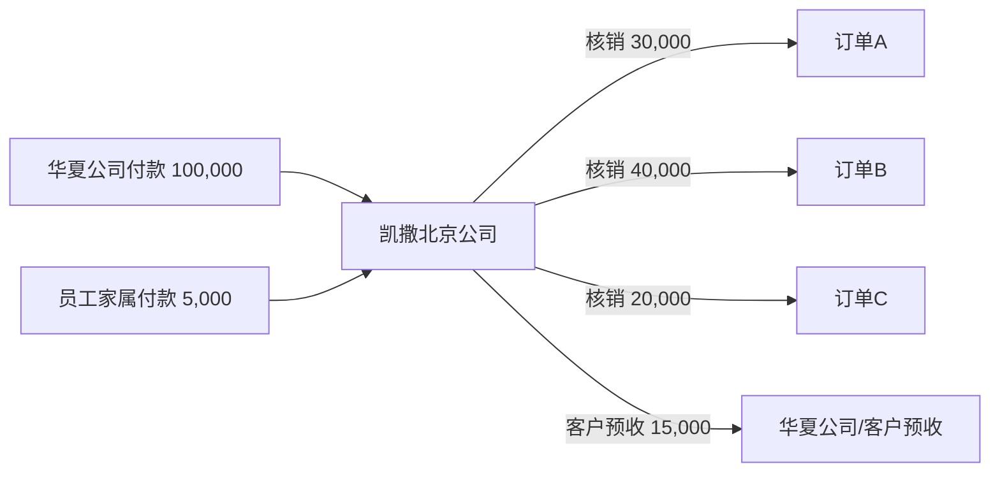

### 5. 按日期发生的完整链路

| 日期 | 业务事实 | 财务数据与余额变化 | 入账判断 |
|---|---|---|---|
| 8月1日 | 三单确认 | 三张应收合计 +90,000 | 会计应收按合同条件判断 |
| 8月3日 | 公司转账 100,000 | 一条流水拆四项：三单核销 90,000、预收 10,000 | 银行只记一次 100,000 |
| 8月4日 | 家属支付 5,000 | 新流水 5,000，因 C 已结清转客户预收 | 形成银行和预收事项 |
| 各团履约日 | 三单分别履约 | 各自确认收入和结算，不合并团期 | 按各团会计日期进入 NC |

### 6. 金额计算

```text
三单有效应收 = 30,000 + 40,000 + 20,000 = 90,000
累计实收 = 100,000 + 5,000 = 105,000
订单核销 = 90,000
客户预收 = 105,000 - 90,000 = 15,000
流水分配检查 = 90,000订单核销 + 15,000预收 = 105,000
```

### 7. 各主体和资金结果

凯撒北京公司客户应收为 0、客户预收为 15,000 元、银行增加 105,000 元。付款方信息保留在两张收款单，不能为了多人付款拆出虚假订单或复制银行流水。

### 8. 发票、会计事项与 NC

收款事项按两条真实流水进入 NC；收入按三张订单各自履约确认。发票按订单和合同客户开具，家属代付不自动改变发票抬头。预收 15,000 元未转用前不作为三单收入。

### 9. 结算和最终对账

| 检查项 | 应有结果 |
|---|---:|
| 三单有效应收/已核销 | 90,000 / 90,000 |
| 两笔银行到账 | 105,000 |
| 期末客户预收 | 15,000 |
| 流水未分配 | 0 |
| 重复资金记录 | 0 |

### 10. 财务确认问题与变化分支

确认预收应归华夏公司还是具体员工；若客户书面要求转入可长期使用的预存，增加预存账户变动并减少预收，不重复记银行。若付款方和客户都无法识别，改用 C03 的待认领款项。

## 十一、案例 C03：银行、静态码、现金和 POS 收款差异

### 1. 业务故事与采用条件

直营门店当日系统订单应收 80,000 元：订单活码 30,000、门店静态码 20,000、现金 15,000、POS 刷卡 15,000。实际银行及平台清算后，静态码手续费 200 元，现金仅实缴 14,800 元，形成现金短款 200 元。

### 2. 参与公司和责任

客户债权、收款和账簿均归凯撒北京公司；门店经办人负责现金收取和实缴，支付平台负责静态码/POS 清算。收款线索没有真实流水时不得核销。

### 3. 金额条件

| 介质 | 客户实付 | 银行净入 | 单列差异 |
|---|---:|---:|---:|
| 活码 | 30,000 | 30,000 | 0 |
| 静态码 | 20,000 | 19,800 | 手续费 200 |
| 现金 | 15,000 | 14,800 | 短款 200 |
| POS | 15,000 | 15,000 | 0 |

### 4. 主体和债权债务图

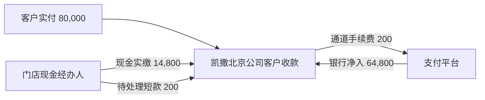

### 5. 按日期发生的完整链路

| 节点 | 财务数据 | 余额变化 | 入账判断 |
|---|---|---|---|
| 客户支付 | 四类收款记录和订单核销 | 客户应收 -80,000 | 确认真实支付后形成收款事项 |
| 静态码认款 | 平台交易号、认款单、收款单 | 平台应结 20,000 | 截图不能作为唯一依据 |
| 平台清算 | 银行到账 19,800、费用 200 | 平台应结清零 | 银行和费用分别入账 |
| 现金实缴 | 交款 14,800、短款单 200 | 现金在途清理，待处理短款 +200 | 短款批准前不直接记损失 |

### 6. 金额计算

```text
客户收款 = 30,000 + 20,000 + 15,000 + 15,000 = 80,000
银行/库存现金实际增加 = 30,000 + 19,800 + 14,800 + 15,000 = 79,600
差额 = 通道手续费200 + 待处理短款200 = 400
80,000 = 79,600 + 200 + 200
```

### 7. 各主体和资金结果

客户应收为 0；平台应结为 0；支付费用 200 元；待处理短款 200 元。短款经责任认定后转员工/门店往来或批准损失，不能倒改客户收款。

### 8. 发票、会计事项与 NC

客户收款、平台手续费、现金实缴和短款为不同事项。客户发票仍按订单有效交易开具。NC 中客户收款总额必须为 80,000 元，银行及现金净增 79,600 元，差额由费用和短款解释。

### 9. 结算和最终对账

系统应收 80,000 = 客户实收 80,000；客户实收 80,000 = 银行/现金 79,600 + 手续费 200 + 短款 200；无真实流水的收款线索金额必须为 0。

### 10. 财务确认问题与变化分支

需确认现金在客户付款日还是出纳复核日核销应收，以及短款审批权限。完全无法识别的银行来款先形成待认领款项；已知客户但不知订单则形成客户预收。

## 十二、案例 C04：外币收款和押金保证金

### 1. 业务故事与采用条件

境外客户支付 10,000 美元团款，订单确认汇率 7.10，应收本币 71,000 元；银行到账日汇率 7.15，银行扣手续费 50 美元。同时客户另缴可退押金 1,000 美元。

### 2. 参与公司和责任

凯撒北京公司为签约、收款和核算主体。团款与押金使用同一外币账户但属于不同债务关系；押金不得作为订单预收或收入。

### 3. 金额条件

团款原币 10,000 美元、押金 1,000 美元、手续费 50 美元；示例到账总额按 10,950 美元，到账日折算 78,292.50 元。

### 4. 主体和债权债务图

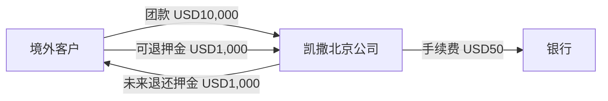

### 5. 按日期发生的完整链路

| 节点 | 财务数据和余额 | 入账判断 |
|---|---|---|
| 订单确认 | 应收 USD10,000 / CNY71,000 | 按会计应收条件 |
| 银行到账 | 外币资金 USD10,950；团款核销 USD10,000；押金负债 USD1,000；手续费 USD50 | 保留原币、本币、汇率 |
| 核销 | 团款原币应收清零；本币折算差异单列 | 汇兑差额按公司政策 |
| 押金退还 | 押金负债和外币银行同时减少 USD1,000 | 不冲订单收入 |

### 6. 金额计算

```text
团款应收本币 = USD10,000 × 7.10 = 71,000
团款到账日折算 = USD10,000 × 7.15 = 71,500
团款实现汇兑差额 = 500
押金负债 = USD1,000 × 7.15 = 7,150
银行手续费 = USD50 × 7.15 = 357.50
银行净到账 = (10,000 + 1,000 - 50) × 7.15 = 78,292.50
```

### 7. 各主体和资金结果

团款原币应收为 0；押金原币负债为 USD1,000；手续费 USD50；汇兑差额 CNY500。后续退押金按退款日汇率结算，产生的本币差异另记。

### 8. 发票、会计事项与 NC

NC 分别承接外币银行资金、客户往来、押金其他应付、手续费和汇兑差额。发票按订单交易和跨境税务政策处理，押金未扣罚或转用前不开发票、不确认收入。

### 9. 结算和最终对账

原币团款应收 USD10,000 = 核销 USD10,000；银行原币入账 USD10,950 = 团款 USD10,000 + 押金 USD1,000 - 手续费 USD50；押金余额 USD1,000 单独与合同核对。

### 10. 财务确认问题与变化分支

确认订单汇率、到账汇率、手续费承担和期末重估规则。押金被批准扣罚时，先减少押金负债，再按扣罚性质确认收入或损失补偿，不能直接改订单价。

## 十三、案例 C05：MICE/研学项目阶段收款和验收

### 1. 业务故事与采用条件

某学校委托研学项目，合同总额 500,000 元：签约款 150,000、出发前进度款 250,000、验收尾款 100,000。学校支付 450,000 元，家长另付自选项目 30,000 元；验收确认合同服务 500,000 元，自选服务确认 30,000 元，项目实际成本 420,000 元。

### 2. 参与公司和责任

凯撒研学公司签约、收款、履约、采购和核算；学校为合同客户，家长为自选服务付款方。结算对象为项目 P01 和对应营期，阶段应收不能拆成虚假订单。

### 3. 金额条件

合同及变更有效交易 530,000 元；累计实收 480,000 元；尾款未收 50,000 元；实际成本 420,000 元，其中已付 350,000 元。

### 4. 主体和债权债务图

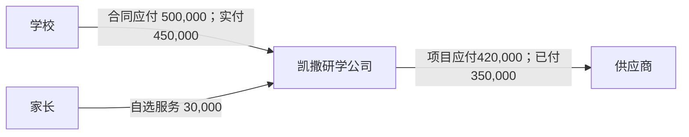

### 5. 按日期发生的完整链路

| 节点 | 财务数据与余额 | 入账判断 |
|---|---|---|
| 签约及变更 | 阶段收款计划 500,000、自选服务 30,000 | 合同资产/应收按无条件收款权判断 |
| 收款 | 学校 450,000、家长 30,000 | 分别保留付款方并核销对应阶段 |
| 履约和验收 | 验收确认 530,000 | 按履约进度或验收确认收入 |
| 成本确认 | 实际成本、应付 420,000 | 成本结转，已付 350,000 后待付 70,000 |
| 项目结算 | 收入 530,000、成本 420,000、毛利 110,000 | 允许未收 50,000、未付 70,000 保留 |

### 6. 金额计算

```text
有效交易 = 500,000 + 30,000 = 530,000
待收 = 530,000 - 450,000 - 30,000 = 50,000
待付 = 420,000 - 350,000 = 70,000
项目毛利 = 530,000 - 420,000 = 110,000
```

### 7. 各主体和资金结果

客户应收 50,000、供应商应付 70,000、银行净流入 130,000（收 480,000、付 350,000）。银行净流入 130,000 = 毛利 110,000 + 未付 70,000 - 未收 50,000。

### 8. 发票、会计事项与 NC

学校合同发票与家长自选服务发票分别关联；阶段收款、合同资产转应收、验收收入、成本应付和收付款按各自日期进入研学公司 NC。未收尾款不阻止已满足条件的收入确认。

### 9. 结算和最终对账

有效交易 530,000 = 已收 480,000 + 待收 50,000；成本应付 420,000 = 已付 350,000 + 待付 70,000；项目结算贡献 110,000；未决差异为 0。

### 10. 财务确认问题与变化分支

确认履约进度法还是验收时点法、学校和家长开票口径、追加服务审批。学校逾期尾款转 C07 做减值评估，不回改项目收入。

## 十四、案例 C06：公司、门店和平台共同承担优惠

### 1. 业务故事与采用条件

订单原价 100,000 元，客户只付 90,000 元。优惠 10,000 元中凯撒承担 4,000、加盟门店承担 3,000、OTA 平台承担 3,000 元。

### 2. 参与公司和责任

凯撒北京公司为销售和收款主体；加盟门店、OTA 为优惠承担方。客户不欠优惠金额，但门店和平台承担部分形成渠道结算调整。

### 3. 金额条件

客户有效应收 90,000；公司承担 4,000；门店结算减少 3,000；平台补贴应收 3,000。产品实际成本另按团期确认。

### 4. 主体和债权债务图

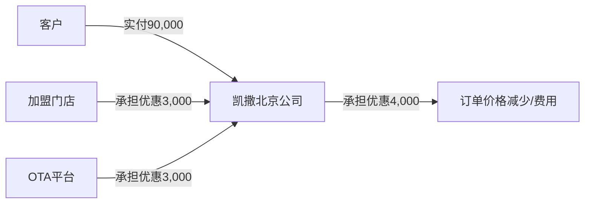

### 5. 按日期发生的完整链路

订单确认时保存优惠总额及三方承担明细；客户收款核销 90,000；门店承担额减少其分润或增加门店应收；平台承担额增加渠道应收；公司承担额按政策减少交易价格或列销售费用。

### 6. 金额计算

```text
客户应收 = 100,000 - 10,000 = 90,000
优惠总额 = 4,000 + 3,000 + 3,000 = 10,000
公司实际承担 = 10,000 - 门店3,000 - 平台3,000 = 4,000
```

### 7. 各主体和资金结果

客户待收 0；平台补贴应收 3,000；门店应收增加或分润减少 3,000；公司承担 4,000。三方承担款未收不应重新向客户追收。

### 8. 发票、会计事项与 NC

客户发票、平台补贴凭证和门店结算凭证分别核对。NC 归类取决于优惠是否改变交易价格、属于销售费用还是渠道往来；同一 10,000 元不得既冲收入又全额记费用。

### 9. 结算和最终对账

客户原价 100,000 = 客户实付 90,000 + 优惠 10,000；优惠 10,000 = 公司 4,000 + 门店 3,000 + 平台 3,000；重复承担为 0。

### 10. 财务确认问题与变化分支

需按活动合同逐项确认承担方、凭证和税务口径。订单必须同时保存展示价、合同金额、客户现金实付、每项优惠金额、承担方应补和核销去向。平台实际少补 500 元时保留渠道差异 500 元，不倒改优惠承担明细。

## 十五、案例 C07：客户欠款减值、核销和后续收回

### 1. 业务故事与采用条件

企业客户团款 200,000 元，已履约并收 120,000 元，期末欠款 80,000 元。财务按政策计提 40% 减值 32,000 元；次年批准核销 80,000 元，随后又收回 20,000 元。

### 2. 参与公司和责任

销售公司保留客户债权；业务负责催收依据，财务负责减值评估，坏账核销必须由有权人员批准。减值、核销和收回不重开原团期经营结算。

### 3. 金额条件

原应收 200,000、已收 120,000、欠款 80,000、减值准备 32,000、批准核销 80,000、后续收回 20,000。

### 4. 主体和债权债务图


### 5. 按日期发生的完整链路

履约时确认收入和应收；收款核销 120,000；期末计提准备不减少业务催收余额；批准核销后关闭业务待收并使用准备；后续收回 20,000 形成真实银行资金和已核销款项收回事项。

### 6. 金额计算

```text
期末业务待收 = 200,000 - 120,000 = 80,000
减值准备 = 80,000 × 40% = 32,000
计提后应收账面净额 = 80,000 - 32,000 = 48,000
批准核销 = 80,000
后续收回 = 20,000
```

### 7. 各主体和资金结果

计提时业务待收仍为 80,000；核销后业务待收为 0；后续银行增加 20,000，但不能恢复原订单收入。核销前后和收回记录均保留原客户、订单及批准单号。

### 8. 发票、会计事项与 NC

计提、转回、坏账核销和已核销款项收回是四类不同 NC 事项。原销售发票不因减值自动红冲；税务坏账处理按正式政策另行确认。

### 9. 结算和最终对账

原应收 200,000 = 已收 120,000 + 核销 80,000；核销审批金额 80,000 与关闭待收一致；后续收回 20,000 与银行到账一致；原团期收入不变。

### 10. 财务确认问题与变化分支

确认账龄分段、减值比例、核销权限、税前扣除和收回列报。只有计提不得关闭业务催收；未经批准不得用“坏账”强行把待收清零。

## 十六、案例 C08：直营门店销售

### 1. 业务故事与采用条件

北京直营门店销售所属法人自营团，客户价 60,000 元，总部账户收款，实际成本 42,000 元。门店不是独立交易法人，只承担销售业绩和责任归属。

### 2. 参与公司和责任

所属法人签约、收款、履约、采购、开票和核算；门店为经营单元，不形成对总部应收应付。

### 3. 金额条件

订单 60,000、已收 60,000、成本及应付 42,000、已付 42,000。

### 4. 主体和债权债务图

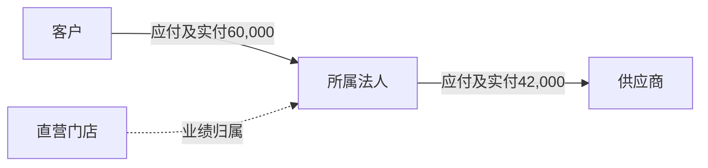

### 5. 按日期发生的完整链路

订单确认形成法人客户应收；总部到账核销；履约形成收入；成本确认形成供应商应付并付款；团期结算保留门店业绩归属，不生成内部往来。

### 6. 金额计算

```text
待收 = 60,000 - 60,000 = 0
待付 = 42,000 - 42,000 = 0
毛利 = 60,000 - 42,000 = 18,000
```

### 7. 各主体和资金结果

所属法人银行净增加 18,000、收入 60,000、成本 42,000；门店法定账收入、应收和应付均为 0，仅保留业绩 60,000 和毛利责任数据。

### 8. 发票、会计事项与 NC

客户和供应商发票均归所属法人；收款、收入、成本、应付和付款只进入所属法人 NC，门店作为辅助核算，不生成第二套凭证。

### 9. 结算和最终对账

订单、银行、团期、供应商和 NC 均为 60,000/42,000/18,000；法人间往来 0。

### 10. 财务确认问题与变化分支

确认直营门店所属法人和 NC 辅助档案。门店收现金或 POS 发生差异时叠加 C03，不改变本场景主体归属。

## 十七、案例 C09：加盟门店获客、总部直收和分润

### 1. 业务故事与采用条件

加盟门店介绍客户购买总部产品，客户价 100,000 元由总部直接收取；门店按有效交易额 8% 获得分润 8,000 元，总部产品成本 70,000 元。

### 2. 参与公司和责任

总部与客户签约、收款、履约和开票；加盟门店为外部合作方，只形成分润应付。

### 3. 金额条件

客户收款 100,000；门店分润 8,000；供应商成本及付款 70,000；门店已付 5,000，期末待付 3,000。

### 4. 主体和债权债务图

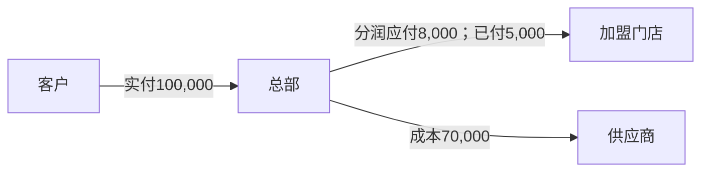

### 5. 按日期发生的完整链路

客户付款核销总部应收；履约确认收入和成本；门店对账确认分润 8,000；付款 5,000 后保留门店应付 3,000；团期与门店月结分别完成。

### 6. 金额计算

```text
门店分润 = 100,000 × 8% = 8,000
业务毛利 = 100,000 - 70,000 = 30,000
结算贡献 = 30,000 - 8,000 = 22,000
门店待付 = 8,000 - 5,000 = 3,000
```

### 7. 各主体和资金结果

总部客户应收 0、供应商应付 0、门店应付 3,000。总部银行净增加 25,000（收客户 100,000、付供应商 70,000、付门店 5,000），等于结算贡献 22,000 加尚未支付门店分润 3,000。门店不取得客户价与结算价差额，收入性质按双方合同由门店自行核算。

### 8. 发票、会计事项与 NC

总部对客开票；门店向总部提供分润/服务合法凭证。总部 NC 记录收入、成本、分润费用及门店应付，不能把客户收款拆给门店。

### 9. 结算和最终对账

客户价 100,000；分润基数 100,000；分润 8,000 = 已付 5,000 + 待付 3,000；结算贡献 22,000。

### 10. 财务确认问题与变化分支

确认分润基数是否扣退款、优惠和税额，并保存规则来自门店协议还是产品级约定。总部全额收款后支付门店分润，与门店净额上缴是两种资金方式，不能只保留净额。退款发生后按门店协议冲减当期或下期分润，不直接改原付款流水。

## 十八、案例 C10：加盟门店预存后按结算价下单

### 1. 业务故事与采用条件

加盟门店充值 200,000 元，在客户价 100,000 元的订单上按总部结算价 80,000 元冻结并扣款，后续订单取消退回预存 20,000 元。

### 2. 参与公司和责任

总部保管门店预存资金；终端客户合同和开票主体按合作模式确定。本案例只确认总部与门店的预存和结算价关系。

### 3. 金额条件

充值 200,000；订单扣款 80,000；取消部分退回预存 20,000；期末预存 140,000。

### 4. 主体和债权债务图


### 5. 按日期发生的完整链路

到账确认后预存 +200,000；下单冻结 80,000 只减少可用余额；订单确认后扣账面余额 80,000；售后批准后预存增加 20,000，不产生银行退款。

### 6. 金额计算

```text
充值后余额 = 200,000
订单扣款后 = 200,000 - 80,000 = 120,000
取消退回后 = 120,000 + 20,000 = 140,000
可用余额 = 140,000 - 其他冻结0 = 140,000
```

### 7. 各主体和资金结果

总部银行增加 200,000，期末对门店预存负债 140,000；订单已使用净额 60,000。客户价与总部结算价差 20,000 的归属必须按合同另算，不能在预存账户中自动称为门店利润。

### 8. 发票、会计事项与 NC

充值形成预存负债而非旅游收入；扣款用于核销订单或门店往来；退回预存不动银行。发票按实际交易合同开具，不以充值单代替销售发票。

### 9. 结算和最终对账

期初 0 + 充值 200,000 - 扣款 80,000 + 退回 20,000 = 期末 140,000；银行累计入 200,000；预存变动与门店对账单一致。

### 10. 财务确认问题与变化分支

确认冻结时点、取消退回条件和客户价差归属。客户价、总部结算金额、预存实际扣款和门店销售差额必须分别保存；若门店要求把 140,000 元退回银行，生成预存退款和真实资金流出。

## 十九、案例 C11：加盟门店代收和账期采购

### 1. 业务故事与采用条件

加盟门店代收客户款 100,000 元，向总部上缴 70,000 元；同时另有账期订单结算价 50,000 元。月末门店对总部净欠款 80,000 元。

### 2. 参与公司和责任

总部保留客户债权；门店代收后对总部形成应缴款。账期订单另形成总部对门店渠道应收，两类往来可对账但未经批准不得自动抵销。

### 3. 金额条件

代收应缴 100,000、已上缴 70,000、代收未缴 30,000；账期应收 50,000；合计门店欠款 80,000。

### 4. 主体和债权债务图

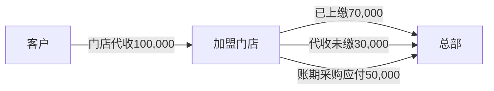

### 5. 按日期发生的完整链路

门店代收确认后核销客户应收并增加总部对门店应收 100,000；上缴 70,000 后剩 30,000；账期订单增加渠道应收 50,000 并占用授信；月末分别列示再汇总。

### 6. 金额计算

```text
代收未缴 = 100,000 - 70,000 = 30,000
账期未收 = 50,000
门店合计欠款 = 30,000 + 50,000 = 80,000
```

### 7. 各主体和资金结果

总部银行实际增加 70,000；客户应收已核销 100,000；总部对门店应收 80,000，需分为代收未缴 30,000 和账期采购 50,000。

### 8. 发票、会计事项与 NC

客户收款确认、门店代收往来和实际上缴分别入账；账期销售按合同和履约确认。总部客户发票与门店采购票据按各自关系办理。

### 9. 结算和最终对账

客户实收 100,000 = 上缴 70,000 + 代收未缴 30,000；门店期末应付总部 80,000 = 代收 30,000 + 账期 50,000；银行差异 0。

### 10. 财务确认问题与变化分支

确认门店授信上限、代收上缴期限和是否允许抵销。必须标记采用全额上缴还是扣除佣金后净额上缴：净额模式用“银行到账＋批准佣金抵销”核销，不能虚构全额银行到账。逾期部分进入账龄和减值评估，不得把门店代收当作总部银行已到账。

## 二十、案例 C12：集团内独立法人门店采购

### 1. 业务故事与采用条件

集团产品公司向独立法人门店公司提供产品，客户价 100,000 元由门店收取，内部结算价 75,000 元，产品公司外部成本 55,000 元。门店已付内部款 50,000 元。

### 2. 参与公司和责任

门店公司对客户销售、收款和开票；产品公司向门店提供产品并采购外部资源；双方分别进入各自 NC。

### 3. 金额条件

门店对外收入及客户实收 100,000；内部成本/收入 75,000；内部已付 50,000、待付 25,000；产品公司外部成本及付款 55,000。

### 4. 主体和债权债务图


### 5. 按日期发生的完整链路

门店订单和收款进入门店账；内部结算形成门店应付、产品公司应收各 75,000；产品履约形成产品公司外部成本并付款 55,000；内部付款 50,000 后双方余额 25,000。

### 6. 金额计算

```text
门店毛利 = 100,000 - 75,000 = 25,000
产品公司毛利 = 75,000 - 55,000 = 20,000
内部余额 = 75,000 - 50,000 = 25,000
集团毛利 = 100,000 - 55,000 = 45,000
```

### 7. 各主体和资金结果

| 主体 | 收入 | 成本 | 毛利 | 内部应收 | 内部应付 |
|---|---:|---:|---:|---:|---:|
| 门店公司 | 100,000 | 75,000 | 25,000 | 0 | 25,000 |
| 产品公司 | 75,000 | 55,000 | 20,000 | 25,000 | 0 |
| 集团合并 | 100,000 | 55,000 | 45,000 | 0 | 0 |

### 8. 发票、会计事项与 NC

门店客户发票、内部交易票据和外部供应商发票分开。两个法人分别推送，内部关联号、金额、期间和交易对方必须一致。

### 9. 结算和最终对账

门店内部应付 25,000 = 产品公司内部应收 25,000；内部损益抵销 75,000；集团对外毛利 45,000；内部差异 0。

### 10. 财务确认问题与变化分支

确认独立门店法人名单、内部结算价和发票政策。跨法人必须分别保留门店—客户、门店—产品公司、产品公司—供应商三段订单关系及团期对应；若门店只是同法人经营单元，改用 C08/C24，不生成内部法定往来。

## 二十一、案例 C14：外部分销商账期采购

### 1. 业务故事与采用条件

外部分销商当月下单 300,000 元，退单 20,000 元，佣金 15,000 元，实付 200,000 元，期末渠道应收 65,000 元，信用额度 500,000 元。

### 2. 参与公司和责任

凯撒销售公司对分销商形成渠道应收；终端客户关系按分销合同确定。渠道账期按分销商和月份结算。

### 3. 金额条件

订单 300,000、退款 20,000、佣金抵减 15,000、回款 200,000、期末应收 65,000。

### 4. 主体和债权债务图

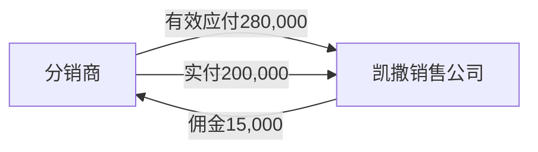

### 5. 按日期发生的完整链路

订单占用授信 300,000；退单释放 20,000；确认佣金减少应收 15,000；回款核销 200,000；期末 65,000 进入账龄。

### 6. 金额计算

```text
期末渠道应收 = 300,000 - 20,000 - 15,000 - 200,000 = 65,000
可用授信 = 500,000 - 65,000 = 435,000
```

### 7. 各主体和资金结果

凯撒银行增加 200,000、渠道应收 65,000、佣金费用 15,000。已结算未收款属于正常账期余额，逾期后才进入催收和减值。

### 8. 发票、会计事项与 NC

销售、退单、佣金和收款分别形成事项；分销发票和佣金发票独立核对。NC 保留分销商辅助和账期。

### 9. 结算和最终对账

渠道有效订单 280,000 = 佣金 15,000 + 实收 200,000 + 待收 65,000；授信占用 65,000；差异 0。

### 10. 财务确认问题与变化分支

确认佣金是抵应收还是另行应付、信用额度释放时点和逾期天数。逾期不自动核销，承接 C07。

## 二十二、案例 C15：平台拒付、强制退款和滚存保证金

### 1. 业务故事与采用条件

平台原已结算客户款 50,000 元，次月因持卡人争议强制扣回 8,000 元，并扣留滚存保证金 3,000 元；凯撒申诉后确认其中 5,000 元可追回，3,000 元最终损失。

### 2. 参与公司和责任

平台从凯撒后续结算款扣回；争议款和保证金分别形成对平台可收回余额，不能当作普通客户退款。

### 3. 金额条件

强制扣回 8,000、可追回 5,000、最终损失 3,000、保证金 3,000。

### 4. 主体和债权债务图


### 5. 按日期发生的完整链路

平台扣回时恢复争议应收 8,000；申诉确认后其中 3,000 转损失、5,000 保留应收；滚存保证金另增 3,000；平台返还 5,000 时核销争议应收。

### 6. 金额计算

```text
强制扣回8,000 = 可追回5,000 + 最终损失3,000
平台期末可收回 = 争议5,000 + 保证金3,000 = 8,000
```

### 7. 各主体和资金结果

扣款当期银行/平台结算减少 11,000；形成平台应收 8,000 和损失 3,000。保证金返还条件满足前不得记费用。

### 8. 发票、会计事项与 NC

拒付通知、申诉结果和保证金条款是入账依据。原订单收入是否冲减取决于交易是否实质取消；诈骗或拒付损失不得伪装成客户退款。

### 9. 结算和最终对账

平台扣项 11,000 = 争议应收 5,000 + 保证金 3,000 + 损失 3,000；每项均有平台编号和账龄。

### 10. 财务确认问题与变化分支

确认争议款计提减值、保证金列报和损失审批。若属于真实售后退款，改用 C30 并关联客户退款单。

## 二十三、案例 C16：供应商账单与多团期成本确认

### 1. 业务故事与采用条件

地接社月账单 150,000 元覆盖团期 A、B、C，分别列 50,000、60,000、40,000 元；业务确认 A 50,000、B 58,000、C 尚未完成服务，账单争议 2,000、待核对 40,000。

### 2. 参与公司和责任

采购法人对地接社结算；三个团期分别承担实际成本。供应商账单到达不代表三项成本和应付同时成立。

### 3. 金额条件

账单原额 150,000；已确认实际成本/应付 108,000；争议 2,000；待业务确认 40,000；已付 80,000。

### 4. 主体和债权债务图

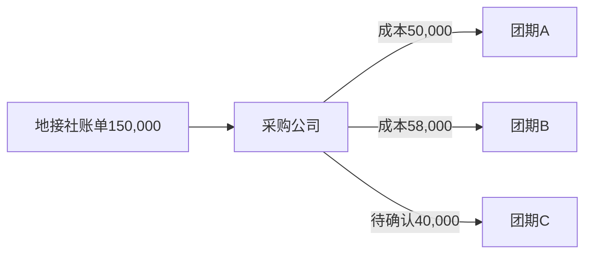

### 5. 按日期发生的完整链路

账单先登记原额；A、B 服务确认后形成成本及应付 108,000；2,000 保留争议；C 的 40,000 只待挂接；付款 80,000 核销已确认应付，余 28,000。

### 6. 金额计算

```text
账单150,000 = 已确认108,000 + 争议2,000 + 待确认40,000
应付未付 = 108,000 - 80,000 = 28,000
```

### 7. 各主体和资金结果

团期 A 成本 50,000、B 成本 58,000、C 暂不确认；采购公司应付 28,000。账单待确认 40,000 不进入 C 团成本或应付。

### 8. 发票、会计事项与 NC

供应商发票可登记 150,000，但只有满足成本、应付和税务条件的部分进入对应事项；发票不得替代团期服务确认。NC 可追溯账单行和团期分配。

### 9. 结算和最终对账

账单原额、认可额、争议额、待确认额四项合计 150,000；有效应付 108,000 = 已付 80,000 + 待付 28,000。

### 10. 财务确认问题与变化分支

确认服务完成未到账单的暂估政策。C 团后续确认时新增成本，不修改原账单；已结算则承接 C34。

## 二十四、案例 C17：外币供应商应付和付款

### 1. 业务故事与采用条件

境外地接成本 EUR20,000，成本确认汇率 7.80，应付本币 156,000 元；付款日汇率 7.90，银行手续费 EUR100。

### 2. 参与公司和责任

采购及付款主体为凯撒北京公司，保留欧元原币应付、本币折算、付款汇率和手续费。

### 3. 金额条件

应付 EUR20,000/CNY156,000；付款折算 CNY158,000；手续费 CNY790；实现汇兑损失 CNY2,000。

### 4. 主体和债权债务图

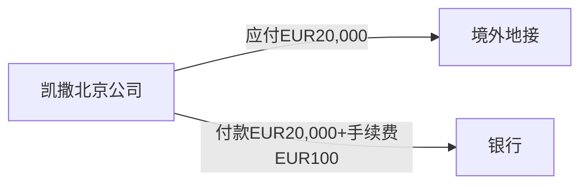

### 5. 按日期发生的完整链路

服务完成确认原币成本及应付；付款按原币核销全部应付；本币付款差额和银行手续费分别记录，不能改写欧元成本数量。

### 6. 金额计算

```text
成本/应付 = 20,000×7.80 = 156,000
付款折算 = 20,000×7.90 = 158,000
汇兑损失 = 2,000
手续费 = 100×7.90 = 790
银行流出 = 158,790
```

### 7. 各主体和资金结果

原币应付为 0；银行减少 158,790；成本 156,000；汇兑损失 2,000；手续费 790。

### 8. 发票、会计事项与 NC

境外结算凭证、付款回单和汇率来源分别归档。NC 同时保存原币、本币和币种，汇兑损益与通道费用不得混记。

### 9. 结算和最终对账

EUR20,000 应付 = EUR20,000 付款；银行本币 158,790 = 应付本币 156,000 + 汇兑 2,000 + 手续费 790。

### 10. 财务确认问题与变化分支

确认各业务日期汇率和期末重估来源。付款被银行退回时恢复应付或预付并按退回日形成新事项。

## 二十五、案例 C18：员工借款、现场支出和报销

### 1. 业务故事与采用条件

领队出团前借款 30,000 元，现场实际合规支出 27,000 元，其中团期交通 12,000、餐费 10,000、临时签证 5,000；回团退回余款 3,000 元。

### 2. 参与公司和责任

公司向领队形成员工借款；领队不是供应商。报销审核后实际费用分到团期和费用项目，余款退回核销借款。

### 3. 金额条件

借款 30,000、报销 27,000、退回 3,000、期末员工借款 0。

### 4. 主体和债权债务图


### 5. 按日期发生的完整链路

借款付款增加员工其他应收；现场单据未经审核不直接形成成本；报销批准确认团期成本 27,000 并核销借款；余款银行/现金退回 3,000 后借款清零。

### 6. 金额计算

```text
员工借款余额 = 30,000 - 报销27,000 - 退回3,000 = 0
团期实际成本 = 12,000 + 10,000 + 5,000 = 27,000
```

### 7. 各主体和资金结果

公司净资金流出 27,000，团期成本 27,000，员工往来 0。若余款未退，3,000 作为员工借款余额和账龄保留，不得塞入团期成本。

### 8. 发票、会计事项与 NC

借款、报销成本和余款退回分别进入 NC；报销票据按费用项目核对。借款付款不等于成本发生。

### 9. 结算和最终对账

借款 30,000 = 合规报销 27,000 + 退回 3,000；现场明细合计 27,000；员工余额 0。

### 10. 财务确认问题与变化分支

确认备用金上限、无票费用和跨团期分配规则。超支时先批准报销差额，再形成对员工应付。

## 二十六、案例 C19：共享固定资源跨团期分摊

### 1. 业务故事与采用条件

包机固定成本 600,000 元供三个团期使用，批准按实际占用座位 100、80、60 分配；未售不可退 10 座损耗 25,000 元单列给资源责任部门。

### 2. 参与公司和责任

采购公司承担包机合同和付款；三个团期承担已使用成本；资源责任部门承担未售不可退损耗。

### 3. 金额条件

可分到已用座位成本 575,000；占用座位合计 240；每座分摊 2,395.8333 元；损耗 25,000。

### 4. 主体和债权债务图

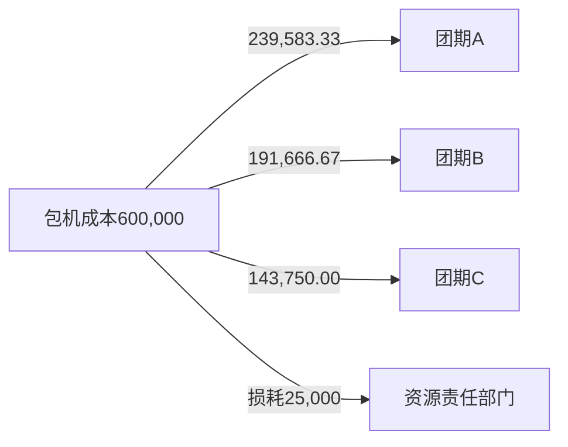

### 5. 按日期发生的完整链路

合同预付先形成供应商预付；资源使用确认总成本；批准分摊后生成三团成本和损耗；分摊调整只重分总额，不重复增加 600,000 元成本。

### 6. 金额计算

```text
单位分摊成本 = 575,000÷240 = 2,395.8333
A = 100×单位成本 = 239,583.33
B = 80×单位成本 = 191,666.67
C = 60×单位成本 = 143,750.00
三团成本575,000 + 损耗25,000 = 600,000
```

### 7. 各主体和资金结果

共享资源总成本始终为 600,000；团期与责任部门分配合计必须等于总额。分摊不产生新付款和新应付。

### 8. 发票、会计事项与 NC

供应商发票关联包机合同总成本；NC 成本事项携带团期或责任部门分配。舍入差异最后一项调整，不得形成无法解释余额。

### 9. 结算和最终对账

合同/账单成本 600,000 = A+B+C 575,000 + 损耗 25,000；未分配成本 0；重复成本 0。

### 10. 财务确认问题与变化分支

确认按占用、实售、里程或收入分摊及损耗责任。分配依据变更须留原版本和批准记录。

## 二十七、案例 C20：邮轮、专列和团队机票固定资源

### 1. 业务故事与采用条件

邮轮切舱合同 1,000,000 元，预付 700,000 元，最终账单 980,000 元；已售舱位收入 1,200,000 元，已售成本 800,000 元，未售可退舱位 0，未售不可退舱损 180,000 元。

### 2. 参与公司和责任

邮轮业务公司签约销售、采购和结算；船司为供应商。专列包铺、团队机票切位使用同样的“固定资源—销售占用—释放—损耗”结构，但结算对象分别为班期和资源批次。

### 3. 金额条件

收入 1,200,000；账单/应付 980,000；预付 700,000；尾款 280,000；已售成本 800,000；舱损 180,000。

### 4. 主体和债权债务图

```mermaid
flowchart LR
  C[游客] -->|实付1,200,000| K[邮轮业务公司]
  K -->|应付980,000；预付700,000| S[船司]
  K -->|尾款280,000| S
```

### 5. 按日期发生的完整链路

分批预付形成预付余额；舱位销售形成订单应收收款；航次结束确认船司账单和资源使用；预付冲应付 700,000、付尾款 280,000；航次结算单列已售成本和舱损。

### 6. 金额计算

```text
待付 = 980,000 - 700,000 = 280,000
航次总成本 = 已售800,000 + 舱损180,000 = 980,000
业务毛利 = 1,200,000 - 800,000 = 400,000
结算贡献 = 400,000 - 舱损180,000 = 220,000
```

### 7. 各主体和资金结果

全部付款后预付和应付均为 0；银行净流入 220,000，等于航次结算贡献。舱损保留资源批次和责任经营单元。

### 8. 发票、会计事项与 NC

预付、航次收入、已售成本、非正常损耗、应付冲抵和尾款分别形成事项。船司发票与 980,000 元账单核对，不以发票到达日改写舱位使用事实。

### 9. 结算和最终对账

船司账单 980,000 = 预付冲抵 700,000 + 尾款 280,000 = 已售成本 800,000 + 舱损 180,000；差异 0。

### 10. 财务确认问题与变化分支

确认可退舱释放时点、舱损正常/非正常列报和按舱型分摊。改舱退舱承接 C31；专列铺损和机票票损使用相同检查式。

## 二十八、案例 C21：BSP 散客票和 B2B 平台充值出票

### 1. 业务故事与采用条件

BSP 出票销售 120,000 元，出票日报成本 100,000 元，IATA 账单调整增加 2,000 元；另向 B2B 平台充值 50,000 元，出票消耗 35,000 元，退票恢复余额 5,000 元。

### 2. 参与公司和责任

航服公司对客销售并承担 BSP/IATA 应付；B2B 充值形成平台预付，出票才形成具体票成本。

### 3. 金额条件

BSP 最终成本/应付 102,000；B2B 期末预付 20,000（50,000-35,000+5,000）。

### 4. 主体和债权债务图

```mermaid
flowchart LR
  C[客户] -->|票款120,000| A[航服公司]
  A -->|BSP应付102,000| I[IATA/BSP]
  A -->|充值50,000| P[B2B平台]
```

### 5. 按日期发生的完整链路

出票保存 PNR、票号和日报成本；IATA 账单将成本调整至 102,000；B2B 充值只增加预付，出票消耗 35,000 转成本，退票 5,000 恢复平台余额并调整票务成本。

### 6. 金额计算

```text
BSP最终成本 = 100,000 + 2,000 = 102,000
BSP毛利 = 120,000 - 102,000 = 18,000
B2B期末余额 = 50,000 - 35,000 + 5,000 = 20,000
B2B净票成本 = 35,000 - 5,000 = 30,000
```

### 7. 各主体和资金结果

航服公司分别保留 BSP 应付和 B2B 预付；两类平台余额不得合并。每张票能追溯订单、PNR、票号、出票和退票。

### 8. 发票、会计事项与 NC

客户票款、出票收入、BSP 成本应付、账单调整、B2B 充值和出票冲预付分别进入 NC。航空结算凭证按公司税务政策核对。

### 9. 结算和最终对账

BSP 日报 100,000 + 调整 2,000 = IATA 应付 102,000；B2B 充值 50,000 = 净消耗 30,000 + 期末余额 20,000。

### 10. 财务确认问题与变化分支

确认出票收入时点、BSP 暂估、退票手续费和账期。票损、改签和客户退款承接 C31。

## 二十九、案例 C22：自由行采购批次成本分摊

### 1. 业务故事与采用条件

采购批次酒店成本 90,000 元服务三个自由行订单，按实际房晚分配 30,000、40,000、20,000；三个订单收入分别 45,000、55,000、35,000 元。

### 2. 参与公司和责任

销售公司对客；采购公司对酒店。假定同一法人，批次成本分配到单订单结算，不改变酒店应付总额。

### 3. 金额条件

总收入 135,000、批次成本 90,000、已付酒店 60,000、待付 30,000。

### 4. 主体和债权债务图

```mermaid
flowchart LR
  H[酒店账单90,000] --> B[采购批次]
  B -->|30,000| A[订单A]
  B -->|40,000| C[订单B]
  B -->|20,000| D[订单C]
```

### 5. 按日期发生的完整链路

批次服务确认形成成本和应付；分配记录把 90,000 分到三单；各订单履约后分别结算；付款 60,000 后酒店应付 30,000。

### 6. 金额计算

```text
分配合计 = 30,000 + 40,000 + 20,000 = 90,000
订单毛利 = 15,000、15,000、15,000
总毛利 = 135,000 - 90,000 = 45,000
```

### 7. 各主体和资金结果

三单各毛利 15,000；酒店待付 30,000。批次分配不产生三份重复应付或付款。

### 8. 发票、会计事项与 NC

酒店发票关联采购批次总额；成本事项携带订单分配。NC 总成本 90,000，不因三个订单产生 270,000。

### 9. 结算和最终对账

批次成本 90,000 = 三单分配 90,000；应付 90,000 = 已付 60,000 + 待付 30,000；订单收入 135,000、毛利 45,000。

### 10. 财务确认问题与变化分支

确认按房晚、人数或实际订单采购价分配。订单退改时调整分配并保持批次总额守恒。

## 三十、案例 C23：单项服务费和代收代付

### 1. 业务故事与采用条件

客户支付签证办理总款 12,000 元，其中凯撒服务费 2,000 元、代收使馆费 10,000 元；凯撒实际向使馆支付 10,000 元。

### 2. 参与公司和责任

凯撒仅对办理服务承担责任，按本案例假定使馆费属于代收代付；若凯撒对签证结果和定价承担主要责任，应重新判断全额收入。

### 3. 金额条件

客户收款 12,000；服务费收入 2,000；代收负债 10,000；向使馆支付 10,000。

### 4. 主体和债权债务图

```mermaid
flowchart LR
  C[客户] -->|12,000| K[凯撒]
  K -->|代付10,000| E[使馆/第三方]
  K -->|服务费收入2,000| R[服务结算]
```

### 5. 按日期发生的完整链路

客户到账拆为服务费相关收款和代收负债；服务完成确认收入 2,000；向第三方付款核销代收负债 10,000；服务单结算。

### 6. 金额计算

```text
客户总收款12,000 = 服务费2,000 + 代收款10,000
代收期末余额 = 10,000 - 实付10,000 = 0
净服务收入 = 2,000
```

### 7. 各主体和资金结果

银行净增加 2,000，与服务费收入一致；代收款收付全额留痕但不作为凯撒收入和成本。

### 8. 发票、会计事项与 NC

服务费发票和第三方收费凭证分开；NC 记录银行收付、代收负债和服务费收入。不得把 12,000 全部确认为净额收入。

### 9. 结算和最终对账

客户收款 12,000 = 第三方实付 10,000 + 服务收入 2,000；代收负债 0；资金差异 0。

### 10. 财务确认问题与变化分支

主责/代理判断、开票和代收代付合规性需逐服务类型确认。第三方收费变化产生客户补退差时分别调整服务费与代收款。

## 三十一、案例 C24：同一法人经营单元内部协作

### 1. 业务故事与采用条件

同一法人下北京销售部对客销售 100,000 元，华东产品部组织履约，外部成本 70,000 元；公司内部按 85,000 元计算经营贡献。

### 2. 参与公司和责任

合同、收款、开票、外部采购和法定账都归同一法人；两个部门只是经营单元，85,000 元只用于管理评价。

### 3. 金额条件

对外收入及客户实收 100,000、外部成本及供应商付款 70,000、内部管理结算 85,000；销售部贡献 15,000、产品部贡献 15,000。

### 4. 主体和债权债务图

```mermaid
flowchart LR
  C[客户] -->|100,000| K[同一法人]
  K -->|外部成本70,000| S[供应商]
  A[北京销售部] -.管理结算85,000.-> B[华东产品部]
```

### 5. 按日期发生的完整链路

订单、收款、收入、成本和付款只生成法人单据；内部结算记录分配 85,000 元管理收入成本，不形成银行资金和法人间应收应付。

### 6. 金额计算

```text
法人毛利 = 100,000 - 70,000 = 30,000
销售部贡献 = 100,000 - 85,000 = 15,000
产品部贡献 = 85,000 - 70,000 = 15,000
```

### 7. 各主体和资金结果

法定账收入 100,000、成本及供应商付款 70,000、毛利 30,000；部门管理贡献合计 30,000；内部应收应付为 0。客户已收清时银行净增加 30,000。

### 8. 发票、会计事项与 NC

客户和供应商发票均归同一法人；NC 只接收对外收入成本和资金事项，部门作为辅助核算。内部管理结算不得重复生成法定收入成本。

### 9. 结算和最终对账

法人毛利 30,000 = 两部门贡献 15,000 + 15,000；内部法定往来 0、集团抵销 0。

### 10. 财务确认问题与变化分支

确认管理结算价和部门贡献报表。公司法定收入成本进入 NC，部门销售差额、采购返还和员工奖励分别进入管理贡献及经批准的薪酬费用；若两个部门实际属于不同法人，必须改用 C25/C26。

## 三十二、案例 C25：A 公司销售 B 公司自营产品

### 1. 业务故事与采用条件

A 公司向客户销售 120,000 元，B 公司自营履约，内部结算价 90,000 元；B 自身外部执行成本 70,000 元。A 已向 B 付款 90,000 元。

### 2. 参与公司和责任

A 签约、收款、开票；B 组织履约并承担外部资源成本。两家公司分别核算，集团抵销内部交易。

### 3. 金额条件

对外收入及客户实收 120,000、内部收入/成本及内部收付款 90,000、外部成本及付款 70,000。

### 4. 主体和债权债务图

```mermaid
flowchart LR
  C[客户] -->|120,000| A[A销售公司]
  A -->|内部结算90,000| B[B产品公司]
  B -->|外部成本70,000| S[外部资源]
```

### 5. 按日期发生的完整链路

A 订单和收款形成对外链；履约确认时 A 形成对外收入及内部成本，B 形成内部收入及外部成本；A 付款、B 收款共同核销内部往来。

### 6. 金额计算

```text
A毛利 = 120,000 - 90,000 = 30,000
B毛利 = 90,000 - 70,000 = 20,000
集团毛利 = 120,000 - 70,000 = 50,000
内部余额 = 90,000 - 90,000 = 0
```

### 7. 各主体和资金结果

A 收入 120,000、内部成本 90,000；B 内部收入 90,000、外部成本 70,000；集团抵销 90,000 后只剩对外收入 120,000、成本 70,000。

### 8. 发票、会计事项与 NC

A 客户发票、A-B 内部票据和 B 外部凭证分别核对。双方 NC 使用同一内部关联号和期间，不能合成单一法人凭证。

### 9. 结算和最终对账

A 内部应付 = B 内部应收 = 0；内部收入成本发生额均 90,000；集团抵销差异 0；集团毛利 50,000。

### 10. 财务确认问题与变化分支

确认 A、B 主责关系、结算时点和内部税务。A 的客户是游客、B 的内部客户是 A，两段订单必须用业务关联号连接但不能共用应收。B 再向明确外部供应商采购的完整三段链见 C26 深化稿。

## 三十三、案例 C27：航服公司向集团内产品公司供票

### 1. 业务故事与采用条件

产品公司对客销售团队游 200,000 元，其中航服公司按内部价 60,000 元供票，航服外部 BSP 成本 52,000 元；产品公司其他地接成本 80,000 元。

### 2. 参与公司和责任

产品公司对客销售；航服公司负责出票、BSP 应付和内部供票；双方独立法人分别入账。

### 3. 金额条件

产品收入及客户实收 200,000；内部票务成本/收入及内部收付款 60,000；航服外部成本及付款 52,000；产品其他成本及付款 80,000。

### 4. 主体和债权债务图

```mermaid
flowchart LR
  C[客户] -->|200,000| P[产品公司]
  P -->|内部票款60,000| A[航服公司]
  A -->|BSP成本52,000| B[BSP/IATA]
  P -->|地接成本80,000| S[地接社]
```

### 5. 按日期发生的完整链路

产品订单关联航服内部供票单和票号；出票确认内部结算；航服按 BSP 日报/账单确认外部成本；产品团期结算汇总内部票务和地接成本。

### 6. 金额计算

```text
产品公司毛利 = 200,000 - 60,000 - 80,000 = 60,000
航服公司毛利 = 60,000 - 52,000 = 8,000
集团毛利 = 200,000 - 80,000 - 52,000 = 68,000
```

### 7. 各主体和资金结果

内部应收应付均 60,000，随内部付款核销；集团抵销内部收入成本 60,000。票号、PNR、团期和内部关联号完整追溯。

### 8. 发票、会计事项与 NC

产品公司、航服公司分别推送；内部供票发票和 BSP 结算凭证属于不同交易。退票时双方内部调整必须与 BSP 外部退款分别处理。

### 9. 结算和最终对账

产品内部票务成本 60,000 = 航服内部收入 60,000；航服外部成本 52,000；集团外部成本 132,000；集团毛利 68,000。

### 10. 财务确认问题与变化分支

确认出票时点、内部供票价、退改签承担和 BSP 暂估。必须连接产品客户订单、集团内部供票单和外部票号/BSP 成本三段关系；跨期票务差异进入 C28 的内部在途。

## 三十四、案例 C28：集中代收、代付和内部资金清算

### 1. 业务故事与采用条件

业务公司 A 对客户应收 100,000 元，客户把款付到资金公司 F；F 又替 A 向供应商支付 60,000 元，月末只向 A 划拨净额 40,000 元。

### 2. 参与公司和责任

A 保留客户债权、供应商债务、收入和成本；F 只承担银行收付和对 A 的内部清算，不取得旅游收入成本。

### 3. 金额条件

代收 100,000、代付 60,000、净划拨 40,000；A-F 两类往来最终均清零。

### 4. 主体和债权债务图

```mermaid
flowchart LR
  C[客户] -->|100,000| F[资金公司]
  F -->|代付60,000| S[供应商]
  F -->|净划拨40,000| A[业务公司]
  A -.客户债权及供应商债务.-> C
```

### 5. 按日期发生的完整链路

F 到账后，A 核销客户应收并形成对 F 内部应收 100,000，F 形成代收应付；F 代付后，A 核销供应商应付并形成对 F 内部应付 60,000，F 形成内部应收；净划拨和批准抵销清理双方往来。

### 6. 金额计算

```text
A对F代收应收 = 100,000
A对F代付应付 = 60,000
F应向A净划拨 = 100,000 - 60,000 = 40,000
清算后双方内部余额 = 0
```

### 7. 各主体和资金结果

A 银行增加 40,000，但客户实收为 100,000、供应商实付为 60,000；F 银行收 100,000、付 60,000、划 40,000，净变化 0。

### 8. 发票、会计事项与 NC

A 的客户和供应商发票不转给 F。A、F 各自 NC 分别记录业务往来和资金清算，代收代付使用同一关联号；F 不确认旅游收入成本。

### 9. 结算和最终对账

客户收款 100,000、供应商付款 60,000、净划拨 40,000 三者闭合；A-F 内部应收应付期末均 0；F 银行净额 0。

### 10. 财务确认问题与变化分支

确认是否允许净额划拨、内部抵销审批和跨期在途。集中资金只增加资金清算段，不改变原客户、内部产品和供应商三段债权债务；外币代收代付时原币必须相等，本币差异单列汇兑，不自动抹平。

## 三十五、案例 C29：外采主责方全额与代理方净额

### 1. 业务故事与采用条件

同一外采产品客户支付 100,000 元、供应商结算 92,000 元。模式一凯撒承担主要履约责任；模式二供应商承担主要责任，凯撒仅取得 8,000 元佣金。

### 2. 参与公司和责任

合同、定价权、履约责任、退款责任和资源风险共同决定主责/代理，不能只凭“外采”标签判断。

### 3. 金额条件

两种模式资金均收 100,000、付供应商 92,000；会计收入和成本列报不同。

### 4. 主体和债权债务图

```mermaid
flowchart LR
  C[客户] -->|100,000| K[凯撒]
  K -->|92,000| S[外部供应商]
  K -->|保留8,000| R[毛利或佣金]
```

### 5. 按日期发生的完整链路

两种模式都完整记录客户资金和供应商结算；主责模式履约时确认全额收入和采购成本；代理模式确认代收负债 92,000 和佣金收入 8,000。

### 6. 金额计算

```text
主责模式：收入100,000 - 成本92,000 = 毛利8,000
代理模式：客户资金100,000 - 代收应付92,000 = 佣金收入8,000
两种模式银行净额均为8,000
```

### 7. 各主体和资金结果

主责模式存在供应商采购成本和应付；代理模式存在代收应付。经营净结果相同不代表会计列报、税务和发票相同。

### 8. 发票、会计事项与 NC

主责模式推全额收入及采购成本；代理模式推资金、代收负债、供应商付款和净额佣金。差额计税另行计算，不等于净额收入。

### 9. 结算和最终对账

两种模式客户收款均 100,000、供应商结算均 92,000、银行净增 8,000；收入列报分别为 100,000 和 8,000，必须能追溯主责判断依据。

### 10. 财务确认问题与变化分支

逐合同确认主责/代理证据、开票和税务。无论全额或净额列报，客户全额资金、供应商结算基础、各类返还和实际付款都必须保留；判断变化只能形成经批准的会计调整，不能只改收入字段而遗漏往来和税额。

## 三十六、案例 C30：减价、退款、预存和转款

### 1. 业务故事与采用条件

原订单 50,000 元已收清，客户退团后确认应退 35,000 元。客户选择 20,000 元原路退款、10,000 元转预存、5,000 元转入同一法人新订单。

### 2. 参与公司和责任

原、新订单均属同一收款法人；原收款主体承担退款和转用责任。未收款取消只冲应收，不生成退款；跨法人转款改用 C28 代收清算或先退后收。

### 3. 金额条件

原收款 50,000、有效退差 35,000、保留原交易 15,000；原路退 20,000、预存 10,000、新订单转款 5,000。

### 4. 主体和债权债务图

```mermaid
flowchart LR
  O[原订单已收50,000] -->|保留15,000| R[原订单收入]
  O -->|原路退20,000| C[客户]
  O -->|转预存10,000| P[客户预存]
  O -->|转款5,000| N[新订单]
```

### 5. 按日期发生的完整链路

售后批准先将原订单有效交易减至 15,000 并形成退款/转用义务 35,000；原路退款成功才减少银行；转预存增加预存负债；同主体转款将核销关系转入新订单，不重复记资金。

### 6. 金额计算

```text
退差义务 = 50,000 - 15,000 = 35,000
去向合计 = 原路20,000 + 预存10,000 + 新订单5,000 = 35,000
原订单最终收入 = 15,000
```

### 7. 各主体和资金结果

银行净流出 20,000；客户预存 10,000；新订单已核销 5,000；原订单无待收待退。转款前后集团资金总额不变。

### 8. 发票、会计事项与 NC

原订单收入/税额调整、退款、预存转列和订单间往来转列分别形成事项；原发票按税务规则红冲或调整。已入账原收款不删除。

### 9. 结算和最终对账

原收款 50,000 = 保留交易 15,000 + 原路退款 20,000 + 预存 10,000 + 新单转款 5,000；未分配 0。

### 10. 财务确认问题与变化分支

确认退款优先顺序、预存客户确认和跨主体转款限制。跨主体原订单退款不能直接覆盖内部 A—B 结算和 B—供应商结算，三段分别形成调整；退款失败或被银行退回时恢复退款待执行余额，不恢复原订单收入。

## 三十七、案例 C31：客户退款、供应商追款和旅游资源退改损耗

### 1. 业务故事与采用条件

订单已收 50,000 元，客户退团应退 35,000 元；供应商同意退回 25,000 元，其中已到账 20,000 元，剩余 5,000 元待收；不可追回 10,000 元为扣损。

### 2. 参与公司和责任

销售主体对客户退款；采购主体向供应商追款。邮轮改舱、专列改铺、机票退改签都使用客户侧和供应商侧两条独立链。

### 3. 金额条件

客户应退/已退 35,000；供应商应退 25,000、已退 20,000、待退 5,000；不可追回 10,000。

### 4. 主体和债权债务图

```mermaid
flowchart LR
  K[凯撒] -->|客户退款35,000| C[客户]
  S[供应商] -->|应退25,000；已退20,000| K
  K -->|扣损10,000| L[责任订单/团期/部门]
```

### 5. 按日期发生的完整链路

客户售后批准即形成退款义务并执行 35,000；供应商确认可退 25,000 时形成供应商应退款，不等待到账；到账 20,000 核销部分应收；10,000 经责任批准转成本/损失。

### 6. 金额计算

```text
供应商待退款 = 25,000 - 20,000 = 5,000
公司净承担 = 客户应退35,000 - 供应商应退25,000 = 10,000
客户未退 = 35,000 - 35,000 = 0
```

### 7. 各主体和资金结果

客户退款负债 0；供应商应退款 5,000；银行净流出 15,000（退客户 35,000、收供应商 20,000）；另有应收 5,000 和扣损 10,000，共同解释净流出。

### 8. 发票、会计事项与 NC

客户退款/收入调整、供应商应退款、资金收回和扣损分别入账。机票手续费、票损、舱损、铺损必须保留票号或资源批次，不能净成一个退款额。

### 9. 结算和最终对账

客户侧 35,000 = 已退 35,000；供应商侧 25,000 = 已收 20,000 + 待收 5,000；两侧差额 10,000 = 已批准扣损。

### 10. 财务确认问题与变化分支

确认扣损归客户、门店、责任部门或公司。多主体业务需分别计算客户应退、内部产品主体应退、外部供应商应退及三者差额；供应商款已付后银行退回时保留原付款，恢复应付或预付余额并重新付款。

## 三十八、案例 C32：取消出团、客户赔偿和保险理赔

### 1. 业务故事与采用条件

团期因不可抗力取消，客户已收 300,000 元需全退；供应商预付款 180,000 元中可追回 140,000 元、不可追回 40,000 元。公司另向客户赔偿 20,000 元，保险公司认可理赔 15,000 元。

### 2. 参与公司和责任

销售主体承担客户退款和赔偿；采购主体向供应商追款；拥有保险权益的主体对保险公司形成应收。退款、赔偿和理赔不能互相冲掉过程。

### 3. 金额条件

客户退款 300,000、赔偿 20,000；供应商应退 140,000、不可追回 40,000；保险应收 15,000。

### 4. 主体和债权债务图

```mermaid
flowchart LR
  K[凯撒] -->|退款300,000+赔偿20,000| C[客户]
  S[供应商] -->|应退140,000| K
  I[保险公司] -->|理赔15,000| K
  K -->|净损失45,000| L[取消/赔偿损失]
```

### 5. 按日期发生的完整链路

取消批准批量冲减客户交易并形成退款；供应商退订确认应退款；不可追回预付转损失；客户赔偿另行批准和支付；保险认可时形成理赔应收，到账后核销。

### 6. 金额计算

```text
不可追回资源损失 = 180,000 - 140,000 = 40,000
赔偿净损失 = 20,000 - 15,000 = 5,000
公司总净损失 = 40,000 + 5,000 = 45,000
```

### 7. 各主体和资金结果

客户退款与赔偿已付后相关负债为 0；供应商应退款和保险应收按实际到账保留；取消结算收入为 0，净损失 45,000。

### 8. 发票、会计事项与 NC

原收入冲减、客户退款、资源损失、赔偿费用、保险应收和赔款收入分别推送。原客户发票按税务规则处理，赔偿协议和理赔通知为独立依据。

### 9. 结算和最终对账

预付 180,000 = 供应商应退 140,000 + 资源损失 40,000；赔偿 20,000 = 理赔 15,000 + 公司净承担 5,000；总净损失 45,000。

### 10. 财务确认问题与变化分支

确认不可抗力责任分配、保险理赔确认时点和赔偿审批。供应商或保险尚未到账不影响已认可应收的记录。

## 三十九、案例 C33：供应商月度对账结算

### 1. 业务故事与采用条件

某供应商期初应付 20,000 元，本期确认应付 100,000 元、预付增加 30,000 元、预付冲应付 25,000 元、银行付款 70,000 元、成本争议 5,000 元。

### 2. 参与公司和责任

采购主体与单一供应商按月核对成本、账单、应付、预付、付款和发票；对账单确认事实，不重复生成已存在金额。

### 3. 金额条件

期初应付 20,000、本期应付 100,000、冲抵 25,000、付款 70,000，期末应付 25,000；期末预付 5,000。

### 4. 主体和债权债务图

```mermaid
flowchart LR
  K[采购公司] -->|期末应付25,000| S[供应商]
  K -->|期末预付5,000| P[供应商预付]
  D[争议5,000] -.待确认.-> S
```

### 5. 按日期发生的完整链路

汇总期初、本期账单认可、预付、付款和发票；双方确认有效金额；争议 5,000 不自动进应付；批准差异通过调整单改变余额。

### 6. 金额计算

```text
期末应付 = 20,000 + 100,000 - 25,000 - 70,000 = 25,000
期末预付 = 30,000 - 25,000 = 5,000
```

### 7. 各主体和资金结果

供应商应付 25,000、预付 5,000 可同时存在，但需明确对应合同或成本范围；不得未经批准直接净成 20,000。

### 8. 发票、会计事项与 NC

对账单本身不重复入账；只有新增应付、预付冲抵、付款和批准差异进入 NC。发票余额作为并行检查。

### 9. 结算和最终对账

应付滚动式和预付滚动式分别平衡；争议 5,000 有责任人和期限；系统余额、供应商确认余额和 NC 辅助账一致。

### 10. 财务确认问题与变化分支

确认应付预付是否允许协议抵销、对账确认权限和账龄。账单晚到已跨结算期时进入 C34。

## 四十、案例 C34：结算后补充和关账后跨期调整

### 1. 业务故事与采用条件

团期 6 月已结算收入 200,000、成本 150,000、毛利 50,000；7 月收到遗漏成本 8,000 元。6 月 NC 已记账且关账，不允许修改原期间。

### 2. 参与公司和责任

原团期和责任主体不变；财务在 7 月开放期间生成补充结算和跨期调整，关联原结算及原 NC 凭证。

### 3. 金额条件

原收入 200,000、原成本 150,000、新增成本 8,000、累计成本 158,000、累计毛利 42,000。

### 4. 主体和债权债务图

```mermaid
flowchart LR
  O[6月原结算] -->|成本150,000| R[累计结果]
  A[7月补成本8,000] --> R
  R -->|累计成本158,000| N[最新团期结果]
```

### 5. 按日期发生的完整链路

6 月原结算和凭证保持不变；7 月账单经业务确认形成新增成本/应付；生成补充结算 -8,000 毛利和 7 月会计事项；NC 返回新凭证号。

### 6. 金额计算

```text
累计成本 = 150,000 + 8,000 = 158,000
累计毛利 = 200,000 - 158,000 = 42,000
本次毛利调整 = -8,000
```

### 7. 各主体和资金结果

新增应付 8,000 按付款情况保留；原业务结算、原 NC 凭证、补充结算和新凭证共同组成完整历史。

### 8. 发票、会计事项与 NC

7 月新增成本按当前开放期推送，摘要和来源关联 6 月团期。只有符合重大前期差错政策并获批才重开 6 月；不得直接覆盖原凭证。

### 9. 结算和最终对账

原结算 + 全部有效调整 = 累计结果；NC 6 月发生额 150,000 + 7 月调整 8,000 = 业务累计成本 158,000；未推失败金额 0。

### 10. 财务确认问题与变化分支

确认重大差错阈值、跨期科目和重开权限。结算后客户退款或供应商退款同样追加调整，不改原单。

## 四十一、案例 C35：同一往来单位应收应付抵销

### 1. 业务故事与采用条件

同一法人对甲公司有客户应收 100,000 元，同时因采购服务对甲公司有供应商应付 70,000 元。双方签署协议并获批抵销 60,000 元。

### 2. 参与公司和责任

凯撒同一核算主体与甲公司同时存在客户、供应商关系。抵销必须有双方协议和内部审批，不能跨法人或自动净额展示。

### 3. 金额条件

抵销前应收 100,000、应付 70,000；批准抵销 60,000；抵销后应收 40,000、应付 10,000。

### 4. 主体和债权债务图

```mermaid
flowchart LR
  X[甲公司] -->|客户应付100,000| K[凯撒]
  K -->|供应商应付70,000| X
  A[批准抵销60,000] --> K
```

### 5. 按日期发生的完整链路

双方对账确认原应收应付；抵销协议指定具体单据；抵销单分别生成应收核销 60,000 和应付核销 60,000；原订单收入、供应商成本和银行资金均不变。

### 6. 金额计算

```text
抵销后应收 = 100,000 - 60,000 = 40,000
抵销后应付 = 70,000 - 60,000 = 10,000
净债权 = 40,000 - 10,000 = 30,000
```

### 7. 各主体和资金结果

无银行收付款；客户应收和供应商应付分别保留 40,000、10,000，不能只显示净额 30,000 而丢失双方交易。

### 8. 发票、会计事项与 NC

销售发票和采购发票不因抵销取消。抵销事项按批准日进入同一核算主体 NC，并保留客户和供应商双重辅助核算。

### 9. 结算和最终对账

抵销协议 60,000 = 应收核销 60,000 = 应付核销 60,000；抵销后应收 40,000、应付 10,000；资金发生额 0。

### 10. 财务确认问题与变化分支

确认可抵销往来范围、税务影响和审批权限。跨法人只能先形成合法内部清算，不得直接抵销不同账簿余额。

## 四十二、全手册财务确认结论表

35 个端到端案例已覆盖同主体销售、复杂收款、门店、OTA、普通供应商、专项产品、多法人、集中资金、售后逆向、结算调整和关账。正式进入开发规则前，集团财务需对下列制度作统一确认：

| 决策事项 | 未确认前的处理 |
|---|---|
| 各产品收入确认时点 | 案例保留履约事实和候选日期，不写死自动入账日 |
| 主责方/代理方判断 | 按合同逐类确认，不按自营/外采标签批量决定 |
| 暂估成本和暂估应付 | 保留服务事实、账单状态和会计期间，不虚构统一政策 |
| 税率、差额扣除、开票和红冲 | 案例按含税金额，待税务规则后拆分 |
| NC 科目、辅助核算和凭证汇总 | 先确定经济事项、主体和来源，正式资料到位后配置 |
| 内部结算价、发票和合并抵销 | 双方金额成对保存，待集团制度确认日期和税务 |
| 坏账、减值、损耗和跨期审批 | 保留完整计算和原单关联，不允许普通用户直接清余额 |

财务逐场景确认时，每个案例只需给出三类结论：金额及关系正确、处理时点需调整、公司不存在或暂不启用该业务。任何调整都必须同步检查《业财底座01—07》和本手册对应案例。
