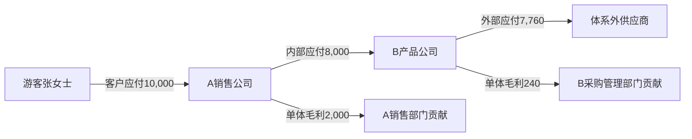

# 凯撒旅游全业务场景业财链路与结算核算确认手册

副标题：订单收款与多主体结算深化案例——A 主体销售 B 主体外采产品  
版本：v0.1（依据2026年8月业务讨论录音整理，待集团财务确认）  
编写日期：2026年8月24日  
上游规范：[业财场景确认手册00：编写规范与内容标准](业财场景确认手册00-编写规范与内容标准.md)  
关联场景：C26、SC-IC-003，并联 SC-SALE-007、SC-STORE-002/004/005、SC-CASH-010、SC-SETTLE-001/009/010  

## 一、录音讨论真正要解决的问题

录音讨论不是在决定数据库使用一张表还是多张表，也不只是计算“A 收客户多少钱、A 给 B 多少钱、B 给供应商多少钱”。真正需要财务确认的是：一笔客户订单从 10,000 元开始，经过销售差额、内部结算、采购返还、优惠、积分和外部供应商付款以后，每一部分钱是谁给的、给谁、依据是什么、在哪个法人和部门体现、何时形成应收应付、何时付款、最终怎样进入 NC。

讨论形成的核心思路是：

```text
先把一张订单上的全部金额拆清楚
→ 再确定每笔金额的支付方、取得方和依据
→ 再确定属于哪个公司法定账、哪个部门管理贡献
→ 再形成各段应收应付、结算和付款
→ 最后推送各法人 NC，并在集团层抵销
```

财务不需要确认技术采用几张表，但必须确认系统能完整追溯三段交易关系、全部价格层次和每一笔钱的去向。

## 二、现有 C26 为什么不够

原 C26 已经正确表达三段债权债务，但只给出了三个结果金额：客户销售 120,000、A—B 内部结算 90,000、B 外部成本 70,000。它没有回答录音中反复讨论的下列问题。

| 录音中的实际争议                      | 原 C26 情况   | 本稿补充                           |
| ----------------------------- | ---------- | ------------------------------ |
| 对外展示价、合同价、客户应付、客户现金实付是否相同     | 未拆分        | 分层保存，并说明不同条件下的关系               |
| 销售差额 2,000 元属于谁               | 只体现在 A 毛利中 | 明确 A 法人利润、A 销售部门贡献和后续员工奖励边界    |
| 结算价 8,000 元以后为什么供应商只收 7,760 元 | 未表达        | 增加采购/平台返还 3% 和外部供应商最终应付        |
| 3% 来自哪里、能否按产品调整               | 未表达        | 从供应商协议或产品约定继承，偏离默认值须确认或审批      |
| 全额收款后返还与净额上缴如何处理              | 未表达        | 分别计算银行流水、佣金应付和应收核销             |
| 优惠券、积分由谁承担                    | 只在其他案例概括   | 在同一订单价格瀑布中逐项列承担方和往来            |
| A、B 是否看到同一客户和同一订单             | 未表达        | A 的客户是游客，B 的内部客户是 A；三段订单用关联号连接 |
| 多个销售订单和供应商团期怎样对应              | 未表达        | 同一出发团期可归集多订单，不同团期不得合并；付款可批量    |
| 谁发起结算、是否需要销售方确认               | 只写双方完成结算   | 区分团期结算、双方对账、应付成立和付款，列明待决策参数    |
| 公司利润和部门贡献是否都推 NC              | 未表达        | 法定利润进入 NC，部门贡献进入管理报表，员工奖励另行审批  |
| 同主体部门协作和跨法人交易有什么根本差异          | 只有跨法人结果    | 增加同法人对照，防止伪造内部法定往来             |

结论：原 C26 的方向正确，但只能证明三段账最终能平，不能作为订单颗粒度和结算过程的开发验收依据。本稿是 C26 的深化主稿。

## 三、案例 C26：A 主体销售 B 主体外采产品

### 1. 业务故事与采用条件

B 产品公司从体系外供应商引进“欧洲 8 日游”，约定对销售公司的内部结算金额为每人 8,000 元。B 与外部供应商另约定：以 8,000 元为计算基础，B 的采购管理部门取得 3% 的采购返还，实际应付供应商 7,760 元。

A 销售公司采用该产品并以 10,000 元与游客签约。游客向 A 支付 10,000 元。团队履约完成后：

- A 对客户确认 10,000 元交易；
- A 应向 B 结算 8,000 元；
- B 应向外部供应商支付 7,760 元；
- A 法人取得 2,000 元单体毛利；
- B 法人取得 240 元单体毛利；
- 集团对外毛利为 2,240 元。

本基础案例假定 A 对游客承担主要履约责任并按全额确认收入；最终仍须以 A—客户合同、A 对服务的控制和退款责任由财务确认。若 A 只是代理销售方，则转入 C29 净额模式。本基础案例暂不加入优惠、积分、退款和未付款，先把正常链路跑通；这些变化在本案例后部单独叠加，不能混入基础数字导致财务无法判断主线。

### 2. 参与公司、订单关系和责任

#### 2.1 三段交易关系

| 交易段    | 销售/提供方 | 购买/接受方 | 本段订单                   | 本段金额   | 本段应收应付                    |
| ------ | ------ | ------ | ---------------------- | ------:| ------------------------- |
| 对客销售   | A 销售公司 | 游客张女士  | 客户销售订单 A-O001          | 10,000 | A 对客户应收 10,000            |
| 集团内部供给 | B 产品公司 | A 销售公司 | 内部供给订单 B-I001 / A-P001 | 8,000  | B 内部应收 8,000；A 内部应付 8,000 |
| 外部采购   | 外部供应商  | B 产品公司 | 外部采购订单 B-S001          | 7,760  | 供应商应收 7,760；B 外部应付 7,760  |

三段订单使用同一“业务关联号”连接，但不能共用一个客户、一个应收或一个发票关系：

- A 看见的客户是游客张女士；
- B 在内部交易中看见的客户/往来单位是 A 销售公司；
- 外部供应商看见的购买方是 B 产品公司；
- A 不直接对 B 的外部供应商形成应付，除非另有合法代付关系。

#### 2.2 各项责任

| 责任            | 承担方          | 必须保存的依据           |
| ------------- | ------------ | ----------------- |
| 对客销售、合同和客户应收  | A 公司         | 客户订单、旅游合同、价格明细    |
| 主责方/代理方判断     | 本案例暂按 A 为主责方 | 合同、定价权、履约控制和退款责任  |
| 客户收款和退款       | A 公司         | 收款方式、到账流水、退款责任    |
| 对客开票          | A 公司         | 客户合同和开票规则         |
| 产品引进和内部供给     | B 公司         | A—B 内部产品约定、团期确认   |
| 外部供应商签约       | B 公司         | 供应商协议、结算条款和返还规则   |
| 产品履约组织        | B 公司         | 出团确认、名单、服务完成和回团记录 |
| 外部供应商成本、应付和付款 | B 公司         | 外部采购订单、账单、应付和回单   |
| A—B 内部结算      | A、B 成对确认     | 内部关系号、结算金额、期间和异常  |
| 法定账和 NC       | A、B 各自账簿     | 各自会计事项和 NC 返回     |
| 集团合并抵销        | 集团财务         | A—B 交易对方、关联号和抵销期间 |

#### 2.3 价格规则的来源顺序

```text
供应商合作协议的默认规则
→ 具体产品上架时的产品结算约定
→ 经双方确认或审批的产品级调整
→ 订单下单时保存当时有效的规则快照
→ 后续只能通过批准调整改变，不能用新规则覆盖历史订单
```

例如，供应商协议默认采购返还为 3%；具体产品协商提高到 6% 时，应取得供应商确认；降低到低于公司政策的比例时，应走公司审批。最终订单必须保存采用的比例、计算基础、取得方、确认人和生效时间。

### 3. 一张订单上的完整金额条件

#### 3.1 基础价格瀑布

| 顺序  | 金额名称       | 计算              | 支付方            | 取得方   | 法定账或管理用途              |
| --- | ---------- | ---------------:| -------------- | ----- | --------------------- |
| 1   | 对外展示价      | 10,000          | —              | —     | 产品销售参考，不直接形成账         |
| 2   | 客户合同金额     | 10,000          | 客户             | A 公司  | A 的客户交易金额             |
| 3   | 客户应付金额     | 10,000          | 客户             | A 公司  | A 的客户应收               |
| 4   | 客户现金实付     | 10,000          | 客户             | A 公司  | A 的银行收款               |
| 5   | A—B 内部结算金额 | 8,000           | A 公司           | B 公司  | A 内部成本/应付；B 内部收入/应收   |
| 6   | A 销售差额     | 2,000           | 来源于对客交易        | A 公司  | A 单体毛利；可继续分到销售部门管理贡献  |
| 7   | B 采购返还     | 8,000×3%=240    | 按B—供应商约定从结算中扣减 | B 公司  | B 单体毛利或采购成本冲减，财务待确认列报 |
| 8   | 外部供应商最终应付  | 8,000-240=7,760 | B 公司           | 外部供应商 | B 外部成本和应付             |

#### 3.2 一笔钱最终分到哪里

```text
客户合同金额 10,000
= A—B内部结算 8,000 + A销售差额 2,000

A—B内部结算 8,000
= 外部供应商应付 7,760 + B采购返还 240

集团对外收入 10,000
= 外部供应商成本 7,760 + 集团对外毛利 2,240
```

#### 3.3 公司利润和部门管理贡献

| 层次     | A 公司         | B 公司         | 集团合并      |
| ------ | ------------:| ------------:| ---------:|
| 法定收入   | 10,000       | 8,000 内部收入   | 10,000    |
| 法定成本   | 8,000 内部成本   | 7,760 外部成本   | 7,760     |
| 单体毛利   | 2,000        | 240          | 2,240     |
| 管理贡献示例 | A 销售部门 2,000 | B 采购管理部门 240 | 不重复增加集团毛利 |

若 A 从 2,000 元部门贡献中再奖励销售员工 300 元：

- 300 元是后续员工绩效或薪酬事项；
- A 公司的对外收入仍为 10,000 元；
- A 原始内部成本仍为 8,000 元；
- 部门扣除员工奖励后的贡献可以为 1,700 元；
- 只有奖励获批并满足薪酬入账条件时才进入 NC，不得在订单收款时直接减少客户应收。

### 4. 主体、订单、债权债务和资金图

#### 4.1 三段债权债务



#### 4.2 实际资金


债权债务和资金必须分别展示。订单确认可以先形成业务应收应付，实际资金可能在以后支付；不能因图中最终全部付款就把系统设计成必须收付清后才能结算。

### 5. 按日期发生的完整订单和结算过程

| 日期     | 业务事实                    | A 公司记录                         | B 公司记录                                | 外部供应商关系          | 是否形成会计事项          |
| ------ | ----------------------- | ------------------------------ | ------------------------------------- | ---------------- | ----------------- |
| 8月1日   | B 与供应商协议约定采购结算基础和 3% 返还 | 无                              | 保存协议规则                                | 确认规则来源           | 合同本身通常不入账         |
| 8月5日   | B 上架具体产品，内部结算金额 8,000   | 可见可采购产品条件                      | 保存产品约定和规则快照                           | 保存产品对应供应商        | 产品配置不直接入账         |
| 8月10日  | A 采用产品，对客销售价 10,000     | 保存销售价、A—B结算价                   | 确认向 A 供给条件                            | 无新资金             | 不入账               |
| 8月12日  | 游客下单                    | 客户订单 A-O001；客户业务应收 10,000      | 形成/确认内部供给订单 B-I001，内部应收候选 8,000       | 外采订单 B-S001 关联团期 | 是否成为会计应收按政策判断     |
| 8月13日  | 游客向 A 付款 10,000         | 到账流水、收款单、客户应收核销；银行 +10,000     | 无                                     | 无                | A 形成收款事项          |
| 8月14日  | B 确认名额和团期               | A 订单关联 B 团期                    | B 团期承接 A 订单人数                         | B 团期映射供应商出发日期/团号 | 名额确认本身不重复入账       |
| 9月1—8日 | 团队履约                    | 保存客户履约结果                       | 保存团期履约及供应商服务事实                        | 供应商完成服务          | 收入成本时点按政策判断       |
| 9月11日  | 回团后第3天，达到示例结算触发日        | A 客户结算 10,000；形成对 B 内部应付 8,000 | B 团期结算；形成对 A 内部应收 8,000、外部成本/应付 7,760 | 形成供应商对账和应付依据     | A、B 分别形成收入成本及往来事项 |
| 9月12日  | 正常业务无差异，A—B 对账完成        | 内部应付 8,000 生效                  | 内部应收 8,000 生效                         | 外部争议为0           | 对账本身不重复入账         |
| 9月20日  | A 按付款计划向 B 支付 8,000     | 银行 -8,000；内部应付清零               | 银行 +8,000；内部应收清零                      | 无                | 双方分别形成内部收付款事项     |
| 9月25日  | B 向供应商支付 7,760          | 无                              | 银行 -7,760；外部应付清零                      | 银行收到 7,760       | B 形成供应商付款事项       |
| 9月末    | 各法人推送 NC 并对账            | A 单体收入成本毛利和资金对平                | B 内部收入、外部成本和资金对平                      | 账单付款一致           | 推送、接收、记账状态分别保存    |

#### 结算动作边界

录音对“谁发起结算”存在反复讨论。本稿建议财务确认以下分层，不把不同动作混成一个按钮：

1. **B 团期业务结算**：B 作为产品和履约主体确认团期收入、成本、损耗和经营结果。
2. **A—B 内部对账**：确认本期 A 应付 B、B 应收 A 的订单明细和金额。
3. **内部应付成立**：对账或合同条件满足后，A 的内部应付和 B 的内部应收生效。
4. **付款计划到期**：根据月结、回团后若干日等合同条件进入可付款范围。
5. **付款申请、审批和银行执行**：属于资金动作，不因业务结算自动完成。

正常无差异的标准外采产品可以在集团批准后采用“回团后第 N 天自动发起结算”，但仍需具备异常冻结机制。是否要求 A 逐单确认不是会计原则，而是集团控制政策，应由财务和业务共同确认。

### 6. 金额、余额和结算计算

#### 6.1 A 客户侧

```text
客户合同金额 = 10,000
客户有效应收 = 10,000
客户实际到账 = 10,000
客户应收核销 = 10,000
客户期末待收 = 10,000 - 10,000 = 0
```

#### 6.2 A—B 内部往来

```text
A内部应付 = 8,000
B内部应收 = 8,000
A向B实付 = 8,000
A内部待付 = 8,000 - 8,000 = 0
B内部待收 = 8,000 - 8,000 = 0
```

#### 6.3 B—外部供应商

```text
采购结算基础 = 8,000
采购返还 = 8,000 × 3% = 240
外部供应商有效应付 = 8,000 - 240 = 7,760
供应商实付 = 7,760
供应商待付 = 7,760 - 7,760 = 0
```

#### 6.4 单体与集团结果

```text
A单体毛利 = 对外收入10,000 - 内部成本8,000 = 2,000
B单体毛利 = 内部收入8,000 - 外部成本7,760 = 240
集团合并毛利 = 对外收入10,000 - 对外成本7,760 = 2,240

集团现金净增加
= 客户现金流入10,000 - 对外供应商现金流出7,760
= 2,240
```

### 7. 各主体账、收钱、分钱和付款结果

#### 7.1 各法人分别看账

| 项目      | A 销售公司 | B 产品公司 | 集团合并   |
| ------- | ------:| ------:| ------:|
| 客户应收    | 0      | 0      | 0      |
| 内部应收    | 0      | 0      | 抵销后0   |
| 内部应付    | 0      | 0      | 抵销后0   |
| 外部供应商应付 | 0      | 0      | 0      |
| 对外收入    | 10,000 | 0      | 10,000 |
| 内部收入    | 0      | 8,000  | 抵销     |
| 内部成本    | 8,000  | 0      | 抵销     |
| 外部成本    | 0      | 7,760  | 7,760  |
| 单体/合并毛利 | 2,000  | 240    | 2,240  |
| 银行净变化   | +2,000 | +240   | +2,240 |

#### 7.2 收钱、分钱和付款

| 资金动作    | 付款方  | 收款方   | 应付金额   | 实付金额   | 未付/未清 |
| ------- | ---- | ----- | ------:| ------:| -----:|
| 客户付款    | 游客   | A 公司  | 10,000 | 10,000 | 0     |
| 内部结算付款  | A 公司 | B 公司  | 8,000  | 8,000  | 0     |
| 外部供应商付款 | B 公司 | 外部供应商 | 7,760  | 7,760  | 0     |

#### 7.3 各角色应当看见什么

| 角色      | 主要看见的关系               | 不应被误解为         |
| ------- | --------------------- | -------------- |
| A 销售人员  | 客户合同10,000、客户收款、A销售贡献 | B 的外部供应商账单     |
| A 财务    | A客户应收收款、A对B内部应付、A收入成本 | B 已经收到供应商款     |
| B 产品/计调 | A订单人数、B团期、供应商履约和成本    | 游客直接成为B的内部应收客户 |
| B 财务    | B对A内部应收、B对供应商应付付款     | A的客户银行流水归B所有   |
| 集团财务    | 三段完整关系、两法人NC和内部抵销     | 用集团净额覆盖单体账     |

这里的可见范围服务于业务职责和数据保密，但不能改变法定主体和真实债权债务。先把每笔钱归属算清，再决定各角色能看哪些内容。

### 8. 发票、会计事项与 NC

#### 8.1 三段票据关系

| 交易段  | 开票方   | 受票方     | 示例金额          | 待确认事项                       |
| ---- | ----- | ------- | -------------:| --------------------------- |
| 对客交易 | A 公司  | 游客/合同客户 | 10,000        | 旅游业务开票及差额计税规则               |
| 内部交易 | B 公司  | A 公司    | 8,000         | 内部交易发票、税率和开票时点              |
| 外部采购 | 外部供应商 | B 公司    | 7,760 或 8,000 | 240 是价款折让、采购返还还是佣金收入，决定发票口径 |

#### 8.2 240 元采购返还的两种会计可能

录音明确了“B 最终取得 240、供应商实际收到 7,760”，但尚不能据此直接确定法定账列报：

| 可能模式            | B 外部成本 | 其他收入/返还 | 供应商应付      | 适用依据                |
| --------------- | ------:| -------:| ----------:| ------------------- |
| 采购价直接折减         | 7,760  | 0       | 7,760      | 合同和发票均按净价结算         |
| 供应商价8,000，另确认返还 | 8,000  | 240     | 8,000后另核返还 | 合同、账单和发票把返还作为独立经济事项 |

两种模式对 B 净利润均可能是 240，但应付、发票、税额和 NC 分录不同，必须由财务根据合同实质确认，系统不能只保存净额 7,760 而丢失 8,000 和 240 的来源。

#### 8.3 NC 会计事项

| 业务事实      | 核算主体 | 会计事项金额      | 会计日期依据    | NC 追溯               |
| --------- | ---- | -----------:| --------- | ------------------- |
| 客户到账      | A    | 10,000      | 银行到账日     | 客户、A-O001、流水        |
| 对外收入确认    | A    | 含税10,000    | 履约/收入政策   | 客户订单、B团期映射          |
| 内部成本和应付   | A    | 8,000       | 内部结算生效日   | A-P001、B-I001、内部关联号 |
| 内部收入和应收   | B    | 8,000       | 与A成对的结算日期 | 同一内部关联号             |
| 外部成本和应付   | B    | 7,760或8,000 | 服务完成/账单政策 | B-S001、供应商、团期       |
| 采购返还      | B    | 240         | 合同条件满足日   | 规则来源和受益部门           |
| A向B付款/B收款 | A、B  | 8,000       | 实际银行日     | 双方回单和内部核销           |
| B付供应商     | B    | 7,760       | 实际银行日     | 付款单、回单、外部应付核销       |

部门贡献不单独推成法人间收入成本。员工奖励只有经批准形成薪酬或费用后才进入相应法人 NC。

### 9. 团期、结算和最终对账

#### 9.1 团期对应规则

| 情况                        | 是否允许 | 处理                           |
| ------------------------- | ---- | ---------------------------- |
| A 的多张客户订单购买 B 同一出发日期、同一团期 | 允许   | 多订单归集到同一 B 团期结算              |
| 不同销售公司购买 B 同一团期           | 允许   | 分别形成各销售公司与 B 的内部订单，再归集到 B 团期 |
| B 不同出发日期的两个团期合并成一个新团期     | 不允许  | 分别结算，保持日期、人数和成本可追溯           |
| 多个团期的到期应付合并付款             | 允许   | 付款单可批量，但核销明细回到各团期应付          |
| A团期号、B团期号、供应商团号不同         | 允许   | 保存明确的一一对应或分配关系               |

#### 9.2 财务最终确认表

| 检查项         | 应有结果                          |
| ----------- | -----------------------------:|
| A客户合同金额     | 10,000                        |
| A客户有效应收     | 10,000                        |
| A客户实收/核销    | 10,000 / 10,000               |
| A对B内部应付发生额  | 8,000                         |
| B对A内部应收发生额  | 8,000                         |
| A—B内部收付款    | 8,000                         |
| B采购结算基础     | 8,000                         |
| B采购返还       | 240                           |
| B供应商有效应付    | 7,760，或按财务确认的毛额模式分别列8,000和240 |
| B供应商实付      | 7,760                         |
| A单体毛利       | 2,000                         |
| B单体毛利       | 240                           |
| 集团对外收入      | 10,000                        |
| 集团对外成本      | 7,760                         |
| 集团毛利        | 2,240                         |
| 内部抵销差异      | 0                             |
| 未分配订单金额     | 0                             |
| 未映射团期金额     | 0                             |
| NC推送失败或重复金额 | 0                             |

### 10. 财务确认问题和变化分支

#### 10.1 本次必须确认的政策

1. B 的 240 元采购返还是采购价折减还是独立返还收入。
2. A—B 内部结算在占位确认、出团、回团还是双方对账时生效。
3. 正常无差异订单是否在回团后第 N 天自动结算；N 由谁配置。
4. 是否要求 A 对 B 的结算逐单确认；若不要求，哪些异常必须冻结。
5. A—B 内部发票和 B—供应商发票的金额、日期和税务处理。
6. 部门贡献 2,000、240 如何进入管理报表，员工奖励如何转薪酬。
7. 销售渠道采用全额上缴后返还还是扣除后净额上缴，是否按门店/代理协议固定。

#### 10.2 两种销售资金方式

假设门店或代理人替 A 销售，客户合同金额仍为 10,000，销售方应得 2,000：

##### 全额上缴后返还

```text
门店向A上缴客户款10,000
A确认门店佣金/销售差额应付2,000
A向门店返还2,000
A银行净增加8,000
```

| 资金动作  | 实际银行金额  |
| ----- | -------:|
| 门店上缴  | +10,000 |
| A返还门店 | -2,000  |
| A净收   | 8,000   |

##### 扣除后净额上缴

```text
门店保留2,000
门店向A净额上缴8,000
A对门店的10,000应收
= 银行到账8,000 + 已批准佣金抵销2,000
```

系统不能在净额上缴模式虚构 10,000 元银行到账，也不能在全额上缴模式只保留净额 8,000 而丢失两笔资金。

#### 10.3 优惠券和积分的叠加

若 10,000 元订单使用优惠券 500 元、积分抵扣 100 元，必须先判断每项优惠是否减少客户合同价，还是由第三方/总部另行补足：

| 优惠项目      | 金额  | 示例承担方       | 系统必须保留                 |
| --------- | ---:| ----------- | ---------------------- |
| 供应商承担优惠   | 300 | 外部供应商或B     | 对供应商应付减少或形成供应商补贴应收     |
| A销售公司承担优惠 | 200 | A           | 交易价格减少或营销费用，待财务确认      |
| 积分抵扣      | 100 | 集团总部/积分运营主体 | 总部补贴应收、营销费用或合同负债结转，待确认 |

不能只记录“客户少付 600”。至少需要满足：

```text
客户合同/应付金额
= 客户现金实付
+ 各承担方应补金额
+ 已批准用于核销的积分或优惠金额
```

合同金额、发票金额和会计收入是否仍为 10,000，取决于优惠和积分的法律关系及税务政策。录音对此尚未形成一致结论，本稿不替财务作结论，但系统必须保留 10,000、客户现金实付、优惠600及三个承担来源，确保未来无论采用哪种政策都能计算。

#### 10.4 售后和结算后调整

- 客户售后只先改变 A—客户关系；是否改变 A—B 内部结算，依据双方售后责任规则另行确认。
- B 是否能向供应商追回，独立形成 B—供应商应退款，不等待 A 客户退款完成。
- 已经完成 A—B 内部付款后再退款，通过内部应退款或下期抵扣处理，不删除原结算。
- 已结算后新增成本或返还变化，生成补充结算；NC 已记账时在开放期间生成调整事项。

## 四、由 C26 推广到其他场景的统一深化要求

| 相关场景            | 必须同步补充的内容                               |
| --------------- | --------------------------------------- |
| C06 优惠承担        | 展示价、合同价、客户现金实付、每个承担方应补、发票和收入口径分别列示      |
| C09 加盟门店总部直收    | 门店应得分润的规则来源；全额收款后支付门店；部门/员工奖励与门店应付分开    |
| C10 门店预存        | 客户价、总部结算金额、门店预存扣款和销售差额分别保存，不能把差额直接称门店利润 |
| C11 门店代收和账期     | 全额上缴、净额上缴、代收未缴和账期应收分开；同一门店可能多类余额并存      |
| C12/C25 跨法人内部产品 | 三段订单视角、双方法人账、内部发票、团期映射和付款批次回溯           |
| C24 同法人部门协作     | 公司法定利润与部门贡献分开，不生成虚假法人间应收应付              |
| C27 航服内部供票      | 产品订单、内部供票单、票号/BSP采购三段连接；内部票价和外部票成本分开    |
| C28 集中资金        | 业务结算关系不因资金主体代收代付而改变；新增独立资金清算段           |
| C29 主责/代理       | 客户全额资金、供应商结算、佣金和收入列报分开；差额计税另算           |
| C30/C31 售后      | 客户侧、内部A—B侧、外部供应商侧分别调整，不能一笔退款贯穿覆盖三段原账    |

## 五、用于财务会议的确认顺序

不建议把全部场景一次交给财务确认。先用本案例按以下顺序开会：

1. 先确认无优惠、无退款、全部收付的 10,000→8,000→7,760 正常链路。
2. 再确认 240 的合同和会计性质。
3. 再确认全额上缴后返还与净额上缴两种资金方式。
4. 再加入优惠券和积分，逐笔指定承担方。
5. 再确认团期映射、自动结算、异常冻结和付款审批。
6. 最后确认 NC 科目、税额、发票和集团抵销。

每一步财务只需回答：金额关系是否正确、应收应付何时成立、属于哪个法人、部门贡献是否只用于管理、发票和 NC 应采用哪一种政策。确认结果再同步回写《业财底座01—07》和完整场景手册。
