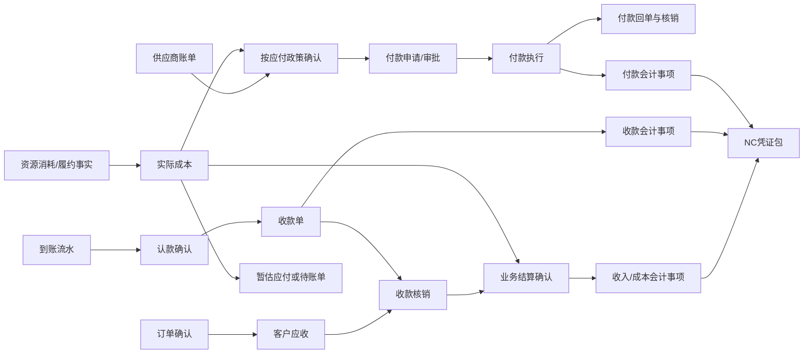
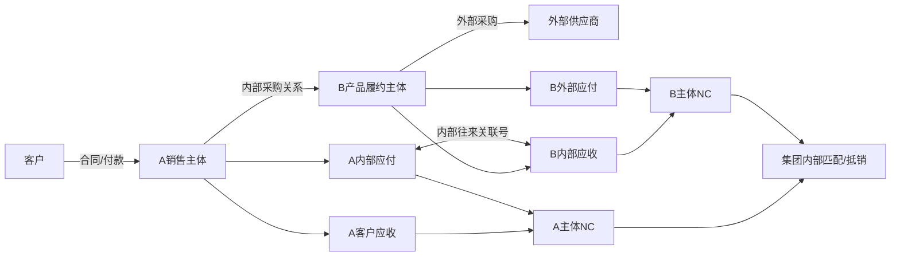
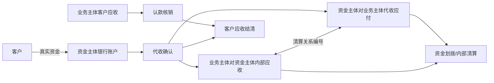

# 业财底座02：全业务场景财务数据链路矩阵

版本：v0.1（分析工作稿，非最终交付文档）  
编写日期：2026年8月23日  
上游基线：[业财底座01：多主体交易关系与核算责任基线](业财底座01-多主体交易关系与核算责任基线.md)

## 一、本阶段目标

本文是正式数据模型和最终交付文档之间的场景分析层。它不设计页面，也暂不穷举会计科目和借贷分录，而是先把凯撒全部业务场景转换为后端可以识别的财务关系。

每个场景统一回答：

1. 谁是客户、签约主体、产品主体、履约主体、收款主体、采购主体和付款主体。
2. 谁对谁形成债权债务，属于客户、供应商、门店、渠道还是集团内部往来。
3. 债权债务在什么业务节点生成。
4. 金额由哪些业务明细计算，发生变更时如何追加、冲减或转移。
5. 收款、付款、预收、预存和预付如何核销。
6. 按订单、团期、航次、班期、项目、服务单还是采购批次结算。
7. 哪些财务事项具备形成会计事项和推送 NC 的条件。

本文完成后仍需继续设计财务单据、财务事项状态、会计规则和 NC 接口；不能直接依据本文建完全部数据库。

本文场景矩阵中的“应收”和“应付”首先表示业务结算中已经确认的客户应付金额和供应商付款义务。它们是否在同一时点进入 NC 的应收账款、应付账款、合同资产或合同负债，应继续依据《业财底座04》的无条件收款权、现时付款义务和履约状态判断，不能看到业务应收或业务应付就直接入总账。

## 二、逐场景统一描述模板

后续每个场景都使用同一套结构，最终的技术文档和财务文档也从这套结构生成。

| 项目 | 技术开发需要理解 | 财务需要确认 |
|---|---|---|
| 场景边界 | 场景编码、进入条件、排除条件 | 现实中什么时候采用该模式 |
| 参与方 | 本单各方主体及系统判断规则 | 合同、收款、开票、收入、采购、付款主体是否正确 |
| 结算关系 | 客户、供应商、内部、门店、渠道、资金清算关系 | 谁对谁形成应收应付 |
| 归集和结算对象 | 订单、团期、项目、服务单、批次的关联关系 | 按什么对象核对和结算 |
| 金额来源 | 订单费用行、资源消耗、账单和调整数据 | 金额计算口径是否符合制度 |
| 单据链 | 业务单据到财务单据的生成顺序 | 每个岗位审核什么、何时成立 |
| 核销链 | 流水、应收、应付、预收预付的分配关系 | 钱是否真实到账或付出、余额是否准确 |
| 结算 | 结算确认记录、差异、锁定和补充结算 | 收入、成本、毛利如何确认 |
| 入账和 NC | 财务事项类型、会计日期、核算主体和辅助核算来源 | 哪些事项入账、按何种口径汇总 |
| 异常 | 防重复、冲销、跨期和主体冲突 | 如何处理错款、退回、差异和跨期 |

### 专项业务名称说明

| 名称 | 本文含义 |
|---|---|
| NC | 公司现有财务核算系统。业务系统把已经确认的收款、成本、应付、付款、收入、结算和调整结果整理成凭证后推送到 NC。 |
| OTA | 携程、飞猪等在线旅游平台。平台可能代客户收款、按月出账单，并扣除佣金、退款和活动费用后向凯撒结算。 |
| BSP | 航空客运销售结算计划。航服通过 BSP 出票后，以出票日报和后续账单核对机票成本和应付。 |
| IATA 大账单 | 航空运输协会按结算周期形成的机票结算账单，用于核对 BSP 出票、退票和最终应付金额。 |
| PNR | 航空订座记录编号，用于把旅客、航段、出票和退改记录关联起来。 |
| DL | 航司、船司或资源供应方规定的最晚名单、付款、释放或确认期限。超过期限可能产生票损、舱损、铺损或资源损失。 |
| 主责方 | 对客户承诺并主要负责交付旅游产品或服务的一方，通常需要结合合同、定价权和履约风险判断是否按全额确认收入。 |
| 代理方 | 主要负责促成其他供应方为客户提供服务的一方，通常根据代理服务费或佣金判断收入金额。 |

## 三、统一金额和余额口径

场景分析前先统一金额语言，避免不同模块使用同名异义字段。

### 1. 客户交易金额

```text
订单原始金额
= 订单费用行原价合计

订单优惠金额
= 各优惠明细中由客户少付的金额

订单确认金额
= 订单原始金额 - 订单优惠金额 + 已生效加价/补差 - 已生效减价/退差

累计有效应收
= 首次应收 + 补差应收 - 应收冲减 - 已关闭应收

待收金额
= 累计有效应收 - 已确认核销收款 - 已核销预收转入 - 已核销预存扣款 - 已批准往来抵销 - 已批准坏账核销
```

订单确认金额是客户合同和业务交易口径，不直接等于会计收入。

### 2. 收款和资金金额

```text
流水可认余额
= 流水入账金额 - 已确认资金归属金额 - 已确认原路退回金额 - 已确认转作其他资金用途金额

应收可核销余额
= 应收有效金额 - 已核销收款 - 已核销预收/预存 - 已批准往来抵销 - 已批准坏账核销

收款未核销余额
= 已确认收款金额 - 已核销应收 - 已转预收/预存 - 已退款 - 已转款

预收余额
= 预收增加 - 转应收核销 - 转预存 - 退款 - 调整冲销

预存可用余额
= 账面余额 - 冻结金额
```

已确认资金归属金额包括已分配至收款、预收、预存或其他已确认收入用途的金额，同一笔分配只扣减一次。

到账流水、认款单、收款单和核销记录是四个不同对象。

### 3. 成本、应付和付款金额

```text
预估成本
= 业务在销售或执行前的成本预测

实际成本原额
= 已确认资源消耗和已完成服务的成本

有效实际成本
= 实际成本原额 + 已确认损耗 + 成本增加调整 - 成本减少调整

账单确认金额
= 供应商账单原金额 - 不认可金额 + 已认可补差 - 账单冲减

有效应付
= 已确认应付 + 应付增加调整 - 应付减少调整 - 已关闭应付

应付未付余额
= 有效应付 - 直接付款核销 - 预付冲抵 - 供应商应退款抵减 - 已批准往来抵销

预付余额
= 已执行预付款 - 已冲抵应付 - 已退回 - 已转用 - 已确认损失
```

实际成本与应付可能在不同时间成立；应付与付款也必须分开。

### 4. 结算金额

```text
业务结算收入
= 纳入本次结算确认范围的有效客户交易金额或按主责/代理政策计算的经营收入口径

会计确认收入
= 按履约义务、会计政策和会计期间确认的收入

结算成本
= 纳入本次结算范围的有效实际成本

业务毛利
= 业务结算收入 - 结算成本

结算贡献
= 业务毛利 - 另列的渠道/门店费用 - 未在收入中冲减的公司承担优惠
```

已经冲减客户交易价格或会计收入的优惠不得再次从结算贡献中扣减。

业务结算收入、会计收入和增值税计税销售额分别计算，不共用一个金额字段。

### 5. 内部交易金额

```text
内部提供方应收 = 内部接收方应付
内部提供方原币金额 = 内部接收方原币金额
内部差异 = 提供方确认额 - 接收方确认额
集团合并经营结果 = 对外收入 - 对外成本
```

内部收入成本是否进入单体法定账，取决于是否跨法人。集团合并时必须按交易伙伴抵销。

## 四、场景分类和编码

| 前缀 | 场景组 | 主要内容 |
|---|---|---|
| SC-SALE | 客户销售与应收 | 标准订单、项目阶段、多人付款、补差和优惠 |
| SC-CASH | 收款与余额 | 直连收款、人工认款、预收、预存、代收和外币 |
| SC-STORE | 门店经营 | 直营、加盟、预存、代收、账期和分润 |
| SC-CHANNEL | OTA 与分销 | 月结、佣金、平台退款、渠道账期 |
| SC-COST | 成本与供应商 | 实际成本、账单、应付、预付和资源分摊 |
| SC-PRODUCT | 专项产品 | 邮轮、专列、自由行、研学、MICE、单项服务、航服 |
| SC-IC | 集团内部交易 | 内部互采、内部供票、集中代收代付 |
| SC-AFTER | 售后逆向 | 退差、退款、转款、供应商追款和付款退回 |
| SC-SETTLE | 结算与关账 | 团期、项目、订单、供应商、门店、渠道、内部和跨期调整 |

## 五、全业务场景目录

### A. 客户销售、应收和收款

| 编码 | 场景 | 主要差异 |
|---|---|---|
| SC-SALE-001 | 同主体标准产品订单 | 同一主体签约、收款和确认客户应收 |
| SC-SALE-002 | 定金、尾款和补差分阶段收款 | 一个订单多笔应收、多次收款 |
| SC-SALE-003 | 一笔款支付多个订单 | 一笔流水拆分核销多张应收 |
| SC-SALE-004 | 一个订单多个付款方 | 单位、个人、家长、亲属等共同付款 |
| SC-SALE-005 | 多付、暂不明确订单 | 超收转预收或客户预存 |
| SC-SALE-006 | MICE/单团按合同阶段应收 | 首款、进度款、尾款、追加服务款 |
| SC-SALE-007 | 优惠由公司、门店、渠道多方承担 | 客户少付与各方结算承担分开 |
| SC-SALE-008 | 客户或渠道欠款减值、核销和后续收回 | 应收余额保留，减值、核销和收回分别处理 |

### B. 收款介质、预收和预存

| 编码 | 场景 | 主要差异 |
|---|---|---|
| SC-CASH-001 | 订单活码/支付链接 | 订单和交易号天然绑定，可自动认款 |
| SC-CASH-002 | 固定码、门店码或工位码 | 只有门店/主体信息，需要销售认领到订单 |
| SC-CASH-003 | 对公银行转账 | 银企直连或导入流水后按付款方、金额、附言匹配 |
| SC-CASH-004 | 现金收款和实缴 | 先登记现金事实，出纳确认实缴后才核销应收 |
| SC-CASH-005 | 无真实流水先提交收款线索 | 待核对收款，不核销应收、不入账 |
| SC-CASH-006 | 客户款暂时无法归属订单 | 到账确认后形成客户/单位预收余额 |
| SC-CASH-007 | 客户确认留存预存 | 形成可充值、冻结、扣款、退款的客户余额账户 |
| SC-CASH-008 | 易宝台牌或第三方静态码 | 平台号与截图号可能不唯一，默认人工复核 |
| SC-CASH-009 | 外币客户收款 | 原币、本币、汇率、手续费和汇兑差额 |
| SC-CASH-010 | 银行、支付平台或 POS 净额结算 | 客户付款、通道手续费和实际到账分开核对 |
| SC-CASH-011 | 付款方和客户都无法识别的来款 | 资金已到账，业务归属未确定，先记待认领款项 |
| SC-CASH-012 | 客户押金、供应商和渠道保证金收付 | 与订单预收和供应商预付分开，按退还、冻结和扣罚条件管理 |

### C. 门店和渠道

| 编码 | 场景 | 主要差异 |
|---|---|---|
| SC-STORE-001 | 直营门店销售 | 法人内部业绩归属，不产生外部门店往来 |
| SC-STORE-002 | 加盟门店、总部直收客户款 | 总部客户应收，门店形成佣金或分润 |
| SC-STORE-003 | 加盟门店预存后下单 | 充值形成余额，订单冻结或扣减 |
| SC-STORE-004 | 加盟门店代收客户款 | 门店应缴、总部应收和代收清算 |
| SC-STORE-005 | 加盟门店账期采购 | 总部对门店形成渠道应收 |
| SC-STORE-006 | 集团内独立法人门店采购 | 形成内部销售、采购和双方往来 |
| SC-STORE-007 | 门店月度对账与分润 | 充值、扣款、退款、管理费、佣金、期末余额 |
| SC-STORE-008 | 门店现金、POS 实缴长短款 | 系统应收、实收、实缴和银行入账四方核对 |
| SC-CHANNEL-001 | OTA 平台月结 | 订单、平台账单、实际到账三方核对 |
| SC-CHANNEL-002 | OTA 平台直接退款 | 平台退款与系统售后、渠道应收同步 |
| SC-CHANNEL-003 | 外部分销商账期 | 分销订单、渠道应收、佣金和信用额度 |
| SC-CHANNEL-004 | 渠道补贴和活动承担 | 补贴方、优惠承担方和到账差异 |
| SC-CHANNEL-005 | 支付平台拒付、强制退款和滚存保证金 | 原收款被后续扣回，与主动退款和认款错误分开 |

### D. 成本、应付、预付和专项资源

| 编码 | 场景 | 主要差异 |
|---|---|---|
| SC-COST-001 | 普通团期实际成本 | 回团后按资源和供应商确认 |
| SC-COST-002 | 供应商先交付后出账单 | 成本先确认，应付按暂估或账单规则成立 |
| SC-COST-003 | 供应商账单先到、业务事实待核对 | 账单待挂接，不直接形成应付 |
| SC-COST-004 | 一张账单覆盖多个团期/项目 | 账单行拆分匹配多个成本项 |
| SC-COST-005 | 多张账单对应一个成本范围 | 汇总核对后形成一张或多张应付 |
| SC-COST-006 | 供应商预付后冲抵 | 付款先形成预付，账单确认后冲应付 |
| SC-COST-007 | 外币供应商付款 | 业务汇率、付款汇率和汇兑差额 |
| SC-COST-008 | 供应商发票先票后款/先款后票 | 发票是并行状态，不当然决定成本和付款 |
| SC-COST-009 | 领队、导游、计调或项目经理借款与报销 | 先付给员工或现场经办人，后按真实费用报销并退回余款 |
| SC-COST-010 | 共享资源固定成本跨多团期分摊 | 包机、切位、包舱、包列和切房成本按已批规则分配，保留未售损耗 |
| SC-PRODUCT-001 | 邮轮包船/切舱 | 航次舱型库存、分批预付、舱损和成本分摊 |
| SC-PRODUCT-002 | 专列包列/包铺 | 班期铺位、固定成本、铺损和空置分摊 |
| SC-PRODUCT-003 | 团队机票/切位/包机 | 一押二押尾款、DL、票损和团期分配 |
| SC-PRODUCT-004 | BSP 散客票 | 订单收款、出票、BSP 日报、IATA 账单 |
| SC-PRODUCT-005 | B2B 航司平台充值出票 | 平台预付余额、航司订单号和多次退改 |
| SC-PRODUCT-006 | 自由行采购批次 | 批次对账，成本分摊至订单 |
| SC-PRODUCT-007 | 单项服务费和代垫 | 服务费收入与代收代付分开 |
| SC-PRODUCT-008 | MICE/单团阶段成本 | 项目阶段、预算、变更和验收结算 |
| SC-PRODUCT-009 | 研学学校与个人混合付款 | 学校/家长多付款方，按营期和学生归集 |

### E. 外采和集团内部交易

| 编码 | 场景 | 主要差异 |
|---|---|---|
| SC-IC-001 | 同法人内部经营单元供给 | 只做管理结算，不生成法人间应收应付 |
| SC-IC-002 | A 法人销售 B 法人自营产品 | A-B 双方对应的内部应收应付 |
| SC-IC-003 | A 销售 B 包装的体系外产品 | A-B 内部链与 B-供应商外部链并存 |
| SC-IC-004 | 跨法人航服内部供票 | 航服内部收入、产品内部成本及双方 NC |
| SC-IC-005 | 集团资金主体代收 | 客户债权不变，新增代收内部清算 |
| SC-IC-006 | 集团资金主体代付 | 供应商债务不变，新增代付内部清算 |
| SC-IC-007 | 内部交易跨期或汇率差异 | 双方在途、差异、对账和后续调整 |
| SC-IC-008 | 体系外外采主责方销售 | 客户全额交易，采购形成成本 |
| SC-IC-009 | 体系外外采代理销售 | 客户代收款和佣金/服务费净额收入 |

### F. 售后和逆向

| 编码 | 场景 | 主要差异 |
|---|---|---|
| SC-AFTER-001 | 未收款订单减价/取消 | 冲减应收，不生成客户退款 |
| SC-AFTER-002 | 已收款订单退差 | 先冲应收，超出未收部分形成退款 |
| SC-AFTER-003 | 原路客户退款 | 关联原收款和原支付账户 |
| SC-AFTER-004 | 退款转客户预存 | 不流出资金，增加预存余额 |
| SC-AFTER-005 | 同主体订单转款 | 原收款核销关系转移到新应收 |
| SC-AFTER-006 | 跨主体订单转款 | 不能直接迁移，需退款/代收清算/新认款组合 |
| SC-AFTER-007 | 客户退款伴随供应商追款 | 客户和供应商两条逆向链独立推进 |
| SC-AFTER-008 | 邮轮改舱/退舱、专列改铺 | 客户差价和供应商损耗分别计算 |
| SC-AFTER-009 | 机票退票/改签/票损 | 客户退款、航司退款、手续费和责任损失 |
| SC-AFTER-010 | 付款银行退回 | 原付款保留，恢复应付或预付余额 |
| SC-AFTER-011 | 客户赔偿、事故理赔和保险赔款收回 | 客户应获赔付、公司承担损失和对保险公司应收分开 |
| SC-AFTER-012 | 取消出团、不成团或不可抗力 | 客户退款、供应商可追回款、不可追回成本和责任分摊 |

### G. 结算、调整和关账

| 编码 | 场景 | 主要差异 |
|---|---|---|
| SC-SETTLE-001 | 普通团期结算 | 汇总订单、收退转、成本、应付和预付 |
| SC-SETTLE-002 | 邮轮航次/专列班期结算 | 固定资源成本、损耗和未售库存 |
| SC-SETTLE-003 | 自由行订单结算 | 采购批次成本分摊后核算单订单盈亏 |
| SC-SETTLE-004 | 项目/研学结算 | 客户确认额、阶段收付、验收和项目成本 |
| SC-SETTLE-005 | 单项服务结算 | 服务费、代垫、直接成本和退款扣损 |
| SC-SETTLE-006 | 供应商对账结算 | 系统成本、供应商账单和发票付款状态 |
| SC-SETTLE-007 | OTA/渠道账期结算 | 平台账单、扣费、退款、补贴和到账 |
| SC-SETTLE-008 | 门店账期与分润结算 | 余额、扣款、管理费、优惠和分润 |
| SC-SETTLE-009 | 集团内部对账结算 | 双方内部应收应付、发票、期间和凭证 |
| SC-SETTLE-010 | 已结算后补充调整 | 保留原结算，追加调整或二次结算 |
| SC-SETTLE-011 | 关账后跨期调整 | 新期间冲销/调整，不修改原期间 |
| SC-SETTLE-012 | 同一往来单位的应收应付抵销 | 客户同时是供应商时，按双方协议和审批逐笔抵销 |
| SC-SETTLE-013 | 应收、合同资产和长期预付减值 | 期末按会计政策确认和转回，不改写原业务余额 |

当前目录共覆盖 86 个场景，其中 12 个为跨文档审计后补充的必要场景。后续发现的新场景必须归入现有场景组并说明为何不能由已有规则组合处理，避免无限新增互相重叠的场景编码。

## 六、场景到财务关系的总矩阵

### 1. 销售和资金类

| 场景 | 债权债务生成节点 | 核销对象 | 结算对象 | 可入账并生成 NC 凭证的事项 |
|---|---|---|---|---|
| 标准订单 | 订单满足确认条件时生成客户应收 | 到账流水/预收/预存核销应收 | 团期或订单 | 收款、收入确认、退款、结转 |
| 阶段项目 | 合同阶段到达时生成阶段应收 | 每笔款核销具体阶段 | 项目/阶段 | 收款、阶段收入、项目结转 |
| 一款多单 | 各订单应收独立存在 | 一条流水拆分多条核销 | 各自原结算对象 | 每个核销明细对应收款会计来源 |
| 多方付款 | 订单应收不按付款方拆假订单 | 多付款方流水共同核销应收 | 原订单/项目 | 收款单保留付款方辅助信息 |
| 超收 | 超过应收的到账确认后形成预收 | 后续转应收、预存或退款 | 客户/单位余额 | 预收、转销、退款 |
| 无流水线索 | 不形成正式债权变化 | 不允许核销 | 无 | 不生成 NC |
| 外币收款 | 订单应收按原币和本币记录 | 原币核销，差额进入汇兑处理 | 原业务对象 | 收款、汇兑损益确认 |

### 2. 门店和渠道类

| 场景 | 债权债务结构 | 资金归属 | 结算对象 | 可入账并生成 NC 凭证的事项 |
|---|---|---|---|---|
| 直营门店 | 所属法人对客户应收 | 所属法人 | 订单/团期，门店仅作辅助核算 | 收款、收入、成本、提成/费用 |
| 加盟总部直收 | 总部对客户应收；总部可能对门店佣金应付 | 总部 | 客户订单 + 门店账期 | 收款、收入、门店佣金/分润 |
| 加盟预存 | 总部对门店形成预存负债；订单扣款核销 | 总部保管门店资金 | 预存账户 + 订单 + 门店账期 | 充值、扣款、退款、分润 |
| 加盟代收 | 总部客户债权 + 门店代收清算关系 | 门店暂时代收 | 订单 + 代收清算单 | 收款确认、门店应缴、清算 |
| 加盟账期 | 总部对门店形成渠道应收 | 门店到期付款 | 门店账期 | 渠道应收、收款、佣金 |
| OTA 月结 | 按合同确定平台或终端客户应收 | 平台代收后周期结算 | 平台账单 + 订单 | 渠道应收核销、佣金/扣费、收款 |

### 3. 成本和供应类

| 场景 | 成本生成节点 | 应付生成节点 | 付款/预付 | 结算对象 | 可入账并生成 NC 凭证的事项 |
|---|---|---|---|---|---|
| 普通团期 | 资源消耗或回团成本确认 | 账单确认或暂估政策命中 | 应付后付款 | 团期 | 成本、应付、付款、结转 |
| 包舱/包列/包机 | 合同和实际履约分阶段形成成本 | 账单或履约节点 | 通常先预付再冲抵 | 航次/班期/资源批次 | 预付、成本、冲抵、损失 |
| BSP 散票 | 出票和 BSP 日报形成成本事实 | IATA/BSP 账单确认 | 按账期付款 | 票/订单/账期 | 成本、应付、付款、退票调整 |
| B2B 平台 | 出票消耗平台余额形成成本 | 平台账单或余额明细确认 | 先充值形成预付 | 航司订单号/票 | 预付、成本、冲抵、汇兑 |
| 自由行 | 采购批次确认后形成成本 | 批次账单确认 | 应付或预付 | 采购批次 + 订单 | 成本分摊、应付、订单结转 |
| 单项服务 | 服务完成形成服务成本；代垫单独核销 | 供应商义务成立 | 应付付款或备用金 | 服务单 | 服务成本、代收代付、结转 |

### 4. 内部交易和集中资金类

| 场景 | 提供方 | 接收方 | 客户/供应商原关系 | 对账和 NC |
|---|---|---|---|---|
| 同法人内部供给 | 管理收入/贡献 | 管理成本 | 对外关系仍归同法人 | 管理会计对账，法定账避免重复损益 |
| 跨法人产品互采 | 内部应收 | 内部应付 | 销售方保留客户关系，产品方保留外部采购关系 | 双方分别入账，集团按交易伙伴抵销 |
| A-B-外部供应商 | B 对 A 内部应收 | A 对 B 内部应付 | B 对外部供应商应付 | 两段结算关系独立处理 |
| 集中代收 | 资金主体对业务主体代收应付 | 业务主体对资金主体内部应收 | 业务主体客户应收不变 | 实际到账与内部清算分别入账 |
| 集中代付 | 资金主体对业务主体内部应收 | 业务主体对资金主体代付应付 | 业务主体供应商应付不变 | 实际付款与内部清算分别入账 |

### 5. 售后和调整类

| 场景 | 客户侧 | 供应商侧 | 结算影响 | 可入账并生成 NC 凭证的事项 |
|---|---|---|---|---|
| 未收减价 | 冲减未收应收 | 视资源退订调整成本 | 未结算直接纳入；已结算补充调整 | 应收调整，必要时收入调整 |
| 已收退款 | 冲应收并执行退款 | 独立追款或确认扣损 | 收入和毛利重算 | 退款、收入冲减、成本调整 |
| 转款 | 原收款核销关系转出，新应收转入 | 视转团产生新成本或扣损 | 原、新结算对象分别调整 | 转款、补差/退差、结转调整 |
| 供应商退款 | 应付冲减、预付退回或银行到账 | 供应商应退款金额核销 | 成本和预付余额调整 | 付款退回、成本/应付调整 |
| 付款退回 | 恢复应付或预付余额 | 原付款不删除 | 原结算付款状态回退 | 付款冲正、重新付款 |

## 七、标准数据流

### 1. 同主体标准业务



### 2. 跨法人内部互采



### 3. 集中代收



## 八、第一批代表性计算案例

这些案例用于验证本阶段模型是否能算通，不作为最终会计分录结论。科目、税额、收入确认时点和 NC 汇总方式仍需在后续阶段结合公司制度确定。

### 案例一：同主体标准团，分两次收款并有供应商预付

业务条件：

- 客户订单确认金额 100,000 元；
- 定金应收 30,000 元，尾款应收 70,000 元；
- 客户分别到账 30,000 元和 70,000 元；
- 团期预估成本 60,000 元；
- 出团前向地接预付 20,000 元；
- 回团后供应商账单 63,000 元，业务核减 3,000 元，确认实际成本和应付 60,000 元。

数据链：

```text
订单确认 -> 应收30,000 + 应收70,000
两笔到账 -> 两笔认款 -> 核销应收100,000
预付款20,000 -> 供应商预付余额20,000
回团成本确认60,000 -> 应付60,000
预付冲抵20,000 -> 应付待付40,000
付款40,000 -> 应付结清
团期结算：业务收入100,000，实际成本60,000，业务毛利40,000
```

控制点：账单原额 63,000、核减 3,000 和确认额 60,000 都要保留；不能直接把供应商原账单改成 60,000。

### 案例二：一笔款支付三张订单

客户一次转账 100,000 元，分别支付订单 A 30,000 元、B 40,000 元、C 20,000 元，剩余 10,000 元暂不明确用途。

```text
原始流水：100,000
认款核销：A 30,000 + B 40,000 + C 20,000
流水已认：90,000
流水剩余：10,000
经客户确认后：10,000 转客户预收
```

技术上保留一条原始流水、四条分配记录，不能复制为四条银行流水。

### 案例三：A 销售 B 产品，B 再采购外部供应商

业务条件：

- A 向客户销售 120,000 元并收款；
- A 与 B 的内部结算价 90,000 元；
- B 对外供应商实际成本 70,000 元。

单体经营结果：

```text
A：待财务确认对外收入120,000 - 内部采购成本90,000 = 毛利30,000
B：内部收入90,000 - 外部成本70,000 = 毛利20,000
```

内部关系：

```text
B内部应收90,000 = A内部应付90,000
```

集团合并结果：

```text
抵销内部收入90,000和内部成本90,000
集团对外收入120,000 - 对外成本70,000 = 集团毛利50,000
```

### 案例四：体系外产品代理销售，按净额方式测算

业务条件：

- 客户支付 100,000 元；
- 其中应结算给供应商 92,000 元；
- 凯撒按协议仅提供代理销售服务并取得佣金 8,000 元；
- 最终主责/代理判断确认凯撒为代理方。

```text
客户资金流入100,000
供应商结算负债92,000
待财务确认佣金/服务费收入8,000
```

这里 100,000 元仍需要完整进入收款和资金流水，但待财务确认的会计收入是 8,000 元。若合同和履约事实表明凯撒是主责方，则应改用全额收入与采购成本模式，不能只因产品来自外部供应商就采用本案例。

### 案例五：加盟门店预存并按结算价下单

业务条件：

- 门店充值 200,000 元；
- 财务确认到账后形成门店预存余额 200,000 元；
- 门店销售一张客户价 100,000 元的订单；
- 按合作协议门店向总部结算 80,000 元；
- 下单冻结 80,000 元，订单确认后扣减 80,000 元。

```text
门店预存期初0
+ 充值200,000
- 订单扣款80,000
= 可用余额120,000
```

客户价与总部结算价之间 20,000 元如何处理，要根据合同模式判断：可能是门店自行销售利润，也可能是总部确认收入后应付门店分润，不能仅在预存账户里计算为“门店利润”。

### 案例六：OTA 月结

本期平台订单原额 100,000 元，平台已退款 10,000 元，扣佣金 12,000 元，平台活动补贴 2,000 元，实际向凯撒打款 80,000 元。

```text
平台有效订单结算额：100,000 - 10,000 = 90,000
平台资金结算额：90,000 - 12,000 + 2,000 = 80,000
实际到账：80,000
三方差异：0
```

系统分别保存订单销售、退款、佣金、补贴和到账，不允许用到账 80,000 元直接覆盖订单收入。

### 案例七：邮轮切舱预付和空舱损失

业务条件：

- 切舱合同总额 1,000,000 元；
- 分两次预付 300,000 元和 400,000 元；
- 航次结束船方确认账单 980,000 元；
- 已售舱房归集成本 800,000 元，未售且不可退舱位成本 180,000 元。

```text
预付余额：700,000
确认应付：980,000
预付冲抵：700,000
待付：280,000
航次结算成本：已售履约成本800,000 + 空舱损失180,000
```

空舱损失必须保留责任经营单元和资源批次，不能平均隐藏进所有已售订单成本而失去经营分析意义。

### 案例八：客户退款与供应商扣损

订单 50,000 元已收清。客户退团，根据客户合同应退 35,000 元；供应商仅同意退回 25,000 元，产生 10,000 元扣损。

```text
客户侧：执行退款35,000
供应商侧：确认供应商应退款25,000
不可追回扣损：10,000
```

客户退款不等待供应商退款时，两条链独立推进。10,000 元最终归订单、团期、门店、客户或公司承担，需要业务责任确认后进入成本调整。

### 案例九：集团资金主体代收

A 公司对客户应收 100,000 元，客户把钱支付到集团资金主体 F 的银行账户。

```text
A：客户应收100,000，经代收认款后核销
A：对F内部应收100,000
F：银行存款增加100,000
F：对A代收应付100,000
```

后续 F 向 A 划拨 100,000 元或按集团资金制度内部清算，才结清 A-F 往来。不能只在 A 记录“已收款”而遗漏 F 的银行到账和内部负债。

### 案例十：已结算后补成本

团期原结算收入 200,000 元、成本 150,000 元、毛利 50,000 元。下月收到遗漏账单并确认新增成本 8,000 元。

```text
原结算保持：收入200,000，成本150,000，毛利50,000
补充结算：新增成本8,000，毛利调整-8,000
调整后累计：收入200,000，成本158,000，毛利42,000
```

原结算单和原 NC 凭证不覆盖。新增成本按新会计期间形成调整事项，并保留与原结算单的关联。

## 九、本阶段发现的现有财务事项缺口

现有《业财事件表标准》已覆盖销售、收款、售后、成本、付款、结算、税务、NC、调整和营销事项，但正式设计前至少需要补充以下财务事项类别：

| 建议财务事项类别 | 需要补充的业务结果 |
|---|---|
| 内部交易 | 内部关系生成、提供方应收、接收方应付、双方确认、对账差异、抵销标识 |
| 集中资金 | 代收确认、代付确认、主体间资金清算、清算差异 |
| 收入确认 | 履约义务满足、阶段收入确认、净额佣金确认、收入冲销 |
| 暂估 | 暂估成本、暂估应付、暂估冲回、账单转正式应付 |
| 渠道/门店 | 门店代收、门店应缴、分润确认、平台佣金、平台补贴 |
| 汇兑 | 收款汇兑、付款汇兑、期末重估和汇兑损益 |
| 合并对账 | 内部匹配、差异确认、在途和集团抵销结果 |

现有“外采差额结算”事项需要重新定义：不得用“外采”直接触发差额收入。应拆为主责方全额模式、代理方净额模式以及独立的旅游服务增值税差额计税数据。

## 十、下一阶段输入和边界

本文为《业财底座03：财务业务对象与数据关系》和《业财底座07：逐场景财务链路开发承接表》提供以下输入：

- 86 个场景编码；
- 五类金额和余额公式；
- 客户、供应商、门店、渠道、内部和资金清算关系；
- 订单与履约对象的双重归集；
- 多对多核销和分摊要求；
- 结算确认记录和补充结算要求；
- 需要新增的财务事项类别。

下一阶段不再增加页面功能，而是先明确稳定的财务业务对象、唯一编号、单据明细、余额账户、核销记录、财务事项记录和结算确认记录；具体数据库表名和字段放在后续技术设计章节。

## 十一、多主体订单价格链补充口径

跨主体外采订单的金额不再只用“客户价、内部价、外部成本”三个汇总数表达。场景计算至少展开为：

```text
客户合同金额
= 客户现金实付 + 优惠/积分核销 + 承担方应补 + 期末待收

客户合同金额
= 销售主体与产品主体结算金额 + 销售主体差额

产品主体结算金额
= 外部供应商最终应付 + 产品/采购主体按约定取得的返还
```

每项优惠、差额和返还必须保存付款方、取得方、计算基础、比例或固定金额、合同/产品/活动来源、确认或审批结果。返还采用净价折减还是毛额结算后另行确认，由财务根据合同和发票实质决定，场景矩阵不得只保留最终净额。

A 的客户订单、A—B 内部订单和 B—供应商采购订单分别承接自己的应收应付；同一出发团期可以汇总多张销售订单，不同团期只允许合并付款，不允许合并经营结算。
