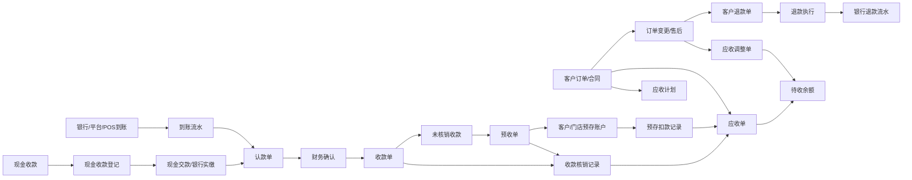
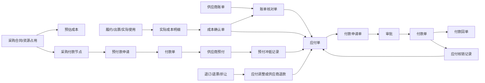

# 业财底座03：财务业务对象与数据关系

版本：v0.1（分析工作稿，非最终交付文档）  
编写日期：2026年8月23日  
上游基线：[业财底座01：多主体交易关系与核算责任基线](业财底座01-多主体交易关系与核算责任基线.md)  
场景依据：[业财底座02：全业务场景财务数据链路矩阵](业财底座02-全业务场景财务数据链路矩阵.md)

## 一、本阶段要解决的问题

前两阶段已经明确了集团多主体之间的交易关系，并列出了客户销售、资金、门店、渠道、成本、专项产品、集团内部交易、售后和结算等 86 个场景。

本阶段不设计财务页面，也不设计数据库表和程序字段，而是先把所有场景反复使用的财务业务对象统一下来，回答五个问题：

1. 每一种财务单据或余额到底代表什么业务事实。
2. 它在什么条件下形成，谁发起，谁确认，何时生效。
3. 它与订单、合同、团期、项目、采购、银行流水和发票是什么关系。
4. 一笔钱、一项债权债务和一笔成本如何在不同单据之间流转与核销。
5. 数据发生错误、售后、跨期或结算后调整时，如何保留原记录并继续算清余额。

本文件是后续技术数据设计、财务核算规则和 NC 凭证规则的共同业务依据。文中先使用业务和财务人员能直接理解的名称，技术字段、数据表和接口留到后续开发文档中表达。

## 二、统一判断原则

### 1. 业务发生、资金收付、债权债务、损益确认分别记录

订单确认说明客户交易成立；应收说明客户欠款已经成立；到账流水说明钱进入账户；收款单说明财务确认了这笔钱的业务归属；收入确认说明履约义务达到会计确认条件。

这五件事可能发生在不同日期，不能合并成一个“已付款”或“已完成”状态。

供应商侧同理：资源预订、服务发生、实际成本确认、供应商账单、应付确认、付款执行和会计成本确认也可能发生在不同日期。

本文所称应收单和应付单，首先是业务结算及收付款管理对象。应收单成立后是否已经取得会计上的无条件收款权，应付单成立时是否已经形成会计上的现时义务，需要继续结合合同、履约和财务制度判断。没有达到会计确认条件的，可以管理业务待收待付，但不能因此直接推送 NC。

### 2. 一张单据只属于一个法人和一个核算主体

一张应收单、应付单、收款单、付款单或结算单只能由一个法人承担。跨法人销售、代收、代付或内部互采必须分别形成各主体自己的单据，并通过同一笔业务关系相互核对。

### 3. 金额明细决定总额

所有财务单据的总金额都必须由费用、成本、账单、核销或调整明细汇总，不能只保存一个可手工覆盖的总数。

### 4. 生效记录不直接改写

未提交、未确认的草稿可以修改；已经确认并影响债权债务、资金余额、结算或会计期间的记录，不得覆盖原金额。后续变化通过调整、冲销、退款、退回或补充结算继续记录。

### 5. 余额由发生明细计算

待收、待付、预收、预存、预付、可认款和可退款余额，都由原始发生额与后续核销、冻结、转用、退款和调整明细计算，不允许财务人员直接修改余额数字。

### 6. 发票是并行核对线

发票反映开票和税务事实，但通常不直接决定应收是否成立、款项是否到账、成本是否发生或付款是否完成。系统应分别记录业务、资金、发票和会计结果，再进行一致性核对。

## 三、财务业务对象总目录

### 1. 上游业务依据

| 业务对象 | 回答的问题 | 进入财务链路的主要内容 |
|---|---|---|
| 客户订单 | 向谁销售了什么 | 签约主体、客户、费用明细、成交金额、付款计划、订单变更 |
| 客户合同 | 客户权利义务如何约定 | 合同主体、付款节点、退款条款、开票要求、履约内容 |
| 团期、航次、班期、营期 | 哪一批客人共同出行并消耗资源 | 出行日期、人数、资源消耗、回团结果、结算范围 |
| MICE 或单团项目 | 项目按什么阶段交付 | 阶段款、预算、追加服务、验收节点、项目成本 |
| 单项服务单 | 哪一项独立服务被销售和交付 | 服务日期、数量、成交金额、服务确认、退改结果 |
| 采购批次或资源占用 | 向供应商采购了什么 | 供应商、采购数量、采购价、付款节点、释放与损耗 |
| 履约及服务确认 | 供应商服务实际发生多少 | 实际使用、取消、退改、损耗、服务完成日期 |
| 售后单 | 原交易发生了什么变化 | 退团、退票、退差、换人、转团、扣损和客户退款方案 |

这些对象是财务单据的来源依据，但本身不能替代应收、应付、收款、付款和结算单据。

### 2. 客户应收和收款对象

| 财务业务对象 | 解决的问题 | 何时成立 |
|---|---|---|
| 应收计划 | 按合同预计何时应收多少 | 合同或订单的付款节点确认后 |
| 应收单 | 哪个客户或结算方已经欠哪个主体多少钱 | 订单、合同阶段、补差或结算条件达到并经业务规则确认后 |
| 应收调整单 | 已生效应收为什么增加或减少 | 订单变更、售后、折让、取消、差错更正获批后 |
| 到账流水 | 哪个银行、支付平台或 POS 账户实际收到多少钱 | 银行或支付渠道产生真实到账后 |
| 待认领款项记录 | 资金已到账但付款方、客户和业务归属均未确定的金额是多少 | 真实到账但无法完成业务认领后 |
| 收款线索 | 业务人员掌握了什么待核实的付款信息 | 客户提供截图、口头信息或其他尚无真实流水支持的材料后；不影响应收和资金余额 |
| 现金收款登记 | 哪个收款人实际收到了多少现金 | 业务人员或收银人员收到现金并登记后 |
| 现金交款单 | 已收现金由谁交给谁、是否已经实缴 | 收款人向出纳交款，或出纳将现金缴入银行后 |
| 认款单 | 到账款拟归属于谁、哪笔业务 | 销售、门店、渠道或财务提交归属信息后 |
| 收款单 | 财务已经确认收到谁的钱并归属于什么业务 | 到账事实和业务归属均核对通过后 |
| 收款核销记录 | 哪笔收款抵了哪张应收、抵了多少 | 收款与应收匹配并确认后 |
| 收款冲销单 | 原收款确认错误或重复，如何抵销其影响 | 原收款错误获批且尚可按制度冲销后 |
| 预收单 | 已收款但暂未形成或暂未明确对应应收 | 收款确认后存在未核销余额，且按制度转为预收后 |
| 客户预存账户 | 客户主动留存、以后可重复使用的余额是多少 | 客户协议或确认成立，充值或退款转存经财务确认后 |
| 门店预存账户 | 门店交存给总部、以后下单可使用的余额是多少 | 门店预存协议有效且充值经财务确认后 |
| 客户退款单 | 应退给客户多少钱、如何退 | 售后退款方案和应收冲减依据审批通过后 |
| 客户转款单 | 原款项转到哪个订单、客户或余额账户 | 转款申请获批且新归属合法后 |
| 坏账准备确认记录 | 客户或渠道欠款的预计无法收回金额是多少 | 期末按已批会计政策完成信用风险评估后 |
| 坏账核销单 | 哪笔应收经批准不再继续作为可收款项 | 已尽催收和法律程序并完成有权审批后 |
| 已核销款项收回单 | 已核销应收后续实际收回多少 | 真实资金到账并确认属于已核销款项后 |
| 押金和保证金记录 | 收取或缴纳了多少押金/保证金，何时可退、扣罚或转用 | 合同要求且真实资金收付确认后 |

### 3. 成本、应付和付款对象

| 财务业务对象 | 解决的问题 | 何时成立 |
|---|---|---|
| 预估成本明细 | 销售或执行前预计需要花多少钱 | 产品报价、团期预算或采购计划确定后 |
| 实际成本明细 | 哪项资源或服务实际消耗了多少成本 | 实际使用、服务完成、出票或合同结算节点达到后；损耗和后续变化分别保留明细 |
| 成本确认单 | 业务负责人确认哪些实际成本可以进入结算 | 数量、单价、服务结果和依据核对通过后 |
| 供应商账单 | 供应商本期主张我方应付多少 | 供应商提交账单或平台生成周期账单后 |
| 账单核对单 | 系统业务事实与供应商账单有何差异 | 成本明细、退改、预付、发票和供应商账单完成核对后 |
| 应付单 | 哪个主体已经欠哪个供应商或内部单位多少钱 | 实际成本或合同付款条件达到，并按制度确认债务后 |
| 应付调整单 | 已生效应付为什么增加或减少 | 补价、折让、扣款、售后追退、差错更正获批后 |
| 付款申请单 | 本次申请向谁支付多少、为什么支付 | 存在可申请金额和合规付款依据，业务提交审批后 |
| 付款单 | 哪个主体实际向谁支付了多少钱 | 银行或支付渠道确认资金已经付出后 |
| 付款回单 | 银行或支付渠道提供了什么付款证明 | 支付完成并取得可核对的银行或平台凭据后 |
| 付款冲销单 | 原付款记录错误或重复，如何抵销其影响 | 原付款记录错误或重复并经批准后 |
| 应付核销记录 | 哪笔付款或预付抵了哪张应付、抵了多少 | 付款、预付与应付匹配并确认后 |
| 供应商预付单 | 已经付款但尚未形成可核销应付的金额是多少 | 合同要求先付、资金实际付出并确认后 |
| 预付冲抵记录 | 哪笔预付抵了哪张应付 | 实际成本和应付成立，且财务确认冲抵后 |
| 供应商退款单 | 供应商应退或已退我方多少钱 | 采购取消、退票退订、超付或折让确认后 |
| 付款退回单 | 原付款因账户等原因被银行退回多少 | 银行确认资金退回我方账户后 |
| 员工或现场经办人借款单 | 领队、导游、计调或项目经理借用公司资金多少 | 借款获批且资金实际付出后 |
| 费用报销单 | 借款实际用于哪些团期、项目和费用 | 真实支出依据审核通过后 |
| 共享资源成本分摊单 | 一个资源批次的固定成本如何分配给多个团期或订单 | 资源总成本和已批分摊规则确定后 |

### 4. 对账和结算对象

| 对账或结算对象 | 主要核对范围 | 主要结果 |
|---|---|---|
| 业务结算单 | 团期、航次、班期、营期、项目、订单、服务单 | 确认纳入本次结算的收入、成本、调整、收付和差异 |
| 供应商对账单 | 系统实际成本、供应商账单、预付、付款和发票 | 确认供应商结算金额和未解决差异 |
| 渠道结算单 | 渠道订单、退款、佣金、活动费、代收款和实付金额 | 确认渠道应收、渠道费用、净结算款和差异 |
| 门店结算单 | 门店订单、预存扣款、代收款、分润、管理费和退款 | 确认总部与门店之间的应收应付或余额变化 |
| 内部业务结算单 | 集团内部提供了什么产品或服务、按什么价格结算 | 同时确认双方对应的内部业务应收和内部业务应付 |
| 内部资金清算单 | 哪些代收、代付或集中资金需要在集团单位之间清算 | 确认双方对应的代收代付往来、清算金额和未清余额 |
| 补充结算单 | 原结算后新增、冲减或跨期确认的事项 | 保留原结算，单独确认本次调整影响 |
| 赔偿和理赔记录 | 客户应获赔偿、公司实际承担和保险/责任方应赔分别是多少 | 赔偿方案、责任和理赔金额经各方确认后 |
| 往来抵销单 | 同一对方的哪些应收和应付经协议同额抵销 | 双方协议、内部审批和可抵销明细均确认后 |
| 减值确认记录 | 应收、合同资产或长期预付的减值准备应增加或转回多少 | 期末按已批会计政策完成评估后 |

### 5. 发票和会计承接对象

| 财务业务对象 | 解决的问题 | 与其他对象的关系 |
|---|---|---|
| 销项发票 | 我方向客户或结算方开具了什么票 | 关联订单、应收、结算和红冲，不替代收款与收入确认 |
| 进项发票 | 供应商向我方开具了什么票 | 关联供应商、成本、应付和付款，不替代成本与应付确认 |
| 收入确认记录 | 哪个主体在什么期间确认多少收入 | 依据履约结果、主责方或代理方判断及会计政策形成 |
| 成本结转记录 | 哪些实际成本在什么期间进入经营结果 | 依据实际成本、收入匹配和结算政策形成 |
| 会计事项 | 哪个已确认业务结果需要进入会计核算 | 来源于收款、退款、成本、应付、付款、收入、结算或调整 |
| NC 凭证 | 会计事项如何进入 NC 账套 | 按核算主体、会计期间和凭证规则形成并接收 NC 返回结果 |
| 关账记录 | 哪个会计期间不再允许普通业务回写 | 约束会计日期、结算调整、冲销和重新推送 |

## 四、最容易混淆的对象边界

### 1. 订单金额、应收、收款和收入不是一回事

| 名称 | 含义 | 典型时间 |
|---|---|---|
| 订单确认金额 | 客户按照交易约定应承担的价格 | 订单确认或合同变更时 |
| 应收金额 | 已经成立的客户债权 | 订单确认、付款节点或验收节点达到时 |
| 收款金额 | 已经实际收到且确认归属的资金 | 银行到账并认款确认后 |
| 会计收入 | 按履约义务和会计政策确认的收入 | 出行、服务完成、阶段验收或其他确认节点 |

因此，客户先付定金时可以已经收款但尚未确认收入；企业客户先出团后付款时可以已经确认收入和应收，但尚未收款。

### 2. 到账流水、认款单、收款单和核销记录不是一回事

```text
到账流水：钱进了哪个账户
认款单：业务人员认为这笔钱属于谁、哪张订单
收款单：财务确认了付款方、收款主体和业务归属
核销记录：确认后的钱具体抵了哪张应收
```

一笔流水可以拆给多个订单；多笔流水也可以共同支付一张应收。因此，收款与应收之间必须通过核销明细建立多笔对多笔的关系，不能只在应收单上写一个收款单号。

### 3. 预收和预存不是一回事

| 项目 | 预收 | 预存 |
|---|---|---|
| 形成原因 | 款已收到，但暂未形成或暂未明确对应应收 | 客户或门店明确把资金留存在可重复使用的余额账户 |
| 是否需要独立账户 | 通常按付款方、客户和收款主体保留余额 | 必须有明确客户或门店账户及使用规则 |
| 典型使用 | 后续转应收、退款或转为预存 | 冻结、扣款、解冻、充值、退款、余额调整 |
| 能否跨订单使用 | 经确认后可以 | 按账户协议和适用范围使用 |
| 是否可直接手工加余额 | 不可以 | 不可以，必须来源于充值、转入或获批调整 |

超收款不会自动成为预存。只有客户或门店明确同意留存且符合账户政策，才能从预收转入预存。

### 4. 资金账户、预存账户和内部授信不是一回事

资金账户回答真实的钱存在哪个银行、平台、POS 或现金账户；预存账户回答公司对客户或门店还负有多少可用余额；内部授信回答允许某组织先使用多少额度。

现金收款必须先登记收款人和现金保管责任，再记录向出纳交款及缴入银行。现金缴入银行产生的银行流水只是资金从现金转到银行，不能再次确认为一笔新的客户收款。

内部授信没有真实入款时，不得伪造成预存资金或公司负债。

### 5. 预估成本、实际成本、供应商账单、应付和付款不是一回事

| 名称 | 回答的问题 |
|---|---|
| 预估成本 | 预计需要花多少钱，主要用于报价、预算和毛利预警 |
| 实际成本 | 实际消耗的资源和服务值多少钱 |
| 供应商账单 | 供应商主张我方应付多少钱 |
| 应付 | 经我方确认后已经成立的供应商债务 |
| 付款 | 资金已经实际付给供应商多少钱 |

供应商账单可以先到，但业务事实未核对前不能直接形成应付；实际成本已经发生但账单未到时，可根据制度形成暂估成本或暂估应付；提前付款则先形成供应商预付，不能直接把全额当成最终成本。

### 6. 成本确认单和供应商账单不是一回事

成本确认单由我方业务负责人依据实际资源使用和服务结果确认；供应商账单由供应商提出。两者可能一对多、多对一或存在金额差异。

账单核对的目的，是把双方明细匹配并明确认可、不认可、待补依据和跨期部分，不允许为迁就供应商账单而覆盖原始业务消耗记录。

### 7. 应付单、付款申请单、付款单和回单不是一回事

```text
应付单：公司已经欠款
付款申请单：申请本次付款并接受审批
付款单：银行或支付渠道已经完成资金付出
付款回单：用来证明和核对该次支付结果
```

审批通过不等于付款成功；付款指令已发送也不等于资金已付出；回单缺失不一定否定银行已成功支付，但属于资金核对缺口，必须后续补齐或通过银行流水确认。

### 8. 业务结算、供应商对账和会计收入确认不是一回事

业务结算是按团期、项目或服务对象确认本次经营结果；供应商对账是与某一供应商核对其账单和往来；会计收入确认是按履约义务和会计政策确认损益。

三者应相互关联，但不能用一个“已结算”状态同时表示全部完成。

### 9. 发票状态不能代替收付和结算状态

已开销项发票不代表已收款，已收到进项发票不代表已付款；无发票也不必然表示实际成本尚未发生。是否允许付款前无票、后补票或按境外凭据入账，应由公司制度控制并留下例外审批记录。

### 10. 账单核对单和供应商对账单不是一回事

| 名称 | 核对范围 | 形成时点 | 主要结果 |
|---|---|---|---|
| 账单核对单 | 某张或若干张供应商账单，与我方实际成本明细逐项核对 | 供应商账单到达后 | 确定认可、不认可、待补依据和差异处理的明细 |
| 供应商对账单 | 某个对账期间内与某一供应商的实际成本、账单、应付、预付、付款、发票和期末余额 | 月结、项目结算或双方约定对账时 | 确定期间往来余额和尚未解决的差异 |

账单核对是供应商对账的明细基础，但不能用一张账单核对单代替整个对账期间的往来确认。

### 11. 收入确认记录和会计事项不是一回事

收入确认记录保存“哪个主体、对哪项服务、在哪个期间、按总额还是净额、确认多少收入”的计算结果和依据；会计事项保存该结果对会计科目、辅助核算和 NC 凭证的影响。一条收入确认记录可以拆成多条会计事项，但同一收入结果不得重复入账。

### 12. 成本确认单和成本结转记录不是一回事

成本确认单记录团期、项目或服务实际消耗了哪些资源和服务，以及可以进入结算的金额；成本结转记录决定这些成本在哪个会计期间进入经营结果。成本已确认不必然表示当期已全部结转，成本结转也不能改写原始实际消耗。

## 五、客户侧完整数据关系



### 客户侧核心关系

1. 一张订单可以形成多张应收，例如定金、尾款、补差和追加服务款。
2. 一张应收可以由多笔收款、预收转入或预存扣款共同核销。
3. 一笔收款可以拆分核销多个订单或多张应收。
4. 付款方可以不是订单联系人或合同客户，但必须说明代付关系并保留付款方信息。
5. 一笔收款只能归属于实际收款法人；收款法人不是应收法人时，必须另外形成代收清算关系。
6. 退款不能仅凭“原订单已收款”执行，还要检查有效应退金额、原收款渠道、已退款金额、冻结和争议金额。

## 六、供应商侧完整数据关系



### 供应商侧核心关系

1. 预估成本只能用于报价、预算、毛利预警和采购控制，不能直接作为最终应付。
2. 实际成本以真实资源消耗、服务完成、出票退改、合同扣损等业务事实为基础。
3. 应付成立条件可以因业务类型不同而不同，但必须明确采用服务确认、账单确认、合同节点还是暂估政策。
4. 一张供应商账单可以覆盖多个团期、订单或成本项目；一个成本项目也可能分次进入多个账单。
5. 一张付款申请可以选择多张应付的可申请余额，但必须属于同一付款主体、同一收款对象、兼容的币种和付款账户政策。
6. 一笔付款可以核销多张应付；一张应付也可以分多次付款或由预付共同冲抵。
7. 付款主体不是应付主体时，应先检查有效代付协议，并形成代付主体与债务主体之间的资金清算关系。

## 七、内部交易和代收代付关系

### 1. 集团内部产品或服务

跨法人内部互采必须同时保留双方的确认结果：

```text
内部提供方：内部应收 + 内部销售/服务结算
内部接收方：内部应付 + 内部采购/成本结算
共同核对：内部结算价、币种、税额、结算期间、交易伙伴和差异
```

双方金额原则上相等，方向相反。任一方调整时，应通知另一方形成对应调整，不能只改单边余额。双方可以在不同 NC 账套分别入账，但必须能够按内部交易伙伴和内部业务结算单核对、抵销。

### 2. 代收

例如 A 公司承担客户应收，客户款进入 B 公司账户：

```text
B 的到账流水和收款确认
-> B 对 A 形成代收应付
-> A 对 B 形成代收应收
-> A 的客户应收按代收确认结果核销
-> B 向 A 清算资金
-> 双方内部往来核销
```

不能把 B 的银行流水直接记为 A 的银行收款，也不能因为客户应收已经核销就认为 A 已收到 B 的清算款。

### 3. 代付

例如 A 公司承担供应商应付，由 B 公司实际付款：

```text
B 的付款单和银行流水
-> B 对 A 形成代付应收
-> A 对 B 形成代付应付
-> A 的供应商应付按代付确认结果核销
-> A 向 B 清算资金
-> 双方内部往来核销
```

### 4. 内部往来关联要求

每一组内部应收和内部应付应共享内部往来关联号，并核对以下内容：

- 双方法人及核算主体；
- 业务类型和原始订单、团期、项目或付款；
- 原币、汇率、本位币金额和税额；
- 提供方确认日期、接收方确认日期和入账期间；
- 开票方向和发票状态；
- 已结算、已核销和未达金额；
- 单边调整、跨期和汇率差异。

## 八、余额和核销计算规则

### 1. 应收余额

```text
有效应收
= 首次确认应收
+ 应收增加调整
- 应收减少调整
- 已关闭金额

待收余额
= 有效应收
- 收款核销
- 预收核销
- 预存扣款核销
- 已批准往来抵销
- 已批准坏账核销
```

待收余额不能为负。超过待收余额的款项应保留为未核销收款，再按制度转预收、预存、转款或退款。

### 2. 到账流水可认余额

```text
流水可认余额
= 到账金额
- 已确认资金归属金额
- 已确认原路退回金额
- 已确认转作其他资金用途金额
```

已确认资金归属金额包括已分配至收款、预收、预存或其他已确认收入用途的金额，同一笔分配只扣减一次。

认款被驳回或撤回时，原占用金额释放；已形成收款单后不能直接撤回，应通过冲销或重新归属流程处理。

### 3. 收款未核销余额

```text
收款未核销余额
= 收款确认金额
- 已核销应收
- 已转预收或预存
- 已退款
- 已转款
- 已冲销金额
```

### 4. 预收余额

```text
预收余额
= 转入预收金额
- 转应收核销
- 转预存
- 退款
- 调整冲销
```

### 5. 预存账户余额

```text
预存账面余额
= 充值
+ 退款转存
+ 获批增加调整
- 已确认扣款
- 已退款
- 获批减少调整

预存可用余额
= 预存账面余额 - 冻结金额
```

冻结只减少可用余额，不减少账面余额；解冻只释放可用余额，不产生充值或收入。订单取消后，应按实际扣款状态决定解冻还是退回。

### 6. 应付余额和可申请金额

```text
有效应付
= 首次确认应付
+ 应付增加调整
- 应付减少调整
- 已关闭金额

应付未付余额
= 有效应付
- 付款核销
- 预付冲抵
- 供应商应退款抵减
- 已批准往来抵销

可申请金额
= 应付未付余额
- 审批中付款申请占用
- 已审批待付款占用
- 争议冻结金额
```

付款申请失败、驳回或取消后释放占用；付款成功后，由申请占用转为付款核销，不能同时重复减少余额。

### 7. 供应商预付余额

```text
预付余额
= 已执行预付款
- 已冲抵应付
- 供应商已退款
- 获批转用
- 已确认损失
- 调整冲销
```

预付转用于其他团期、项目或采购批次时，必须保留原付款、原用途、转出金额和新用途，不能直接修改原预付款的业务归属。

### 8. 内部往来余额

```text
某内部单位应收余额
= 内部应收确认
+ 增加调整
- 内部收款核销
- 减少调整

某内部单位应付余额
= 内部应付确认
+ 增加调整
- 内部付款核销
- 减少调整
```

集团层面对账还要比较提供方应收与接收方应付，识别确认时间差、入账期间差、汇率差、税额差和单边漏记。

### 9. 待认领款项余额

```text
待认领款项余额
= 无法识别对方和业务的真实到账
- 后续已认领并转入应收、预收或其他款项
- 已确认原路退回
- 已批准调整冲销
```

### 10. 押金和保证金余额

```text
收取押金/保证金待退余额
= 已实际收取 + 增加调整 - 已退还 - 已批准扣罚 - 已批准转用 - 冲销

已缴押金/保证金可收回余额
= 已实际缴纳 + 增加调整 - 已收回 - 已批准扣罚/损失 - 已批准转用 - 冲销
```

### 11. 支付平台待结算余额

```text
平台待结算余额
= 客户有效支付 + 平台应承担补贴
- 平台已执行客户退款
- 已认可通道手续费和其他扣项
- 已确认拒付/强制退款
- 已转滚存保证金
- 平台已汇款
```

### 12. 员工或现场经办人借款余额

```text
借款余额
= 已实际付出借款
- 已审核报销
- 已收回余款
- 已批准转用
- 已批准损失
- 冲销
```

费用报销按真实受益团期、项目和费用项目归集，不能把借款付出全额直接当成成本。

### 13. 共享资源成本分摊

```text
共享资源总成本
= 已分摊至团期/订单的成本
+ 已确认未售损耗
+ 待分摊成本
```

分摊调整只能在受益对象、未售损耗和待分摊之间转移，不得重复增加资源总成本。

### 14. 赔偿和理赔余额

```text
客户待赔付余额
= 已批准客户赔付 - 已实际赔付 - 已批准转预存 - 冲销

保险/责任方应收余额
= 已认可理赔 + 增加调整 - 已到账核销 - 减少调整 - 已批准核销
```

### 15. 减值准备余额

```text
减值准备余额
= 期初准备 + 本期计提 - 本期转回 - 本期核销 + 其他已批调整
```

减值准备与原应收、合同资产或预付余额分开记录；计提减值不改写原业务余额。

## 九、对账与结算的数据关系

### 1. 对账回答“双方记录是否一致”

对账可以发生在客户、渠道、门店、供应商和集团内部单位之间。对账单汇集来源明细、对方明细、匹配结果和差异处理，但不应覆盖原订单、成本、流水、应收或应付。

### 2. 结算回答“本次经营结果确认了什么”

业务结算单按确定的业务对象保存本次纳入范围：

- 有效客户交易和售后调整；
- 应收、收款、预收和预存使用情况；
- 实际成本、损耗和成本调整；
- 供应商账单、应付、预付和付款情况；
- 门店、渠道和内部交易结算；
- 收入、成本、毛利和未决差异；
- 开票、收票和会计承接状态。

结算单不是重新录入一套金额，而是保存结算确认时纳入了哪些原始明细、排除了哪些明细、差异如何处理以及最终确认结果。

### 3. 结算对象因业务而异

| 业务类型 | 主要结算对象 | 必要补充核对 |
|---|---|---|
| 跟团游 | 团期 | 订单、名单、售后、资源消耗、供应商成本 |
| 邮轮 | 航次或航次下的采购批次 | 舱房、港务费、升舱、退舱和舱损 |
| 专列 | 班期或铺位采购批次 | 铺位、包厢差价、释放和铺损 |
| 自由行 | 订单或采购批次 | 多服务组合、即时确认和订单级退改 |
| 单项服务 | 服务单或服务日期批次 | 服务数量、使用确认和退改 |
| 研学 | 营期或学校项目 | 学校、班级、学生收款和营地课程成本 |
| MICE/单团 | 项目及合同阶段 | 预算、追加服务、阶段验收和项目回款 |
| 航服 | 出票批次或账单周期 | PNR、票号、退改、BSP 和 IATA 账单 |
| OTA/渠道 | 渠道账单周期 | 订单、平台退款、佣金、活动费和净打款 |

### 4. 结算后调整

原结算未关账且制度允许时，可在原结算期间追加补充结算；已经推送 NC 或期间关账后，必须在允许的会计期间形成补充结算和调整事项，并关联原结算、原成本、原应收应付和原 NC 凭证。

## 十、状态和生效责任

本阶段只定义业务含义，不规定页面按钮。正式开发时，每类单据至少区分以下责任阶段：

| 阶段 | 含义 | 是否影响余额或结算 |
|---|---|---|
| 草稿 | 发起人暂存，尚未提交 | 否 |
| 待业务确认 | 数量、服务、订单或成本依据待业务负责人确认 | 否 |
| 待财务确认 | 主体、金额、资金、税务或核销口径待财务核对 | 通常否，可占用可申请额度 |
| 审批中 | 按制度等待授权审批 | 通常否，可冻结或占用相关额度 |
| 已生效 | 已经形成债权债务、资金归属、余额变化或结算结果 | 是 |
| 已部分核销 | 有部分金额已与收款、付款或余额匹配 | 是 |
| 已核销 | 有效金额全部完成核销 | 是 |
| 已冲销 | 原生效影响已由反向记录抵销 | 是，原记录仍保留 |
| 已关闭 | 剩余金额按审批结果不再继续处理 | 是，必须说明关闭依据 |

不同单据可以采用适合自己的业务状态名称，但必须保留“尚未生效、生效后、部分处理、全部处理、反向更正”这些财务含义，不能只使用一个通用的完成状态。

## 十一、调整、冲销和跨期规则

### 1. 调整

原业务事实仍成立，只是金额或归属发生合法变化时，使用调整单。例如供应商认可折让、客户补差、公司承担优惠或实际人数变化。

### 2. 冲销

原记录错误、重复或不应成立时，使用与原记录方向相反的冲销记录，将原影响抵销。冲销必须写明原因、审批人、原单据和会计期间。

### 3. 重新归属

款项认错订单、成本归错团期或预付转用于其他采购时，应先撤销或冲销原分配，再形成新的分配记录。不能只改关联对象而丢失历史。

### 4. 跨期

原期间尚未关账时，按权限和制度决定是否回原期间；原期间已关账时，在当前允许期间形成调整，并保留原业务发生日期、原会计期间和本次调整期间。

### 5. 已推 NC 后的处理

已经推送成功的会计结果不允许在业务系统直接删除或覆盖。应根据情况形成冲销、补充或更正会计事项，再推送新的 NC 凭证，并保留与原凭证的对应关系。

## 十二、全过程来源追溯

每一笔生效财务单据必须可以向上追溯业务依据，向下追溯资金、结算和会计结果。

### 1. 应收和收款追溯

```text
应收单
-> 订单/合同阶段/补差/售后
-> 收款核销
-> 收款单
-> 认款单
-> 原到账流水
-> 银行或支付平台账户
-> 会计事项和 NC 凭证
```

### 2. 成本和付款追溯

```text
应付单
-> 实际成本/供应商账单/合同付款节点
-> 团期/项目/订单/采购批次/出票记录
-> 付款申请
-> 付款单
-> 付款回单和银行流水
-> 应付核销或预付冲抵
-> 会计事项和 NC 凭证
```

### 3. 结算追溯

```text
业务结算单
-> 纳入的订单、收入、成本、售后和调整明细
-> 对应收款、付款、预收、预付、发票和差异
-> 收入成本确认事项
-> NC 凭证及返回结果
```

## 十三、86 个场景与财务对象的承接关系

| 场景组 | 必用财务对象 | 按场景选用对象 |
|---|---|---|
| SC-SALE 客户销售 | 应收计划、应收单、收款核销 | 应收调整、预收、预存、项目阶段应收、坏账准备与核销 |
| SC-CASH 收款与余额 | 到账流水、认款单、收款单 | 预收、预存、待认领款项、押金保证金、通道手续费、代收清算、外币差额、现金交款 |
| SC-STORE 门店经营 | 门店对账或结算、订单应收/应付 | 门店预存、门店代收、分润、管理费、长短款、集团内部往来 |
| SC-CHANNEL 渠道 | 渠道结算单、渠道应收、收款核销 | 平台代收、佣金、活动费、平台退款、拒付、滚存保证金、差额调整 |
| SC-COST 成本与供应商 | 实际成本、成本确认、应付单 | 供应商账单、预付、付款、员工借款报销、损耗、共享成本分摊 |
| SC-PRODUCT 专项产品 | 对应结算对象、应收、成本、应付 | 舱损、铺损、BSP/IATA 账单、项目阶段、单项采购 |
| SC-IC 集团内部交易 | 内部业务结算单、内部资金清算单、双方内部应收应付 | 内部代收、代付、供票、服务费、内部开票 |
| SC-AFTER 售后逆向 | 应收调整、应付调整或退款依据 | 客户退款、转款、退款转存、供应商退款、付款退回、赔偿理赔、取消出团损失 |
| SC-SETTLE 结算关账 | 业务结算单、会计事项、NC 凭证 | 供应商、门店、渠道、内部结算、补充结算、往来抵销和减值 |

这张表用于验证对象体系能够覆盖全部场景，但不能替代《业财底座02》中每一个场景的计算和责任说明。

## 十四、正式开发前必须固化的制度选择

以下问题不能由开发人员自行猜测，需在下一阶段结合凯撒财务制度、合同样本和 NC 要求逐项确认：

1. 不同产品和合同模式下，应收在订单确认、合同生效、付款节点还是验收节点成立。
2. 跟团、邮轮、专列、航服、自由行、研学和 MICE 的实际成本确认节点。
3. 哪些供应商业务允许账单未到暂估应付，暂估如何冲回。
4. 预收转预存、预存跨主体或跨门店使用的授权和限制。
5. 代收、代付的协议范围、清算周期和内部往来科目。
6. 付款前必须具备的合同、账单、验收、发票和审批条件及例外政策。
7. 门店预存究竟属于真实资金余额、保证金、结算备付金还是内部授信。
8. OTA、BSP、IATA 大账单和主要供应商的对账周期与差异处理期限。
9. 各业务的主责方/代理方收入确认政策和会计确认时点。
10. 结算关账、业务关账、会计关账和 NC 关账之间的先后与重开权限。

## 十五、本阶段结论

1. 订单、资金、债权债务、成本、结算、发票和会计必须分别记录，再通过明确关系串联。
2. 到账流水、认款、收款和核销是四个不同环节；供应商侧的成本、账单、应付、付款申请、付款和回单也必须分开。
3. 预收、预存和内部授信代表三种不同财务关系，不能共用一个余额。
4. 所有余额都必须由发生和核销明细计算，生效数据只能通过调整或冲销改变。
5. 一张财务单据只归属一个法人；跨主体代收代付和内部互采必须形成双方可对账的往来。
6. 业务结算单保存纳入范围和确认结果，不重新制造一套脱离订单、成本和资金的金额。
7. 本单据和余额体系已能承接《业财底座02》的九类 86 个场景，每个场景的具体承接见《业财底座07》。

## 十六、下一阶段

下一阶段进入《业财底座04：会计事项与 NC 凭证规则》，重点明确：

- 哪些业务结果需要形成会计事项；
- 每类事项在什么条件下允许入账；
- 会计日期、核算主体、科目和辅助核算从哪里确定；
- 主责方与代理方、预收预付、代收代付、内部交易、退款和跨期调整如何形成凭证；
- 业务明细如何汇总推送 NC，又如何从 NC 凭证反查原订单、流水、成本和结算单。

## 十七、多主体订单关系和价格明细补充

一笔跨主体订单必须能同时追溯三段业务记录：

```text
客户销售订单（A—客户）
↕ 业务关联号
内部供给/采购订单（A—B）
↕ 业务关联号
外部采购订单（B—供应商）
```

每段记录各自保存交易双方、金额、团期、应收应付、收付款、发票和调整。订单价格明细至少能够表达展示价、合同金额、客户实付、优惠及承担方、销售差额、内部结算金额、采购返还、外部供应商应付。

价格规则保存来源和订单采用时的有效版本。合同默认规则、产品级调整和订单调整分别留痕；新规则不能覆盖历史订单。多项差额按计算顺序逐层计算，每层都保留计算基础和取得方。

同一法人部门贡献进入管理结算记录；不同法人往来进入内部应收应付。部门和员工归属用于经营报表及绩效，不改变法定客户和供应商关系。
