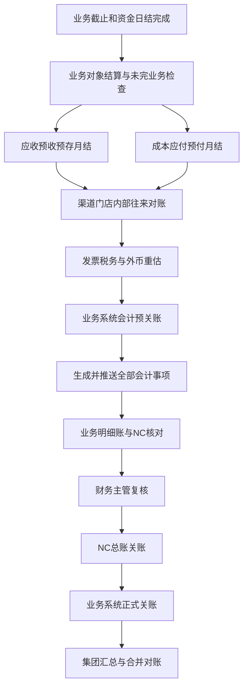

# 业财底座05：对账、关账与异常控制

版本：v0.1（分析工作稿，非最终交付文档）  
编写日期：2026年8月23日  
上游基线：[业财底座01：多主体交易关系与核算责任基线](业财底座01-多主体交易关系与核算责任基线.md)  
场景依据：[业财底座02：全业务场景财务数据链路矩阵](业财底座02-全业务场景财务数据链路矩阵.md)  
对象依据：[业财底座03：财务业务对象与数据关系](业财底座03-财务业务对象与数据关系.md)  
入账依据：[业财底座04：会计事项与 NC 凭证规则](业财底座04-会计事项与NC凭证规则.md)

## 一、本阶段要解决的问题

业财链路不是“凭证成功推到 NC”就结束。系统还必须持续证明：

1. 银行、支付平台、POS 和现金记录与真实资金一致。
2. 客户应收、预收、预存、退款和收款核销余额一致。
3. 供应商成本、账单、应付、预付、付款和发票一致。
4. 渠道、OTA、加盟门店与我方的订单、扣费和实结金额一致。
5. 集团内部双方的应收应付、代收代付和结算期间一致。
6. 团期、航次、班期、营期、项目、订单和服务单的经营结果可解释。
7. 业务系统明细账与 NC 总账凭证和余额一致。
8. 关账后数据不会被无痕修改，必要调整能够进入正确期间并保留原始记录。

本阶段建立全公司的对账层次、对账公式、差异处理、关账顺序、异常责任和重开规则。它既服务财务日常工作，也为后端开发提供明确的检查条件。

## 二、规则依据和总体原则

2024年修订的《中华人民共和国会计法》要求会计资料真实、完整，并要求会计人员审核原始凭证；记载不准确、不完整的凭证应退回更正或补充。[财政部：中华人民共和国会计法（2024年）](https://kjs.mof.gov.cn/zhengcefabu/202408/t20240812_3941615.htm)

财政部《会计信息化工作规范》和《会计软件基本功能和服务规范》自2025年1月1日起施行，强调会计数据真实、完整、安全传输，电子凭证完整接收、验签或验真以及重要数据防篡改。[财政部：会计信息化工作规范和会计软件规范答记者问](https://m.mof.gov.cn/czxw/202408/t20240806_3941155.htm) [财政部：会计软件基本功能和服务规范](https://kjs.mof.gov.cn/zhengcefabu/202408/t20240805_3941147.htm)

据此，本系统遵守以下原则：

1. 对账不修改原始事实，只记录匹配、差异和处理结果。
2. 差异必须说明来自时间差、汇率差、规则差、遗漏、重复还是错误。
3. 正常未收、正常未付和正常余额不等于账不平。
4. 关账检查关注的是数据完整、余额可解释和会计承接一致，不要求所有应收、应付、预收、预付都归零。
5. 已结算、已推 NC、已关账的数据只能通过调整、冲销、补充结算或重开期间处理。
6. 每个法人和核算主体独立对账、独立关账；集团汇总不能掩盖单体差异。
7. 对账结果必须能从汇总余额展开到业务单据、资金流水和 NC 凭证。

## 三、先区分正常余额、未达项和真正异常

### 1. 正常余额

正常余额是已经有明确业务依据、责任方和后续处理日期的未结金额。例如：

- 企业客户尚未到付款日的应收；
- 已确认应付但尚未到付款节点；
- 船司合同要求提前支付而形成的有效预付；
- 客户或门店主动留存的预存余额；
- 跨月履约项目尚未结转的合同负债或履约成本；
- 尚未达到开票或收票节点的发票余额。

正常余额进入账龄、到期和风险管理，但不因余额不为零阻断关账。

### 2. 未达项

未达项是双方记录时间不同，但金额、主体和业务来源能够解释的暂时差异。例如：

- 业务系统已记录付款，银行次日才正式扣款；
- 银行已到账，业务系统次日取得银行流水；
- A 公司本月确认内部应收，B 公司在次月初完成内部应付确认；
- OTA 已在平台账单扣款，我方退款单仍在处理；
- 供应商已开票，发票尚在传递或验真。

未达项必须记录对方、金额、预计消除日期和责任人。超过约定期限仍未消除时，转为异常。

### 3. 真正异常

异常是不能仅由正常账期或时间差解释，可能导致资金、债权债务、损益、税额或主体错误的问题。例如：

- 银行流水无法找到业务归属；
- 同一笔流水被重复认款；
- 收款主体与应收主体不一致且没有代收关系；
- 供应商账单重复、金额错误或无业务依据；
- 应付已付款但余额未减少；
- 平台净打款与订单、退款、佣金无法勾稽；
- 内部提供方应收与接收方应付金额不一致；
- 业务系统会计事项已生效但 NC 没有凭证；
- NC 已有凭证但业务系统无法找到来源；
- 已关账期间的原始金额被直接修改。

## 四、全链路对账层次


系统需要同时完成四类对账：

| 对账层次 | 核心问题 | 典型对象 |
|---|---|---|
| 外部对账 | 外部机构记录与我方是否一致 | 银行、支付平台、OTA、供应商、加盟门店 |
| 业务财务对账 | 订单履约事实与财务单据是否一致 | 订单、团期、成本、应收应付、收付款 |
| 明细账内部勾稽 | 各财务对象的发生额和余额是否相互解释 | 应收与核销、应付与付款、预存与扣款 |
| 业务系统与 NC 对账 | 会计事项、凭证和总账余额是否一致 | 业务明细账、NC 凭证、科目余额 |

## 五、资金对账

### 1. 银行账户对账

每个银行账户必须按所属法人、币种和日期独立对账。

```text
银行对账单期末余额
= 银行对账单期初余额
+ 银行入账合计
- 银行扣款合计

业务系统资金账期末余额
= 业务系统期初余额
+ 已确认收款、退款退回、供应商退款、调拨转入
- 已确认付款、客户退款、调拨转出、银行手续费

银行与系统差额
= 银行对账单期末余额 - 业务系统资金账期末余额
= 银行已记我方未记净额 - 我方已记银行未记净额 + 错误差额
```

对账不能只比较期末余额，还必须逐笔匹配银行流水与收款单、付款单、退款单、付款退回、供应商退款和资金调拨。

### 2. 银行流水匹配关系

| 资金记录 | 可匹配业务记录 | 允许关系 |
|---|---|---|
| 一笔客户入款 | 多张收款单或多个订单认款 | 一笔拆多笔 |
| 多笔客户入款 | 一张收款单或一张应收 | 多笔合一 |
| 一笔批量付款 | 多张付款单 | 银行批次与付款明细同时保留 |
| 一笔渠道净打款 | 多订单、退款、佣金和费用 | 通过渠道结算单拆解 |
| 一笔集团资金清算 | 多笔内部代收代付 | 通过内部清算明细拆解 |

系统自动匹配可以使用账户、金额、日期、付款方、收款方、附言、渠道交易号和业务单号，但自动匹配结果仍要保留依据。金额相同不能作为唯一认定条件。

银行已经真实到账但暂时无法确认客户或业务归属时，资金事实仍应按财务制度完整入账，贷方暂记待认领款项等适当负债，同时进入未认款清单。后续确认归属后再转应收核销、合同负债、预存或代收款；不得为了对平银行而暂记收入，也不得使用一个通用客户长期挂账。

### 3. 支付平台和 POS 对账

支付平台需核对三个层面：

```text
客户支付成功金额
- 平台退款
- 平台手续费
- 平台冻结/保证金变化
= 平台应结算金额

平台应结算金额
- 已结算到银行金额
= 平台待结算余额
```

平台交易成功不等于银行已经收到清算款；客户支付、平台余额和银行结算必须分别记录。

### 4. 现金对账

```text
收款人应交现金
= 现金收款登记
- 已向出纳交款
- 获批现金退款或作废

出纳库存现金
= 期初库存现金
+ 收款人交款
- 银行缴存
- 获批现金支出

银行缴存金额
<-> 银行入账流水
```

现金从收款人交给出纳、再从出纳缴入银行，只是保管位置变化，不能重复确认为客户收款。

### 5. 资金日结

每个工作日结束后，出纳或资金会计至少完成：

- 当日银行及平台流水取得情况；
- 当日收款、付款、退款和退回逐笔匹配；
- 现金收取、交款和银行缴存核对；
- 未认款、重复流水、账户异常和大额差异清单；
- 当日资金余额与银行可用余额差异说明；
- 结果未知的支付和退款查询。

日结允许保留有明确解释的未达项，但不能把未知资金自动归入收入、预收或其他往来来完成日结。

## 六、客户应收、预收和预存对账

### 1. 业务应收余额

```text
期末业务应收余额
= 期初业务应收余额
+ 本期应收增加
- 本期应收冲减
- 本期收款核销
- 本期预收核销
- 本期预存扣款核销
- 本期获批关闭金额
```

核对范围至少包括客户、订单、合同阶段、结算主体、币种和账龄。

### 2. 会计应收、合同资产和合同负债

业务应收余额不能直接与 NC 应收科目总额比较。应先按《业财底座04》分成：

- 已形成无条件收款权的会计应收；
- 已履约但权利仍附条件的合同资产；
- 已收或已到付款节点但尚待履约的合同负债；
- 仅用于业务催收、尚未达到会计确认条件的付款计划。

然后分别与 NC 对应科目核对。

### 3. 预收余额

```text
期末预收余额
= 期初预收
+ 本期未核销收款转入
- 转应收核销
- 转预存
- 客户退款
- 调整冲销
```

预收必须能追溯到原收款和付款方。长期无法确定客户或业务归属的款项，应进入异常处理，不能永久挂在一个通用客户名下。

### 4. 预存余额

```text
期末预存账面余额
= 期初账面余额
+ 本期充值
+ 本期退款转存
+ 获批增加调整
- 本期订单扣款
- 本期现金退款
- 获批减少调整

期末预存可用余额
= 期末账面余额 - 期末冻结余额
```

对账需要同时核对预存总账负债、客户/门店账户余额和每笔充值扣款明细。冻结不改变总账余额，因此不能用可用余额与 NC 负债科目直接比较。

### 5. 客户侧正常余额和异常

| 情况 | 性质 | 处理 |
|---|---|---|
| 未到期客户应收 | 正常余额 | 进入账龄和到期管理 |
| 已到期未收 | 正常余额但有信用风险 | 催收、信用控制和减值评估 |
| 收款已到账未认款 | 未达或异常 | 限期认领；不能核销不明应收 |
| 超收已确认客户 | 正常预收或待退款 | 按客户确认转预收、预存或退款 |
| 预存账面余额与明细不等 | 异常 | 阻断预存相关关账并查找重复、漏记或错误调整 |
| 已退款但应收未恢复/冲减 | 异常 | 按退款性质补齐应收或收入调整 |

## 七、供应商成本、应付和预付对账

### 1. 供应商账单对账

供应商账单与我方实际成本按账单明细核对：

```text
供应商主张金额
- 不认可金额
+ 我方认可但供应商漏列金额
= 双方确认结算金额

双方确认结算金额
- 已形成正式应付
= 待形成应付或待调整金额
```

对账明细需要保存供应商账单号、费用项目、服务日期、团期/项目/采购批次、数量、单价、原币、税额和差异原因。

### 2. 应付余额

```text
期末应付余额
= 期初应付
+ 本期正式应付
+ 本期增加调整
- 本期减少调整
- 付款核销
- 预付冲抵
- 供应商应退款抵减
- 获批关闭金额
```

应付余额与供应商对账单、付款单和 NC 供应商往来余额分别核对。

### 3. 预付余额

```text
期末供应商预付
= 期初预付
+ 本期预付款
- 本期冲抵应付
- 本期供应商退款
- 获批转用
- 已确认损失
- 调整冲销
```

正常预付可以跨期存在，但必须有合同、预计使用对象、预计冲抵或退回日期。已经回团、航次结束或采购取消后长期未处理的预付属于风险余额。

### 4. 实际成本与应付的勾稽

实际成本与应付不要求在每一天完全相等，因为可能存在暂估、预付、代付和费用化时间差。但每项差额必须归入明确类别：

- 已发生实际成本、正式账单未到；
- 已暂估入账、待转正式应付；
- 账单已到、业务服务待确认；
- 成本承担主体与付款主体不同；
- 供应商退款或折让待处理；
- 成本归集与会计结转期间不同。

### 5. 发票与应付对账

```text
供应商已确认应付金额
<-> 已收发票金额 + 合规无票依据金额 + 待收票金额

发票价税合计
<-> 应付含税金额

可抵扣税额
<-> NC进项税额及待认证/待抵扣记录
```

未收票不一定阻断业务结算或会计关账，但必须按公司付款、税务和暂估制度分类。发票金额不一致、购方主体错误、重复发票或发票无法验真属于异常。

## 八、团期、航次、班期、项目和订单结算对账

### 1. 结算不是把所有余额清零

结算确认的是某个业务对象在当前时点的有效交易、收入、成本、调整和未决事项。客户尚未付款、供应商尚未到付款日或发票尚未收到，只要金额和责任清楚，可以作为结算后的正常余额继续管理。

### 2. 客户侧结算勾稽

```text
有效客户交易金额
= 已确认收款
+ 已核销预收
+ 已核销预存
+ 期末待收

有效客户交易金额
= 已履约确认收入
+ 尚待履约对应金额
+ 代第三方收取金额
+ 其他经批准非收入金额
```

第一组核对钱怎么结清，第二组核对交易金额如何进入收入或负债，二者不能混成一个公式。

### 3. 供应商侧结算勾稽

```text
实际成本及成本调整
= 已形成正式或暂估应付
+ 已由预付直接承接但待形成应付的金额
+ 其他经批准无应付成本
- 尚未达到成本确认条件的账单金额
```

### 4. 结算对象检查

| 结算对象 | 必须核对 |
|---|---|
| 普通团期 | 有效订单、游客变更、收退转、资源消耗、实际成本、损耗和未决售后 |
| 邮轮航次 | 舱房、港务费、小费、升舱退舱、舱损、船司账单和分批预付 |
| 专列班期 | 铺位、包厢差、释放、铺损、运营方账单和包列成本分摊 |
| 自由行订单 | 订单服务组合、采购批次成本、退改、即时确认和订单级毛利 |
| MICE/单团项目 | 合同阶段、变更、验收、阶段收款、项目成本和未完履约 |
| 研学营期 | 学校、班级、学生、家长收款、营地课程导师成本和退营 |
| 单项服务单 | 服务费、代垫、服务完成、退改、供应商结算和客户核销 |
| 航服票务 | PNR、票号、出票、退改、BSP 日报、IATA 账单和平台预付 |

### 5. 业务结算完成条件

业务结算可以确认时至少满足：

- 结算范围明确，订单和成本没有重复或漏纳；
- 主体、币种、收入模式和结算对象明确；
- 关键履约资料齐全；
- 实际成本或可接受暂估已确认；
- 已发生售后已纳入，未决售后有金额估计和责任说明；
- 毛利异常已解释或审批；
- 所有阻断性差异已处理；
- 未收、未付、未开票等正常余额已分类。

## 九、渠道和 OTA 对账

### 1. 三方对账

渠道和 OTA 必须同时核对系统订单、平台账单和实际资金：

```text
系统应结算金额
= 平台确认的有效订单金额
- 平台代退客户金额
- 平台佣金
- 平台服务费及其他扣费
+ 平台或活动补贴
+/- 已确认调整

渠道未结余额
= 系统应结算金额
- 平台实际打款
- 已确认抵扣或转期金额
```

### 2. 对账顺序

1. 先按平台订单号匹配系统订单。
2. 再匹配取消、退订、退款和售后结果。
3. 单独识别佣金、服务费、活动补贴和其他扣费。
4. 按签约主体、经营单元、产品和税务处理分配。
5. 最后将净结算金额与银行实际到账匹配。

### 3. 常见差异

| 差异 | 处理原则 |
|---|---|
| 平台有单、系统无单 | 查漏单、接口延迟或非凯撒业务，不直接确认收入 |
| 系统有单、平台无单 | 查订单状态、结算周期或平台拒付 |
| 平台已退款、系统无售后 | 补建售后事实并核对客户与库存影响 |
| 佣金比例不同 | 核对合同版本、活动政策和适用日期 |
| 净打款差异 | 拆解手续费、冻结款、跨期款和银行未达 |
| 主体不一致 | 阻断结算，确认是否存在有效代收或内部交易关系 |

## 十、门店对账

### 1. 直营门店

直营门店属于同一法人内部经营单元，不形成外部门店应收应付。对账重点是订单、收款、现金交款、业绩归属、费用和分润管理结果。

### 2. 加盟门店或外部门店

```text
门店预存期末余额
= 期初余额
+ 本期充值
+ 本期退款转存
+ 增加调整
- 订单扣款
- 预存退款
- 管理费或经授权扣费
- 减少调整

门店本期应结金额
= 门店代收客户款
+ 门店账期采购金额
- 总部代收应付门店分润
- 门店已清算或已扣预存金额
+/- 已确认调整
```

### 3. 门店对账不得混用的口径

- 客户零售价与总部对门店结算价；
- 门店真实预存资金与总部给予门店的信用额度；
- 门店代收客户款与门店自有充值款；
- 门店经营利润与总部应付门店分润；
- 直营门店内部业绩与独立法人门店内部交易。

## 十一、集团内部往来对账

### 1. 对账单位

内部对账必须按“提供方法人—接收方法人—内部往来关联号—原币—期间”核对，不能只比较集团合计。

```text
提供方内部应收原币金额
= 接收方内部应付原币金额

提供方已收内部款
= 接收方已付内部款

提供方内部销项
<-> 接收方内部进项或适用凭据
```

### 2. 差异分类

- 一方已确认、另一方尚未确认的时间差；
- 结算价、税额或币种不一致；
- 交易伙伴选择错误；
- 一方遗漏或重复记录；
- 代收代付尚未完成资金清算；
- 双方会计期间不同；
- 汇率使用日期不同；
- 同法人管理结算误做成法人间往来。

### 3. 内部未达项

允许合理的跨月未达项，但双方必须共同确认：

- 原始业务和结算金额；
- 已入账方及会计期间；
- 未入账方和预计处理期间；
- 差异责任人；
- 是否影响合并抵销；
- 逾期后的升级处理。

不能为了让集团汇总自动对平而覆盖单方法定账事实。

## 十二、业务系统与 NC 对账

### 1. 凭证完整性对账

```text
本期已生效会计事项
= 已生成待推送凭证
+ 经批准暂缓入账事项

本期应推送凭证
= NC已接收凭证
+ NC明确拒绝待处理
+ 结果待确认凭证
```

不存在来源的 NC 凭证和没有 NC 承接的已生效会计事项都属于重点异常。

### 2. 发生额对账

按核算主体、期间、事项类别、科目类别、币种和辅助核算比较：

```text
业务系统本期借方发生额 = NC对应来源凭证借方发生额
业务系统本期贷方发生额 = NC对应来源凭证贷方发生额
```

汇总凭证必须能展开到原会计事项，不能只用总金额对平。

### 3. 余额对账

至少核对：

- 银行和支付平台资金；
- 会计应收、合同资产和合同负债；
- 客户及门店预存负债；
- 供应商应付、暂估应付和供应商预付；
- 渠道和门店往来；
- 集团内部应收应付；
- 外币余额和汇兑调整；
- 进销项税额及发票相关余额。

### 4. NC 侧人工改动

如果 NC 允许财务人员修改业务系统来源凭证，系统必须把该凭证列为“业财不一致”，取得修改后的科目、金额、辅助核算、期间和修改原因。没有返回修改结果时，不允许仅以“NC 已记账”视为对账完成。

## 十三、日结、月结和关账层次

### 1. 资金日结

每日核对收款、付款、退款、现金、平台和银行流水，形成当日未达项与异常清单。资金日结不等于业务结算或会计月结。

### 2. 业务对象结算

团期、航次、班期、营期、项目、订单或服务完成后进行业务结算。不同月份仍在履约的业务对象不需要为了月末强行结算，但必须按收入和成本政策处理本期应确认事项。

### 3. 财务明细账月结

分别完成资金、应收、预收预存、成本、应付预付、渠道、门店、内部往来和发票的月度核对，确认期末余额组成。

### 4. 业务系统会计预关账

完成本月业务截止，限制普通人员继续把业务结果记入本期，但保留经授权的月结调整入口。此时继续完成会计事项生成、NC 推送和差异处理。

### 5. NC 总账关账

业务系统会计事项全部承接、NC 凭证完整、业务明细账与 NC 对平后，由总账会计按 NC 流程关账。NC 返回关账结果后，业务系统把该核算主体和期间标记为正式关账。

### 6. 集团汇总和合并

各法人的内部往来差异、跨期未达和抵销范围确认后，进入集团合并与管理报表。集团完成汇总不代表单体差异可以关闭。

## 十四、月末关账顺序



### 月末不能颠倒的关系

1. 资金流水未取得完整前，不能完成资金月结。
2. 实际成本和必要暂估未完成前，不能确认成本完整。
3. 主体、收入模式和内部交易未明确前，不能生成最终会计事项。
4. NC 推送结果未知时，不能重复推送，也不能视为已完成。
5. 业务系统与 NC 未对平时，不能完成正式关账。

## 十五、关账检查项目

### 1. 必须阻断关账的问题

- 银行或现金余额存在无法解释的差额；
- 同一资金流水、收款、付款或会计事项重复处理；
- 收款、付款、应收、应付或收入成本主体错误；
- 跨主体收付没有有效代收代付或内部清算关系；
- 预存、预收、预付明细合计与财务余额不一致；
- 已发生重大业务但收入、成本或暂估遗漏；
- 内部往来双方金额不一致且无有效未达说明；
- 已生效会计事项未生成凭证且无批准原因；
- NC 拒绝或结果待确认且影响本期账务的凭证未处理；
- 业务系统与 NC 发生额或余额不一致；
- 已关账数据被直接修改或来源记录缺失；
- 借贷不平、币种汇率缺失或关键辅助核算缺失。

### 2. 可以带余额关账的问题

以下事项在业务依据完整、金额可解释、责任人和后续日期明确时，可以作为正常余额或批准未达项跨期：

- 未到期应收和应付；
- 已到期但已进入催收或付款安排的余额；
- 合法客户预存和供应商预付余额；
- 跨月履约项目的合同负债、合同资产和履约成本；
- 尚未到开票/收票节点的发票余额；
- 银行正常结算时间造成的短期未达；
- 双方已确认金额和处理期间的内部未达；
- 尚未结束团期、航次、班期和项目的预计后续成本。

“可以带余额”不等于不管理。系统仍应记录账龄、预计处理日期、风险等级和责任人。

### 3. 需要财务主管批准后带入下期的问题

- 超过正常期限但金额可确认的银行未达；
- 供应商账单或发票尚未取得但暂估依据充分；
- 客户或供应商争议尚未解决但已合理估计金额；
- 内部往来因双方关账时间差暂未对平；
- 小额渠道或门店差异已经按批准方式计入待处理往来，并将在下一账期完成调整；
- NC 已接收且不影响法定账金额的管理分析资料待补充。

批准记录必须包含金额、影响科目、责任人、计划完成日期和逾期升级方式。金额及天数标准由凯撒财务制度配置，不能写死在程序里。

## 十六、异常分级和处理责任

### 1. 异常分级

| 等级 | 判断标准 | 处理要求 |
|---|---|---|
| 重大异常 | 可能造成资金损失、主体错误、重复入账、重大错报或合规风险 | 立即阻断相关处理和关账，升级财务负责人 |
| 关账异常 | 影响本期余额、损益、税额或 NC 对账 | 月结前必须处理或取得正式批准 |
| 业务差异 | 金额和业务范围不一致，但尚未形成错误会计结果 | 退回责任环节处理，限制结算确认 |
| 正常未达 | 时间差可解释且预计短期消除 | 记录并跟踪，不阻断无关业务 |
| 风险余额 | 金额账面成立但账龄、回收或冲抵存在风险 | 持续催收、减值或损失评估 |

### 2. 责任分工

| 问题来源 | 主要责任角色 | 财务角色 |
|---|---|---|
| 订单金额、客户、合同、优惠 | 销售、门店或渠道运营 | 核对应收和退回更正 |
| 名单、资源消耗、履约和售后 | 计调、团控、票务或项目负责人 | 核对收入成本影响 |
| 供应商服务、数量和账单依据 | 采购、计调或成本负责人 | 核对应付、预付和差异 |
| 银行、平台、现金和支付结果 | 出纳、资金会计 | 完成资金对账和异常升级 |
| 应收、预收、预存、退款 | 应收会计 | 余额核对、账龄和异常处理 |
| 应付、预付、付款和回单 | 应付会计、出纳 | 供应商往来和资金核对 |
| 发票和税额 | 税务会计 | 票据验真、税额和税务差异 |
| 会计事项、NC 和期间 | 总账会计、NC 管理人员 | 凭证对账、关账和重开控制 |
| 内部往来 | 双方法人财务 | 双方共同确认，不允许单边关闭 |

NC 管理人员负责档案对应、科目规则和传输问题，但不能代替业务或财务修改订单、成本和资金事实。

## 十七、典型差异处理示例

### 示例一：银行到账 100,000 元，认款 90,000 元

客户向公司账户支付 100,000 元，其中订单有效应收 90,000 元。

```text
银行流水：100,000
已确认收款：100,000
应收核销：90,000
未核销收款：10,000
```

差额 10,000 元不是银行差异。它是收款内部尚未分配的余额，应根据客户确认转预收、预存或退款。

### 示例二：系统付款 80,000 元，银行尚未扣款

如果付款只是指令已提交，不能确认资金已经付出；若银行明确受理但跨日扣款，应列为我方已记、银行未记的短期未达。次日仍未扣款时，必须查询支付结果，不能重复付款。

### 示例三：OTA 月结

平台有效订单 500,000 元，平台退款 30,000 元，佣金 40,000 元，活动补贴 5,000 元，银行到账 435,000 元。

```text
应结算金额
= 500,000 - 30,000 - 40,000 + 5,000
= 435,000

银行到账 = 435,000
渠道资金差异 = 0
```

还需要核对 30,000 元平台退款是否都有系统售后，40,000 元佣金是否符合合同，5,000 元补贴由谁承担。资金对平不代表业务明细已经对清。

### 示例四：供应商预付和账单

船司预付 300,000 元，最终认可账单 280,000 元，已冲抵 280,000 元。

```text
供应商预付期末余额
= 300,000 - 280,000
= 20,000

应付余额 = 280,000 - 预付冲抵280,000 = 0
```

20,000 元是正常预付还是供应商应退款，要根据合同和后续航次转用计划判断；不能为了结算将其直接计入成本。

### 示例五：加盟门店预存月结

期初余额 200,000 元，本月充值 50,000 元，订单扣款 120,000 元，退款转存 10,000 元，管理费扣款 5,000 元，冻结 20,000 元。

```text
期末账面余额
= 200,000 + 50,000 - 120,000 + 10,000 - 5,000
= 135,000

期末可用余额
= 135,000 - 20,000
= 115,000
```

与 NC 预存负债核对的是 135,000 元账面余额，不是 115,000 元可用余额。

### 示例六：集团内部代收未清算

B 为 A 代收客户款 60,000 元，双方已确认内部往来但本月尚未清算。

```text
A 对 B 内部应收：60,000
B 对 A 代收应付：60,000
双方差额：0
未清算余额：60,000
```

60,000 元是正常内部往来余额，不是对账差异。若 A 为 60,000 元、B 为 50,000 元，未说明的 10,000 元才是异常。

### 示例七：关账后新增成本 12,000 元

原团期和原会计期间已经关账。供应商次月补交有效账单 12,000 元。

正确处理为：

1. 保留原结算和原 NC 凭证。
2. 判断是否需要重开原期间；通常优先按制度在当前开放期间调整。
3. 形成成本调整和补充结算。
4. 生成新的会计事项和 NC 凭证。
5. 在报表中说明对原团期毛利和当前期间损益的影响。

## 十八、关账后调整和重开

### 1. 优先使用当前期间调整

原期间已经正式关账后，如果会计制度允许在当前期间反映，应通过补充结算、调整或冲销处理，不重开原期间。

### 2. 必须重开原期间的条件

只有在重大错报、法规要求、审计调整或财务负责人认定必须更正原期间时，才能申请重开。

重开申请至少说明：

- 核算主体和期间；
- 需更正的原业务和 NC 凭证；
- 错误原因及金额影响；
- 对收入、成本、税额、资金和报表的影响；
- 为什么不能在当前期间调整；
- 重开范围、处理人和完成期限；
- 重新关账的复核人。

### 3. 重开顺序

```text
重开申请和审批
-> NC原期间按权限重开
-> 业务系统对应期间进入受控调整状态
-> 仅允许批准范围内的调整
-> 重新生成/冲销并推送凭证
-> 业务系统与NC重新对账
-> 财务主管复核
-> NC重新关账
-> 业务系统恢复正式关账
```

业务系统不能在 NC 仍关闭时单独完成原期间入账；NC 也不能重开后长期不通知业务系统。

### 4. 业务结算重开与会计期间重开不是一回事

团期或项目结算重开用于补充业务明细，不必然要求重开会计期间。系统应先判断新增内容是否能通过当前期间补充结算承接，只有确需改原期间会计结果时才进入会计期间重开。

## 十九、异常处理记录要求

每一项对账差异或异常至少保存：

- 异常名称和发现日期；
- 涉及法人、核算主体和业务对象；
- 涉及客户、供应商、门店、渠道或内部单位；
- 原始金额、对方金额和差异金额；
- 币种、汇率和税额；
- 来源单据、外部凭据和 NC 凭证；
- 差异分类和原因；
- 责任角色和具体处理人；
- 是否阻断结算、付款、退款、NC 或关账；
- 计划完成日期；
- 处理方式、审批和最终结果；
- 调整、冲销或补充结算单据；
- 关闭人和关闭日期。

异常不能通过删除原记录或手工改余额关闭。没有处理单据、资金结果或正式批准依据的，只能标记为待处理，不能标记为已解决。

## 二十、管理报表和异常清单

系统至少需要提供以下财务工作清单：

| 清单 | 主要内容 |
|---|---|
| 未认款和未核销资金清单 | 到账流水、付款方、已认金额、剩余金额和账龄 |
| 银行及平台未达清单 | 系统记录、外部记录、差异方向、预计消除日期 |
| 应收账龄和逾期清单 | 客户、订单、到期日、余额、信用风险和催收状态 |
| 预收预存余额清单 | 原收款、客户/门店、余额、账龄、冻结和用途 |
| 供应商账单差异清单 | 账单、实际成本、认可金额、差异原因和责任人 |
| 应付及预付账龄清单 | 供应商、应付、已付、预付、预计冲抵或退回日期 |
| 渠道与门店差异清单 | 订单、扣费、退款、分润、实结和差异 |
| 内部往来未达清单 | 双方法人、双方金额、期间、差异和清算状态 |
| 业务结算缺口清单 | 团期/项目、未决售后、成本缺口、毛利异常和结算状态 |
| 业务系统与 NC 差异清单 | 会计事项、凭证、科目余额、期间和差异原因 |
| 关账检查清单 | 阻断项、批准跨期项、责任人和完成进度 |

清单中的“待处理”必须表达具体数据缺口和金额，不使用“请联系、请催促、待跟进”等无法核对的员工动作作为财务状态。

### 新增场景的专项对账要求

| 场景 | 必须对上的关系 | 关账检查 |
|---|---|---|
| 通道手续费和净额到账 | 客户交易总额＝实际到账＋手续费＋其他已认可扣项 | 未拆出的净额到账不能直接作客户收款全额 |
| 拒付、强制退款和滚存保证金 | 原交易、原收款、平台扣款、争议结果和保证金余额 | 长期未决拒付和无来源保证金差异必须说明 |
| 待认领款项 | 银行实际到账＝已认领＋已退回＋待认领余额 | 按账龄列示，不得为对平而转为收入 |
| 坏账和减值 | 原资产余额、减值准备、核销、收回和 NC 余额 | 减值不改写原业务余额，核销必须有审批 |
| 押金和保证金 | 合同、实际收付、冻结、扣罚、退还和期末余额 | 超过合同退还日的余额必须有原因和处理计划 |
| 员工借款和报销 | 借款付款、费用报销、余款退回、超支补付和员工期末余额 | 已回团/项目完成后长期未报销借款必须列示 |
| 共享资源成本分摊 | 资源总成本＝已分摊＋未售损耗＋待分摊 | 结算前无规则或无受益对象的分摊必须阻断 |
| 赔偿和保险理赔 | 客户应赔/已赔、保险应赔/已收和公司净损失 | 客户赔付不得等待保险理赔而不记录 |
| 取消出团/不可抗力 | 客户应退/已退、供应商应退/已退、不可追回成本和责任分摊 | 客户和供应商两侧未完成的重大差异必须说明 |
| 应收应付抵销 | 抵销协议、双方对账单、应收核销、应付核销和 NC 剩余往来 | 未经批准不得用净额覆盖应收和应付明细 |

## 二十一、86 个业务场景的对账和关账承接

| 场景组 | 重点对账 | 重点异常 |
|---|---|---|
| SC-SALE 客户销售 | 订单、业务应收、会计应收、收款核销、收入、减值和坏账 | 阶段款误作收入、分配错误、减值改写原余额、核销无审批 |
| SC-CASH 收款余额 | 银行/平台/现金、收款、待认领、预收、预存、通道费用和押金保证金 | 未认款、重复认款、净到账未拆费用、押金预收混淆、外币差额 |
| SC-STORE 门店 | 订单、代收、预存、账期、分润、实结和长短款 | 直营加盟混淆、预存与授信混淆、代收未缴、长短款无责任结论 |
| SC-CHANNEL 渠道 | 系统订单、平台账单、佣金退款、拒付、滚存保证金和实际打款 | 漏单、平台退款未同步、净打款误作收入、拒付删除原收款 |
| SC-COST 供应商 | 实际成本、账单、应付、预付、付款、发票、员工借款报销和共享成本分摊 | 账单重复、无依据成本、预付长期未冲抵、借款误作成本、分摊不平 |
| SC-PRODUCT 专项产品 | 舱房铺位票号、资源损耗、项目阶段和大账单 | 舱损铺损票损遗漏、BSP/IATA 与出票不符 |
| SC-IC 内部交易 | 双方内部应收应付、代收代付和资金清算 | 单边入账、交易伙伴错误、跨期汇率差异 |
| SC-AFTER 售后 | 应收收入调整、客户退款、供应商追退、赔偿理赔、取消出团损失和资金退回 | 只改客户侧未改供应商/保险侧、不可追回成本无责任归属、原凭证被覆盖 |
| SC-SETTLE 结算关账 | 业务结算、会计事项、NC、余额、往来抵销、减值和跨期调整 | 重复结转、结算遗漏、未批抵销、减值改写原余额、关账后直接修改 |

九类 86 个场景均可进入本文件定义的资金、往来、结算、NC 和关账检查。逐场景对账承接见《业财底座07》。

## 二十二、正式开发前需要凯撒补充的制度资料

1. 各法人资金日结、银行对账和现金管理制度。
2. 银行、支付平台、POS、OTA 和银企直连真实流水样本。
3. 客户应收账龄、逾期、信用控制和减值政策。
4. 客户及门店预收、预存、冻结、退款和余额调整制度。
5. 主要供应商账单、对账、暂估、预付和追退款制度。
6. OTA、分销、加盟门店和集团内部单位的结算协议及真实对账单。
7. 各业务结算完成条件、成本完整性标准和毛利异常阈值。
8. 发票未到、无票付款、境外凭据和税额差异处理制度。
9. 各法人月结时间表、关账检查、重大性标准和批准跨期条件。
10. NC 月结关账、作废、冲销、重开及凭证修改权限。
11. 集团内部往来对账和合并抵销规则。
12. 审计调整、历史差错更正和报表重述制度。

## 二十三、本阶段结论

1. 对账必须同时覆盖外部机构、业务财务明细、财务余额、结算结果和 NC 总账，不能只看某一张结算单。
2. 正常余额、时间未达和真正异常必须分开；未收未付不等于账不平，无法解释的差额才需要阻断。
3. 银行、平台和现金需逐笔对账，支付成功、平台清算和银行到账不能混成一个状态。
4. 业务应收要先区分会计应收、合同资产和合同负债，再与 NC 对账。
5. 供应商成本、账单、应付、预付、付款和发票各自对账，正常预付余额不能被强制转成本。
6. 渠道、门店和集团内部结算必须同时核对业务明细、费用扣减和真实资金。
7. 业务结算可以保留正常未收、未付和待开发票余额，但所有阻断性差异必须处理。
8. 月结按照资金、业务对象、明细账、会计事项、NC 和集团汇总逐层完成；业务系统与 NC 未对平不能正式关账。
9. 关账后优先在当前开放期间调整；确需重开原期间时，NC 与业务系统必须按批准范围同步重开和重新关账。
10. 本文件与前四份底座共同构成最终技术开发文档和财务场景文档的上游设计依据。

## 二十四、下一阶段

五份业财底座工作稿与逐场景承接表已经覆盖主体责任、86 个业务场景、财务单据、会计事项、NC、对账和关账。

跨文档一致性复核已经完成，其审计结果见《业财底座06》；缺失场景和逐场景承接已回填到《业财底座02》和《业财底座07》。下一阶段重点是：

- 相同名称在不同文档中的含义差异；
- 同一业务结果在多个环节重复入账的风险；
- 用凯撒真实制度和样本验证 86 个场景的主体、金额、会计时点和 NC 口径；
- 依赖凯撒实际制度但目前仍未确认的业务判断；
- 现有原型页面与正式底层规则之间的冲突。

复核完成后，再分别形成：

1. 面向技术开发的《业财全链路业务规则与数据流程设计》；
2. 面向财务的《全业务场景收付款、结算与核算说明》。
