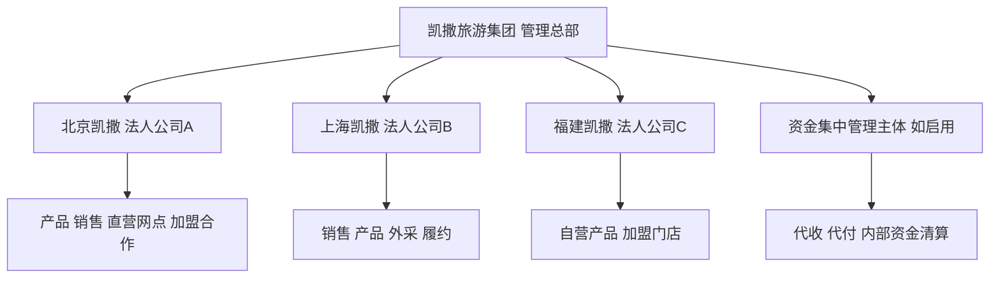
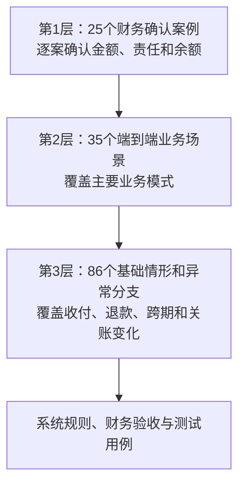
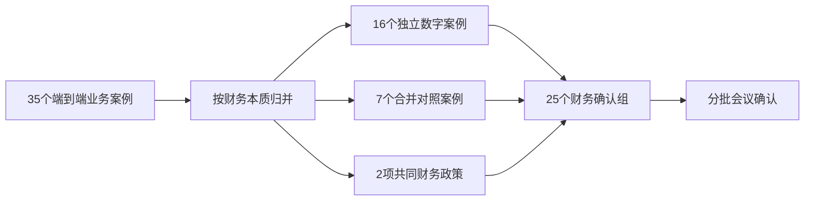
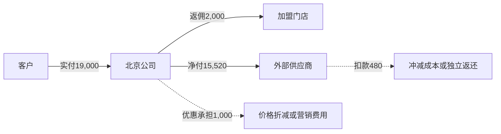
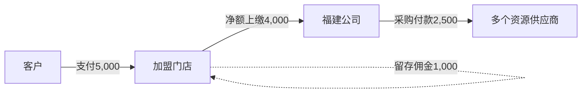
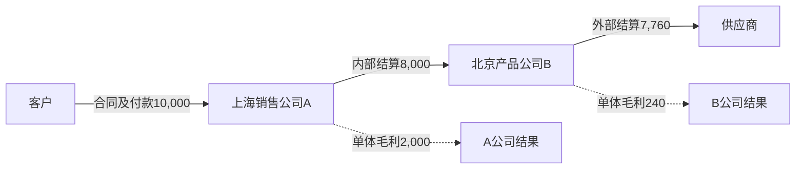
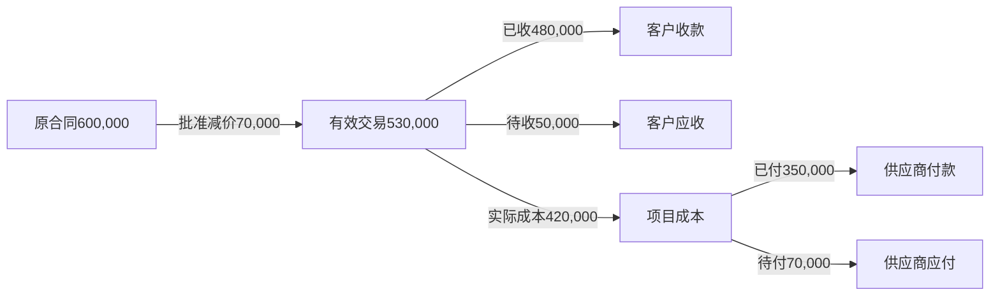
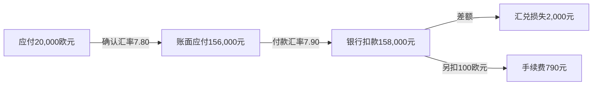
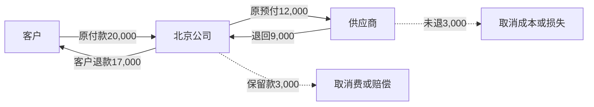
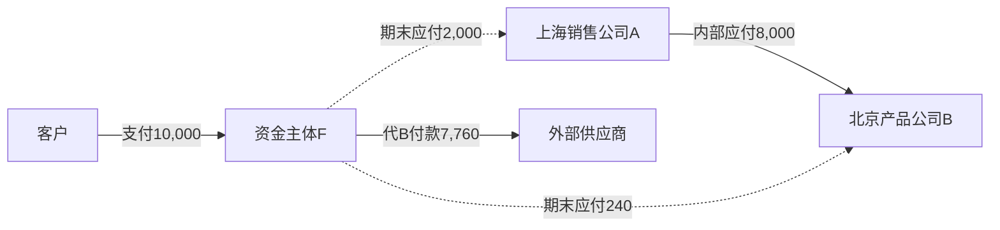

# 凯撒旅游SaaS全业务场景财务确认完整稿

> 文档定位：产品经理 × 集团财务逐项确认材料
> 分析视角：从客户合同、收付款和履约事实，一直验算到各法人往来、经营结果和NC（集团现用财务核算系统）
> 确认目标：证明每一笔钱归属清楚、每项债权债务成立时点清楚、每项收益只计算一次、反向调整可以追溯
> 文档范围：25个财务确认案例，完整承接35个端到端业务场景及其86个基础情形
> 版本日期：v2.0｜2026年8月24日

## 一、这份确认文档要解决什么问题

这次与财务确认的对象不是某一张页面或某一笔会计分录，而是旅游业务从产品来源、客户下单、收款、履约、供应商成本、门店或渠道结算、内部公司结算到财务入账的完整计算链路。

应收是客户或往来单位按合同已经应付给公司的金额；应付是公司因已经取得资源或服务而需要支付给供应商或内部公司的金额。业务系统先把这些业务事实和余额算清，财务再确认哪些事实达到会计入账条件。

本文所称NC，是集团现用的财务核算系统；文中只确认应进入NC的经济事项、所属公司、金额和日期依据，不在缺少正式档案时编造会计科目编码。

- 确认系统有没有把合同金额、客户实际付款、优惠承担、门店留存、供应商扣款混成一个金额。

- 确认同一笔收入、返佣、采购返还或部门贡献有没有在不同层次重复计算。

- 确认各法人分别应收谁、应付谁、收了多少钱、付了多少钱，集团合并时怎样抵销内部交易。

- 确认收入以履约事实为依据，资金到账只改变现金和债权债务，不直接替代收入确认。

- 确认已结算、已推送NC后发生退款、补价、银行退回或跨期调整时，不删除原记录，而是形成有依据的反向处理。

> **这件事的意义：** 财务确认后的案例将同时成为系统计算规则、财务验收口径和测试样本。将来任何页面或程序只要算出的余额、公司结果或资金反算与案例不一致，就能直接定位为漏算、重复计算、主体归属错误或时点错误。

## 二、业务复杂度地图

### 2.1 集团与核算责任



判断顺序：谁签客户合同 → 谁承担履约责任 → 谁向供应商采购 → 谁实际收付款 → 哪个法人记账

- 每个法人独立核算、独立开票、独立审计；跨法人交易形成双方对应的内部应收和内部应付。

- 同一法人内产品部、采购部、销售部、门店之间的利润分配属于管理核算，不形成虚假的法人间债权债务。

- 资金由集团统一代收或代付时，只改变实际资金所在主体，不改变客户合同、供应商合同和业务债权债务所属主体。

### 2.2 产品来源、销售方式和结算方式

| 判断维度 | 主要类型 | 财务必须识别的差异 |
| --- | --- | --- |
| 产品来源 | 本公司自营 / 体系外采购 / 集团内采购 | 决定履约责任、成本承担、内部往来和供应商应付 |
| 销售方式 | 直营网点 / 加盟门店 / 在线旅游平台（OTA） / 外部分销 / 企业项目 | 决定客户、收款方、佣金、账期和发票关系 |
| 客户资金 | 公司直收 / 门店代收 / 平台代收 / 集中代收 / 预存扣款 | 决定银行到账、代收未缴、预收和核销路径 |
| 渠道结算 | 全额上缴后返佣 / 扣佣后净额上缴 / 预存 / 月结 | 合同金额不因现金路径改变；差额必须有佣金或抵销依据 |
| 供应商结算 | 按单 / 按团期 / 按账单 / 预付 / 外币 | 实际成本、应付、预付、付款和汇兑差额分别记录 |

### 2.3 全文统一核算规则

```text
一项业务金额只进入一个确定去向：
合同成交金额
= 客户现金实付 + 被批准用于核销的优惠/积分/佣金抵销 + 期末待收

供应商有效应付
= 已付款 + 已冲抵预付 + 已批准抵销 + 期末待付

各法人经营结果合计 - 内部收入与内部成本抵销
= 集团对外收入 - 集团对外成本费用

资金净变化
= 实际流入 - 实际流出
资金净变化不必等于利润；差异应由应收、应付、预收、预付和跨期解释。
```

> **确认边界：** 本文不替财务直接决定税率、差额计税、收入确认日期、暂估政策、NC科目编码和发票时点。本文先把业务事实、金额、责任主体和余额算平，再由财务在备选方案中确认正式口径。

## 三、完整场景范围和组织方式

本文将35个端到端业务场景按财务实质归并为25个确认案例。原有8个数字案例继续保留并作为表达标准，其余17个案例按同一逻辑补齐。每个案例都必须从业务事实开始，贯通金额、债权债务、资金、履约、结算、会计事项和NC承接，不能只确认某一张单据或某一个页面。



### 3.1 原8个数字案例承担什么作用

| 覆盖维度 | 已覆盖内容 | 代表意义 |
| --- | --- | --- |
| 产品来源 | 自营、体系外外采、集团内采购 | 验证成本和履约责任怎样变化 |
| 销售与收款 | 公司直收、门店代收、平台代收、集中代收 | 验证合同金额与实际资金不一致时怎样核销 |
| 结算关系 | 门店佣金、供应商结算、内部公司结算、平台月结 | 验证谁应收谁、谁应付谁及差额去向 |
| 特殊核算 | 项目阶段款、外币、退款损失、集中资金 | 验证跨期、汇率和反向处理 |

因此，原8个场景继续作为本文的数字贯穿样板，其计算方法由其余17个案例沿用，但不再被当作完整覆盖范围。

### 3.2 本完整稿新增覆盖什么

本稿新增标准订单和多订单收款、不同收款渠道、外币客户款、押金保证金、多方优惠、减值核销、直营门店和部门贡献、加盟预存、分销商授信、平台拒付、供应商账单和暂估、员工借款、固定资源、航空票务、自由行采购、主责方与代理方、取消出团、关账后调整及往来抵销等内容。

### 3.3 从《05-待财务确认的全业务场景目录》归并出的财务确认范围

《05-待财务确认的全业务场景目录》中的C01—C35都涉及财务结果，原则上不能从财务确认范围删除。但35个业务案例不等于要开35场彼此独立的会议：部分案例的财务本质相同，可以作为同一确认组的不同业务变体；减值、跨期调整等内容则应作为所有案例共同遵守的政策。



| 财务确认组 | 来源场景 | 建议处理方式 | 批次 | 必须与财务确认的原因 |
| --- | --- | --- | --- | --- |
| G01 标准订单、收款分配和收款方式 | C01—C03 | 以标准跟团为主案例，将一款多单、多人付款、银行/收款码/现金作为分支 | 第一批 | 决定业务应收、会计应收、预收、到账和核销的基础口径 |
| G02 外币收款、押金和保证金 | C04 | 拆成“外币客户款”和“押金保证金”两个子案例确认 | 第二批 | 两者会分别改变汇兑损益、受限或返还性质负债，不能混成普通团款 |
| G03 会奖、单团和研学项目 | C05 | 独立数字案例 | 第一批 | 阶段收款、混合付款、合同变更和验收不等于阶段收入 |
| G04 多方承担优惠 | C06 | 独立价格瀑布案例 | 第一批 | 必须确定每项优惠减少谁的收入、增加谁的费用或形成谁的补偿应收 |
| G05 长期欠款、减值和核销 | C07 | 作为客户信用和期末政策专项确认 | 第二批 | 减值、坏账核销和核销后收回不是普通售后流程 |
| G06 直营门店和同法人部门协作 | C08、C24 | 合并为一个“法人账与部门贡献对照案例” | 第一批 | 必须确认部门贡献不形成虚假应收应付，员工提成何时成为真实费用 |
| G07 加盟门店总部直收和分润 | C09 | 独立数字案例 | 第一批 | 决定佣金成立时点、退款追回、发票及全额上缴后返佣规则 |
| G08 加盟门店预存 | C10 | 独立余额案例 | 第二批 | 充值、冻结、扣减、解冻和退款均改变预存负债，不等于订单收入 |
| G09 加盟门店代收和账期 | C11 | 独立数字案例 | 第一批 | 必须区分客户应收、门店代收应缴、门店应收、净额上缴和授信余额 |
| G10 集团内法人采购和三段交易 | C12、C25、C26 | 合并成“客户—销售公司—产品公司—供应商”案例族，分别展示自营和外采变体 | 第一批 | 决定内部结算价、双方应收应付、内部发票、单体结果及集团抵销 |
| G11 在线旅游平台月结 | C13 | 独立数字案例 | 第一批 | 平台销售额、退款、佣金、补贴和净额到账必须还原 |
| G12 外部分销商授信和账期 | C14 | 独立额度与应收案例 | 第二批 | 决定额度占用释放、渠道应收、逾期、保证金及代理/买断关系 |
| G13 平台拒付和滚存保证金 | C15 | 独立异常案例 | 第二批 | 原收款已核销后又被平台扣回，需要恢复应收、确认损失或受限资金 |
| G14 供应商成本、账单和周期对账 | C16、C33 | 合并为一个从实际成本到周期对账的完整案例 | 第一批 | 必须避免实际成本、暂估、正式账单和应付重复入账 |
| G15 外币供应商应付和付款 | C17 | 独立数字案例 | 第二批 | 成本汇率、付款汇率、期末重估、手续费和外币预付口径不同 |
| G16 员工借款和现场报销 | C18 | 独立余额案例 | 第二批 | 借款不是最终成本，报销、余款、补款和团期归属需要分别核对 |
| G17 固定资源和专项产品损耗 | C19、C20 | 合并确认分摊原则，再按邮轮、专列、包机分别给变体 | 第一批 | 决定预付、库存占用、已使用成本、可退资源和未售损耗 |
| G18 航空票务和集团内部供票 | C21、C27 | 合并成“外部票务采购—内部供票—产品团期”三层案例 | 第二批 | 票面、税费、代理费、内部票价、退改签和票损口径独特 |
| G19 自由行采购批次 | C22 | 独立分摊案例 | 第二批 | 没有标准团期时必须确定批次成本向订单和出行日期的分配依据 |
| G20 单项服务和主责方/代理方 | C23、C29 | 合并为全额收入、净额佣金和代收代付的对照案例 | 第一批 | 决定哪些金额属于收入成本，哪些只是代收负债和代付款 |
| G21 集中代收代付和资金清算 | C28 | 独立多主体案例 | 第一批 | 资金主体变化不能改变原客户债权、供应商债务和收入成本所属公司 |
| G22 客户退款和供应商追回 | C30、C31 | 合并为客户侧与供应商侧两条独立调整链路 | 第一批 | 客户应退与供应商可追回必须分别计算，转预存和转订单不产生虚假资金 |
| G23 取消出团、赔偿和保险理赔 | C32 | 独立重大异常案例 | 第二批 | 团款退款、额外赔偿、供应商索赔和保险理赔属于不同债权债务 |
| G24 结算后和关账后调整 | C34 | 作为全部案例共同政策 | 第一批 | 决定补充结算、冲销、反结算和跨期入账，不能直接覆盖原数据 |
| G25 同一往来单位应收应付抵销 | C35 | 独立抵销案例 | 第二批 | 抵销前两项往来必须真实存在，抵销后仍要保留收入成本和发票全貌 |

上述归并覆盖C01—C35全部案例，没有删除任何场景。其结构为：

- **16个独立数字案例**：业务金额、余额或财务性质独特，需要用一组完整数字单独验算。
- **7个合并对照案例**：多个业务场景共享同一财务主干，应在同一个案例中展示不同变体，避免重复确认。
- **2项共同财务政策**：客户减值和关账后调整应覆盖所有适用案例，不宜只绑定某一种产品。

案例1—8直接覆盖G03、G07、G09、G10、G11、G15、G21和G22，并部分验证G04和G14；案例9—25补齐其余确认组。上表“批次”仅表示建议会议顺序，不表示第二批场景可以不确认。

### 3.4 25个完整财务确认案例

### 案例1：体系外外采产品＋公司全额收款后返门店佣金

> 场景定位：外采产品 × 北京公司对客销售与收款 × 加盟门店获客 × 外部供应商履约 × 回团后结算
> 验证重点：优惠1,000、门店佣金2,000和供应商扣款480是否各算一次；公司结果为什么只能是1,480
> 金额说明：以下均为含税业务金额；收入时点、税额、发票和正式会计科目以财务确认结论为准。

#### 1. 业务场景设定

| 项目 | 内容 |
| --- | --- |
| 销售及履约公司 | 北京凯撒旅行社有限公司 |
| 产品 | 欧洲五国十日游，2人，外采同行产品 |
| 客户与团期 | 李先生；2026年9月1日出发，9月10日回团 |
| 销售渠道 | 加盟门店A获客，北京公司与客户签约并直接收款 |
| 合同及结算 | 合同价20,000；客户付19,000；门店佣金2,000；供应商结算基础16,000，扣款480 |
| 案例假设 | 北京公司为主要履约责任方，暂按全额列示客户交易；税务和收入时点待确认 |

#### 2. 参与方和财务责任

| 责任 | 承担方 | 判断依据 |
| --- | --- | --- |
| 对客合同、收退款 | 北京公司 | 旅游合同及北京公司收款账户 |
| 门店获客和佣金 | 加盟门店A | 加盟合作协议及佣金结算单 |
| 产品资源和履约 | 外部同行供应商 | 采购合同、名单、出团与回团记录 |
| 收入、成本和NC | 北京公司 | 主要责任方判断、履约事实及北京NC账簿 |
| 优惠承担 | 北京公司总部营销部门（示例） | 活动规则；同法人内只做部门承担，不形成另一法人应收 |

#### 3. 完整价格和金额拆解

| 金额项目 | 计算 | 金额 | 最终去向 |
| --- | --- | --- | --- |
| 客户合同价 | 10,000×2 | 20,000 | 客户交易金额 |
| 客户现金实付 | 20,000－1,000 | 19,000 | 北京公司银行到账 |
| 优惠券 | 公司承担 | 1,000 | 价格折减或营销费用，二选一 |
| 供应商结算基础 | 8,000×2 | 16,000 | 采购成本基础 |
| 供应商扣款 | 16,000×3% | 480 | 冲减采购价或独立返还，二选一 |
| 供应商实际收款 | 16,000－480 | 15,520 | 北京公司实际付款 |
| 门店佣金 | 已批准合作规则 | 2,000 | 北京公司应付加盟门店 |
| 公司结果 | 20,000－16,000－2,000－1,000＋480 | 1,480 | 优惠费用、返还收入展示方案 |
| 公司结果（净额展示） | 19,000－15,520－2,000 | 1,480 | 收入折减、采购净价展示方案 |

#### 4. 交易、债权债务和实际资金



```text
债权债务：客户应付20,000 → 北京公司
            北京公司应付2,000 → 加盟门店A
            北京公司应付16,000、另有扣款480 → 外部供应商

实际资金：客户 ─19,000→ 北京公司 ─2,000→ 加盟门店A
                               └15,520→ 外部供应商

注意：优惠1,000和扣款480必须保留原金额及承担依据；不能只保存净额。
```

#### 5. 分阶段业务与财务变化

| 阶段 | 业务事实 | 记录和余额变化 | 实际资金 | 会计及NC状态 |
| --- | --- | --- | --- | --- |
| 签约 | 形成20,000合同 | 业务应收20,000；保存优惠承担 | 0 | 是否形成会计应收待政策判断 |
| 客户付款 | 客户支付19,000 | 核销19,000；剩余1,000由优惠口径承接 | +19,000 | 真实到账后形成收款事项 |
| 出团履约 | 供应商提供服务 | 记录履约和实际资源 | 0 | 不因出团状态机械确认收入 |
| 回团结算 | 确认有效订单、实际成本 | 收入/成本及门店、供应商往来生效 | 0 | 达到财务批准条件后推送NC |
| 供应商付款 | 应付16,000，净付15,520 | 应付清零；480按已确认方案处理 | －15,520 | 实际扣款日形成付款事项 |
| 门店结算 | 支付佣金2,000 | 门店应付清零 | －2,000 | 发票条件和费用时点待确认 |

#### 6. 余额、结果和反算

```text
客户侧：20,000 = 现金19,000 + 优惠承担1,000；期末客户待收0
供应商侧：16,000 = 实付15,520 + 扣款480；期末待付0
经营结果：20,000 - 16,000 - 2,000 - 1,000 + 480 = 1,480
等价净额：19,000 - 15,520 - 2,000 = 1,480
资金反算：19,000 - 15,520 - 2,000 = 1,480

禁止：把480既冲减成本又计入其他收入；把销售员300既包含在门店2,000内又由公司另记一次。
```

| 观察层次 | 收入/流入 | 成本费用/流出 | 结果或余额 |
| --- | --- | --- | --- |
| 北京公司法定账 | 收入20,000或19,000 | 成本16,000或15,520；佣金2,000；优惠1,000或0 | 两种展示均应得到1,480 |
| 门店 | 佣金2,000 | 门店自行承担员工奖励（若约定） | 不重复减少北京公司利润 |
| 采购部门管理贡献 | 480 | 仅在管理报表分配 | 必须与公司层扣款结果抵销 |
| 资金 | 客户流入19,000 | 供应商15,520＋门店2,000 | 净增加1,480 |

#### 7. 合同、业务、资金、发票和会计核对

| 交易段 | 合同与业务 | 资金与发票 | 会计结果/差异解释 |
| --- | --- | --- | --- |
| 客户—北京公司 | 合同20,000，履约由北京负责 | 客户实付19,000；发票金额待税务确认 | 1,000需由价格折减或公司优惠费用承接 |
| 北京公司—门店 | 加盟协议约定佣金2,000 | 北京付2,000；门店开票规则待确认 | 形成真实应付和销售费用 |
| 北京公司—供应商 | 采购基础16,000、扣款480 | 净付15,520；供应商票据口径待确认 | 净价或毛额返还二选一 |
| 部门管理 | 同法人部门贡献分配 | 不形成外部资金和发票 | 只影响管理报表，不增加法人利润 |

#### 8. 会计事项和NC承接

| 生效时点 | 所属公司 | 经济事项 | 金额 | 反向处理 |
| --- | --- | --- | --- | --- |
| 客户到账日 | 北京公司 | 银行资金增加；核销应收或形成未履约客户款 | 19,000 | 收款冲销或退款 |
| 履约确认日 | 北京公司 | 客户收入及外采成本 | 20,000/16,000或净额方案 | 收入成本调整 |
| 门店结算生效 | 北京公司 | 加盟门店佣金应付 | 2,000 | 佣金结算冲销 |
| 供应商付款日 | 北京公司 | 应付减少、银行资金减少 | 15,520 | 付款退回恢复应付 |
| 扣款条件满足 | 北京公司 | 采购价减少或独立返还 | 480 | 返还调整 |

> **本案例的核心判断：** 附件示例出现520、1,480和1,660三个结果。按给定金额，无论采用毛额还是净额展示，公司结果都只能是1,480；其他结果来自漏算、重复计算或把部门虚拟分配叠加到公司利润。

#### 财务需要逐项确认

- 优惠1,000是减少交易价格，还是公司营销费用；合同和发票分别按19,000还是20,000？

- 供应商扣款480是采购折让、返佣收入还是服务收入；发票和税额如何处理？

- 门店2,000是否为独立加盟商佣金；销售员300由门店承担还是北京公司另行承担？

- 回团后第几天达到收入、成本和结算确认条件；哪些异常必须冻结自动处理？

### 案例2：自营产品＋加盟门店先扣佣金后净额上缴

> 场景定位：福建公司自营产品 × 加盟门店对客代收 × 门店扣佣后汇款 × 福建公司承担履约和采购
> 验证重点：客户合同5,000与公司银行到账4,000的差额如何核销；同法人采购部75元不能重复减少公司利润
> 金额说明：以下均为含税业务金额；收入时点、税额、发票和正式会计科目以财务确认结论为准。

#### 1. 业务场景设定

| 项目 | 内容 |
| --- | --- |
| 销售及履约公司 | 福建凯撒旅行社有限公司 |
| 产品 | 厦门金门三日游，1人，自营打包 |
| 渠道 | 独立加盟门店B代收客户全款 |
| 合同与资金 | 客户合同5,000；门店收5,000，留佣1,000，向福建公司汇4,000 |
| 实际成本 | 交通800、酒店600、餐饮300、门票400、导游200、保险50、证件服务150，合计2,500 |
| 案例假设 | 福建公司为主要责任方并向客户开票 |

#### 2. 参与方和财务责任

| 责任 | 承担方 | 判断依据 |
| --- | --- | --- |
| 对客合同与履约 | 福建公司 | 旅游合同及自营产品安排 |
| 客户代收 | 加盟门店B | 代收和净额上缴协议 |
| 门店佣金 | 加盟门店B | 佣金1,000及抵销授权 |
| 资源采购和应付 | 福建公司 | 各供应商采购合同与账单 |
| 收入成本和NC | 福建公司 | 履约事实和福建NC账簿 |

#### 3. 完整价格和金额拆解

| 金额项目 | 计算 | 金额 | 最终去向 |
| --- | --- | --- | --- |
| 客户合同价 | 固定成交价 | 5,000 | 福建公司客户交易 |
| 门店代收 | 客户实付 | 5,000 | 先进入门店资金 |
| 门店佣金 | 协议金额 | 1,000 | 福建公司对门店应付 |
| 门店净额上缴 | 5,000－1,000 | 4,000 | 福建公司银行到账 |
| 自营实际成本 | 各资源合计 | 2,500 | 福建公司成本和供应商应付 |
| 法人经营结果 | 5,000－2,500－1,000 | 1,500 | 福建公司结果 |
| 采购部管理费 | 2,500×3% | 75 | 同法人管理分配，不降低法定利润 |

#### 4. 交易、债权债务和实际资金



```text
客户 ─5,000→ 加盟门店B ─4,000→ 福建公司
                         └留存1,000（经批准佣金抵销）

福建公司客户应收5,000
= 银行到账4,000 + 对门店佣金应付抵销1,000

福建公司 ─2,500→ 多个外部资源供应商
```

#### 5. 分阶段业务与财务变化

| 阶段 | 业务事实 | 记录和余额变化 | 实际资金 | 会计及NC状态 |
| --- | --- | --- | --- | --- |
| 签约 | 福建公司形成客户交易 | 客户业务应收5,000 | 客户向门店5,000 | 是否形成会计应收待确认 |
| 门店上缴 | 净额汇款4,000 | 客户应收减少4,000；门店代收应缴减少 | +4,000 | 收款事实按银行到账确认 |
| 佣金抵销 | 批准门店留佣1,000 | 客户应收再减少1,000；门店佣金应付清零 | 0 | 佣金费用事项与收款分别可追溯 |
| 履约 | 完成三日游 | 收入和实际成本达到确认条件 | 0 | 按财务政策推送NC |
| 供应商付款 | 分批付2,500 | 各供应商应付逐笔核销 | －2,500 | 以实际银行扣款为准 |

#### 6. 余额、结果和反算

```text
客户应收核销：5,000 = 银行4,000 + 佣金抵销1,000
供应商成本：800+600+300+400+200+50+150 = 2,500
法人结果：5,000 - 2,500 - 1,000 = 1,500
资金观察：福建公司净收4,000 - 对外付款2,500 = 1,500

采购部75若只是同法人管理分配：部门贡献可调整，但福建公司法定结果仍为1,500。
只有存在外部服务方和真实付款义务时，75才可能使法人结果变为1,425。
```

| 观察层次 | 收入/流入 | 成本费用/流出 | 结果或余额 |
| --- | --- | --- | --- |
| 福建公司 | 客户收入5,000 | 资源成本2,500＋门店佣金1,000 | 1,500 |
| 加盟门店 | 佣金1,000 | 门店自身成本 | 独立核算 |
| 福建采购部门 | 管理贡献75（示例） | 内部管理分配 | 不得再增加或减少公司总利润 |
| 客户资金 | 门店收5,000 | 上缴4,000＋留佣1,000 | 代收应缴为0 |

#### 7. 合同、业务、资金、发票和会计核对

| 交易段 | 合同与业务 | 资金与发票 | 会计结果/差异解释 |
| --- | --- | --- | --- |
| 客户—福建公司 | 合同和履约均由福建公司承担 | 客户向门店付款；福建公司开票口径待确认 | 客户债权不因门店代收而转移 |
| 门店—福建公司 | 代收协议＋佣金协议 | 净额汇4,000，抵销1,000 | 必须分别保留代收应缴和佣金应付 |
| 福建公司—供应商 | 多份采购合同和实际服务 | 分批付2,500并取得凭据 | 每家供应商单独应付核销 |
| 福建公司内部部门 | 采购部与销售部协作 | 无外部资金和发票 | 管理分配合计需与公司结果对平 |

#### 8. 会计事项和NC承接

| 生效时点 | 所属公司 | 经济事项 | 金额 | 反向处理 |
| --- | --- | --- | --- | --- |
| 门店代收确认 | 福建公司 | 客户收款归属或对门店应收 | 5,000 | 代收冲销 |
| 公司到账日 | 福建公司 | 银行增加并减少门店代收余额 | 4,000 | 银行退回 |
| 佣金抵销批准 | 福建公司 | 佣金费用与客户/门店往来抵销 | 1,000 | 撤销抵销 |
| 履约确认日 | 福建公司 | 收入和资源成本 | 5,000/2,500 | 售后或成本调整 |
| 供应商付款日 | 福建公司 | 应付减少、银行减少 | 2,500 | 付款退回 |

> **本案例的核心判断：** 系统不能虚构福建公司收到5,000银行款，也不能只保存4,000而漏掉客户合同5,000和门店留佣1,000。三项金额都必须独立可追溯。

#### 财务需要逐项确认

- 加盟门店代收是否允许净额上缴；是否必须取得逐单抵销授权？

- 福建公司对客开票按5,000还是存在代收代付拆分，税务依据是什么？

- 门店佣金在何时形成应付和费用，发票未到是否允许先暂估？

- 采购部75是纯管理分配还是外部服务费；若为内部管理分配，确认不得影响法人利润。

### 案例3：集团内A公司销售、B公司包装并向外部供应商采购

> 场景定位：A公司对客销售收款 × B公司组织产品与履约 × A-B内部结算 × B公司外部采购
> 验证重点：三段订单、两法人内部往来和集团抵销；10,000→8,000→7,760能否逐层反算
> 金额说明：以下均为含税业务金额；收入时点、税额、发票和正式会计科目以财务确认结论为准。

#### 1. 业务场景设定

| 项目 | 内容 |
| --- | --- |
| 销售公司A | 上海凯撒旅行社有限公司，对客合同10,000并收款 |
| 产品公司B | 北京凯撒旅行社有限公司，向上海提供产品，内部结算8,000 |
| 外部供应商 | 某国旅，采购基础8,000，返还240，实际应付7,760 |
| 客户和团期 | 赵先生，2026年9月1日欧洲团 |
| 实际资金 | 客户付上海10,000；上海付北京8,000；北京付供应商7,760 |
| 案例假设 | 上海为对客主要责任方；北京内部供给具有真实合同和独立定价依据 |

#### 2. 参与方和财务责任

| 责任 | 承担方 | 判断依据 |
| --- | --- | --- |
| 客户合同、应收和收入 | 上海公司A | 客户合同和对客责任 |
| 产品组织、团期履约 | 北京公司B | 内部供给协议和团期记录 |
| 外部采购、应付和付款 | 北京公司B | B与供应商采购合同 |
| A-B内部应收应付 | 双方成对确认 | 同一内部结算关联号、金额和期间 |
| 集团抵销 | 集团财务 | A内部成本8,000与B内部收入8,000 |

#### 3. 完整价格和金额拆解

| 金额项目 | 计算 | 金额 | 最终去向 |
| --- | --- | --- | --- |
| 客户合同价 | 上海对客 | 10,000 | 上海对外收入基础 |
| A-B内部结算 | 批准内部价格 | 8,000 | 上海内部成本/应付；北京内部收入/应收 |
| A销售差额 | 10,000－8,000 | 2,000 | 上海单体毛利 |
| 外部采购基础 | 北京采购 | 8,000 | 北京采购基础 |
| 采购返还 | 8,000×3% | 240 | 北京采购价减少或返还 |
| 外部供应商应付 | 8,000－240 | 7,760 | 北京外部成本/应付 |
| 北京单体毛利 | 8,000－7,760 | 240 | 北京结果 |
| 集团对外毛利 | 10,000－7,760 | 2,240 | 抵销内部8,000后 |

#### 4. 交易、债权债务和实际资金



```text
三段债权债务：
客户 ─应付10,000→ 上海A ─内部应付8,000→ 北京B ─外部应付7,760→ 供应商

实际资金：
客户 ─10,000→ 上海A ─8,000→ 北京B ─7,760→ 外部供应商

集团合并：抵销北京内部收入8,000与上海内部成本8,000；只保留对外收入10,000和对外成本7,760。
```

#### 5. 分阶段业务与财务变化

| 阶段 | 业务事实 | 记录和余额变化 | 实际资金 | 会计及NC状态 |
| --- | --- | --- | --- | --- |
| 客户下单 | 上海形成客户订单 | 上海客户应收10,000；北京形成内部供给关系 | 0 | 是否形成会计应收按政策 |
| 客户付款 | 客户付上海 | 上海客户应收核销 | +10,000（上海） | 上海收款事项 |
| 团期履约 | 北京组织、供应商服务 | 三段订单和团期保持对应 | 0 | 履约事实供双方确认 |
| 内部结算 | A-B确认8,000 | 上海内部应付8,000；北京内部应收8,000 | 0 | 双方会计日期必须一致 |
| 内部付款 | 上海付北京 | 双方内部往来清零 | A－8,000 / B＋8,000 | 双方分别形成收付款 |
| 外部付款 | 北京净付7,760 | 供应商应付清零；返还240结清 | －7,760（北京） | 北京付款和返还事项 |
| 集团关账 | 抵销内部交易 | 单体账保留，集团抵销差异0 | 0 | NC两账簿及抵销依据一致 |

#### 6. 余额、结果和反算

```text
上海：收入10,000 - 内部成本8,000 = 单体毛利2,000
北京：内部收入8,000 - 外部成本7,760 = 单体毛利240
集团：10,000 - 7,760 = 对外毛利2,240

内部核对：上海内部应付8,000 = 北京内部应收8,000
集团反算：2,000 + 240 = 2,240
资金反算：客户10,000 - 外部供应商7,760 = 2,240
内部未抵销差异、未映射团期金额、未分配订单金额均应为0。
```

| 观察层次 | 收入/流入 | 成本费用/流出 | 结果或余额 |
| --- | --- | --- | --- |
| 上海A单体 | 对外收入10,000 | 内部成本8,000 | 毛利2,000；银行净＋2,000 |
| 北京B单体 | 内部收入8,000 | 外部成本7,760 | 毛利240；银行净＋240 |
| 集团合并 | 对外收入10,000 | 对外成本7,760 | 毛利2,240 |
| 内部往来 | 北京应收8,000 | 上海应付8,000 | 收付款后双方0 |

#### 7. 合同、业务、资金、发票和会计核对

| 交易段 | 合同与业务 | 资金与发票 | 会计结果/差异解释 |
| --- | --- | --- | --- |
| 客户—上海 | 上海签约并承担对客责任 | 客户付/上海开票10,000 | 上海对外收入和客户收款 |
| 上海—北京 | 内部产品采购协议8,000 | 上海付北京；北京向上海开票规则待确认 | 双方成对内部应付/应收和成本/收入 |
| 北京—供应商 | 采购基础8,000、返还240 | 北京净付7,760；票据口径待确认 | 北京外部成本和应付 |
| 集团合并 | 保留单体合法记录 | 无新增资金和发票 | 抵销内部8,000，差异必须为0 |

#### 8. 会计事项和NC承接

| 生效时点 | 所属公司 | 经济事项 | 金额 | 反向处理 |
| --- | --- | --- | --- | --- |
| 客户到账日 | 上海 | 客户收款 | 10,000 | 退款或收款冲销 |
| 内部结算日 | 上海 | 内部成本和内部应付 | 8,000 | 补充/反向内部结算 |
| 同一内部结算日 | 北京 | 内部收入和内部应收 | 8,000 | 与上海成对反向 |
| 实际成本确认 | 北京 | 外部成本和供应商应付 | 7,760或8,000 | 成本调整 |
| 内部付款日 | 上海/北京 | 内部应付、应收核销 | 8,000 | 银行退回 |
| 供应商付款日 | 北京 | 外部应付核销 | 7,760 | 付款退回 |

> **本案例的核心判断：** A公司不直接对B公司的外部供应商形成应付；B公司也不把游客作为内部应收客户。三段交易共享业务关联信息，但客户、应收、发票和账簿分别归属。

#### 财务需要逐项确认

- A-B内部结算在占位、出团、回团还是双方对账时生效？

- 正常无差异订单能否回团后第N天自动结算，哪些异常必须冻结？

- 内部结算价8,000的定价依据、内部发票金额和开票日期如何确定？

- 采购返还240的会计和发票口径是什么？

- 两法人NC凭证如何共享内部往来关联信息并保证同期间抵销？

### 案例4：OTA平台月结、退款、佣金、补贴和净额到账

> 场景定位：OTA代收 × 月结账单 × 订单退款先抵扣 × 平台佣金和活动补贴 × 净额打款
> 验证重点：平台净到账9,500如何反算到有效交易10,000；退款2,000不能再重复出款
> 金额说明：以下均为含税业务金额；收入时点、税额、发票和正式会计科目以财务确认结论为准。

#### 1. 业务场景设定

| 项目 | 内容 |
| --- | --- |
| 销售公司 | 北京凯撒旅行社有限公司 |
| 渠道 | 某OTA平台代收并按月结算 |
| 订单 | 两张订单合计12,000；结算前一张退款2,000；有效交易10,000 |
| 平台费用 | 佣金8%=800；平台承担活动补贴300 |
| 平台打款 | 10,000－800＋300=9,500 |
| 产品实际成本 | 7,000；案例假设北京为主要责任方 |

#### 2. 参与方和财务责任

| 责任 | 承担方 | 判断依据 |
| --- | --- | --- |
| 对客交易和履约 | 北京公司 | 平台订单、客户规则和履约责任 |
| 客户资金代收 | OTA平台 | 平台代收协议和支付记录 |
| 退款执行 | OTA平台（示例） | 结算前已向客户退2,000并在账单扣除 |
| 平台佣金和补贴 | 平台与北京公司 | 月结账单、佣金发票和活动协议 |
| 收入成本和NC | 北京公司 | 有效订单、履约和平台结算单 |

#### 3. 完整价格和金额拆解

| 金额项目 | 计算 | 金额 | 最终去向 |
| --- | --- | --- | --- |
| 原订单总额 | 两单合计 | 12,000 | 原始订单 |
| 结算前退款 | 已实际退客户 | 2,000 | 减少有效交易 |
| 有效交易 | 12,000－2,000 | 10,000 | 收入/渠道应收基础 |
| 平台佣金 | 10,000×8% | 800 | 渠道费用或净额扣减 |
| 平台补贴 | 平台承担 | 300 | 其他收入或冲减佣金，二选一 |
| 平台净打款 | 10,000－800＋300 | 9,500 | 北京银行到账 |
| 产品成本 | 实际履约 | 7,000 | 北京成本 |
| 经营结果 | 10,000－7,000－800＋300 | 2,500 | 北京结果 |

#### 4. 交易、债权债务和实际资金


```text
客户付款12,000 → OTA平台
OTA已向客户退款2,000 → 有效交易10,000
OTA结算：有效交易10,000 - 佣金800 + 平台补贴300 = 向北京净打款9,500
北京向供应商支付7,000

退款2,000已由平台在结算前执行，北京不得再次生成一笔客户银行退款。
```

#### 5. 分阶段业务与财务变化

| 阶段 | 业务事实 | 记录和余额变化 | 实际资金 | 会计及NC状态 |
| --- | --- | --- | --- | --- |
| 平台订单 | 平台回传12,000订单 | 形成订单和渠道应收候选 | 平台代收 | 是否形成会计应收按合同 |
| 结算前退款 | 平台已退2,000 | 原订单和应收减少；保留退款记录 | 平台－2,000 | 退款/收入调整事项 |
| 月结账单 | 确认有效交易、佣金、补贴 | 渠道应收9,500及费用/补贴明细 | 0 | 对账完成后生效 |
| 平台打款 | 净付9,500 | 渠道应收核销 | +9,500 | 真实到账形成收款 |
| 履约结算 | 有效订单完成 | 收入10,000、成本7,000 | 供应商付款另行 | 按履约政策推送NC |
| 期末对账 | 订单、账单、资金三方对清 | 未匹配订单和差异均0 | 0 | 失败任务单独处理 |

#### 6. 余额、结果和反算

```text
有效交易：12,000 - 2,000 = 10,000
平台应结：10,000 - 800 + 300 = 9,500
经营结果：10,000 - 7,000 - 800 + 300 = 2,500
资金（假设供应商已付）：9,500 - 7,000 = 2,500

若补贴300冲减佣金，则净佣金500，结果仍为2,500；
若补贴作为独立收入，收入展示不同但不得再次增加渠道应收。
```

| 观察层次 | 收入/流入 | 成本费用/流出 | 结果或余额 |
| --- | --- | --- | --- |
| 北京公司 | 有效交易10,000＋补贴300（若独立） | 产品成本7,000＋佣金800 | 2,500 |
| 平台往来 | 应结9,500 | 到账9,500 | 余额0 |
| 客户退款 | 原订单减少2,000 | 平台已实际退款 | 不重复出款 |
| 未决差异 | 未匹配订单0 | 账单差异0 | 允许结算 |

#### 7. 合同、业务、资金、发票和会计核对

| 交易段 | 合同与业务 | 资金与发票 | 会计结果/差异解释 |
| --- | --- | --- | --- |
| 客户—北京 | 平台订单承接北京产品 | 客户资金由平台代收；发票方向待确认 | 有效交易10,000 |
| 北京—平台 | 佣金和补贴协议 | 平台净付9,500；佣金票据待确认 | 佣金800、补贴300分别承接 |
| 北京—供应商 | 履约采购7,000 | 北京付款并取得凭据 | 成本7,000 |
| 退款 | 平台规则和客户售后 | 平台已退2,000 | 原交易减少，不二次退款 |

#### 8. 会计事项和NC承接

| 生效时点 | 所属公司 | 经济事项 | 金额 | 反向处理 |
| --- | --- | --- | --- | --- |
| 退款实际日 | 北京 | 客户交易减少或退款责任结清 | 2,000 | 退款退回 |
| 平台账单确认 | 北京 | 渠道应收、佣金、补贴 | 9,500/800/300 | 账单调整 |
| 平台到账日 | 北京 | 银行增加、渠道应收减少 | 9,500 | 银行退回 |
| 履约确认日 | 北京 | 收入和成本 | 10,000/7,000 | 售后和成本调整 |

> **本案例的核心判断：** OTA必须同时保存订单明细、平台账单和银行到账三层金额。只保存净到账9,500，财务无法解释10,000有效交易、800佣金和300补贴。

#### 财务需要逐项确认

- 本案例北京是否为主要责任方；哪些OTA产品属于代理净额收入？

- 平台补贴300计入其他收入还是冲减佣金，税务和发票依据是什么？

- 平台结算前退款是否全部由平台执行；北京何时承担直接退款？

- 平台佣金按有效交易、含税价还是其他基础计算？

- 账单确认、平台到账和收入确认分别采用什么日期？

### 案例5：会奖旅游项目阶段收款、合同变更和验收确认

> 场景定位：企业项目合同 × 分阶段收款 × 项目变更减价 × 验收后收入 × 成本部分未付
> 验证重点：业务应收、会计应收、未履约客户款和收入不能按收款节点机械相等
> 金额说明：以下均为含税业务金额；收入时点、税额、发票和正式会计科目以财务确认结论为准。

#### 1. 业务场景设定

| 项目 | 内容 |
| --- | --- |
| 项目公司 | 北京凯撒旅行社有限公司 |
| 客户 | 某企业客户，年度会议项目 |
| 产品类型 | 会奖旅游（MICE，指会议、奖励旅游、大型会议及展览） |
| 原合同 | 600,000；后经双方确认减少70,000，有效合同530,000 |
| 客户收款 | 已收480,000，期末待收50,000 |
| 项目成本 | 实际成本420,000；已付350,000，期末待付70,000 |
| 验收 | 2026年10月18日客户验收通过；案例按单一项目成果示意 |

#### 2. 参与方和财务责任

| 责任 | 承担方 | 判断依据 |
| --- | --- | --- |
| 项目合同和客户应收 | 北京公司 | 项目合同、变更协议和收款节点 |
| 项目履约与验收 | 北京项目团队 | 服务记录、客户验收单 |
| 对外采购和成本 | 北京公司 | 会务、酒店、搭建等合同和账单 |
| 收入确认 | 北京公司财务 | 履约义务和验收/进度政策 |
| NC账簿 | 北京公司 | 客户、项目和供应商辅助核对 |

#### 3. 完整价格和金额拆解

| 金额项目 | 计算 | 金额 | 最终去向 |
| --- | --- | --- | --- |
| 原合同 | 签约金额 | 600,000 | 初始业务计划 |
| 批准变更 | 减少范围 | －70,000 | 变更原业务应收 |
| 有效交易 | 600,000－70,000 | 530,000 | 项目结算收入基础 |
| 客户已收 | 阶段款合计 | 480,000 | 银行到账 |
| 期末待收 | 530,000－480,000 | 50,000 | 客户应收余额 |
| 实际成本 | 供应商实际服务 | 420,000 | 项目成本和应付 |
| 已付供应商 | 付款合计 | 350,000 | 应付核销 |
| 期末待付 | 420,000－350,000 | 70,000 | 供应商应付余额 |
| 项目贡献 | 530,000－420,000 | 110,000 | 项目经营结果 |

#### 4. 交易、债权债务和实际资金



```text
客户合同：600,000 ─变更70,000→ 有效530,000
客户资金：已收480,000；期末应收50,000
供应商成本：实际420,000；已付350,000；期末应付70,000

验收前：已收款可能属于未履约客户款，不等于收入。
验收后：按财务确认的履约政策确认530,000收入；50,000仍可作为应收。
```

#### 5. 分阶段业务与财务变化

| 阶段 | 业务事实 | 记录和余额变化 | 实际资金 | 会计及NC状态 |
| --- | --- | --- | --- | --- |
| 签约 | 合同600,000 | 生成阶段付款计划 | 0 | 是否形成会计应收按无条件收款权 |
| 阶段收款 | 累计到账480,000 | 核销已成立应收或形成未履约客户款 | +480,000 | 各到账日形成收款事项 |
| 合同变更 | 双方减价70,000 | 业务应收和交易价格调整 | 0 | 未确认收入时调整负债/应收 |
| 供应商履约 | 实际成本420,000 | 成本/资产和应付按服务事实确认 | 已付－350,000 | 付款不替代成本确认 |
| 客户验收 | 10月18日通过 | 项目收入达到示例确认条件 | 0 | 确认530,000收入，具体日期待批准 |
| 期末 | 仍待收50,000、待付70,000 | 保留真实往来余额 | 0 | 对账平衡后关账 |

#### 6. 余额、结果和反算

```text
客户：有效530,000 = 已收480,000 + 待收50,000
供应商：实际420,000 = 已付350,000 + 待付70,000
项目贡献：530,000 - 420,000 = 110,000
资金净额：480,000 - 350,000 = 130,000
资金与利润差20,000 = 未收50,000 - 未付70,000 的反向影响
验证：利润110,000 + 应付增加70,000 - 应收增加50,000 = 现金净额130,000。
```

| 观察层次 | 收入/流入 | 成本费用/流出 | 结果或余额 |
| --- | --- | --- | --- |
| 项目经营 | 收入530,000 | 成本420,000 | 贡献110,000 |
| 客户往来 | 有效应收530,000 | 已核销480,000 | 待收50,000 |
| 供应商往来 | 实际应付420,000 | 已付350,000 | 待付70,000 |
| 资金 | 客户流入480,000 | 供应商流出350,000 | 净流入130,000 |

#### 7. 合同、业务、资金、发票和会计核对

| 交易段 | 合同与业务 | 资金与发票 | 会计结果/差异解释 |
| --- | --- | --- | --- |
| 企业客户—北京 | 合同600,000＋变更－70,000；验收完成 | 已收480,000；开票节点待确认 | 有效交易530,000，不能按已收确认收入 |
| 北京—供应商 | 实际服务420,000 | 已付350,000；供应商票据分批 | 应付余额70,000 |
| 项目验收 | 客户书面验收 | 无直接资金 | 作为收入时点依据之一 |
| 期末关账 | 项目和往来对账 | 资金与利润不同 | 差异由50,000应收和70,000应付解释 |

#### 8. 会计事项和NC承接

| 生效时点 | 所属公司 | 经济事项 | 金额 | 反向处理 |
| --- | --- | --- | --- | --- |
| 各收款日 | 北京 | 银行增加、核销应收或增加未履约客户款 | 480,000 | 退款/收款冲销 |
| 变更生效日 | 北京 | 交易价格和应收/负债调整 | 70,000 | 变更撤销 |
| 成本发生日 | 北京 | 成本或履约成本资产、供应商应付 | 420,000 | 成本调整 |
| 验收/履约日 | 北京 | 收入确认 | 530,000 | 收入调整 |
| 付款日 | 北京 | 应付减少、银行减少 | 350,000 | 付款退回 |

> **本案例的核心判断：** 项目阶段收款是资金和债权管理节点，不天然等于阶段收入。系统必须分别保留付款计划、无条件收款权、实际收款、履约进度和客户验收。

#### 财务需要逐项确认

- 该类项目是一个整体履约义务还是多个可区分服务？

- 采用时点验收还是时段进度确认收入；进度依据是什么？

- 阶段付款计划何时形成会计应收，何时仅是业务待收？

- 合同变更70,000在验收前、验收后分别怎样调整？

- 成本420,000中哪些可在验收前作为履约成本资产，哪些应直接费用化？

### 案例6：外币供应商应付、付款、手续费和汇兑差额

> 场景定位：境外地接采购 × 欧元应付 × 人民币本位币记录 × 付款汇率变化 × 银行手续费
> 验证重点：原币、本位币、确认汇率和付款汇率必须同时保留；2,000汇兑差额不能混入供应商成本
> 金额说明：以下均为含税业务金额；收入时点、税额、发票和正式会计科目以财务确认结论为准。

#### 1. 业务场景设定

| 项目 | 内容 |
| --- | --- |
| 采购公司 | 北京凯撒旅行社有限公司 |
| 供应商 | 境外地接社 |
| 采购金额 | 20,000欧元 |
| 应付确认汇率 | 1欧元=7.80元人民币，应付账面156,000元人民币 |
| 付款汇率 | 1欧元=7.90元人民币，银行实际扣款158,000元人民币 |
| 银行手续费 | 100欧元×7.90=790元人民币 |
| 案例假设 | 服务已完成后确认应付，随后一次性付款；不含期末跨月重估 |

#### 2. 参与方和财务责任

| 责任 | 承担方 | 判断依据 |
| --- | --- | --- |
| 境外采购和成本 | 北京公司 | 境外采购合同和服务完成证明 |
| 外币应付 | 北京公司 | 应付确认日汇率和原币金额 |
| 外币付款 | 北京公司出纳 | 银行扣款和付款汇率 |
| 汇兑差额与手续费 | 北京公司财务 | 应付账面额与实际扣款差额、银行费用 |
| NC账簿 | 北京公司 | 原币、汇率、本位币和供应商辅助核对 |

#### 3. 完整价格和金额拆解

| 金额项目 | 计算 | 金额 | 最终去向 |
| --- | --- | --- | --- |
| 供应商原币应付 | 合同金额 | 20,000欧元 | 外币往来 |
| 应付本位币 | 20,000×7.80 | 156,000元 | 成本和应付账面额 |
| 实际付款本位币 | 20,000×7.90 | 158,000元 | 银行扣款 |
| 汇兑差额 | 158,000－156,000 | 2,000元 | 汇兑损失 |
| 银行手续费 | 100×7.90 | 790元 | 财务费用 |
| 总资金流出 | 158,000＋790 | 158,790元 | 银行实际减少 |

#### 4. 交易、债权债务和实际资金



```text
服务完成：北京公司确认20,000欧元应付，按7.80折算156,000元人民币
付款日：北京公司支付20,000欧元，按7.90形成银行扣款158,000元人民币
差额：158,000 - 156,000 = 汇兑损失2,000
手续费：100欧元 × 7.90 = 790元人民币
银行总流出：158,790
```

#### 5. 分阶段业务与财务变化

| 阶段 | 业务事实 | 记录和余额变化 | 实际资金 | 会计及NC状态 |
| --- | --- | --- | --- | --- |
| 合同签订 | 约定20,000欧元 | 保存币种和结算条件 | 0 | 合同本身通常不入账 |
| 服务完成 | 境外地接履约 | 确认原币应付20,000和本位币156,000 | 0 | 成本和应付事项 |
| 付款 | 按7.90支付 | 原币应付清零；本位币差额2,000 | －158,000 | 付款及汇兑事项 |
| 手续费 | 银行另扣100欧元 | 费用790 | －790 | 手续费事项 |
| 期末对账 | 原币应付0 | 供应商和银行对账无差异 | 0 | NC原币、本位币一致 |

#### 6. 余额、结果和反算

```text
应付账面额：20,000欧元 × 7.80 = 156,000元人民币
实际付款：20,000欧元 × 7.90 = 158,000元人民币
汇兑损失：158,000 - 156,000 = 2,000
手续费：100欧元 × 7.90 = 790元人民币
银行总流出：158,000 + 790 = 158,790

付款后：供应商原币应付0；汇兑差额2,000和手续费790各自有独立依据。
```

| 观察层次 | 收入/流入 | 成本费用/流出 | 结果或余额 |
| --- | --- | --- | --- |
| 采购成本 | 无资金流入 | 按确认汇率156,000 | 供应商应付156,000 |
| 付款 | 应付核销156,000 | 银行158,000 | 汇兑损失2,000 |
| 银行费用 | 0 | 手续费790 | 当期财务费用790 |
| 外币余额 | 20,000欧元应付 | 付款20,000欧元 | 原币余额0 |

#### 7. 合同、业务、资金、发票和会计核对

| 交易段 | 合同与业务 | 资金与发票 | 会计结果/差异解释 |
| --- | --- | --- | --- |
| 北京—境外供应商 | 合同20,000欧元、服务完成 | 银行付20,000欧元；境外票据规则待确认 | 成本/应付156,000元人民币 |
| 北京—银行 | 付款指令和费用规则 | 扣款158,000＋790 | 汇兑损失2,000、手续费790 |
| NC核对 | 原币和汇率来源完整 | 银行外币流水 | 原币余额0、本位币差额有解释 |

#### 8. 会计事项和NC承接

| 生效时点 | 所属公司 | 经济事项 | 金额 | 反向处理 |
| --- | --- | --- | --- | --- |
| 服务完成日 | 北京 | 外币成本和应付 | 20,000欧元 / 156,000元人民币 | 成本/应付调整 |
| 付款日 | 北京 | 应付核销、银行减少 | 20,000欧元 / 158,000元人民币 | 付款退回 |
| 付款日 | 北京 | 汇兑损失 | 2,000元人民币 | 汇率更正 |
| 银行扣费日 | 北京 | 银行手续费 | 100欧元 / 790元人民币 | 银行退费 |

> **本案例的核心判断：** 业务系统必须保留原币金额、业务确认汇率、本位币金额、付款汇率、汇率来源和汇兑差额。只保存人民币158,000会丢失供应商真正应付20,000欧元和差额原因。

#### 财务需要逐项确认

- 应付确认汇率采用哪一来源、哪一时点，是否按日汇率或月度统一汇率？

- 跨月未付外币应付如何期末重估，重估和实际付款差额如何衔接？

- 供应商预付款的汇率和后续冲抵如何处理？

- 银行手续费由采购项目承担还是财务部门承担，管理报表如何分配？

- NC是否能同时接收原币、汇率和本位币金额？

### 案例7：客户取消、退款、供应商退款不足和损失承担

> 场景定位：出团前客户取消 × 公司已收全款 × 已付供应商定金 × 客户退款与供应商追回分别处理
> 验证重点：客户侧和供应商侧不能用一张退款相互覆盖；现金净额与取消费收入、供应商损失应同时对平
> 金额说明：以下均为含税业务金额；收入时点、税额、发票和正式会计科目以财务确认结论为准。

#### 1. 业务场景设定

| 项目 | 内容 |
| --- | --- |
| 销售公司 | 北京凯撒旅行社有限公司 |
| 原订单 | 客户合同20,000，已全额收款 |
| 取消结果 | 批准客户退款17,000，保留取消费3,000 |
| 供应商预付 | 已付12,000 |
| 供应商返还 | 退回9,000，未退3,000 |
| 履约情况 | 客户未出行；取消责任和金额均已审批 |

#### 2. 参与方和财务责任

| 责任 | 承担方 | 判断依据 |
| --- | --- | --- |
| 客户售后和退款责任 | 北京公司 | 旅游合同、退订规则和审批 |
| 供应商追回 | 北京采购/履约团队 | 采购取消条款和供应商确认 |
| 客户退款执行 | 北京出纳 | 退款审批和银行结果 |
| 供应商退款认领 | 北京财务 | 供应商回款流水 |
| 取消费和损失列报 | 北京财务 | 合同实质、税务和会计政策 |

#### 3. 完整价格和金额拆解

| 金额项目 | 计算 | 金额 | 最终去向 |
| --- | --- | --- | --- |
| 原客户收款 | 已到账 | 20,000 | 未履约客户款 |
| 客户退款 | 批准金额 | 17,000 | 客户退款 |
| 公司保留 | 20,000－17,000 | 3,000 | 取消费/赔偿，性质待确认 |
| 供应商预付 | 已实际支付 | 12,000 | 供应商预付款 |
| 供应商退回 | 已实际到账 | 9,000 | 冲减预付或供应商应收 |
| 供应商未退 | 12,000－9,000 | 3,000 | 取消成本或损失 |
| 本案例净结果 | 保留3,000－未退3,000 | 0 | 未计支付手续费 |

#### 4. 交易、债权债务和实际资金



```text
原资金：客户 ─20,000→ 北京公司 ─12,000→ 供应商
取消后：北京公司 ─17,000→ 客户
        供应商 ─9,000→ 北京公司

资金净变化：20,000 - 12,000 - 17,000 + 9,000 = 0
经济结果：取消费/赔偿3,000 - 供应商未退损失3,000 = 0
```

#### 5. 分阶段业务与财务变化

| 阶段 | 业务事实 | 记录和余额变化 | 实际资金 | 会计及NC状态 |
| --- | --- | --- | --- | --- |
| 原收款 | 客户付20,000 | 形成未履约客户款或核销应收 | +20,000 | 收款事项 |
| 供应商预付 | 预付12,000 | 供应商预付款增加 | －12,000 | 预付款事项 |
| 取消审批 | 客户退17,000、保留3,000 | 原交易调整；退款责任17,000 | 0 | 审批不等于资金已退 |
| 客户退款 | 银行成功退17,000 | 退款责任清零 | －17,000 | 实际扣款日形成退款事项 |
| 供应商退款 | 供应商退9,000 | 预付减少9,000 | +9,000 | 实际到账日确认 |
| 损失确认 | 3,000无法追回 | 剩余预付转取消成本或损失 | 0 | 责任确认日进入NC |

#### 6. 余额、结果和反算

```text
客户：原收20,000 = 已退17,000 + 保留3,000
供应商：预付12,000 = 已退9,000 + 未退3,000
经营结果：3,000 - 3,000 = 0
资金反算：20,000 - 17,000 - 12,000 + 9,000 = 0

客户退款不等待供应商退款；供应商能否追回也不自动改变对客户责任。
```

| 观察层次 | 收入/流入 | 成本费用/流出 | 结果或余额 |
| --- | --- | --- | --- |
| 客户侧 | 原收20,000 | 退款17,000 | 保留3,000 |
| 供应商侧 | 退款流入9,000 | 原预付12,000 | 损失3,000 |
| 公司经营 | 取消费/赔偿3,000 | 取消成本/损失3,000 | 0 |
| 资金 | 客户20,000＋供应商9,000 | 供应商12,000＋客户17,000 | 净变化0 |

#### 7. 合同、业务、资金、发票和会计核对

| 交易段 | 合同与业务 | 资金与发票 | 会计结果/差异解释 |
| --- | --- | --- | --- |
| 客户—北京 | 取消协议确认退17,000、留3,000 | 北京实际退17,000；红字发票规则待确认 | 原收入/负债调整；保留款性质待确认 |
| 北京—供应商 | 取消条款决定退9,000 | 供应商实际回款9,000 | 预付减少，未退3,000转损失或成本 |
| 资金 | 两条退款独立 | 客户退款和供应商回款分别匹配 | 不得用供应商未退作为拒付客户依据 |
| NC | 原事项可追溯 | 不删除原收付 | 以退款、回款和损失事项反向承接 |

#### 8. 会计事项和NC承接

| 生效时点 | 所属公司 | 经济事项 | 金额 | 反向处理 |
| --- | --- | --- | --- | --- |
| 客户退款责任批准 | 北京 | 原交易调整和退款责任 | 17,000/3,000 | 售后撤销 |
| 客户退款成功 | 北京 | 退款责任减少、银行减少 | 17,000 | 退款银行退回 |
| 供应商退款到账 | 北京 | 银行增加、供应商预付减少 | 9,000 | 回款冲销 |
| 不可追回确认 | 北京 | 取消成本或损失、预付减少 | 3,000 | 后续追回形成回款/损失转回 |
| 保留款条件成立 | 北京 | 取消费或赔偿相关事项 | 3,000 | 客户争议调整 |

> **本案例的核心判断：** 系统必须保留原收款、客户退款、供应商预付、供应商退回和未退损失五条独立记录。任何一条发生时间变化，都不能重写其余四条。

#### 财务需要逐项确认

- 保留3,000属于取消服务收入、违约赔偿还是原收入调整，税务和发票如何处理？

- 供应商未退3,000属于正常履约成本、销售成本还是损失？

- 客户退款审批通过后多久形成退款责任，银行失败时如何恢复？

- 供应商后续又追回1,000时，如何冲回原损失并跨期处理？

- 已开票订单取消时红字发票是否为退款放款前置条件？

### 案例8：集团资金集中代收、代付与内部资金清算

> 场景定位：上海A对客销售 × 北京B提供产品 × 集团资金主体F代收客户款并代付供应商
> 验证重点：资金放在F不改变A的客户债权和B的供应商债务；10,000资金如何分解为A余额2,000和B余额240
> 金额说明：以下均为含税业务金额；收入时点、税额、发票和正式会计科目以财务确认结论为准。

#### 1. 业务场景设定

| 项目 | 内容 |
| --- | --- |
| 销售公司A | 上海公司，对客合同10,000，内部采购北京产品8,000 |
| 产品公司B | 北京公司，外部供应商应付7,760 |
| 资金主体F | 集团资金管理主体，代收客户10,000并代付供应商7,760 |
| 客户与供应商 | 客户向F付款；F根据指令向B的供应商付款 |
| 结算结果 | A单体毛利2,000；B单体毛利240；F不取得业务利润 |
| 案例假设 | 三方代收代付及内部清算协议有效 |

#### 2. 参与方和财务责任

| 责任 | 承担方 | 判断依据 |
| --- | --- | --- |
| 客户合同、应收和收入 | 上海A | 对客合同 |
| 内部产品结算 | 上海A与北京B | 内部供给协议8,000 |
| 外部采购和应付 | 北京B | B与供应商合同7,760 |
| 银行收付款 | 资金主体F | 代收代付协议和业务指令 |
| 资金清算和NC | A、B、F各自 | 同一资金清算关联信息和各自账簿 |

#### 3. 完整价格和金额拆解

| 金额项目 | 计算 | 金额 | 最终去向 |
| --- | --- | --- | --- |
| 客户合同 | A对客 | 10,000 | A客户交易 |
| A-B内部结算 | 内部价格 | 8,000 | A应付B、B应收A |
| 外部供应商应付 | B采购净额 | 7,760 | B对供应商应付 |
| A单体毛利 | 10,000－8,000 | 2,000 | A经营结果 |
| B单体毛利 | 8,000－7,760 | 240 | B经营结果 |
| F代收 | 客户实际付款 | 10,000 | F银行、对A代收应付 |
| F代付 | 替B付供应商 | 7,760 | F银行、对B代付应收/结算 |
| F期末保留资金 | 10,000－7,760 | 2,240 | 应归A 2,000＋应归B 240 |

#### 4. 交易、债权债务和实际资金



```text
业务债务：客户 →10,000→ A；A →8,000→ B；B →7,760→ 供应商

资金：客户 ─10,000→ F银行 ─7,760→ 供应商

内部资金清算：
F先确认对A代收应付10,000；A确认对F内部应收10,000并核销客户应收。
A用其中8,000结算B：F对A应付减8,000，转为对B应付8,000。
F代B付供应商7,760后，对B应付剩240；F对A应付剩2,000。
F银行余额2,240 = 应付A 2,000 + 应付B 240。
```

#### 5. 分阶段业务与财务变化

| 阶段 | 业务事实 | 记录和余额变化 | 实际资金 | 会计及NC状态 |
| --- | --- | --- | --- | --- |
| 客户付款 | 客户向F付10,000 | A客户应收核销；A对F应收10,000；F对A应付10,000 | +10,000（F） | A和F分别形成代收事项 |
| A-B结算 | 内部结算8,000 | A应付B、B应收A各8,000 | 0 | 双方内部事项 |
| 资金划转指令 | A以F代收余额结算B | A-B往来清零；F对A应付减8,000、对B应付增8,000 | 0 | 内部资金清算事项 |
| F代付供应商 | F替B付7,760 | B供应商应付清零；F对B应付剩240 | －7,760（F） | F资金付款、B代付核销 |
| 期末 | F尚持资金2,240 | F对A应付2,000、对B应付240 | F余额2,240 | 三主体对账差异0 |

#### 6. 余额、结果和反算

```text
业务结果：A毛利2,000 + B毛利240 = 集团毛利2,240
F银行：10,000 - 7,760 = 2,240
F资金负债：应付A 2,000 + 应付B 240 = 2,240
内部业务往来：A应付B8,000 = B应收A8,000，清算后0

F不因持有2,240资金确认业务收入；该余额仍分别归属于A和B。
```

| 观察层次 | 收入/流入 | 成本费用/流出 | 结果或余额 |
| --- | --- | --- | --- |
| 上海A | 对外收入10,000 | 内部成本8,000 | 毛利2,000；对F应收2,000 |
| 北京B | 内部收入8,000 | 外部成本7,760 | 毛利240；对F应收240 |
| 资金主体F | 代收10,000 | 代付7,760 | 银行2,240；对A/B应付2,240；利润0 |
| 集团 | 对外收入10,000 | 对外成本7,760 | 毛利与资金余额2,240 |

#### 7. 合同、业务、资金、发票和会计核对

| 交易段 | 合同与业务 | 资金与发票 | 会计结果/差异解释 |
| --- | --- | --- | --- |
| 客户—上海A | A签客户合同 | 客户向F付款 | A客户债权不转给F |
| A—B | 内部供给8,000 | 通过F内部资金清算 | 双方内部往来仍成对 |
| B—供应商 | B采购7,760 | F代B付款 | 供应商债务仍属于B |
| F—A/B | 代收代付及清算协议 | F持有2,240 | F形成内部资金应付，不形成业务收入 |

#### 8. 会计事项和NC承接

| 生效时点 | 所属公司 | 经济事项 | 金额 | 反向处理 |
| --- | --- | --- | --- | --- |
| 客户到账日 | F | 银行增加、对A代收应付增加 | 10,000 | 收款退回 |
| 同日/确认日 | A | 对F内部应收增加、客户应收减少 | 10,000 | 代收冲销 |
| 内部结算日 | A/B | 内部成本应付/收入应收 | 8,000 | 成对反向 |
| 资金清算日 | A/B/F | 内部往来和资金往来转列 | 8,000 | 清算冲销 |
| 供应商付款日 | F/B | F银行减少；B供应商应付核销 | 7,760 | 付款退回 |
| 期末 | F | 对A、B资金应付 | 2,000/240 | 后续真实清算 |

> **本案例的核心判断：** 集中资金只改变“钱在哪里”，不改变“谁欠谁、谁取得收入、谁承担成本”。系统必须把业务结算和资金清算分成两条可互相核对的关系。

#### 财务需要逐项确认

- 资金主体F是独立法人、财务中心还是各公司共管账户；法律和银行账户性质是什么？

- 客户付款给F能否直接核销A客户应收，所需代收协议和客户告知是什么？

- F代付B供应商时，B的付款完成日以F银行扣款还是内部确认日为准？

- A、B、F在NC中分别使用哪些内部往来辅助核算，如何按同一日期对账？

- 期末F持有的2,240是否自动清算，还是允许作为内部资金余额滚存？

### 案例9：标准订单、多订单分款和不同收款渠道

> 对应确认组：G01；来源场景：C01—C03  
> 验证重点：订单应收、付款人、银行到账、认款和核销必须分层，手续费和现金长短款不得改写客户付款金额。

#### 1. 业务场景设定

| 项目 | 内容 |
| --- | --- |
| 法人和产品 | 北京公司自营国内跟团游，同一团期两张订单 |
| 订单A | 合同价12,000；定金3,000、尾款9,000；由两名家庭成员付款 |
| 订单B | 合同价8,000；企业先付5,000、门店现金补付3,000 |
| 合并到账 | 银行一笔14,000，客户注明用于订单A尾款9,000和订单B首款5,000 |
| 其他收款 | 订单A定金3,000通过收款码到账；订单B现金3,000由门店实缴 |

#### 2. 参与方和财务责任

| 责任 | 承担方 | 系统必须保留 |
| --- | --- | --- |
| 客户合同、收入和客户应收 | 北京公司 | 两张订单分别形成20,000有效应收 |
| 实际付款 | 三个付款来源 | 付款人可与游客、合同客户不同 |
| 认款和核销 | 北京财务 | 一笔14,000拆到两张订单，保留人工分配依据 |
| 门店现金 | 直营网点 | 收现登记与公司银行实缴分别核对 |

#### 3. 完整价格和金额拆解

| 项目 | 订单A | 订单B | 合计 |
| --- | ---: | ---: | ---: |
| 有效合同金额 | 12,000 | 8,000 | 20,000 |
| 收款码/银行/现金 | 3,000＋9,000 | 5,000＋3,000 | 20,000 |
| 已核销 | 12,000 | 8,000 | 20,000 |
| 期末待收 | 0 | 0 | 0 |

#### 4. 交易、债权债务和实际资金

```text
客户有效应收20,000＝已核销收款20,000＋期末待收0
银行一笔14,000只是一笔资金事实，认款后才分别核销A 9,000和B 5,000。
支付渠道如另扣手续费60，应另列财务费用60，不把客户收款3,000改成2,940。
现金3,000在门店收现、总部实缴之间形成待实缴余额，财务确认到账日后再核销客户应收。
```

#### 5. 分阶段业务与财务变化

| 阶段 | 业务事实 | 余额变化 |
| --- | --- | --- |
| 下单 | 两张合同生效 | 形成业务应收20,000 |
| 到账待认 | 14,000银行款无自动唯一匹配 | 先进入待认款，不提前核销 |
| 财务认款 | 按客户说明拆分9,000和5,000 | 两订单分别减少待收 |
| 现金实缴 | 门店现金与银行入账一致 | 核销订单B剩余3,000 |
| 履约完成 | 团期服务完成 | 按财务政策确认收入，与收款时点分开 |

#### 6. 余额、结果和反算

订单、收款计划、实际到账和核销结果均应为20,000；撤销14,000认款时，两张订单原核销必须同步恢复，银行流水仍保留为待认款。现金若只实缴2,950，则50为现金短款，不得把客户应收恢复为50。

#### 7. 合同、业务、资金、发票和会计核对

| 核对层 | 核对结论 |
| --- | --- |
| 合同与订单 | 两张订单合计20,000，不因一笔合并付款而合并客户责任 |
| 资金 | 收款码、银行和现金分别核对，重复流水不得重复形成收款 |
| 发票 | 按合同客户和有效交易金额开具，付款人不是当然的开票对象 |
| 会计 | 收款形成现金及客户往来变化；收入按履约政策承接 |

#### 8. 会计事项和NC承接

NC承接客户往来、经确认的收款、履约收入、渠道手续费和经审批的现金长短款；待认款、错误分配和仅登记未实缴现金不直接作为已核销客户款推送。

#### 财务需要逐项确认

- 定金和尾款何时从业务收款计划转为会计应收或预收？
- 一款多单的默认核销顺序及撤销认款审批是什么？
- 静态码、现金和无银行流水收款在什么条件下允许核销？
- 手续费、现金长短款分别由哪个部门和期间承担？

### 案例10：外币客户款、押金和保证金

> 对应确认组：G02；来源场景：C04  
> 验证重点：外币销售款和可退保证金是两种财务性质；原币、本位币、汇率差异和扣罚必须分别计算。

#### 1. 业务场景设定

| 项目 | 内容 |
| --- | --- |
| 客户合同 | 境外企业团，合同价EUR 10,000，签约折算汇率7.80 |
| 分次收款 | EUR 4,000按7.85到账；EUR 6,000按7.90到账 |
| 保证金 | 另收人民币20,000；项目结束退18,000，按约扣罚2,000 |
| 说明 | 欧元团款与人民币保证金分账户、分余额核对 |

#### 2. 参与方和财务责任

| 责任 | 主体 | 金额或依据 |
| --- | --- | --- |
| 外币应收和履约收入 | 销售法人 | EUR 10,000；入账汇率待财务确认 |
| 外币收款 | 销售法人银行账户 | 实收本位币折算78,800 |
| 可退保证金 | 销售法人 | 收20,000、退18,000、扣2,000 |

#### 3. 完整价格和金额拆解

| 项目 | 原币 | 汇率 | 本位币 |
| --- | ---: | ---: | ---: |
| 合同基准 | EUR 10,000 | 7.80 | 78,000 |
| 第一次到账 | EUR 4,000 | 7.85 | 31,400 |
| 第二次到账 | EUR 6,000 | 7.90 | 47,400 |
| 收款折算合计 | EUR 10,000 | — | 78,800 |
| 待确认汇兑影响 | — | — | 800 |

#### 4. 交易、债权债务和实际资金

```text
外币应收EUR 10,000＝已核销EUR 10,000＋原币待收0
本位币收款78,800－合同基准78,000＝待财务确认的汇兑影响800
保证金20,000＝已退18,000＋经批准扣罚2,000＋期末待退0
```

#### 5. 分阶段业务与财务变化

签约、两次到账、期末重估、履约、保证金返还和扣罚分别形成独立日期。外币退款应优先按原币金额关联原收款；保证金转团款时形成经批准的余额转用，不虚构新的银行到账。

#### 6. 余额、结果和反算

项目结束后欧元应收原币余额为0，保证金负债余额为0；800和2,000分别进入财务确认的汇兑处理及扣罚性质，不能都当作旅游收入。

#### 7. 合同、业务、资金、发票和会计核对

客户合同、银行外币流水、汇率来源、保证金协议、退还回单和扣罚审批必须能够相互关联。保证金收据或发票政策不得沿用普通团款规则。

#### 8. 会计事项和NC承接

NC分别承接外币应收、外币收款、本位币折算、期末重估、汇兑差额、保证金收退和经批准扣罚；系统同时保存原币与本位币，不能只保存折算后的人民币。

#### 财务需要逐项确认

- 签约、收款、收入确认、退款和期末重估分别使用哪一日、哪一来源汇率？
- 800在何时确认为汇兑损益？
- 保证金扣罚2,000属于收入、赔偿还是其他往来，开票依据是什么？
- 保证金能否跨订单、跨法人转用？

### 案例11：公司、门店、平台和供应商共同承担优惠

> 对应确认组：G04；来源场景：C06  
> 验证重点：客户少付、第三方补偿和供应商降价分别落到正确承担方，同一优惠只影响一次结果。

#### 1. 业务场景设定

| 项目 | 内容 |
| --- | --- |
| 产品展示价 | 10,000 |
| 客户优惠 | 公司券500、门店让利300、平台券200，客户实付9,000 |
| 第三方补偿 | 门店向公司补300，平台向公司补200 |
| 供应商采购 | 原价7,000，促销返还400，净成本6,600 |

#### 2. 参与方和财务责任

公司承担500的客户价格折减；门店与平台各承担300、200并形成对公司的结算款；供应商承担400并减少公司采购成本或形成供应商返还，具体会计性质由合同和发票决定。

#### 3. 完整价格和金额拆解

| 价格层 | 金额 | 去向 |
| --- | ---: | --- |
| 展示价 | 10,000 | 营销参考，不直接入账 |
| 客户合同及实付 | 9,000 | 客户应收与收款 |
| 门店、平台补偿 | 500 | 对第三方应收或结算款 |
| 公司总交易对价 | 9,500 | 待财务确认是否计入交易价格 |
| 供应商净成本 | 6,600 | 7,000－400 |
| 示例经营差额 | 2,900 | 9,500－6,600 |

#### 4. 交易、债权债务和实际资金

客户应收只核销9,000；门店应收300、平台应收200分别核销，不能用客户实付冲掉第三方应收。供应商400未实际返还前，应保留可收或可抵扣状态，不提前当作现金。

#### 5. 分阶段业务与财务变化

下单时锁定优惠承担明细；客户付款核销客户应收；履约后按政策确认收入；门店和平台账单生效后确认补偿；供应商结算确认400；退款时按原承担比例反向恢复或追回。

#### 6. 余额、结果和反算

```text
客户实付9,000＋门店补偿300＋平台补偿200＝公司取得对价9,500
供应商采购7,000－供应商承担400＝净成本6,600
示例差额9,500－6,600＝2,900
```

#### 7. 合同、业务、资金、发票和会计核对

每一项优惠必须有活动规则、承担主体、结算依据和售后规则；发票金额和税务处理由财务确认，不能仅按资金净额或展示价决定。

#### 8. 会计事项和NC承接

NC只承接生效后的客户交易、第三方补偿、供应商价款调整和退款反向事项；同法人部门承担只做辅助核算，不生成法人应收应付。

#### 财务需要逐项确认

- 公司券500是价格折减还是营销费用？
- 门店和平台补偿500计入收入、冲减费用还是其他结算？
- 供应商返还400冲减成本还是形成其他收益，何时生效？
- 部分退款时四方优惠怎样追回和恢复？

### 案例12：长期欠款、减值、坏账核销和后续收回

> 对应确认组：G05；来源场景：C07  
> 验证重点：经营欠款、减值准备、批准核销和核销后追偿是四个不同事实。

#### 1. 业务场景设定

企业客户账期应收100,000，到期收回20,000，逾期余额80,000；期末按经批准政策测算减值24,000；次年批准核销50,000，之后又收回其中10,000。

#### 2. 参与方和财务责任

业务部门保留合同、履约和催收证据；信用管理确认逾期和追偿；财务确定减值方法、核销条件和会计期间；批准核销不等于免除业务追偿责任。

#### 3. 完整价格和金额拆解

| 项目 | 金额 |
| --- | ---: |
| 原应收 | 100,000 |
| 已收回 | 20,000 |
| 核销前经营欠款 | 80,000 |
| 期末减值测算 | 24,000 |
| 次年批准核销 | 50,000 |
| 核销后账面应收 | 30,000 |
| 后续收回已核销款 | 10,000 |

#### 4. 交易、债权债务和实际资金

减值24,000不减少客户合同欠款80,000；核销50,000改变账面应收，但客户追偿台账仍保留；后续10,000是新的实际收款，必须关联原核销记录。

#### 5. 分阶段业务与财务变化

应收到期、逾期分层、减值测算、减值审批、坏账核销审批、核销后追偿和后续收回均保留时间及依据。关账后改变比例只能在允许期间形成调整。

#### 6. 余额、结果和反算

```text
100,000－已收20,000＝核销前经营欠款80,000
80,000－批准核销50,000＝账面剩余应收30,000
核销后收回10,000不应重新增加原订单收入。
```

#### 7. 合同、业务、资金、发票和会计核对

客户对账单继续展示依法可追偿金额；财务账展示减值和核销后的账面金额；二者差异必须能由减值、核销和收回记录解释。

#### 8. 会计事项和NC承接

NC承接减值、减值转回、核销和核销后收回；系统不自动决定比例或科目，只把账龄、担保、历史回款和审批结果传递给财务。

#### 财务需要逐项确认

- 减值采用账龄比例、单项评估还是组合模型？
- 核销50,000时原24,000减值准备怎样使用，剩余应收怎样重估？
- 核销后10,000收回的会计性质和开票处理是什么？
- 保证金、担保和应付抵销是否先于减值测算？

### 案例13：直营门店销售和同法人部门贡献

> 对应确认组：G06；来源场景：C08、C24  
> 验证重点：法人法定利润与部门贡献分开，内部贡献不形成虚假现金和外部往来。

#### 1. 业务场景设定

北京公司产品部门组织团期，直营网点销售，客户合同30,000全部进入北京公司账户；外部成本22,000。管理规则将2,000贡献分配给门店，员工提成600经审批后成为薪酬费用。

#### 2. 参与方和财务责任

客户合同、收款、收入和外部采购均属于北京公司；产品部门和门店只是同法人经营单元；员工提成在满足公司政策并审批后才形成真实费用和对员工的应付。

#### 3. 完整价格和金额拆解

| 项目 | 法人账 | 管理核算 |
| --- | ---: | ---: |
| 收入 | 30,000 | 门店销售贡献按规则展示 |
| 外部成本 | 22,000 | 归产品团期 |
| 部门贡献划分 | 不新增收入成本 | 门店2,000、产品部门6,000 |
| 员工提成 | 费用600 | 归门店及员工 |
| 法人示例结果 | 7,400 | 30,000－22,000－600 |

#### 4. 交易、债权债务和实际资金

法人只收客户30,000、向外部承担22,000及员工提成600；门店贡献2,000不产生另一笔收款，也不形成北京公司对本公司门店的应付。

#### 5. 分阶段业务与财务变化

订单确认归属门店；履约后确认法人收入成本；团期结算生成管理贡献；提成条件满足并审批后形成薪酬事项；组织调整只改辅助归属，不覆盖原法人交易。

#### 6. 余额、结果和反算

```text
法人经营结果＝30,000－22,000－600＝7,400
部门贡献合计在扣除相同费用后必须回到7,400，不能再叠加成为法人利润。
```

#### 7. 合同、业务、资金、发票和会计核对

客户合同、发票和银行账户均为北京公司；部门、门店、销售人员作为辅助核算和绩效归属。跨法人门店不得套用本案例，应转入集团内部交易案例。

#### 8. 会计事项和NC承接

NC承接北京公司收入、外部成本、薪酬费用及确认后的辅助核算；纯管理贡献是否进入NC辅助核算由财务确认，但不得生成内部应收应付。

#### 财务需要逐项确认

- 门店贡献和产品部门贡献是否进入NC辅助核算？
- 员工提成按成交、收款、出团还是回团成立？
- 退款后已计提提成如何追回或冲减？
- 跨区域、跨部门共享成本采用什么分摊依据？

### 案例14：加盟门店预存、冻结、扣减和退款

> 对应确认组：G08；来源场景：C10  
> 验证重点：充值是门店预存负债，冻结不等于收入，只有有效订单结算才扣减余额。

#### 1. 业务场景设定

加盟门店充值50,000；订单A结算价12,000、订单B结算价18,000，创建时分别冻结；订单A确认后扣减12,000，订单B取消后解冻18,000；门店申请退回20,000。

#### 2. 参与方和财务责任

总部管理银行到账和门店预存负债；门店拥有可用、冻结和已用余额；订单销售关系按加盟合同另行判断，不能因预存扣款自动推断客户合同主体。

#### 3. 完整价格和金额拆解

| 阶段 | 可用余额 | 冻结余额 | 累计已用/已退 |
| --- | ---: | ---: | ---: |
| 充值认款后 | 50,000 | 0 | 0 |
| 两订单冻结 | 20,000 | 30,000 | 0 |
| A扣减、B取消解冻 | 38,000 | 0 | 已用12,000 |
| 退款20,000后 | 18,000 | 0 | 已用12,000、已退20,000 |

#### 4. 交易、债权债务和实际资金

```text
充值50,000＝期末可用18,000＋订单已用12,000＋实际退款20,000
冻结18,000只是限制可用余额，不改变预存负债总额，也不产生银行资金。
```

#### 5. 分阶段业务与财务变化

银行到账并认款后增加预存；订单提交冻结；订单达到合同约定节点才扣减；取消解冻；账户退款必须经过审核和银行成功结果，失败则恢复可退余额。

#### 6. 余额、结果和反算

门店账户余额、银行收退净额30,000和订单已用12,000能够解释：净资金30,000＝期末预存18,000＋已用于订单12,000。

#### 7. 合同、业务、资金、发票和会计核对

充值凭证、认款记录、冻结明细、订单结算价、扣减记录和退款回单形成闭环；手工调账必须注明原因、审批和调整前后余额。

#### 8. 会计事项和NC承接

NC承接预存增加、有效扣减、退款和经批准余额调整；冻结、解冻属于余额控制，一般不形成会计事项，最终由财务确认。

#### 财务需要逐项确认

- 预存负债按门店还是按合同客户设置辅助核算？
- 冻结和扣减的业务时点分别是什么？
- 预存能否透支、跨法人或与授信叠加？
- 退款、长期未使用余额和异常调整的审批及会计政策是什么？

### 案例15：外部分销商授信、账期和保证金

> 对应确认组：G12；来源场景：C14  
> 验证重点：信用额度、保证金、渠道应收和实际回款分别管理，额度恢复不能早于风险解除。

#### 1. 业务场景设定

分销商信用额度100,000，另缴保证金20,000；订单A结算价60,000、订单B结算价30,000，占用90,000。订单B取消10,000，渠道支付50,000，剩余有效应收30,000。

#### 2. 参与方和财务责任

销售法人承担渠道信用风险并形成渠道应收；分销商可能是买断采购方或代理方，两种关系必须由合同判断；保证金不是销售回款，除非发生经批准抵扣。

#### 3. 完整价格和金额拆解

| 项目 | 金额 |
| --- | ---: |
| 授信额度 | 100,000 |
| 初始订单占用 | 90,000 |
| 订单取消释放 | 10,000 |
| 调整后有效应收 | 80,000 |
| 实际回款 | 50,000 |
| 期末渠道应收/额度占用 | 30,000 |
| 独立保证金 | 20,000 |

#### 4. 交易、债权债务和实际资金

渠道有效应收80,000＝已核销50,000＋期末待收30,000。保证金20,000单独作为可退余额，不直接把渠道应收降为10,000。

#### 5. 分阶段业务与财务变化

合同授信生效、订单占用、取消释放、履约、周期账单、回款核销、逾期冻结和保证金抵扣分别留痕。退款或争议订单只释放已批准金额。

#### 6. 余额、结果和反算

可用额度70,000＝100,000－有效占用30,000；若财务政策规定履约前订单仍占额度，则系统应按该政策重算，不可同时使用两套口径。

#### 7. 合同、业务、资金、发票和会计核对

授信合同、订单结算价、周期账单、回款和保证金协议分别核对；客户销售价不等于渠道应收，代理模式下还需单列佣金。

#### 8. 会计事项和NC承接

NC承接有效渠道应收、回款、保证金收退、经批准抵扣和减值；额度占用和冻结属于信用控制，不直接等同会计应收。

#### 财务需要逐项确认

- 分销商是代理还是买断，收入和发票方向分别是什么？
- 额度按订单提交、确认、出团还是未收余额占用？
- 保证金何时允许抵扣欠款，抵扣后是否可补足额度？
- 逾期、部分回款、退款和坏账怎样影响可用额度？

### 案例16：平台拒付、强制退款和滚存保证金

> 对应确认组：G13；来源场景：C15  
> 验证重点：原收款已核销后发生拒付，必须恢复债权或确认责任损失；滚存保证金不是平台费用。

#### 1. 业务场景设定

平台代收客户款20,000，扣服务费400并留存保证金2,000，首期打款17,600；订单履约后客户拒付5,000，平台从后续结算扣回；申诉未决，期满释放保证金2,000。

#### 2. 参与方和财务责任

销售法人保留客户订单和履约证据；平台负责代收、扣费、保证金及拒付通知；财务决定拒付恢复客户应收、形成平台应收、损失还是责任方往来。

#### 3. 完整价格和金额拆解

| 项目 | 金额 |
| --- | ---: |
| 平台有效销售款 | 20,000 |
| 服务费 | 400 |
| 滚存保证金 | 2,000 |
| 首期净到账 | 17,600 |
| 后续拒付扣回 | 5,000 |
| 到期保证金释放 | 2,000 |

#### 4. 交易、债权债务和实际资金

```text
平台应结20,000＝首期到账17,600＋服务费400＋保证金2,000
拒付5,000发生后，必须生成新的待追偿或损失判断，不能覆盖原20,000收款事实。
保证金释放2,000只结清平台留存余额，不是新增销售收入。
```

#### 5. 分阶段业务与财务变化

平台收款并认款、账单扣费、保证金留存、履约、拒付通知、申诉结果、平台扣回和保证金释放均为独立事件；跨期拒付通过当前允许期间反向承接。

#### 6. 余额、结果和反算

拒付前平台结算余额为保证金2,000；拒付后另有5,000争议。若申诉失败且客户承担，则恢复客户应收5,000；若公司承担，则经审批转损失，二者不能同时发生。

#### 7. 合同、业务、资金、发票和会计核对

平台订单、收款账单、服务费发票、保证金明细、拒付通知、履约证据和申诉结果必须关联到同一订单及原收款。

#### 8. 会计事项和NC承接

NC承接平台应收、净到账、服务费、保证金余额、拒付恢复或损失及保证金释放；申诉中金额保留争议状态，不自动冲减收入。

#### 财务需要逐项确认

- 拒付5,000优先恢复客户应收、平台应收还是确认损失？
- 申诉期间是否计提减值，责任部门如何承担？
- 滚存保证金列作平台应收还是受限资金？
- 已开票、已结算和跨期拒付怎样反向处理？

### 案例17：供应商成本、账单、暂估和周期对账

> 对应确认组：G14；来源场景：C16、C33  
> 验证重点：实际成本、暂估、供应商账单和应付是同一业务的不同阶段，正式账单到达后不能重复增加成本。

#### 1. 业务场景设定

地接社一个月服务三个团期，经业务确认的实际成本分别为40,000、35,000和25,000，合计100,000。月末未收账单先暂估100,000；次月供应商账单102,000，其中2,000有争议。公司此前预付30,000，争议解决后确认有效应付100,000并支付70,000。

#### 2. 参与方和财务责任

计调确认服务用量和团期归属；采购核对合同价格；供应商提供账单；财务决定暂估、正式应付、预付冲抵和付款；争议2,000不得进入可付款金额。

#### 3. 完整价格和金额拆解

| 项目 | 团期A | 团期B | 团期C | 合计 |
| --- | ---: | ---: | ---: | ---: |
| 已确认实际成本 | 40,000 | 35,000 | 25,000 | 100,000 |
| 供应商账单分配 | 40,000 | 35,000 | 27,000 | 102,000 |
| 争议金额 | 0 | 0 | 2,000 | 2,000 |
| 有效应付 | 40,000 | 35,000 | 25,000 | 100,000 |

#### 4. 交易、债权债务和实际资金

```text
有效应付100,000＝预付冲抵30,000＋实际付款70,000＋期末待付0
正式账单有效金额100,000替换暂估依据，不新增第二笔100,000成本。
账单102,000－有效应付100,000＝争议2,000。
```

#### 5. 分阶段业务与财务变化

服务完成后确认实际成本；月末按政策暂估；账单到达后逐行匹配团期；争议冻结；正式确认后冲回或转销暂估并形成应付；预付先冲抵，再对剩余70,000付款；周期对账确认余额。

#### 6. 余额、结果和反算

三个团期成本合计100,000、供应商有效应付100,000、冲抵及付款100,000三者相等。系统必须能解释账单原额102,000为何只有100,000进入有效应付。

#### 7. 合同、业务、资金、发票和会计核对

合同、实际用量、成本确认、暂估、账单、争议、预付、付款回单和发票逐项关联。账单晚到、红字账单和已付款后调账必须生成补充事项，不覆盖原记录。

#### 8. 会计事项和NC承接

NC承接实际成本或暂估、正式应付、暂估冲转、预付冲抵、付款和差异调整；具体采用“先冲回再正式入账”还是“差额调整”由财务统一确认。

#### 财务需要逐项确认

- 实际成本确认和暂估的最低业务依据是什么？
- 正式账单到达时采用全额冲回还是差额调整？
- 争议2,000是否计入成本、应付、账龄及发票核对？
- 未结算团期是否进入供应商周期对账和付款范围？

### 案例18：员工借款、现场支出和回团报销

> 对应确认组：G16；来源场景：C18  
> 验证重点：借款只是员工往来，实际审核通过的现场支出才进入团期成本。

#### 1. 业务场景设定

领队出发前借款30,000，实际为团期A支出18,000、团期B支出8,000，回团后退回余款4,000。A中有一笔2,000无正式发票但有境外支付证明，是否可入成本及税前处理待财务确认。

#### 2. 参与方和财务责任

领队承担借款和票据提交；计调确认费用对应团期及业务真实性；部门负责人确认预算和超支；财务审核票据、币种、费用性质并核销员工借款。

#### 3. 完整价格和金额拆解

| 项目 | 金额 |
| --- | ---: |
| 借款付款 | 30,000 |
| 团期A现场成本 | 18,000 |
| 团期B现场成本 | 8,000 |
| 余款退回 | 4,000 |
| 借款期末余额 | 0 |

#### 4. 交易、债权债务和实际资金

```text
员工借款30,000＝审核通过支出26,000＋实际退回4,000
团期成本26,000不在借款付款日自动形成，而在业务归属和财务审核通过后形成。
```

#### 5. 分阶段业务与财务变化

借款申请审批后付款并形成员工借款余额；员工逐笔登记外币或人民币支出；回团归集团期；财务审核后转成本；余款银行或现金退回；全部处理后核销借款。

#### 6. 余额、结果和反算

员工往来余额为0，团期A和B成本合计26,000，资金净流出26,000。若2,000不被批准，则员工仍应退回2,000或形成经批准的其他承担，不能直接强行结清。

#### 7. 合同、业务、资金、发票和会计核对

借款申请、付款回单、现场支出、汇率依据、团期归属、报销审批和余款回单形成闭环；多团共用借款必须逐笔分配，不能只写汇总备注。

#### 8. 会计事项和NC承接

NC承接员工借款、经审核费用、余款退回和补款；未审核费用、仅上传的票据和逾期未报销余额保留待处理，不自动进团期成本。

#### 财务需要逐项确认

- 借款最长未报销期限和期末处理是什么？
- 外币现金费用使用什么汇率？
- 无票、超预算及跨团支出的审批和税务处理是什么？
- 员工补款或余款现金退回以什么凭证确认完成？

### 案例19：邮轮、专列、包机固定资源分摊和未售损耗

> 对应确认组：G17；来源场景：C19、C20  
> 验证重点：固定采购总成本在已使用资源、可退资源和不可退未售损耗之间完整分配。

#### 1. 业务场景设定

公司切100个等价机位，总成本500,000，先付定金100,000、后付尾款400,000。团期A使用50个、团期B使用30个，剩余20个到截止日无法退回且未售出。

#### 2. 参与方和财务责任

采购管理固定资源合同和付款节点；团控管理分配、释放和实际使用；财务确认预付转成本、各团期分摊和未售损耗所属法人、部门及期间。

#### 3. 完整价格和金额拆解

| 去向 | 数量 | 单位成本 | 金额 |
| --- | ---: | ---: | ---: |
| 团期A已使用 | 50 | 5,000 | 250,000 |
| 团期B已使用 | 30 | 5,000 | 150,000 |
| 未售且不可退 | 20 | 5,000 | 100,000 |
| 合计 | 100 | — | 500,000 |

#### 4. 交易、债权债务和实际资金

固定资源付款500,000先形成预付或合同款；达到服务和成本确认条件后，250,000、150,000和100,000分别转入团期成本或损耗。付款节点不能直接替代成本归属。

#### 5. 分阶段业务与财务变化

签约锁量、支付定金、资源分配、截止日前释放、名单确认、尾款、实际使用、未售确定和团期结算分别记录。邮轮舱型、专列铺位和机位等级不等价时应先确定权重再分摊。

#### 6. 余额、结果和反算

```text
固定采购500,000＝团期A 250,000＋团期B 150,000＋未售损耗100,000
预付500,000＝已转成本/损耗500,000＋期末预付0
```

#### 7. 合同、业务、资金、发票和会计核对

资源合同、数量、舱位/铺位/机位等级、分配记录、释放结果、实际名单、供应商账单及付款逐一核对。免费名额和升级差价必须注明承担方。

#### 8. 会计事项和NC承接

NC承接预付、实际使用成本、未售损耗、供应商退款和调整；正常包量成本与非正常损失是否分列，由财务按产品和责任原因确认。

#### 财务需要逐项确认

- 固定资源按数量、等级权重、销售收入还是预计可售量分摊？
- 20个未售资源属于正常团期成本还是单独损失？
- 可退但尚未收到退款的资源形成供应商应收还是保留预付？
- 已结算团期后重新分配如何做补充结算？

### 案例20：航空外部采购、集团内部供票和退改签

> 对应确认组：G18；来源场景：C21、C27  
> 验证重点：产品订单、内部供票和航服外部采购三层价格、票号及退改链路分别对平。

#### 1. 业务场景设定

航服公司为产品公司出10张票，外部BSP结算成本90,000，内部供票价100,000；产品公司将机票组合销售取得客户交易价120,000。后有1张票取消：客户退10,000，航司退8,000，内部供票价调减9,000。

#### 2. 参与方和财务责任

产品公司对客销售并承担客户退款；航服公司负责PNR、票号、外部BSP账单和退票；双方按内部供票价形成对应应收应付；退票差异按内部协议确定承担方。

#### 3. 完整价格和金额拆解

| 层次 | 原金额 | 退票调整 | 调整后 |
| --- | ---: | ---: | ---: |
| 客户交易价 | 120,000 | -10,000 | 110,000 |
| 内部供票价 | 100,000 | -9,000 | 91,000 |
| 航服外部成本 | 90,000 | -8,000 | 82,000 |
| 产品公司示例差额 | 20,000 | -1,000 | 19,000 |
| 航服公司示例差额 | 10,000 | -1,000 | 9,000 |

#### 4. 交易、债权债务和实际资金

客户退款10,000、内部结算调减9,000和航司退款8,000是三笔不同债权债务；两段各有1,000退票损失或服务差额，不能合并成一笔2,000后失去责任主体。

#### 5. 分阶段业务与财务变化

需求确认、PNR、出票、BSP日报/平台扣款、内部交付、团期使用、退票申请、航司退款、内部调价和客户退款逐步处理。B2B充值时先形成预付，出票后再按票号转成本。

#### 6. 余额、结果和反算

产品公司调整后结果19,000，航服公司调整后结果9,000；合并抵销内部收入成本91,000后，集团对外结果为28,000＝客户110,000－外部成本82,000。

#### 7. 合同、业务、资金、发票和会计核对

每张票需以订单、团期、PNR、票号、票面、税费、内部供票、BSP或平台账单、退改单相互关联；票面、税费、代理费和退改费不得只保留总额。

#### 8. 会计事项和NC承接

两家公司分别承接外部与内部收入成本、应收应付、退款和票损；集团合并抵销内部91,000，保留真实外部交易110,000和82,000。

#### 财务需要逐项确认

- 票面、税费、代理费、佣金和退改费分别怎样列示？
- 内部供票价及退票价差由哪家公司承担？
- BSP账单跨期调整和ADM差异怎样进入已结算团期？
- B2B充值、出票扣款和平台退款如何核对预付余额？

### 案例21：自由行采购批次向订单分摊

> 对应确认组：G19；来源场景：C22  
> 验证重点：没有标准团期时，以采购批次、出行日期和实际服务数量把组合成本分配到订单。

#### 1. 业务场景设定

自由行批次采购酒店10房晚共20,000、接送5次共3,000、门票5套共10,000，总成本33,000。订单A使用4房晚、2次接送、2套门票；订单B使用其余资源。

#### 2. 参与方和财务责任

产品运营维护套餐和出行日期；资源采购维护批次价格及数量；订单记录实际占用；财务确认成本分配依据、库存余量及后调价格的期间。

#### 3. 完整价格和金额拆解

| 成本 | 批次总额 | 订单A | 订单B |
| --- | ---: | ---: | ---: |
| 酒店 | 20,000 | 8,000 | 12,000 |
| 接送 | 3,000 | 1,200 | 1,800 |
| 门票 | 10,000 | 4,000 | 6,000 |
| 合计 | 33,000 | 13,200 | 19,800 |

#### 4. 交易、债权债务和实际资金

供应商应付按各采购合同形成，订单成本按实际服务占用分配；付款不决定订单成本。未分配资源继续保留采购批次余额，不能随意塞入最后一张订单。

#### 5. 分阶段业务与财务变化

采购批次建立、套餐报价、订单占用、供应商确认、服务完成、订单结算和采购价后调依次记录。单项替换时只调整相关服务成本及退款，不重算无关服务。

#### 6. 余额、结果和反算

批次成本33,000＝订单A 13,200＋订单B 19,800＋未分配0。若仍有库存余量，期末必须解释为可用资源、可退资源或损耗。

#### 7. 合同、业务、资金、发票和会计核对

酒店按房晚、接送按次数、门票按套数分别核对；不能用套餐销售收入比例替代真实数量，除非财务明确批准该分配方法。

#### 8. 会计事项和NC承接

NC承接各供应商成本应付及订单成本归属；系统可按订单或出行批次汇总推送，但必须保留到采购明细的反查关系。

#### 财务需要逐项确认

- 自由行结算对象按订单、出行日期还是采购批次？
- 采购折扣和后调价格如何分配给已结算订单？
- 未使用库存期末列作预付、存货还是损耗？
- 组合订单部分退款时收入和各单项成本如何反向？

### 案例22：单项服务、主要责任方、代理方和代收代付

> 对应确认组：G20；来源场景：C23、C29  
> 验证重点：同样收到客户全款，不同权责模式下收入、成本和代收负债完全不同。

#### 1. 业务场景设定

同一公司发生三笔业务：自主销售签证服务，客户价1,000、外部成本700；代理销售保险，客户付500、向保险公司结算450、佣金50；纯代收门票款2,000并另收服务费100，门票款全额转付供应商。

#### 2. 参与方和财务责任

自主销售由凯撒定价并承担服务责任；代理保险由保险公司承担主要责任，凯撒取得佣金；代收门票款不属于凯撒可支配收入，凯撒只取得明确服务费。

#### 3. 完整价格和金额拆解

| 模式 | 客户收款 | 收入示例 | 成本/代付款 | 示例结果 |
| --- | ---: | ---: | ---: | ---: |
| 自主销售 | 1,000 | 1,000 | 成本700 | 300 |
| 代理销售 | 500 | 佣金50 | 应付保险公司450 | 50 |
| 代收代付＋服务费 | 2,100 | 服务费100 | 代付门票款2,000 | 100 |
| 合计 | 3,600 | 1,150 | 3,150 | 450 |

#### 4. 交易、债权债务和实际资金

资金流入3,600不等于收入3,600。代理和代收模式仍需保存客户全款、对外结算和退款链路；净额确认收入不能把450和2,000从资金及往来记录中删除。

#### 5. 分阶段业务与财务变化

产品准入时初判权责，合同签订时固化；收款后分别形成收入待确认或代收负债；服务完成后确认相应收入；对外付款核销成本应付或代收负债；取消时分别退服务费和代收款。

#### 6. 余额、结果和反算

```text
客户收款3,600＝自主销售1,000＋代理款500＋代收及服务费2,100
会计收入示例1,150＝自主收入1,000＋佣金50＋服务费100
示例经营结果450＝300＋50＋100
```

#### 7. 合同、业务、资金、发票和会计核对

主责判断必须依据定价权、履约责任、库存风险和信用风险；会计全额/净额判断与差额计税不是同一个结论，客户及供应商发票方向需单独确认。

#### 8. 会计事项和NC承接

NC按模式分别承接全额收入成本、净额佣金或服务费、代收负债及代付款；同一产品合同模式变化必须有生效日期，不能追溯覆盖历史订单。

#### 财务需要逐项确认

- 各产品判断主要责任方或代理方的证据和审批人是谁？
- 代理保险500是否全额经过应收和收款核销，NC如何列示？
- 代收门票款2,000的发票和退款责任属于谁？
- 差额计税与会计净额确认如何分别配置和验收？

### 案例23：取消出团、客户赔偿、供应商索赔和保险理赔

> 对应确认组：G23；来源场景：C32  
> 验证重点：团款退款、额外赔偿、供应商追回和保险理赔是四条独立链路，最后才能计算公司净损失。

#### 1. 业务场景设定

团期已收客户团款100,000，因供应商违约取消。公司退还全部团款并另付客户赔偿10,000；已支付供应商60,000，可追回45,000，15,000不可退；保险批准理赔8,000并已到账。

#### 2. 参与方和财务责任

销售法人执行客户批量退款和赔偿；采购向供应商追偿；保险合同主体确认理赔应收和收款；财务汇总损失但不把四条债权债务互相替代。

#### 3. 完整价格和金额拆解

| 项目 | 金额 | 财务性质 |
| --- | ---: | --- |
| 退还原团款 | 100,000 | 原客户交易反向 |
| 额外客户赔偿 | 10,000 | 赔偿支出 |
| 供应商不可退 | 15,000 | 资源损失或成本 |
| 保险理赔 | 8,000 | 对损失的补偿 |
| 示例净损失 | 17,000 | 10,000＋15,000－8,000 |

#### 4. 交易、债权债务和实际资金

原团款100,000的收退相互对应，不进入净损失重复计算；供应商追回45,000核销供应商预付或形成供应商应收；保险8,000按批准和到账分别记录。

#### 5. 分阶段业务与财务变化

取消审批后批量冻结履约；逐单计算可退金额；执行客户退款和赔偿；释放资源并发起供应商追偿；保险报案、定损、批准和收款；最后完成团期损失结算。

#### 6. 余额、结果和反算

```text
供应商原付款60,000＝追回45,000＋不可退15,000
公司示例净损失＝客户赔偿10,000＋不可退资源15,000－保险理赔8,000＝17,000
```

#### 7. 合同、业务、资金、发票和会计核对

取消决定、客户清单、退款回单、赔偿协议、供应商贷项或退款、保险定损及理赔流水必须逐项核对；批量处理仍需防止单订单漏退、重退和超退。

#### 8. 会计事项和NC承接

NC承接原交易反向、赔偿、不可退损失、供应商追回和保险理赔；理赔应收是否在批准时确认，以及赔偿和损失科目，由财务确定。

#### 财务需要逐项确认

- 团款退款与额外赔偿分别采用什么入账和开票处理？
- 保险理赔在报案、定损、批准还是到账时确认？
- 供应商违约索赔超过原付款时如何列示？
- 已结算、已推NC或已关账团期怎样重新承接调整？

### 案例24：结算后补收入、补成本和关账后跨期调整

> 对应确认组：G24；来源场景：C34  
> 验证重点：原结算和原凭证不可覆盖，后续事实通过补充结算或反向事项累加得到最新结果。

#### 1. 业务场景设定

团期7月已结算并关账：收入200,000、成本150,000、结果50,000。8月收到客户补价10,000、供应商补充成本6,000；随后确认应退客户2,000。累计有效收入应为208,000、成本156,000、结果52,000。

#### 2. 参与方和财务责任

业务部门提供补价、退款或补成本依据；原结算负责人说明差异原因；财务决定补充结算、反结算、冲销或当前期间调整；系统保留原结算与全部调整版本。

#### 3. 完整价格和金额拆解

| 项目 | 收入 | 成本 | 结果 |
| --- | ---: | ---: | ---: |
| 7月原结算 | 200,000 | 150,000 | 50,000 |
| 8月补价 | +10,000 | 0 | +10,000 |
| 8月补成本 | 0 | +6,000 | -6,000 |
| 8月客户退款 | -2,000 | 0 | -2,000 |
| 调整后累计 | 208,000 | 156,000 | 52,000 |

#### 4. 交易、债权债务和实际资金

补价10,000先形成新的客户应收并在到账后核销；补成本6,000形成新的供应商应付；客户退款2,000关联原收款。三者不能以净额2,000只做一笔调整。

#### 5. 分阶段业务与财务变化

识别新事实、验证原结算及关账状态、选择调整方式、审批、生成补充结算、在允许期间形成会计事项、推送NC并更新累计结果。原7月数据保持不变。

#### 6. 余额、结果和反算

```text
累计收入＝200,000＋10,000－2,000＝208,000
累计成本＝150,000＋6,000＝156,000
累计结果＝208,000－156,000＝52,000
8月调整对结果影响＝+2,000
```

#### 7. 合同、业务、资金、发票和会计核对

每项调整关联原订单、团期、结算单、NC凭证和新依据；已开发票时同步确定补票、红字或后续票据方案；任何人不得直接修改原金额来“做平”。

#### 8. 会计事项和NC承接

NC接收当前允许期间的补充或冲销事项，并携带原事项关联信息。重复推送必须被防重复标识拦截，失败重试不得新增第二笔经济影响。

#### 财务需要逐项确认

- 哪些情况用补充结算、反结算、冲销或跨期调整？
- 关账后业务日期、会计日期和税务日期分别怎样取值？
- 调整达到什么金额或期间跨度需要升级审批？
- 原凭证、调整凭证和累计团期结果如何对账？

### 案例25：同一往来单位应收应付抵销

> 对应确认组：G25；来源场景：C35  
> 验证重点：抵销前应收和应付必须独立成立，抵销只核销双方余额，不隐藏原收入、成本和发票。

#### 1. 业务场景设定

同一外部公司向凯撒采购旅游服务形成客户应收120,000，同时向凯撒提供酒店服务形成供应商应付80,000。双方签署协议抵销60,000，随后对方支付剩余应收60,000，凯撒支付剩余应付20,000。

#### 2. 参与方和财务责任

销售确认客户应收真实有效；采购确认供应商应付真实有效；法务或授权人确认抵销协议；财务检查法人、币种、到期条件、发票和审批后执行抵销。

#### 3. 完整价格和金额拆解

| 项目 | 抵销前 | 抵销金额 | 现金结算 | 期末余额 |
| --- | ---: | ---: | ---: | ---: |
| 客户应收 | 120,000 | 60,000 | 收款60,000 | 0 |
| 供应商应付 | 80,000 | 60,000 | 付款20,000 | 0 |

#### 4. 交易、债权债务和实际资金

```text
应收120,000＝抵销60,000＋实际收款60,000
应付80,000＝抵销60,000＋实际付款20,000
资金净流入40,000不等于利润；收入120,000和成本80,000仍分别完整保留。
```

#### 5. 分阶段业务与财务变化

两项交易独立履约并成立往来；双方对账；发起抵销申请；校验条件并审批；生成一份抵销记录同时核销60,000应收和应付；再分别收付剩余款。

#### 6. 余额、结果和反算

期末应收应付均为0，经营差额40,000，资金净流入40,000。本例数值相同仅因余额全部结清，不代表所有抵销场景资金结果都等于利润。

#### 7. 合同、业务、资金、发票和会计核对

销售合同、采购合同、应收应付、对账单、抵销协议、审批、双方发票和剩余收付款分别保留；不同法人或不同币种默认不得直接抵销，除非财务和法务明确批准。

#### 8. 会计事项和NC承接

NC保留原收入成本及应收应付，再承接抵销核销和剩余收付款；抵销记录必须同时成功作用于两边，不能一边成功一边失败。

#### 财务需要逐项确认

- 允许抵销的往来单位、法人、币种、到期日和票据条件是什么？
- 外部抵销与集团内部抵销分别需要什么协议和审批？
- 抵销日、核销顺序及汇率差异怎样确定？
- 发票未齐、争议款或已逾期款是否允许进入抵销？

## 四、全场景共同确认的高风险分支

下列内容已经分别进入案例9、10、14、16—19、22和24。此处不是遗漏场景清单，而是提醒财务：这些变化可能发生在多个案例中，确认结论必须作为共同规则应用，不能只在示例案例里有效。

| 共同规则 | 主要承接案例 | 系统必须算清 | 财务必须确认 |
| --- | --- | --- | --- |
| 静态码、现金、无流水收款 | 案例9 | 真实到账、待核对、可认余额、现金实缴 | 何时核销应收、何时允许合同放行 |
| 预收、预存和跨订单使用 | 案例9、14 | 已到账未核销、可用、冻结、扣减和退款余额 | 预收转预存条件、能否跨主体使用 |
| 固定资源损耗 | 案例19、20 | 固定采购、已使用、可退、未售和责任方 | 正常成本与非正常损失划分、分摊方法 |
| 预付、暂估和账单后到 | 案例17、19—21 | 预付、实际成本、暂估、正式应付不重复 | 暂估时点、冲回或差额调整政策 |
| 已结算、已推NC和关账后调整 | 案例7、24 | 原事项、反向事项、补充结算和累计结果 | 开放期间、跨期日期和审批权限 |
| 拒付、强退和保证金 | 案例10、15、16 | 应收恢复、保证金余额、追偿和损失 | 资产负债分类、损失承担和减值政策 |
| 员工借款和现场费用 | 案例18 | 借款、报销、余款、补款和团期成本 | 费用依据、汇率和超期政策 |
| 主要责任方与代理方 | 案例1、22 | 客户全款、收入、成本、佣金和代收负债 | 各产品合同全额或净额收入判断 |

## 五、系统统一计算与核对流程


```text
第一步  识别合同与法人责任：谁销售、谁收款、谁履约、谁采购、谁付款、谁记账
第二步  保存完整金额：展示价、合同价、客户实付、优惠、佣金、内部结算、采购基础、扣款、实付
第三步  分别形成余额：客户应收/预收，渠道往来，内部应收应付，供应商预付/应付
第四步  以真实收付款核销余额：审批通过不等于资金完成
第五步  以履约和财务政策确认收入、成本及损失：不以收清、开票或回团状态单独代替
第六步  完成团期、项目、供应商、渠道和内部公司结算：不同结算不混成一个动作
第七步  形成各法人会计事项并推送NC：同一经济影响只推送一次
第八步  用客户、供应商、内部往来、经营结果和资金五组等式反算
第九步  发生退款、退回、补价或跨期时，以反向事项承接，不删除原事实
```

### 5.1 财务验算的五组强制等式

| 核对对象 | 必须成立的关系 | 不相等时先查什么 |
| --- | --- | --- |
| 客户 | 有效应收＝已核销收款＋预收/预存核销＋批准抵销＋期末待收 | 优惠承担、代收、退款、重复认款 |
| 供应商 | 有效应付＝已付款＋预付冲抵＋批准抵销＋期末待付 | 账单差异、扣款、付款退回、重复成本 |
| 内部公司 | 提供方内部应收＝接收方内部应付 | 主体、币种、期间、内部关联信息 |
| 经营结果 | 收入－成本－费用/损失＝公司结果 | 返佣、扣点和部门贡献是否重复 |
| 资金 | 期初＋实际流入－实际流出＝期末资金 | 未收应收、未付应付、预收、预付和跨期 |

## 六、需要财务正式签结论的事项

以下事项一旦确认，将直接决定系统计算、财务复核、NC推送和测试验收口径。建议财务在“最终口径”栏填写明确结论，不能只写原则同意。

| 编号 | 确认主题 | 需要形成的明确结论 | 优先级 | 最终口径/确认人 |
| --- | --- | --- | --- | --- |
| P01 | 客户优惠 | 价格折减、营销费用或第三方补偿分别采用什么条件 | 高 |  |
| P02 | 供应商扣款/返还 | 冲减采购价还是独立收入；发票与税额怎样处理 | 高 |  |
| P03 | 收入确认 | 跟团、邮轮、专列、MICE、自由行分别按什么履约依据和日期 | 高 |  |
| P04 | 业务应收与会计应收 | 付款计划何时成为无条件收款权 | 高 |  |
| P05 | 加盟门店净额上缴 | 是否允许佣金抵销客户应收，所需协议和票据 | 高 |  |
| P06 | 直营门店和部门贡献 | 只做管理核算，不形成法人间应收应付 | 高 |  |
| P07 | 集团内部结算 | 成立时点、定价依据、发票、付款计划和抵销期间 | 高 |  |
| P08 | 集中代收代付 | 代收代付协议、核销日和内部资金清算方式 | 高 |  |
| P09 | OTA月结 | 主责/代理判断、佣金、补贴、退款和账单生效日 | 高 |  |
| P10 | 预付和暂估 | 实际成本、暂估应付、正式应付如何避免重复入账 | 高 |  |
| P11 | 固定资源损耗 | 正常成本、非正常损失和责任方承担的划分 | 高 |  |
| P12 | 外币 | 汇率来源、期末重估、预付款和手续费归属 | 高 |  |
| P13 | 客户取消保留款 | 取消费、赔偿或收入调整的会计与税务性质 | 高 |  |
| P14 | 收款确认 | 银行、平台、现金、无流水待核对分别何时核销应收 | 高 |  |
| P15 | 退款和付款成功 | 以银行结果、平台结果还是回单为最终日期 | 高 |  |
| P16 | 发票 | 对客、门店、内部公司、供应商各交易段的开票方向和时点 | 高 |  |
| P17 | 自动结算 | 回团后第N天、适用范围和异常冻结条件 | 中 |  |
| P18 | 已关账后调整 | 开放期间、跨期日期、反向事项和审批权限 | 高 |  |
| P19 | NC推送 | 按单、按日或按期间汇总；失败、重复和冲销处理 | 高 |  |
| P20 | 集团抵销 | 内部交易关联、差异阈值和关账前置检查 | 高 |  |

## 七、建议的财务确认会议顺序

为避免在税率和科目编码上过早分散，建议按以下顺序逐层确认。每一轮先确认金额和责任，再确认会计与税务。

| 轮次 | 会议主题 | 本轮必须形成的结果 |
| --- | --- | --- |
| 第1轮 | 案例9、10、14：标准收款、外币客户款和预存 | 确认应收、预收、认款、核销、汇率及保证金 |
| 第2轮 | 案例1、2、11、13、15：门店、优惠和渠道授信 | 确认佣金、净额上缴、优惠承担、部门贡献和额度 |
| 第3轮 | 案例4、16：平台月结、保证金和拒付 | 确认销售额、扣费、补贴、保证金、拒付和净到账 |
| 第4轮 | 案例3、8、20：内部交易、集中资金和集团供票 | 确认业务往来与资金往来分离及集团抵销 |
| 第5轮 | 案例5、17、18、21：项目和成本归集 | 确认验收收入、实际成本、暂估、借款及采购分摊 |
| 第6轮 | 案例6、19：外币供应商和固定资源 | 确认汇率、预付、分摊、未售损耗和付款 |
| 第7轮 | 案例7、22、23、25：售后、权责判断、取消和抵销 | 确认退款、全额/净额、赔偿理赔及往来抵销 |
| 第8轮 | 案例12、24及全案例：减值、跨期、发票和NC | 形成共同会计政策、关账规则及最终验收口径 |

## 八、财务确认完成标准

- 每个案例能从客户合同金额一直反算到各法人期末余额，差异均有业务依据。

- 同一收益或成本没有在公司法定结果、部门贡献和现金结果中重复计算。

- 业务应收、会计应收、实际收款、收入确认以及开票时点已经分别确认。

- 供应商实际成本、应付、预付、付款、扣款和退款已经分别确认。

- 跨法人内部应收应付金额、币种、日期和关联信息一致，集团抵销差异为零。

- NC财务系统只接收已经生效的经济事项；审批中、待核对和纯业务状态不入账。

- 退款、付款退回、补价、成本调整和跨期事项都有可追溯的反向处理。

- 财务确认结论已经注明适用产品、法人范围、生效日期和确认人，并同步用于系统验收。

> **最终判断：** 系统是否“把账算对”，不以某一张分录能否借贷平衡为终点，而以客户、供应商、内部公司、各法人经营结果、实际资金和NC六个层面能否同时对平为准。

## 附录：本文依据

- 《表结构 (1).docx》：采用其业务复杂度地图、场景设定、价格拆解、分阶段资金流、会计示意和确认问题的表达方式。

- 《业财场景确认手册01—02》：采用端到端案例、三段交易、多主体结算和反算规则。

- 《业财底座01—07》及《财务流程01》：采用主体责任、收付款、预收预付、应收应付、NC和关账原则。

- 本文对附件示例数字进行了重新验算；凡与附件示例结论不同之处，以本文列明的等式和财务最终确认结果为准。
