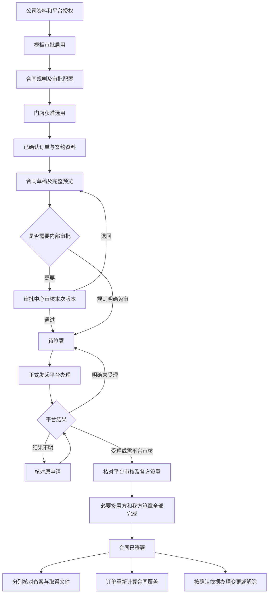

# 电子合同模块需求说明书：流程、状态与业务规则

版本：V1.0｜日期：2026-09-24｜用途：电子合同模块开发交接

适用范围：公司与个人游客、企业客户之间的旅游销售合同；目标平台为12301。

**原型负责说明界面，本说明书负责说明界面背后的业务。** 字段位置、列表、抽屉和按钮样式直接看现有原型。本文重点规定：业务从哪里开始、什么条件允许推进、谁确认结果、状态何时变化、失败后如何继续，以及订单、审批、售后、配置之间如何交接。

当前交付的是原型及开发需求，不表示已经接通12301。尚未取得本公司平台登录网址、服务商资料、接口文档及实际授权。本说明书不虚构平台接口地址、开放能力、短信渠道或法律效力判定。

## 1. 开发先统一的边界

### 1.1 本模块做什么

合同经办人在销售中心，以已确认订单为依据，准备合同、送内部审批、发起签署、核对结果、取得文件，并办理后续变更、撤销、解除或企业线下合同归档。

公司和平台授权归集团配置；模板与合同规则归业务端系统设置；审批归审批中心。订单、售后和项目页面提供来源及结果查看，不能再各自维护一套合同办理流程。

本模块交付的结果是“哪份合同、哪个版本、覆盖哪些人或企业服务范围、约定多少金额、各方是否签完、后续是否变更或解除，以及对应证据文件”。

### 1.2 不由合同模块决定的事情

| 事项                       | 正式责任与处理原则                               |
| ------------------------ | --------------------------------------- |
| 订单确认、成交金额、游客、出行日期、服务范围   | 由订单及获准变更提供。合同引用，不反向直接修改这些事实             |
| 收款是否满足签约条件               | 读取财务确认的订单收款及适用付款规则，不能把销售填写金额或到账截图当成确认收款 |
| 售后增减费用、退订责任              | 由订单／售后确认，再作为合同变更依据                      |
| 退款、转款、应收调整、收入、成本、发票、核算推送 | 由既有售后和财务流程办理。签署、解除、归档均不能直接完成这些动作        |
| 产品和项目资料                  | 为合同提供服务内容来源。项目负责人不能在项目页自行批准、盖章或宣布合同归档完成 |
| 平台是否支持某类合同与签署方式          | 以本公司实际授权及现行平台资料核实，不由原型选项推定              |

### 1.3 如何理解本文的要求

- **沿用原型规则**：现有原型已经表达的业务流程和限制，正式开发应保留其业务含义。
- **开发补充规则**：跨页面共同数据、并发操作、结果通知、防重复及文件权限等，静态原型无法证明，本文明确作为正式开发要求；不宣称原型已实现。
- **待确认事项**：公司制度或平台事实未取得，集中见第13节。开发可以先实现相应能力，但不能擅自填入实际政策并开通业务。

本说明书不新增菜单或独立页面，不要求把演示结果按钮带入正式系统。正式开发的业务规则与原型演示代码有差异时，按第11节登记的区别处理。

## 2. 业务对象和责任

### 2.1 先分清六个对象

| 业务对象     | 含义与关系                                            |
| -------- | ------------------------------------------------ |
| 订单       | 本次交易的来源。一张订单可对应一份多人合签主合同，也可对应多份按人分签主合同           |
| 合同及版本    | 对某组当事人和某段服务约定的文书。主合同、补充协议分别保留；完整重签产生新版本，不覆盖已签文件  |
| 游客与实际签署人 | 游客是合同覆盖的人；实际签署人是执行签字的人。本人、监护人、代理人、企业授权代表不能混为同一身份 |
| 审批申请     | 公司内部对某个版本或某次撤销／解除申请的审核。它不等于平台签署结果                |
| 平台办理记录   | 记录创建、受理、平台审核、签署、备案、文件获取和撤销／解除的实际结果；不同步骤分别判断      |
| 变更／结束依据  | 已确认订单或售后变更，以及撤销／解除申请和确认文件。必须能回到具体来源，不能只写自由备注     |

本系统合同号、平台合同号、监管统一编号分别保存。不能因取得一个编号就推断另外两个编号已取得，也不能将编号存在视为签署完成。

### 2.2 岗位交接

| 岗位          | 本岗位负责                   | 交给下一环节的结果               |
| ----------- | ----------------------- | ----------------------- |
| 组织管理员       | 公司名称、证照、合同联系资料          | 可被合同引用的公司资料             |
| 技术／平台配置管理员  | 连接、公司平台关联、用章及能力核实       | 哪家公司在什么范围内可以使用哪些平台功能    |
| 法务／合同运营     | 模板内容、版本、附件要求、适用范围       | 经审批且启用的模板版本             |
| 公司业务管理员     | 生成条件、内部审批、付款条件、门店适用范围   | 已确认且启用的合同规则             |
| 门店管理员       | 在获准范围内选用公司、模板、规则        | 门店可办理合同的条件              |
| 销售／合同经办人    | 核对来源、准备、提交、发起、异常核对、变更申请 | 待审批申请、平台办理申请及可追溯合同结果    |
| 审批人         | 审核本次版本和依据，明确通过或退回意见     | 本次申请的内部决定，不代替任何外部办理结果   |
| 游客／代理人／企业代表 | 在获准签署渠道完成身份核验和签署        | 每个必要签署方的实际结果            |
| 财务          | 确认收款、退款和其他财务事项          | 合同可读取的付款条件核对结果；财务单据自行推进 |

## 3. 从配置到办结的完整路径

企业线下分支：已确认企业订单 → 上传实际签署文件及授权资料 → 内部归档审批 → 待归档 → 经办人核对并确认归档 → 已归档。此分支不生成假的平台编号、电子签署记录或平台备案结果。

正常签署完成后，仍可能存在“备案待核对”或“文件待获取”。这些后续事项继续办理，不能倒退已经确认的签署事实。原型的“整单签约完成”不等于所有监管及文件事项均已办结，详见第8节。

## 4. 配置如何生效

对应页面：集团接口配置／主体公司；系统设置合同模板／基础参数；门店销售设置；审批配置。

### 4.1 可签约条件按交集判断

一次新签约必须同时满足：

1. 经办人有本公司、本订单的相应操作权限。
2. 订单已有确定的实际签约公司，公司必需资料完整。
3. 该公司平台关联、授权、用章归属与有效期均通过核实。
4. 模板已经审批并启用，适用公司、业务、客户类型和签署方式一致。
5. 当前合同规则已确认、已启用且在有效期内。
6. 门店获准办理，选用的公司、模板、规则相互一致。
7. 订单、签署人、付款条件及必要附件满足本次办理阶段的要求。

连接检测通过，只证明检测涉及的项目通过，不能自动开通所有公司或所有合同。模板可用，也不能突破公司授权；门店选中规则，也不能突破模板适用范围。

### 4.2 规则匹配与冲突

- 先按实际签约公司、业务类型、门店适用范围和业务办理日期匹配。
- 没有有效规则时，显示缺少配置并阻止正式提交／发起，不默认采用其他公司规则。
- 同一时段同一范围命中多条启用规则时，阻止启用冲突配置或阻止办理，并指向配置责任人。
- 沿用原型：公司通用规则与覆盖同一门店的指定规则视为重叠，**不暗设“门店优先”**。以后若需要优先级，应单独确认政策再改。
- 公司或模板改变后，重新校验规则和门店选用，不能保留不适用的旧选择。
- 有效日期首尾均包含；使用统一业务日期判断，不以不同终端电脑时间决定是否有效。

### 4.3 付款条件

| 获准规则    | 允许发起的判断                      | 禁止的替代判断                  |
| ------- | ---------------------------- | ------------------------ |
| 先签后收    | 不以尚未收款单独阻止签署；其他条件仍必须满足       | 擅自改成必须收全款                |
| 先收后签    | 必须明确所需付款标准，并取得财务确认的满足结果      | 只写“先收后签”，没有金额／比例／节点却直接放行 |
| 按付款节点   | 引用订单已经约定的首款或全款节点；财务确认结果满足该节点 | 将订单总额自动当成首款，或把待认款申请当成到账  |
| 待确认、缺依据 | 阻止正式提交／发起，并说明需要确认的规则         | 由经办人临时勾选“已付款”绕过          |

原型已用“付款条件满足／未满足”演示拦截，但并未实现正式收款判定。所用确认记录、退款后重算方式和阈值由第13节Q03落实；不得复用演示布尔值作为正式依据。

### 4.4 模板发布和版本规则

模板草稿 → 校验及预览 → 提交审批并冻结本次内容 → 审批通过后待启用 → 启用。

退回后必须保留原因，解锁本次待修改内容，修改后重新校验、预览和送审。不能只把状态改回通过。

已启用模板的内容修订应形成新版本，新版本完成审批及启用后供新业务选择。旧合同始终引用当时采用的正文、附件要求及模板版本；模板停用不删除旧合同，也不使旧合同自动失效。

平台标准文本、补充条款、自定义文本分别核实支持范围。“本地预览成功”不能作为“平台模板已验证”的依据。

### 4.5 配置变化对存量业务的影响

| 业务处于什么阶段     | 应如何处理                                      |
| ------------ | ------------------------------------------ |
| 尚未提交的草稿      | 再次提交时重新核对现行配置；内容需要变化时重新预览                  |
| 内部审批中        | 审批继续对应提交时的固定内容和审批流程；配置变化不得偷偷修改待审正文         |
| 审批通过、尚未向平台发起 | 重新检查当前授权、模板可用性、付款和订单条件；不满足则阻止发起。需要改正文时重新送审 |
| 平台已经受理或结果未知  | 先核对原平台记录，不能因换账号、模板停用或权限变化自动重建合同            |
| 已签署／已归档      | 保留当时资料与文件。后续合同内容变化走变更流程                    |
| 门店暂停新增业务     | 阻止新业务；已获准的历史查看、补签和售后服务仍按存量授权办理，不能清除历史合同    |

授权失效后存量合同如何继续签署或补章，须核实平台规则。此时可以保留查询和历史文件服务，不能用另一公司的章代替。

## 5. 首次合同如何生成、送审、发起

主入口：销售中心 → 合同管理；订单页面提供带订单身份的入口。

### 5.1 生成与编辑

1. 按订单唯一编号读取来源，确认公司、客户、游客、金额、出行和服务资料属于同一订单。地址参数只能定位，不能成为可信金额或公司来源。
2. 只允许已确认订单进入正式签约流程。预留、占位、待确认订单可以查看准备缺项，不能据此直接发起。
3. 同一订单已有合同草稿时优先继续原草稿；已有办理中或生效合同覆盖相关人员时，应进入该合同继续办理或变更，不能重复生成。
4. 多人合签生成一份主合同，列明覆盖游客及各自实际签署安排；按人分签生成分别可追溯的多份主合同。
5. 分签金额必须有订单已确认的分配依据，合计等于所选范围应分配金额；整单首次分签合计必须等于订单金额。不能默认平均分配并当作确认事实。
6. 保存草稿允许资料未齐，但记录缺项，不产生审批单、平台合同、监管编号或短信。
7. 提交前要求当前内容的完整预览通过。正文、金额、人员、附件内容变化均使原预览确认失效，必须重新预览；只比较文件名不够。
8. 编辑中取消或关闭且确认放弃，不得覆盖已保存文件和内容。按人拆分后，每份合同须保留本份适用的实际附件。

原型首次主合同使用正金额；零金额主合同、部分人员单独成约、复杂多服务拆分不因存在输入框而默认开放，见Q07。零金额补充协议属于不同情形，见第9节。

### 5.2 人员与授权

- 覆盖游客从订单选择，使用稳定身份区分，同名不合并、改名不新增一人。
- 本人签署，核对该游客的身份和签署联系方式。
- 监护／代理签署，分别记录游客、实际签署人、签署关系和相应授权材料，不能将下单联系人直接当作全体游客代理人。
- 一个实际签署人可涉及多名游客时，应明确每项代表关系；不能简单按手机号去重后少签，也不能按游客人数伪造签署次数。平台如何表示此种关系列Q04。
- 企业客户以企业为合同相对方，以获准代表执行签署；普通联系人不自动取得代表权。参与出行人员名单与企业代表签署进度分别管理。
- 人员、证件或代表关系错误时，先处理资料；已受理或已签文件不得直接换人继续沿用签名。

### 5.3 正式提交前的共同检查

提交时一次返回可处理的全部缺项，至少覆盖：订单确认、公司与模板适用、门店与经办权限、规则和付款条件、游客覆盖不重复、金额不超分配、签署资料、签署截止、必要行程／费用／授权文件，以及当前内容已经预览。

需要内部审批：提交后为待审核，冻结本次正文、人员、金额及附件，创建一份对应申请。

规则明确免审：提交后为待签署，记录免审规则与适用版本。不得伪造审批人或“审批通过”记录。

### 5.4 内部审批

审批中心承接六类事项：首次签约、合同变更、合同撤销、合同解除、企业合同归档、合同模板发布。

审批人必须看到本次提交版本、完整正文及附件；变更额外看到原约定、确认依据、变化内容及新旧金额。不能仅审批合同号或摘要。

| 审批操作      | 对申请的影响               | 对来源业务的影响                          |
| --------- | -------------------- | --------------------------------- |
| 通过首次／变更签约 | 记录本次通过及意见            | 本次合同进入待签署，尚未向平台发起                 |
| 退回        | 原因必填，保留原申请和审阅版本      | 合同进入审核退回，可修改并重新送审                 |
| 驳回        | 原因必填，保留与退回不同的决定记录    | 按原型允许修改后重新提交，但创建新的申请轮次，不复用已驳回审批结论 |
| 申请人撤回     | 仅在审批尚未最终决定时允许；关闭本次待办 | 返回可编辑草稿；已发生的审阅记录保留                |
| 通过撤销／解除   | 只批准本次办理申请            | 进入待办理，原合同主状态不变                    |
| 通过企业归档    | 记录归档资料审核通过           | 进入待归档，尚未确认归档完成                    |
| 通过模板发布    | 记录该模板版本通过            | 进入待启用，不直接改变历史合同                   |

开发补充：审批结论与来源变化应对应同一申请和内容版本，只处理一次。审批人通过与申请人撤回同时发生时，只能有一个成功，另一方刷新后看到最终结果。

审批执行方式选本审批中心或外部审批，二者只保留一个执行责任。外部审批期间本地只查询结果，不允许本地再点通过。审批配置变化只影响新提交，不能替换已提交申请的原流程。具体岗位、节点、是否允许本人审批及外部系统对应见Q09。

### 5.5 正式发起平台办理

允许发起的前提：本版本处于待签署；内部审核已通过或规则明确免审；共同条件重新校验通过；平台从未提交，或有明确证据证明原申请未受理。

本次提交内容必须与获批／免审确认版本一致。平台拒绝要求修改正文、人员或附件时，应退回准备和审批环节；只修复连接等不改变合同内容的问题，可以在确认未受理后重试原申请。

草稿、预览和内部审批不应调用可能发送正式短信、占用正式编号或启动签署的接口。此类调用统一放在明确的“发起签署”阶段；实际副作用仍需Q01、Q02核实。

## 6. 状态及允许的转换

### 6.1 合同主状态

列表只用一个主状态组织办理；异常原因和平台子结果不另造一套互相冲突的主状态。

| 当前主状态 | 业务含义                     | 允许的关键动作                    | 进入下一状态的条件                         |
| ----- | ------------------------ | -------------------------- | --------------------------------- |
| 草稿    | 本地合同内容待完善                | 编辑、保存、预览、提交、撤销草稿           | 提交有效后到待审核，明确免审则到待签署               |
| 待审核   | 本次内容已经冻结，等待内部决定          | 查看、按权限撤回；审批在审批中心执行         | 通过到待签署；归档类通过到待归档；退回／驳回到审核退回；撤回到草稿 |
| 审核退回  | 本次未获准，保留具体意见             | 修改、重新预览、重新提交、撤销草稿          | 重新提交开始新的审批轮次                      |
| 待签署   | 内部环节完成，尚未确认平台受理          | 查看、发起；仅明确未受理时允许撤销本地草稿      | 发起后到签署中；明确未受理则保留／回到待签署            |
| 签署中   | 平台办理已发起，可能审核中、结果待核对或部分签完 | 查询原结果、取得／更新签署入口；按条件申请撤销或解除 | 必要签署及我方签章全部完成到已签署；最终撤销／解除结果到对应终态  |
| 已签署   | 本版本必要签署完成                | 查看文件、核对备案、获取文件、申请变更／解除     | 不因备案失败、文件缺失或链接失效倒退；最终解除到已解除       |
| 待归档   | 企业线下签署材料的内部审核已通过         | 核对并确认归档                    | 文件、双方签章和授权材料确认齐全后到已归档             |
| 已归档   | 线下合同材料已完成归档确认            | 查看、下载、申请替换版本／解除            | 替换成功后本版保留为历史；解除完成到已解除             |
| 已撤销   | 本地草稿已撤销，或平台确认撤销完成        | 查看记录及已有文件                  | 终态，不能直接改回签署中；新办理另建关联记录            |
| 已解除   | 解除所需协议和办理确认已完成           | 查看原合同、解除依据及文件              | 终态，不删除原签署事实，不自动退款                 |

“当前版本／待替换版本／历史版本”独立于主状态。旧版退为历史后仍可显示已签署，不应将其伪装成已撤销。

本地撤销与平台撤销虽共用已撤销主状态，必须分别记录撤销类别、原因、经办人和证据。审批中先撤回再撤销；受理未知时不能按“未受理”直接撤销本地草稿。

### 6.2 平台及后续结果分别保存

| 结果类别    | 至少区分                           | 不允许推断的结论                 |
| ------- | ------------------------------ | ------------------------ |
| 平台受理    | 未提交、明确未受理、结果待核对、平台待审核、已受理      | 网络请求成功不等于已签署；超时不等于失败     |
| 内部审批    | 未提交、待审核、通过、退回、驳回、已撤回、规则免审      | 内部通过不等于平台审核通过            |
| 每个必要签署方 | 待核验／核验失败／核验通过，未签署／已签署，签署时间     | 身份核验成功不等于签字；一人签完不等于全员完成  |
| 我方签章    | 未完成、已完成；异常原因另存                 | 游客签完不等于旅行社盖章完成           |
| 签署入口    | 未取得、可用、已失效、已结束                 | 链接失效不等于合同失效；监管查验入口不是签字入口 |
| 备案      | 未提交、待备案、已备案、备案失败、结果待核对；不适用须有依据 | 有监管编号不等于已备案；备案失败不抹掉签署结果  |
| 文件      | 待获取、获取中、已取得、获取失败               | 已签署不等于文件下载已成功；预览稿不等于签后文件 |

平台返回的实际状态可能不同。正式对接须逐项映射、保留原结果，并说明未知状态如何处理；不能用字符串包含“成功”统一推成已签署。

### 6.3 撤销／解除申请的独立状态

申请使用：待审核 → 待办理 → 已完成。分支包括已退回、已撤回、结果待核对、办理失败、待协议签署。

待审核、待办理、办理失败或待协议签署期间，原合同主状态继续保留。申请失败可继续核对／修复原申请，不重复建另一条并行申请；退回或撤回后重提保留前次历史。

## 7. 平台结果与异常处理

以下均为开发补充要求；正式触发机制以平台实际开放能力实现。

| 情形                | 系统应做什么                          | 错误做法                 |
| ----------------- | ------------------------------- | -------------------- |
| 创建明确未受理           | 保存原因；返回待签署；修复后允许再发起             | 把缺授权当作正常受理           |
| 创建超时、断网、返回不完整     | 保持结果待核对；用原申请标识查询；查明前禁止重复创建      | 用户重复点一次就再生成一份合同或再发短信 |
| 查询确认原申请已受理        | 关联原平台合同号并继续原流程                  | 因本地没保存编号再创建          |
| 查询暂时没有记录但平台存在处理延迟 | 仍保持待核对，按约定继续核实                  | 一次“未查到”就等同明确未受理      |
| 平台待审核             | 单独保留平台审核状态；尚无获准签署入口时不开放签字       | 内部通过后直接跳过平台审核        |
| 平台审核退回            | 保留原因；确认原平台记录的处置方式；内容修改重新预览／审批   | 沿用旧审批结论发送已变化正文       |
| 身份核验失败、部分人未签      | 保留已完成方的结果，处理未完成方；更换当事人走更正／变更路径  | 清空全部签名或自动标记全部完成      |
| 游客均已签、我方未盖章       | 继续签署中，展示未完成项；按授权补齐我方签章          | 提前显示合同已签署            |
| 签署入口过期            | 先核对合同是否仍可签，再为同一平台合同取得新入口，保留已签结果 | 将更新链接实现为新建合同         |
| 合同签署期限已到          | 停止直接使用原入口；按获准延期／重签流程处理          | 仅刷新链接就越过合同期限         |
| 备案失败或结果未知         | 保留已签署状态、原编号、原因和查询记录，独立核对备案      | 再签一次合同来“修复备案”        |
| 文件未取得或下载失败        | 保留签署结果，对原版本重新获取；核对文件归属与完整性      | 以本地预览稿冒充签后原件         |
| 撤销时又收到签署完成结果      | 先核对平台最终状态，必要时转解除；保留冲突记录         | 后收到哪个通知就直接覆盖成哪个状态    |
| 老版本通知晚到           | 更新该老版本的真实记录，重新核对当前约定关系          | 按订单号直接覆盖当前新版本状态      |
| 权限／公司关联不符         | 拒绝操作并记录，不泄露他公司资料                | 因知道合同号就允许查看或下载       |

查询、平台通知和人工核对最终应汇入同一份合同事实。人工处理必须留下核实依据和责任人，不能给普通经办人一个随意改“已签署／已解除”的开关。

签署链接和到期时长、查询间隔、重试次数、人工处理时限均未由原型正式确定，应在平台限制和公司要求明确后配置，不将演示日期、次数写死。

## 8. 订单如何判断合同覆盖与签约完成

对应页面：订单详情“合同资料”、合同详情的订单覆盖。正式开发必须由同一套规则产生结果，不能两页各算一次。

### 8.1 必须分开显示和计算的含义

- **主合同覆盖人数**：当前主合同覆盖的不同游客数。草稿已经选择某人，不等于该人已签完。
- **必要签署完成情况**：每份合同要求的实际签署角色是否完成，并核对我方签章。
- **主合同分配金额**：当前主合同准备覆盖的金额，用于防止首次重复分配，不等于已经签妥的金额。
- **已签当前约定金额**：当前已签主合同的完整金额，加仍适用的已签补充协议增减额。线下合同须已归档才纳入此项。
- **整单签约完成**：当前有效约定的人员／服务覆盖、签署结果与订单确认金额全部一致，且没有未完成的合同变更。
- **备案与文件办理情况**：单独展示，不混入上述金额或签署人数。

### 8.2 个人订单判定规则

1. 排除已撤销、已解除及历史版本；待替换的新版本尚未完成时不计入当前已签约定。
2. 当前主合同覆盖的游客集合必须等于本次订单应签游客集合，不能漏人，也不能重复覆盖。
3. 每份电子主合同的全部必要签署方及我方签章均完成；线下适用合同须完成实际归档。
4. 当前适用补充协议均已签完；没有待完成的替换版本。
5. 已签当前约定金额等于订单最新已确认金额；金额未确认、覆盖关系不明时不得显示整单完成。
6. 备案和文件尚未齐全时，保留具体待办，不把“整单签约完成”扩大解释为所有事项办结。

待撤销／解除申请不提前改变原合同事实，应另列正在办理。最终结束后重新计算覆盖；不能自动把订单也改成已取消。

### 8.3 企业订单与金额算例

企业订单核对的是企业相对方、获准代表、服务范围、金额和双方签章；不能用“1位企业代表已签”冒充“全部参团游客已签”。企业名单是否必须逐人签署由正式模板决定，原型代表样例不是通用政策。

| 场景                                     | 正确结果                                       |
| -------------------------------------- | ------------------------------------------ |
| 30,000元，3人按人分签，每份10,000元；2份已签，第3份未签    | 主合同可覆盖3人；已签当前约定20,000元；整单未完成               |
| 30,000元，3人合签；3人完成，我方未盖章                | 仍签署中；这份合同不按已签金额计入；整单未完成                    |
| 当前主合同10,000元，已签补充协议增加1,000元，另有待签增加500元 | 已签当前约定11,000元；500元不计入；仍有变更待完成              |
| 原合同30,000元，已确认增加3,000元，选择完整重签33,000元   | 新版未签完时当前约定仍30,000元；新版完成后为33,000元，不是63,000元 |
| 原合同30,000元，已签补充协议减少3,000元              | 当前约定27,000元；不自动生成3,000元退款结果                |
| 集合地点变更，补充协议金额0元                        | 金额保持不变，但协议仍须按规则审批签署；不能因0元跳过                |

金额比较使用精确到分的计算；显示舍入不能掩盖差额。当前示例为人民币，不默认支持跨币种相加或换算。

## 9. 变更、撤销、解除和企业归档

### 9.1 已签合同的变更

入口在合同管理原合同详情；售后页只提供确认依据及准确跳转。

流程：订单／售后确认变更 → 选择当前已签原合同 → 选择补充协议或完整新版本 → 带入确认前后内容与金额 → 预览 → 内部审批 → 平台办理和重新签署 → 确认新版关系 → 订单重新核对覆盖。

| 规则     | 必须实现的判断                                        |
| ------ | ---------------------------------------------- |
| 来源有效   | 来源已确认，且属于同一订单、公司和所选合同范围；未确认的售后草稿不能生成正式变更       |
| 变化完整   | 留存原服务／日期／人员／金额、变更后内容、确认人和确认依据；不能只传“加3000”      |
| 补充协议   | 金额表达本次增减额，可为正、负、零；必须与原合同关联，并重新审批签署             |
| 完整新版本  | 金额表达替换后的完整约定总额；明确替换哪份原合同、包含哪些已签补充约定            |
| 新旧接替   | 新版未签完，原版继续作为当前约定；新版完成后，再将被替换原版及被吸收补充协议转为历史     |
| 签名独立   | 新版不继承旧版签名、签署入口、平台合同号和文件                        |
| 防止并行冲突 | 同一原合同有未完成变更或撤销／解除申请时，先处理原申请；同一确认依据不能重复生成多份有效变更 |
| 失败与退回  | 原合同继续保留；修改待办或按条件撤销该待办，不能因新版失败撤销原版              |

按人分签只变更部分人员时，变化金额必须明确分配到受影响合同，不能把整单增额复制给每一份。现有原型主要用一份主合同演示变更；复杂拆分的正式依据及选择策略列Q07，未经确认的组合应阻止办理并提示补充依据。

换签约公司、换合同相对方不属于普通备注修改。应先完成订单责任确认及原合同处置，再按确认方案签新合同；具体允许路径列Q07。

### 9.2 撤销的两种情况

**本地草稿撤销**：尚未向平台提交，或明确查明未受理；经办人有权限并说明原因。已有内部待审申请应先撤回。撤销后保留草稿和办理记录。

**平台合同撤销**：平台已受理、尚无任何必要当事人签署，且平台支持此操作。申请 → 内部审批 → 平台办理 → 确认平台撤销完成，最后才将合同改为已撤销。

撤销资格应在申请和实际执行前分别核对。审批期间有人签署，不能继续按未签撤销；结果未知也不能按未签撤销。

### 9.3 解除

已部分签署、已签署或线下已归档合同需要结束时，走解除申请。此处是系统办理分类；具体平台操作和解除文本以法务及平台确认为准。

流程：填写原因和关联依据 → 内部审批 → 办理解除协议及相关确认 → 核对最终结果 → 已解除。

- 电子合同：按获准流程取得必要各方的解除签署结果，并取得平台解除完成的确认。内部通过、单方签字或请求已发出均不足以结束。
- 线下合同：双方解除文件和相应授权材料经核对并归档，才能确认完成。
- 失败、未知或解除协议未签完，保留原合同主状态和本次申请进度。
- 完成后保留原合同和补充协议文件、签署证据及解除文件；原约定退出当前覆盖计算。
- 有退款时回到关联售后／财务流程继续办理。解除金额与实际退款金额不能互相替代。

### 9.4 企业线下归档及替换

企业电子签约仅在本公司、该模板与代表签署方式均获准时启用。线下归档是明确的业务路径，不能因为12301临时故障就自动切换并宣布成功。

首次线下归档：上传实际文件 → 核对双方签章及企业代表授权 → 提交归档审批 → 审批通过进入待归档 → 归档经办人核对并确认 → 已归档。

原型的“双方盖章、授权资料已核对”勾选表示经办人的核对结论，正式系统必须关联实际文件、核对人和时间，不能只存三个勾选值。

替换归档版本：从原合同新建待替换版本，填写原因，重新提供文件及核对结论，重新审批和归档。新版本完成前原归档继续保留为当前；完成后一次性切换，旧文件仍可按权限下载。

仅纠正归档文件与变更合同内容须区分：若服务、人员或金额变化，应先取得订单／售后确认依据，不能借“换文件”直接改变约定。原型文件替换未展开全部业务变更场景，正式开发须补此判断。

## 10. 各菜单页面需要承接哪些逻辑

以下为开发定位表，覆盖本轮已有18个HTML页面；不是新页面清单。界面内容直接看原型，开发重点是将页面背后的共同规则和实际业务结果补齐。

| 编号  | 菜单／原型页面                                                               | 本页面必须承接的逻辑与交接                                             | 对应规则        |
| --- | --------------------------------------------------------------------- | --------------------------------------------------------- | ----------- |
| P01 | 集团→系统配置→[接口配置](../admin/interface.html)                               | 分开连接可用、公司获准及具体业务结果；按实际能力配置；失败与未知分开；对接记录关联原申请，不一键伪造成功      | 4、7、12      |
| P02 | 集团→部门组织→[组织架构](../admin/org.html)                                     | 公司资料唯一来源；显示平台配置引用，不能在此另存一套用章授权                            | 2、4         |
| P03 | 主体公司→[公司编辑](../admin/org_company_modal.html)                          | 保存公司资料并保留修改记录；未知公司不能回退默认公司；资料修改不覆盖已签正文                    | 4.5、12      |
| P04 | 集团→部门组织→[业务角色](../admin/merchant-roles.html)                          | 将查看、下载、准备、发起、变更、结束、配置及审批授权分开；落实公司／部门／门店／本人数据范围            | 12.3        |
| P05 | 集团→系统配置→[后台角色](../admin/roles.html)                                   | 连接维护、公司授权维护、对接记录查看分权，不因有后台角色就默认可签合同                       | 12.3        |
| P06 | 集团→系统配置→[操作审计](../admin/audit.html)                                   | 记录实际操作者、公司、版本、动作、结果和变更前后；文件访问与越权拒绝可追溯；导出受同一权限和查询范围约束      | 12.3、12.4   |
| P07 | 业务→系统设置→[合同模板](../merchant/sales/contract-templates.html)             | 新版与旧版分离；停用限制新引用，历史合同文件仍可查；不能将列表启用当作平台验证                   | 4.4、4.5     |
| P08 | 合同模板→[模板编辑](../merchant/sales/contract-template-edit.html)            | 预览绑定实际内容；送审冻结；退回重提；审批通过待启用；平台模板适用关系有核实依据                  | 4.4、5.4     |
| P09 | 业务→系统设置→[基础参数](../merchant/system/business-params.html)               | 合同规则唯一匹配、有效期和冲突检查；付款标准有依据；引用审批流程，不复制审批人配置                 | 4.2、4.3     |
| P10 | 业务→门店中心→[门店管理／销售设置](../merchant/sales/store/index.html)               | 只选获准公司／模板／规则；切换后重新校验；区分新业务与存量服务授权；不维护财务付款政策               | 4.1、4.5     |
| P11 | 门店管理→[门店详情](../merchant/sales/store/detail.html)                      | 与销售设置引用同一份已生效配置；待审核或未保存修改不提前改变当前授权结果                      | 4.5、12.1    |
| P12 | 业务→销售中心→[订单管理](../merchant/sales/orders.html)                         | 合同入口定位真实订单；根据来源和合同阶段进入准备／办理／查看，不能每次点击都新建合同                | 5.1、8       |
| P13 | 订单管理→[订单详情](../merchant/sales/orders-detail.html)                     | 准备缺项按权威来源核对；当前主合同／补充协议／历史分开；人数和金额统一计算；合同未齐不代改订单收付         | 5、8、9       |
| P14 | 业务→销售中心→[合同管理](../merchant/sales/contracts.html)                      | 本模块唯一主办理入口；实现生成、送审、发起、结果核对、文件、变更、结束及归档的完整规则；正式系统移除人工选演示结果 | 5—9、12      |
| P15 | 业务→销售中心→[售后处理](../merchant/sales/orders-after-sales.html)             | 提供已确认的变化前后及责任依据；精确关联原合同；合同模块只消费确认结果，售后审批不直接解除合同／完成退款      | 9、12.1      |
| P16 | 业务→审批中心→[审批及配置](../merchant/approval/approvals.html)                  | 六类事项引用准确来源版本；唯一审批执行责任；决定只回到本次申请；已审批内容不可偷换，历史单沿用提交时流程      | 5.4、6.3     |
| P17 | [旧审核入口](../merchant/approval/approval-product-review.html)            | 合同事项转统一审批中心并定位原申请；不再保留独立合同审批或“历史文件不能下载”的旧逻辑               | 5.4、12.3    |
| P18 | 业务→产品中心→自营产品→单团项目→[项目详情](../merchant/tour/product-custom-detail.html) | 项目提供客户与服务依据，合同归对应订单；无确定订单不发起；电子或线下按能力和获准方式选择；只读引用合同结果     | 5.1、8.3、9.4 |

模板虽然位于`sales`文件目录，菜单归属仍是**系统设置**。目录名不代表应另建销售模板菜单。审批配置和待办是同一个审批页面的不同视图，不另建合同审批页面。

## 11. 原型不能直接照搬到正式开发的部分

| 原型事实                        | 正式开发要求                                  |
| --------------------------- | --------------------------------------- |
| 页面使用各自演示资料，刷新可能复位           | 订单、合同、审批、配置必须读取各自唯一正式记录；跨页查看同一业务结果      |
| 合同模型用福建公司及固定日期、金额演示可签条件     | 按真实公司授权和日期计算，不硬编码公司、订单号或默认金额            |
| 页面可选“审核通过、正常受理、全部完成”等演示结果   | 正式入口移除；改为审批系统决定、平台实际结果和有凭据的归档确认         |
| 审批来源链接可按演示参数建立样例            | 正式链接只定位已有申请及合同；不得根据网址参数创建业务或赋予权限        |
| 签后文件可下载样例HTML，上传附件使用浏览器临时文件 | 正式保存真实文件，区分预览稿、签后文件及证据；刷新、换设备仍可按权限取得    |
| 审批页面和来源页面可以分别演示结果           | 正式由同一申请对应同一版本，仅产生一次有效状态变化               |
| 平台退回演示直接回到待签署               | 正式区分是否改变已审内容、平台原记录是否仍存在，按第5.5及第7节处理     |
| 企业代表可作为单条人员样例计数             | 正式分开企业签署责任与参团人员范围，不套用个人逐游客签完判断          |
| 归档文件替换主要演示同金额换文件            | 正式发现约定内容变化时，必须关联已确认业务变更                 |
| 原型中一些当前版本标记用于界面演示           | 正式保存版本之间的替换和补充关系；不得仅按最大版本号或最后更新时间判断当前约定 |

本次文档只说明上述开发差异，没有据此重写原型或建设后端。

## 12. 面向开发的交接约定

本节只规定业务必须可靠落地的约束；数据库表名、接口地址和框架选型由开发设计。下列信息分组不是完整页面字段字典，也不是已存在的12301接口定义。

### 12.1 与其他模块交换什么

| 提供方→接收方      | 必需业务内容                                              | 责任约束                              |
| ------------ | --------------------------------------------------- | --------------------------------- |
| 组织／权限→合同     | 公司身份、签约资料、经办授权、组织范围                                 | 公司唯一编号匹配，不能通过显示名称猜公司              |
| 配置→合同        | 获准平台能力、公司用章、模板及规则版本、审批配置                            | 记录本次采用的版本；发起前另核当前是否仍可用            |
| 订单→合同        | 订单编号、确认状态、签约公司、客户、游客及签署关系、服务日期／内容、币种、确认金额和分签依据、来源版本 | 合同保留采用的确认内容；订单修改不自动改待审／已签正文       |
| 财务／订单付款服务→合同 | 规则所需节点、财务已确认金额或满足结论、核对时间和依据记录                       | 来源不可用时标待核对，不能把空值当0或默认满足           |
| 售后／订单变更→合同   | 确认单号及版本、确认状态、原合同范围、变化前后、增减金额、确认人及附件                 | 同一来源防重复使用；审批／发起前发现来源已撤回或被替代，应停止继续 |
| 合同→审批        | 事项类别、公司、申请人、合同及内容版本、正文附件、变化前后及依据                    | 审批时读取提交的固定内容，不能只取正在编辑的最新内容        |
| 审批→合同        | 申请编号、对应版本、决定、意见、操作者、时间和执行系统                         | 只作用于匹配且仍待处理的申请；重复决定不重复执行          |
| 合同→订单／项目／售后  | 合同编号和关系、当前约定、人员覆盖、金额、签署／结束／备案／文件结果、查询入口             | 下游读取同一份结果；不通过结果通知直接产生退款、收入等财务单据   |

### 12.2 必须长期留存的信息

1. **来源与责任**：订单、公司、门店、经办人，以及采用的订单确认和变更依据。
2. **提交内容**：正文、人员、实际签署关系、金额、日期、附件版本、模板与规则版本、内容校验结果。
3. **审批轮次**：每次提交、撤回、退回、驳回、通过及所审内容，不能以最终意见覆盖前次。
4. **平台对应**：本系统办理申请、平台合同、监管编号、环境及当时公司授权关联；缺哪个明确缺哪个。
5. **逐方结果**：身份核验、签署、我方签章、相关时间及来源证据。
6. **版本与结束关系**：原合同、补充协议、待替换版本、被替换内容、撤销／解除申请及证据文件。
7. **文件与访问**：文件类别、所归属版本、上传／获取来源、完整性识别、取得结果及访问记录。

“冻结内容”在技术设计中可采用不可变版本或提交快照实现，其业务含义是**审批人看到的、平台收到的、最终留存的必须是同一次确认内容**。附件同名替换仍应视为内容变更。

### 12.3 权限要求

权限同时校验“能做什么”和“能操作谁的资料”。页面按钮隐藏只是提示，服务端必须再次校验。

| 权限组   | 分开控制的动作                            |
| ----- | ---------------------------------- |
| 平台管理  | 连接及凭据维护、公司授权配置、对接记录查看              |
| 业务配置  | 模板维护／发布、合同规则维护、门店选用                |
| 合同办理  | 查看、生成／编辑／提交、发起签署、申请变更、申请撤销／解除、归档确认 |
| 审批    | 指定事项和公司范围内审批；不能以普通合同办理权限取得审批权      |
| 文件与审计 | 下载签后／历史文件、查看敏感资料、查看／导出审计记录         |

历史文件依然有权限，不能因合同解除或模板停用一律禁止下载；也不能因有订单查看权限就自动开放全部证件、授权书和平台凭据。

凭据保存在受控服务端，不写入前端脚本、普通日志或导出文件。签署入口及文件下载地址不得成为绕过公司权限的永久公开链接。正式保留期限、脱敏及下载岗位见Q10。

### 12.4 防重复、并发和结果一致性

- **重复操作只产生一次业务结果**：技术上使用幂等控制。每次发起有稳定的防重复标识；超时查询沿用原标识，不能每次点击生成一个新的正式合同。
- **同一版本只能被确认一次**：保存、送审、审批和平台发起校验内容版本；旧窗口不能覆盖别人已提交的版本。
- **同一变更只能生效一次**：建立来源使用约束及原合同并行申请约束；同一依据被重复点击只返回已有办理记录。
- **新旧切换不可拆开成功**：新版本满足完成条件后，将新版设为当前、原版及已吸收补充约定设为历史，应在一次可靠操作中完成，避免两版同时计金额或都不计。
- **平台通知必须可信且可重放核对**：若平台支持回调，应验证真实性、合同与公司对应、重复及乱序；持久保存原结果再处理。未知通知先隔离核对，不能按通知里的订单号随意建合同。
- **通知和查询共用处理逻辑**：同一平台结果从回调和主动查询各到一次，不应产生两份文件、两次状态变化或两次业务通知。
- **对外请求与本地保存不一致可恢复**：保存本次请求和处理进度；服务中断重启后继续查询原请求，而非重新创建。
- **记录可追溯**：配置、送审、发起、查询、版本启用、撤销／解除、归档、下载和越权拒绝均记录操作者、时间、公司、对象、变化前后和结果；日志不暴露凭据及完整敏感证件。

人工核对只用于有证据的异常处置。无法确定的平台状态保持待核对，并转责任人处理，不能以“系统一直等待”为由强制填写成功。

### 12.5 12301对接能力清单

以下是本业务需要核实和承接的能力，不代表12301已经向本项目开放这些接口。

| 能力          | 需要平台给出的依据                  | 缺失时的业务处理              |
| ----------- | -------------------------- | --------------------- |
| 企业、经办人与用章授权 | 公司对应、用章归属、有效期、账号权限范围       | 不开通该公司的正式签署           |
| 模板与文本       | 模板版本、允许编辑范围、上传与附件要求        | 不开放未确认模板              |
| 创建／提交／发起    | 每步含义、正式编号及短信触发时点、防重复及查询方式  | 不把创建调用塞进预览或内部审批       |
| 平台审核        | 是否需要、结果状态、退回后的原记录处理        | 单独等待审核，不推断已获准         |
| 身份与签署       | 多人、代理、监护、企业代表及用章方式，签署顺序    | 只开放获准组合；不自行实现签名替代平台证据 |
| 进度及结果通知     | 查询与通知能力、签署完成判定、乱序处理、未知状态   | 按可用查询方式核对；无证据不填成功     |
| 补充／重签／撤销／解除 | 适用条件、文书关系、必要确认和最终结果        | 保留申请及待办理，未支持路径不自动执行   |
| 监管编号与备案     | 编号取得时点、备案责任、查询及失败处理        | 分别记录，不能以编号存在冒充备案      |
| 文件及证据       | 签后正文、附件、证据材料、取得时点、有效期和校验方式 | 保留文件待获取，不用预览稿替代       |
| 存量迁移与授权变更   | 旧合同查询下载、换凭据／换经办人、历史授权处理    | 不重新发起旧合同，也不自动重签       |

若实际只开放备案能力，尚缺签署能力的衔接方案，不能将其标为电子签约全流程完成。此问题由项目负责人和平台确认，不自动另选另一家签约平台。

## 13. 开发前及开通前需要落实的事项

这些事项不影响理解和实现通用流程；对应功能正式开放前必须得到答复。这里不把原型示例升级为公司制度。

| 编号  | 待确认问题                                    | 谁落实                | 未明确前如何处理                            |
| --- | ---------------------------------------- | ------------------ | ----------------------------------- |
| Q01 | 12301实际合作方／入口、已有成果可复用范围、开放的是签署还是备案能力     | 公司合同负责人、项目负责人、平台   | 可开发内部流程；外部适配保留能力边界，不能宣布接通           |
| Q02 | 认证、企业用章、模板、短信触发、平台审核、结果通知、查询和文件接口规范及测试安排 | 平台、对接工程师           | 不虚构参数、状态及测试成功结果                     |
| Q03 | 各公司／业务的签约付款条件、节点金额依据、退款后判定、是否允许先签后收      | 业务负责人、财务           | 待确认规则不得启用；未确认付款结果不得放行               |
| Q04 | 本人、监护、代理、企业代表和一人代表多人如何授权、签署及保留证据         | 法务、平台              | 只启用已核准组合；不能让联系人默认代签                 |
| Q05 | 各业务正式模板、补充条款、自定义文本、附件和平台适用范围             | 法务／合同运营、平台         | 模板保持待核实，不对未支持业务开放电子签约               |
| Q06 | 撤销、部分签署解除、完整解除的实际平台能力与解除文本               | 法务、平台              | 不凭内部通过改变合同终态；无法电子办理的路径另经批准          |
| Q07 | 部分人员变更、分签增减金额归属、零金额主合同、换签约公司／相对方、多币种规则   | 业务负责人、法务；金额问题由财务参与 | 缺明确分配或处置依据的组合阻止提交，不套用整单样例           |
| Q08 | 签署截止、链接到期、延期及超期重签条件，授权失效后的存量办理           | 业务负责人、平台           | 链接续期不自动延长合同期限；不跨公司补章                |
| Q09 | 六类审批的实际岗位和节点、本人审批限制、外部审批对应、归档确认人         | 业务负责人、审批管理员        | 无有效流程不能送审；配置免审也须有明确授权               |
| Q10 | 文件类型／大小、存储及保留期限、敏感资料下载范围、旧合同迁移方式         | 合同运营、法务、技术及权限负责人   | 原型PDF／图片及20MB为演示限制，生产值另核；无授权不开放敏感文件 |
| Q11 | 备案和文件完成是否为出团／履约的额外放行条件                   | 业务负责人、法务           | 原型仅判断签约完成；不得自动把它当作所有履约条件满足          |

每项确认应记录答复、责任人、生效范围、日期和依据，并回填相应配置或规则。仅有口头“按常规处理”不应被工程师解释成具体阈值和时限。

## 14. 验收必须覆盖的业务情形

以下是正式开发的待执行验收清单，**不是已通过的生产测试记录**。界面位置按原型验收；本表检查流程结果、状态和证据是否正确。

| 编号  | 前提与操作                      | 必须得到的结果                             | 规则       |
| --- | -------------------------- | ----------------------------------- | -------- |
| A01 | 连接可用，公司用章未获准，发起合同          | 阻止发起并说明公司缺项，不标已受理                   | 4.1      |
| A02 | 两条启用规则时段和适用门店重叠            | 阻止冲突配置／办理，不按列表第一条随机选择               | 4.2      |
| A03 | 门店切换签约公司，原模板不适用            | 原选择失效并重新校验；不能串用另一家公司用章              | 4.1      |
| A04 | 修订已启用模板，旧合同已签署             | 新版独立送审；旧合同正文及文件不变                   | 4.4      |
| A05 | 合同已送审，管理员调整审批流程            | 该申请仍按提交时流程执行；新申请采用新配置               | 4.5、5.4  |
| A06 | 先签后收已获准、尚未收款；其他条件齐全        | 允许进入签署；不能暗加全款限制                     | 4.3      |
| A07 | 需要首款，只有待认款申请或财务来源不可用       | 不视为付款满足；指出待确认依据                     | 4.3      |
| A08 | 预留订单或未知订单号进入合同页            | 不以默认订单或默认金额生成正式合同                   | 5.1      |
| A09 | 同订单同游客重复生成，或分签合计超过订单       | 阻止重复／超额；返回已有合同和差额                   | 5.1      |
| A10 | 30,000元分3份，2份已签、1份未签       | 已签金额20,000元，整单未完成                   | 8        |
| A11 | 监护／代理签署缺对应授权文件             | 允许存草稿，阻止正式提交                        | 5.2      |
| A12 | 预览后替换同名附件，直接提交             | 原预览确认失效，要求重新预览                      | 5.1      |
| A13 | 编辑中替换附件后放弃；分签保存实际附件        | 放弃不污染已保存文件；拆分后各份附件内容正确且可取得          | 5.1      |
| A14 | 审批退回／驳回不填原因；修改后重提          | 无原因不能提交决定；重提留存前轮内容和决定               | 5.4      |
| A15 | 两人同时审批与撤回同一申请              | 只有一个有效结果；不出现既已撤回又被批准发起              | 12.4     |
| A16 | 保存、预览或内部审批通过               | 不触发平台正式签约或短信，不伪造平台编号                | 5.5      |
| A17 | 发起超时后连续重复点击                | 只有一份有效申请；先核对原结果，不重复创建               | 7、12.4   |
| A18 | 未知结果查询后确认已受理／明确未受理         | 已受理沿用原号；只有明确未受理才允许重新发起              | 7        |
| A19 | 内部已通过，平台仍待审核               | 保留平台待审核；未获准签署入口不开放签字                | 6.2      |
| A20 | 游客签完，我方尚未盖章                | 合同仍签署中；不能提前计作已签完整合同                 | 6、8      |
| A21 | 签署入口失效但合同仍可签，更新入口          | 平台合同号及已有签名不变；不重新创建                  | 7        |
| A22 | 已超过合同签署期限，只更新链接            | 不能越过期限，需按获准延期／重签处理                  | 7        |
| A23 | 已签署但备案失败／文件获取失败            | 签署状态保留，失败分别可查及重试原记录                 | 6.2、7    |
| A24 | 30,000元原合同，33,000元新版先待签后签完 | 待签仍保留原版；完成后当前金额33,000，历史可查，不计63,000 | 9.1      |
| A25 | 已签增加1,000元；另有待签增加500元      | 只计已签增额，保留变更未完成                      | 8、9.1    |
| A26 | 减少3,000元或0元内容变更            | 都按规则审批签署；减额不自动退款，0元不跳流程             | 9.1      |
| A27 | 同一变更依据再次生成，或已有未完成变更再申请解除   | 阻止重复／并行冲突并定位已有申请                    | 9.1      |
| A28 | 合同未有人签，撤销内部通过但平台仍未知        | 原主状态保留；只有最终撤销完成才变已撤销                | 9.2      |
| A29 | 撤销审批期间有人签署                 | 重新核对资格，不继续按未签撤销                     | 9.2      |
| A30 | 解除内部通过，解除协议仍未签完            | 保持原合同状态及待协议签署；不自动退款                 | 9.3      |
| A31 | 平台解除完成，或双方线下解除文件已归档        | 转已解除，保留原文件及解除依据，订单重新核对合同覆盖          | 9.3      |
| A32 | 企业归档材料缺一方签章或授权             | 阻止提交／确认；内部通过也不能直接已归档                | 9.4      |
| A33 | 企业归档替换，先提交后完成归档            | 新版完成前旧版仍当前；完成后切换，历史文件可下载            | 9.4      |
| A34 | 企业代表完成签署，参团名单另有多人          | 正确显示企业合同完成情况，不伪造逐游客签名               | 8.3      |
| A35 | 项目没有确定订单，或电子模板未获准          | 无订单不发起；电子能力未获准不伪造成功，也不自动改线下已归档      | 9.4、10   |
| A36 | 同一平台结果重复／乱序到达，或老版本通知晚到     | 无重复业务结果，不覆盖错误版本；冲突可核对               | 7、12.4   |
| A37 | 他公司用户持合同编号／下载地址访问          | 服务端拒绝并记录；不依赖前端是否显示按钮                | 12.3     |
| A38 | 合同已解除、模板已停用，授权人员下载历史文件     | 仍可取得正确历史文件；无授权人员不能取得                | 12.3     |
| A39 | 销售、审批、订单、项目分别查看同一合同        | 状态、版本和金额一致；页面地址参数不能更改事实             | 10、12.1  |
| A40 | 请求发出后服务中断，再恢复处理            | 查询原申请并恢复进度，不重新创建或丢失最终结果             | 12.4     |
| A41 | 合同完成／解除／归档后检查财务数据          | 不自动完成收退款、不自行确认收入或推送核算               | 1.2      |
| A42 | 审批后上游订单／售后依据改变，尚未发起平台      | 阻止使用过时内容发起；按变化重新核对及送审               | 4.5、12.1 |
| A43 | 分签只调整1人费用，未明确分配依据          | 阻止把整单增减额复制到多份合同，要求补齐受影响范围           | 9.1      |
| A44 | 仅取得监管编号，或签后文件返回另一版本        | 不推断已备案；拒绝将错误文件归入本版，并记录异常            | 6.2、12.5 |

建议按“配置与首次签约 → 审批及结果处理 → 变更和结束 → 归档及跨模块一致性”的依赖完成开发，每段同时验正常和异常。平台条件未齐时可用明确的测试替身验证内部规则，但不能将替身结果计作平台联调验收。已有原型证据见[配置验收](合同12301配置原型第一步实施验收-20260924.md)、[销售办理验收](合同12301销售办理原型第二步实施验收-20260924.md)、[审批变更归档验收](合同12301审批变更归档原型第三步实施验收-20260924.md)、[菜单试用修复验收](合同12301原型菜单试用与修复验收-20260924.md)。这些证明原型场景，不证明正式接口或生产权限。

1. 旧版合同审计、旧页面脚本和早期方案用于追溯，不作为当前开发规则的优先来源。尤其不能恢复“内部批准即解除”“历史文件禁止下载”“项目自审归档”“所有企业合同默认不能电子签”等旧逻辑。
2. 12301现行接口、公司正式授权及法务确认文件取得后，补充平台状态对应和能力核实结果，不在未核实前改写本文为“已经支持”

交接完成的标准：开发能按本说明书解释每个状态从哪里来、下一步由谁处理、什么证据才能推进、失败如何恢复，并按第14节验出明确结果；不以界面按钮能点击作为完整流程验收。

### 2026-09-24 原型补齐与开发承接

对照本说明书反查出的三项主流程缺口已补齐，见[三项主流程补齐验收](电子合同三项主流程补齐实施验收-20260924.md)。开发应同时承接以下规则：

1. 实际签署关系在合同草稿准备，游客基础资料仍来自订单；变更代表身份使原授权材料失效，变化内容重新预览和审批。后续合同版本保留适用签署关系及授权，不复制旧签名。
2. 平台明确未受理且无签署事实时，退回资料通过“修改重提”返回草稿；保存前次办理记录，旧审批失效，完成修改、预览及重新审批后才能发起。未知结果不得直接解锁。
3. 按人分签的一份已撤销且游客仍需签约时，仅针对缺口人员和已确认金额补签；已签份不变，撤销历史保留，补签完成后不重复计人数和金额。真正退订、解除或金额分配未明确仍按第8、9节及待确认事项处理。

以上为原型已表达的业务规则，不改变第14节正式开发待验清单的性质；正式接口和跨页面共同数据仍由开发实现。
