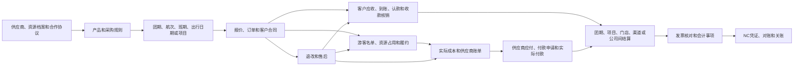
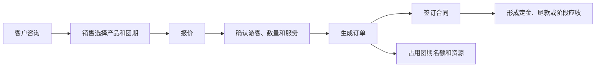

# 凯撒旅游SaaS项目业务全景与业财流程说明书

版本：v1.0  
编写日期：2026年8月24日  
适用读者：未参与本项目的旅游业务专家、财务专家、产品经理、系统架构人员和外部大模型

## 一、项目概述

### 1. 项目背景

凯撒旅游SaaS是一套面向全国连锁、多法人公司、多门店、多产品类型和多销售渠道的旅游业务系统。

系统承载的不是单一旅行社的“产品—下单—收款”流程，而是集团化旅游经营过程：集团内不同公司可能分别承担销售、产品组织、资源采购、履约、收款、付款、开票和会计核算；直营门店、加盟门店、OTA、同业渠道和企业客户又会形成不同的合同及结算关系。

系统需要覆盖跟团游、邮轮、专列、自由行、单项服务、研学、MICE和定制项目、外采产品、集团内部产品以及航服机票等业务。不同产品在库存、履约、成本和结算方式上存在明显差异，但最终都要回到统一的订单、收付款、债权债务、结算、对账和会计处理链路。

### 2. 建设目标

项目的整体目标是让以下链路可以连续承接：

```text
供应商和资源
→ 产品与销售政策
→ 团期、航次、班期或项目
→ 报价、订单与合同
→ 名单、资源确认和履约
→ 客户应收、收款和退款
→ 成本、供应商应付和付款
→ 团期、项目、门店、渠道及公司间结算
→ 发票、对账和关账
→ 会计事项与NC凭证
```

系统最终应达到：

- 每一笔订单能够确认由哪家公司销售、签约、收款、履约和确认收入；
- 每一笔成本能够确认由哪家公司采购、承担、付款和取得发票；
- 每一笔资金能够从银行或平台流水追溯到订单、应收、应付、退款或内部清算；
- 每一笔公司间交易能够在双方形成对应记录并完成对账；
- 每个团期或项目能够汇总收入、成本、已收未收、已付未付和经营结果；
- 每个会计结果能够追溯到原始业务，并按规则推送到NC。

### 3. 当前项目阶段

当前系统的整体功能和使用流程原型已经基本形成，覆盖资源、产品、履约、销售、门店、渠道、客户、营销、财务、审批和系统设置等模块。

现有原型主要用于确认岗位如何操作、业务对象如何流转和页面入口是否合理。正式开发前，还需要在这些流程基础上进一步固化全业务场景下的业财计算和数据承接规则。

## 二、凯撒旅游的经营特点

### 1. 多法人公司共同经营

集团内可能存在旅游产品公司、区域销售公司、航服公司、邮轮或专项业务公司等多个法人。一个客户订单可能只涉及一家法人，也可能同时关联多家公司。

例如：

- A公司向客户销售并签约；
- B公司拥有产品并负责履约；
- B公司再向外部地接社、船司或酒店采购；
- 集团资金公司或总部账户代A公司收款；
- 航服公司向B公司提供团队机票。

因此，“订单属于谁”“产品属于谁”“钱收到了哪里”和“收入成本归谁”是不同问题。

### 2. 全国门店和多种合作关系

门店至少可能包括：

| 门店类型      | 与集团的关系     | 常见收款和结算方式              |
| --------- | ---------- | ---------------------- |
| 直营门店      | 所属法人内部经营组织 | 客户款进入所属法人账户，按部门或利润中心统计 |
| 内部承包门市    | 法人内部经营单元   | 使用内部额度或预存，进行管理核算和提成分配  |
| 集团内独立法人门店 | 集团内部另一法人   | 形成公司间应收应付、开票和结算        |
| 加盟门店      | 集团外部合作方    | 预存、代收、总部直收、佣金或分润结算     |
| 外部分销门店    | 外部销售渠道     | 账期、押金、预存、佣金或差额结算       |

门店负责获客和销售，不代表门店一定是客户合同主体、收款主体或收入确认主体。

### 3. 产品来源复杂

系统内销售的产品可能来自：

- 本公司自行设计和组织；
- 本公司直接向外部供应商采购后包装；
- 集团内另一家公司提供；
- 集团内另一家公司向外部供应商采购并包装；
- 外部供应商在供应商端提供产品，由凯撒审核后销售；
- 邮轮、专列、机票等固定资源采购后重新组合；
- 围绕企业或团队客户需求建立的定制项目。

产品来源影响供给、采购和结算关系，但不能单独决定收入按全额还是净额确认。收入确认还需要结合谁承担主要履约责任、定价权、库存风险、信用风险和合同安排判断。

### 4. 销售渠道复杂

客户可以通过销售顾问、直营门店、加盟门店、外部分销商、OTA、小程序、企业客户经理或同业合作购买。

不同渠道可能出现：

- 客户直接向凯撒付款；
- 门店代客户收款后汇给总部；
- 总部直接收取门店客户款；
- OTA先收客户款，再扣除佣金、服务费或活动补贴后结算；
- 企业客户按合同账期付款；
- 加盟商或渠道使用预存余额下单；
- 一笔渠道结算款覆盖多张订单和多个团期。

### 5. 旅游业务先销售、后履约、再结算

旅游订单通常跨越较长周期：下单时可能只收定金，出发前收尾款，期间发生签证、机票、酒店、地接、舱房等资源确认；出行前后还可能发生人数变化、升舱、退改、损耗和追加费用。

因此，订单金额、客户应收、客户收款、会计收入、预计成本、实际成本、供应商应付和付款不会在同一天形成，也不能用一个订单总状态代替。

## 三、集团组织和交易参与方

### 1. 组织层级

系统需要区分以下组织概念：

| 组织概念    | 业务含义                 | 是否直接承担债权债务   |
| ------- | -------------------- | ------------ |
| 集团或业务板块 | 管理汇总和经营分析范围          | 通常不直接承担      |
| 法人公司    | 对外签约、纳税并承担法律责任的公司    | 是            |
| 核算主体    | 在NC中形成独立会计结果的核算单位    | 是，以账簿规则为准    |
| 经营单元    | 产品、区域或事业部的经营责任归属     | 通常不是独立债权债务主体 |
| 部门      | 人员、费用和业绩管理归属         | 否            |
| 门店      | 面向客户的经营网点，法律性质需要单独判定 | 取决于门店类型      |

集团或板块、经营单元、部门可以用于经营分析，但只有明确的法人或核算主体才能承担客户应收、供应商应付、收付款和NC会计结果。

### 2. 一笔业务中的不同责任

同一订单需要分别识别：

| 责任     | 需要确认的内容             |
| ------ | ------------------- |
| 客户签约方  | 谁与客户签订合同并承担合同责任     |
| 销售方    | 谁获客、报价、维护客户并取得销售业绩  |
| 产品提供方  | 谁拥有产品经营权和产品定价责任     |
| 资源提供方  | 谁持有团期、机位、舱房、铺位或采购配额 |
| 履约责任方  | 谁组织并对旅游服务交付负责       |
| 收款方    | 客户款实际进入谁的银行账户或支付商户  |
| 收入确认方  | 哪家公司根据会计政策确认收入      |
| 客户开票方  | 谁向客户开具发票            |
| 采购签约方  | 谁与供应商签约并承担付款义务      |
| 成本承担方  | 哪家公司承担采购或履约成本       |
| 付款方    | 供应商款实际由谁的账户支付       |
| 供应商收票方 | 谁取得并认证供应商发票         |

这些责任可以全部由同一家公司承担，也可以分属不同公司。系统应在订单或采购确认时根据产品来源、合作协议、门店关系、收付款政策和内部结算政策确定，不能只保存一个“所属公司”。

## 四、系统服务的主要岗位

| 岗位      | 主要工作                    | 上游           | 下游           |
| ------- | ----------------------- | ------------ | ------------ |
| 产品经理    | 维护线路、行程、费用说明和产品规则       | 资源和供应商       | 团期、报价和销售     |
| 外采产品人员  | 引入内外部产品、确认来源、采购价和包装规则   | 产品提供方、供应商    | 代理产品、订单、采购结算 |
| 采购人员    | 签订供应商协议，采购机位、舱房、铺位和其他资源 | 供应商、资源协议     | 团期分配、成本和付款节点 |
| 计调和团控   | 建团、控位、名单、资源确认、出团和回团     | 产品、订单、资源     | 成本确认和团期结算    |
| 销售顾问    | 报价、下单、合同、客户收款跟进和售后发起    | 产品和团期        | 订单、应收、名单和售后  |
| 门店运营    | 管理门店、人员、预存和经营结果         | 集团政策         | 门店订单和门店对账    |
| 渠道运营    | 管理分销商、OTA、佣金和渠道账单       | 产品授权、渠道合同    | 渠道订单和渠道结算    |
| 收款及认款财务 | 导入到账流水，确认付款人和订单归属       | 银行、支付平台、销售认领 | 收款单和应收核销     |
| 应收财务    | 管理客户、门店和渠道应收及账龄         | 订单、改价、退款     | 核销、催收依据和对账   |
| 成本及应付财务 | 核对成本依据和供应商账单，确认应付       | 团期、采购、供应商    | 付款申请和供应商对账   |
| 资金及出纳   | 执行付款、退款、资金调拨和回单处理       | 审批通过的申请      | 银行结果和核销      |
| 结算财务    | 完成团期、项目、门店、渠道和公司间结算     | 收款、成本、应付和对账  | 结算结果和会计处理    |
| 发票及税务人员 | 管理客户开票、供应商来票和税务资料       | 合同、收付、账单     | 税务处理和NC      |
| 总账及NC人员 | 复核会计事项、推送凭证、处理失败和关账     | 已生效财务事项      | NC凭证和财务报表    |
| 审批人     | 审核改价、退款、付款和调整等事项        | 业务或财务申请      | 原业务事项生效或驳回   |

## 五、系统业务范围和主要对象

### 1. 资源和供应商

资源模块保存可重复使用的基础资料和协议，例如景点、酒店、餐厅、车型、航空公司、航线、船公司、船只、专列运营商、车次、供应商档案和领队档案。

具体日期的机位、舱房、铺位、酒店房量和团期资源不是静态资源档案，而是履约过程中的动态供给，需要记录采购数量、占用、释放、确认、成本和付款节点。

### 2. 产品和销售政策

产品用于说明向客户销售什么，包括线路、行程、服务内容、费用包含和不包含、报名条件、退改规则及展示资料。

产品层可以保存参考报价依据，但具体出发日期的售价、库存和确认方式通常由团期、航次、班期或出行日期承接；最终成交价格保存在订单。

销售政策包括定价、渠道授权、佣金、优惠和退改规则。政策只是计算依据，真正影响客户应收或渠道结算的结果要在订单确认时保存。

### 3. 团期、航次、班期和项目

| 对象        | 适用业务         | 主要承载内容                      |
| --------- | ------------ | --------------------------- |
| 团期        | 跟团游、研学等      | 出发日期、人数、名单、资源、执行、成本和结算      |
| 航次        | 邮轮           | 船只、航线、日期、舱型库存、名单、房号和船司结算    |
| 班期        | 专列           | 车次、日期、铺位库存、名单、执行和运营商结算      |
| 出行日期或套餐批次 | 自由行          | 酒店、机票、服务组合、可售数量和采购批次        |
| 项目团       | MICE、定制团、企业团 | 客户需求、报价版本、项目合同、阶段收款、执行和项目结算 |

团期或项目是订单和履约成本汇合的核心对象。一期团可以关联多张订单；一张复杂订单也可以拆分并分配到不同服务或履约对象。

### 4. 销售交易

销售交易主要包括：

- 客户和联系人；
- 意向和报价；
- 销售订单及订单明细；
- 游客名单；
- 客户合同；
- 应收计划；
- 优惠、补差和改价；
- 售后申请；
- 退款、转款或转预存安排。

订单记录客户买了什么、成交金额和业务归属，但订单金额本身不等于已经收款，也不等于已经确认收入。

### 5. 客户侧财务对象

| 对象   | 业务含义                      |
| ---- | ------------------------- |
| 客户应收 | 根据订单、合同或补差形成的客户付款义务       |
| 到账流水 | 银行、支付平台或现金实际收到的钱          |
| 认款记录 | 财务确认到账款属于哪个客户、订单或预存账户     |
| 收款单  | 经确认有效的收款事实                |
| 核销记录 | 用某笔收款冲减某笔应收的金额关系          |
| 预收款  | 已收款但暂时未能对应到确定履约义务或收入的客户资金 |
| 预存账户 | 客户、门店或渠道事先充值并可供后续订单扣减的余额  |
| 退款单  | 经审批后应退并实际执行的客户资金          |
| 转款记录 | 将已收资金从原订单转到新订单或其他允许用途     |

### 6. 供应商侧财务对象

| 对象    | 业务含义                   |
| ----- | ---------------------- |
| 预计成本  | 产品或团期规划时估算的成本，不代表已欠供应商 |
| 实际成本  | 根据实际用量、确认单或合同规则确定的履约成本 |
| 供应商账单 | 供应商提出或双方核对的结算明细        |
| 供应商应付 | 公司已经承担、需要向供应商支付的债务     |
| 供应商预付 | 在成本或最终账单确认前支付给供应商的款项   |
| 付款申请  | 业务或财务根据应付、预付条件提出的付款请求  |
| 付款单   | 审批通过并进入资金执行的付款安排       |
| 银行回单  | 银行实际支付结果               |
| 付款核销  | 用实际付款冲减应付或预付的关系        |

预计成本、实际成本、供应商账单、应付和付款是不同阶段，不能相互替代。

### 7. 结算、发票和会计对象

系统还需要保存：

- 团期或项目结算单；
- 门店、渠道和OTA对账单；
- 供应商对账单；
- 集团内部公司结算单；
- 客户销项发票和供应商进项发票；
- 结算调整和跨期调整；
- 会计事项；
- NC推送记录、凭证号、失败原因和重推记录；
- 会计期间和关账记录。

## 六、系统整体业务架构



这张图表达的是业务承接方向，不表示所有节点必须顺序等待。例如供应商预付可能早于实际成本确认，客户可能在履约前分期付款，发票也可能根据企业政策在收款前后不同时间开具。

## 七、从资源到产品和可售团期

### 1. 供应商准入和协议

业务或采购人员建立供应商档案，提交准入资料、合作内容和结算资料。财务审核供应商名称、银行账户、币种、税务及开票资料。只有审核有效的供应商和收款账户才能进入采购及付款。

合作协议约定采购内容、价格、付款节点、取消损失、返佣或折扣、开票方式和有效期。

### 2. 资源采购

酒店、地接、车辆和景点可以按实际团期询价采购；机位、邮轮舱房和专列铺位也可能提前按批次采购并支付定金或预付款。

提前采购的固定资源需要记录：采购总量、可分配量、已占用量、已释放量、损耗量、采购总价、已付预付、后续付款节点以及分配到哪些团期。

### 3. 产品建立

产品经理根据业务定位建立线路或服务产品，维护行程、服务标准、费用说明、材料要求和退改规则。外采人员还要记录产品来自集团内部公司还是体系外供应商，以及采购价或内部结算规则。

### 4. 建立团期或项目

计调根据产品建立具体出发日期，设置可售人数、价格、报名截止日、资源确认方式和责任人。定制业务从企业或团队需求开始，经报价和合同确认后建立专属项目团。

团期开放销售后，订单占用名额和资源；取消或变更时按规则释放或形成损耗。

## 八、从报价到订单、合同和应收

### 1. 标准销售流程



### 2. 订单需要保存的价格层次

一张订单不能只保存一个总金额，至少需要区分：

- 对客展示价；
- 合同成交价；
- 客户应付金额；
- 客户实际支付金额；
- 优惠券、积分或活动抵扣金额；
- 各项优惠由哪家公司、门店、渠道或平台承担；
- 销售公司与产品提供公司的内部结算价；
- 产品提供公司与外部供应商的采购价；
- 返佣、折扣或其他后返金额；
- 退款、补差和改价后的有效金额。

每个金额都应回答：从哪里来、谁支付、谁收取、按什么规则计算、最后进入哪家公司的收入、成本、往来或费用。

### 3. 应收形成

订单和合同确认后，根据收款计划形成客户应收。标准团可能形成定金和尾款；企业项目可能按合同节点形成多期应收；订单增加服务或人数时形成补差应收；减价、取消或退款审批生效后反向调整应收。

## 九、客户收款、认款和核销

### 1. 标准收款流程


到账流水只是银行事实；认款说明钱属于谁；收款单说明财务确认收款；核销说明这笔钱冲减了哪一笔应收。四者不能合并成一个状态。

### 2. 分期和合并收款

- 一张订单可以先收定金、后收尾款；
- 一笔到账可以分配给多张订单；
- 多笔到账可以共同核销一张订单；
- 企业客户的一笔付款可以覆盖多个项目或账期；
- 无法识别的到账先保留为待认款，不能直接视为某张订单已收。

### 3. 预存业务

门店、渠道或客户可以先充值形成预存余额，后续订单扣减预存。

充值到账、预存入账和订单扣减是三件事：充值先形成资金和预存负债；下单扣减时才将余额分配给订单并核销应收；退款转回预存时恢复余额但不发生银行付款。

### 4. 代收业务

如果客户合同属于A公司，但款项进入B公司账户：

- A公司仍保留对客户的销售和应收关系；
- B公司记录实际到账；
- B公司对A公司形成应付的代收款；
- A公司对B公司形成应收的代收款；
- 经双方清算、划款或抵销后结清。

不能因为集团账户已经收到钱，就直接忽略A、B公司之间的资金往来。

## 十、履约、名单和资源确认

订单确认后，游客和服务明细进入团期、航次、班期或项目。

计调和履约人员完成：

- 游客名单、证件和材料校验；
- 团期名额和房型、舱型、铺位、机位占用；
- 酒店、地接、车辆、景点、签证、保险和领队安排；
- 供应商确认号、票号、房号等履约结果；
- 出团前检查；
- 出行中的追加、变更和异常；
- 回团确认和实际用量确认。

履约结果决定最终成本和结算依据。名单变化、资源释放、升舱、单房差、退票损失和供应商临时加价都可能同时影响客户应收和供应商成本，但两侧金额需要分别计算。

## 十一、成本、供应商应付和付款

### 1. 标准供应商链路


### 2. 预付业务

邮轮包舱、专列包铺、机票切位、包机、酒店保量等业务可能在实际使用前付款。此时先形成供应商预付，不应提前当作最终团期成本。

实际使用和成本确认后，将预付按明确依据分摊到团期、航次、班期或订单并冲抵应付。未使用但不可退的部分根据批准的损耗规则进入相应成本或损失；可退部分继续作为供应商追款。

### 3. 付款边界

业务人员确认采购和成本依据，财务确认应付和付款条件，审批人批准，出纳执行银行付款。

应付金额表示已经形成的债务；可申请金额表示扣除已申请、已付、冻结和争议金额后的余额；付款申请金额表示本次请求；银行回单金额表示实际支付。四个金额必须分别保存。

## 十二、不同产品的履约和成本特点

### 1. 标准跟团游

以团期为核心汇总多张订单、游客名单、地接、酒店、车辆、机票、景点、签证、保险和领队成本。回团后根据实际人数及实际用量完成团期结算。

### 2. 邮轮

以航次和舱型为核心。可能存在包船、切舱、定金、Final Payment、舱位释放、升降舱、房号和登船资料。预付和固定舱位损耗需要分配到相应航次。

### 3. 专列

以班期、车次和铺位为核心。可能提前包铺并按硬卧、软卧等铺位类型销售。固定采购成本、已售铺位和空置损耗要在班期结算中说明。

### 4. 自由行

以套餐、出行日期和采购批次为核心。一张订单可能组合机票、酒店、接送、门票和签证等单项服务，不一定共享一个标准团期；成本可以直接归订单，也可以从采购批次分摊。

### 5. 单项服务

签证、保险、门票、酒店、机票和接送可以独立销售，也可以作为旅游订单的附加服务。系统需区分凯撒自主销售、仅收服务费和纯代收代付三种关系。

### 6. 研学、MICE和定制项目

通常先有客户需求和多轮报价，再形成项目合同、项目团和阶段收款计划。执行中可能发生预算调整、追加服务和现场支出，最终按项目而非标准公开团期结算。

### 7. 航服机票

包括散客票、团队票、切位、包机、BSP和B2B平台充值出票。需要保存PNR、票号、出票、退改签、票损、BSP日报、大账单和平台账单。航服既可以对外销售，也可以向集团内旅游公司供票。

## 十三、团期和项目结算

### 1. 结算的目的

团期或项目结算用于确认一次旅游履约的完整经营结果，回答：

- 本团或本项目包含哪些有效订单和游客；
- 有效销售金额、退款和补差是多少；
- 已收、未收和待退款是多少；
- 实际发生了哪些成本；
- 已形成多少应付、已支付多少、尚未支付多少；
- 固定资源和共享成本如何分摊；
- 哪些差异仍有争议；
- 各法人公司、门店、渠道和经营部门分别取得什么结果。

### 2. 结算流程


### 3. 结算与其他工作的区别

| 工作      | 回答的问题                 |
| ------- | --------------------- |
| 团期或项目结算 | 这次业务最终发生了多少收入、成本和经营结果 |
| 供应商对账   | 我方与供应商记录的项目、数量和金额是否一致 |
| 应付确认    | 我方是否已经承担对供应商的付款义务     |
| 付款      | 银行是否已经把钱付给供应商         |
| 公司间结算   | 集团内两家公司之间应收应付是多少      |
| NC推送    | 已确认业务结果如何进入会计账簿       |

这些过程互有关联，但不能合并为同一张单据或同一个“已结算”状态。

## 十四、门店、渠道和OTA结算

### 1. 直营门店

直营门店属于同一法人时，客户订单、收款和收入进入所属法人，不形成法人间应收应付。门店业绩、内部贡献和员工提成属于管理核算或薪酬费用，不能伪装成外部供应商应付。

### 2. 集团内独立法人门店

门店法人销售总部或另一公司产品时，需要根据实际合同关系形成客户销售以及两家公司间的内部采购和销售。双方分别确认内部应付和内部应收，并可进行内部开票、对账和合并抵销。

### 3. 加盟门店

根据合同可能采用：

- 加盟门店预存后下单；
- 客户款由总部直接收取；
- 加盟门店代收客户全款后向总部汇款；
- 加盟门店按总部结算价付款并保留销售差额；
- 总部向加盟门店支付佣金或分润。

系统必须分别保存客户成交价、总部结算价、优惠承担、实际收款方、门店应收应付和佣金或分润。

### 4. OTA和外部分销

OTA订单进入销售和履约链路。平台账单需逐项包含订单销售额、客户退款、平台佣金、技术服务费、活动补贴、商家承担优惠、平台承担优惠和实际结算款。

平台实际打款只是资金结果，不能代替渠道对账。平台净结算款必须能分配回具体订单、费用和退款。

## 十五、多主体业务

### 1. 集团内部产品互采

当A公司销售B公司产品时，至少存在两段关系：

```text
客户与A公司：客户销售、应收和收款关系
A公司与B公司：集团内部采购、销售和结算关系
```

如果B公司又向外部供应商采购，则再增加：

```text
B公司与外部供应商：外部采购、应付和付款关系
```

三段关系关联同一旅客、产品、团期或履约服务，但每段有自己的交易双方、价格、应收应付、发票和NC结果。

### 2. 内部供票和专业服务

航服公司向集团旅游公司提供机票时，航服公司保存出票、票号和外部航司或BSP成本；旅游公司将内部票价作为团期成本；双方按内部供票价形成内部应收应付。

### 3. 集中代收和代付

集团统一账户代各公司收款或付款，只改变资金经过的账户，不改变原始合同和债权债务。系统应在原客户或供应商关系之外增加代收、代付及公司间资金清算。

### 4. 同一法人跨部门协作

同一法人内产品部门、销售部门和门店协作，不形成法人间债权债务。系统可以计算销售贡献、产品贡献、部门分摊和员工提成，但进入NC的仍是同一法人的收入、成本和费用。

## 十六、售后、退款和反向处理

### 1. 客户侧售后

销售或客服根据客户申请发起退订、减人、改期、换产品、升级服务、补差或退款。审批生效后分别处理：

- 订单有效金额；
- 客户应收增减；
- 已收款的退款、转款或转预存；
- 名额和资源释放；
- 合同和发票调整；
- 对团期或项目结算的影响。

### 2. 供应商侧退改

客户退款不代表供应商一定全额退款。供应商可能收取取消费、退票费、舱位损失或只退部分款项。

系统要分别计算客户应退金额和供应商可追回金额，差额按合同责任确认由客户、凯撒、门店、渠道、供应商或保险承担。

### 3. 已结算或已推NC后的调整

未结算业务可以通过获批调整修改未生效结果；已经生效、已经结算或已经推送NC的记录不能直接覆盖。需要保留原记录，通过冲销、补充结算、红字或下期调整形成完整轨迹。

## 十七、发票、会计事项和NC

### 1. 发票是独立核对线

客户是否付款、公司是否确认收入、客户发票是否开具是三个不同状态；供应商是否已付款、公司是否确认成本、供应商发票是否收到也是三个不同状态。

发票需要关联合同、订单、收付款、结算和对方单位，但不能用“已开票”代替“已收款”或“已结算”。

### 2. 会计事项

业务和财务单据生效后，根据事项类型形成会计处理依据，例如：

- 客户应收确认及调整；
- 客户收款、预收和退款；
- 供应商应付、预付和付款；
- 收入和成本确认；
- 内部交易及内部资金清算；
- 渠道佣金和平台费用；
- 发票和税务调整；
- 结算后调整和跨期冲销。

收款不自动代表收入，付款不自动代表成本。会计确认时点由合同履约、会计政策和公司制度共同决定。

### 3. NC承接


业务系统保留订单、团期、游客、供应商、收付款和核销明细；NC可以按确定规则汇总生成凭证，但每张NC凭证必须能够反查其来源。

## 十八、对账和关账

### 1. 日常需要持续核对的关系

| 对账范围      | 核对内容              |
| --------- | ----------------- |
| 订单与客户应收   | 有效订单金额、应收调整、已收和未收 |
| 到账流水与收款单  | 银行到账、已认款、待认款和重复认款 |
| 收款单与应收核销  | 已收款金额是否准确冲减对应应收   |
| 成本与供应商应付  | 实际成本、账单、应付和争议金额   |
| 付款与银行回单   | 付款申请、实际支付和应付核销    |
| 团期或项目结算   | 订单、退款、实际成本和经营结果   |
| 门店、渠道和OTA | 双方订单、费用、退款和净结算款   |
| 集团内部公司    | 双方内部应收应付、开票和资金清算  |
| 业务系统与NC   | 会计事项、推送金额、凭证号和差异  |

### 2. 期间关账

月末关账前至少检查：

- 是否存在无法解释的到账和付款流水；
- 应收、应付、预收和预付余额是否可追溯；
- 已回团业务是否完成成本和结算；
- 供应商账单和渠道账单是否存在未处理差异；
- 内部往来双方是否一致；
- 已生效事项是否全部成功推送NC；
- NC返回金额与业务系统汇总是否一致；
- 是否存在需要跨期处理的退款、成本补充或发票差异。

关账后不直接修改原期数据，而是按制度在允许期间进行冲销或调整。

## 十九、全流程总览

一笔完整旅游业务可以概括为：

```text
1. 建立合法的公司、门店、供应商、客户、账户和结算资料
2. 采购或组织资源，建立旅游产品
3. 建立具体团期、航次、班期、出行日期或客户项目
4. 销售报价，确认成交价、交易各方和优惠承担方
5. 生成订单、合同、客户应收并占用资源
6. 客户付款，财务根据到账流水认款并核销应收
7. 计调完成名单、资源确认和旅游履约
8. 根据实际使用确认成本、供应商账单和应付
9. 经申请、审批和银行支付完成供应商付款及核销
10. 对订单、团期、门店、渠道、供应商和内部公司完成对账
11. 完成团期或项目经营结算，处理退款、损耗和差异
12. 根据已生效结果形成会计事项并推送NC
13. 核对NC凭证并完成期间关账
```


