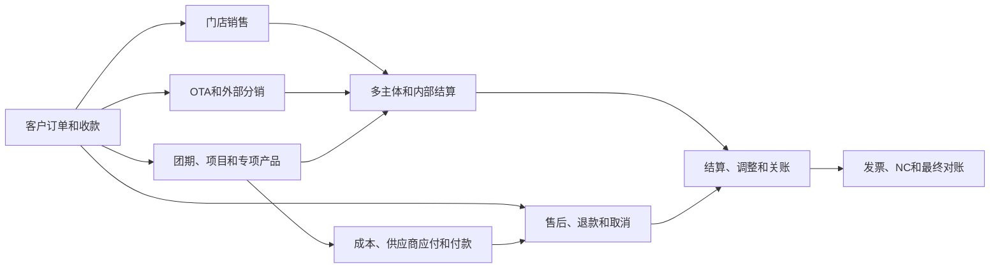

# 凯撒旅游SaaS待财务确认的全业务场景目录

版本：v1.0  
编写日期：2026年8月24日  
适用对象：外部大模型、集团财务、业务负责人、产品经理、后端开发和测试

## 一、本文用途

本目录告诉外部模型：项目已经识别出哪些必须与财务确认的业务场景，每个场景实际怎样发生，需要把哪一段收付款、债权债务、结算和NC链路继续写深。

本文不是最终财务确认手册，也不是只列场景名称。每个场景均提供：

- 实际业务描述；
- 必须贯通的财务链路；
- 财务需要确认的核心内容；
- 外部模型扩写时必须覆盖的变化。

## 二、场景组织方式

现有设计包含86个基础业务情形。部分情形能够独立构成完整业务，例如OTA平台月结；部分情形是任何订单都可能遇到的变化，例如一笔款支付多张订单、银行付款退回和关账后补成本。

为了让财务能够从一笔真实业务开始验算，本目录把86个基础情形组合成35个端到端案例。后续手册应以35个案例为主，每个案例内部承接对应的基础情形和变化分支。

35个案例按九条业务主轴组织：



NC、对账和关账异常不是孤立的业务故事，而是C01—C35每个案例共同必须写到的尾部结果。

## 三、第一主轴：客户订单、应收和收款

### C01 同一法人标准跟团产品完整链路

**业务描述**  
同一家公司设计产品、建立团期、对客销售、签订合同、分定金和尾款收款、组织履约、向外部供应商采购，并在回团后完成团期结算。

**必须贯通的链路**  
产品与团期 → 客户订单 → 合同和定金/尾款应收 → 到账、认款和收款核销 → 名单和资源履约 → 供应商预付 → 实际成本和应付 → 付款 → 团期结算 → 收入成本事项 → NC → 订单、团期、供应商、银行和NC对账。

**财务确认重点**

- 订单确认、收款和收入确认分别发生在什么时候；
- 定金、尾款、预收和已核销收款如何区分；
- 供应商预付什么时候转为成本及冲抵应付；
- 一个团期汇总多张订单时收入和成本如何核对；
- 回团前后存在未收尾款或未到账单时是否允许结算。

**必须覆盖的变化**  
分期收款、尾款逾期、供应商预付、回团补成本、订单部分退订、结算后调整。

**承接编号**  
SC-SALE-001、SC-SALE-002、SC-CASH-001、SC-COST-001、SC-COST-002、SC-COST-006、SC-COST-008、SC-SETTLE-001。

### C02 一笔款对应多订单、多人付款和多付留存

**业务描述**  
同一客户一次支付多张订单；一张家庭或企业订单又可能由个人、单位或不同成员共同付款；付款金额还可能超过当前应收。

**必须贯通的链路**  
多张订单应收 → 一笔或多笔到账 → 认款 → 按订单和应收计划分配 → 核销 → 多付款转预收、预存、退款或保留待分配 → 最终余额对账。

**财务确认重点**

- 一笔收款怎样拆分到多张订单；
- 多个付款人付款时客户和付款人怎样分别保存；
- 核销顺序由客户指定、合同到期日还是财务选择；
- 超额付款进入预收、预存还是直接退款；
- 撤销认款后原核销和余额如何恢复。

**必须覆盖的变化**  
单位和个人共同付款、一笔款跨团期、多笔款核销一笔应收、多付、少付、错误分配和重新认款。

**承接编号**  
SC-SALE-003、SC-SALE-004、SC-SALE-005、SC-CASH-006、SC-CASH-007。

### C03 银行、收款码、现金和POS收款差异

**业务描述**  
客户可能通过银行转账、固定收款码、门店码、静态码、POS或现金付款。到账信息可能缺少订单号，支付平台还可能扣费后净额到账，门店现金实缴可能与登记金额不一致。

**必须贯通的链路**  
客户付款 → 银行/支付平台/现金记录 → 待认款 → 财务核对付款人和订单 → 收款确认 → 手续费、净额到账或实缴差异处理 → 应收核销 → 银行和现金对账。

**财务确认重点**

- 哪些渠道可以自动认款，哪些必须人工复核；
- 平台扣费是减少客户收款还是另记费用；
- 现金由门店收取后何时视为公司到账；
- 实缴短款、长款由谁承担；
- 没有银行流水的现金或调整收款需要什么依据和审批。

**必须覆盖的变化**  
待认款、错认款、重复流水、支付手续费、净额到账、现金长短款、门店码收款和无流水收款。

**承接编号**  
SC-CASH-002、SC-CASH-003、SC-CASH-004、SC-CASH-005、SC-CASH-008、SC-CASH-010、SC-CASH-011、SC-STORE-008。

### C04 外币收款及押金、保证金

**业务描述**  
境外客户或企业客户使用外币支付团款；客户、供应商或渠道还可能缴纳押金、履约保证金，并在业务结束后退还或按约扣罚。

**必须贯通的链路**  
外币应收 → 外币到账 → 交易币和本位币换算 → 核销及汇率差异 → 押金/保证金收取 → 独立余额管理 → 退还、转业务款或扣罚 → NC和银行对账。

**财务确认重点**

- 使用哪一天、哪一种汇率；
- 汇率差异在收款、结算还是期末确认；
- 押金和销售款是否使用不同财务处理；
- 保证金扣罚的审批、收入或损失归属及开票方式。

**必须覆盖的变化**  
外币多次收款、跨期汇兑、原币退款、保证金部分退还、保证金扣罚和转为订单款。

**承接编号**  
SC-CASH-009、SC-CASH-012。

### C05 MICE、单团和研学项目阶段收款及验收

**业务描述**  
企业客户、学校或机构提出定制需求，经多轮报价和项目合同确认后，按签约、出发、验收等节点收款。研学还可能由学校统一付款与家长个人付款共同组成。

**必须贯通的链路**  
客户需求 → 报价版本 → 项目合同 → 项目团和阶段应收 → 单位/家长付款及核销 → 项目预算和采购 → 阶段验收 → 收入成本确认 → 项目结算 → NC和客户对账。

**财务确认重点**

- 报价、合同总价、项目预算和有效订单金额怎样衔接；
- 阶段应收与项目验收节点如何对应；
- 学校及家长混合付款怎样归集到同一项目；
- 追加服务和变更预算怎样补充合同、应收和成本；
- 项目收入按什么履约和验收依据确认。

**必须覆盖的变化**  
阶段付款、账期、混合付款、预算追加、分阶段验收、项目取消和尾款争议。

**承接编号**  
SC-SALE-006、SC-PRODUCT-008、SC-PRODUCT-009、SC-SETTLE-004。

### C06 公司、门店、渠道和供应商共同承担优惠

**业务描述**  
客户看到的展示价与合同价不同，优惠券、积分、门店让利、平台补贴和供应商促销可能同时存在，并由不同参与方承担。

**必须贯通的链路**  
展示价 → 合同成交价 → 客户应付和实付 → 各项优惠明细 → 承担方补偿或费用 → 门店/渠道/供应商结算 → 收入、费用、应收应付和发票 → NC。

**财务确认重点**

- 每项优惠减少谁的收入、增加谁的费用或形成谁对谁的补偿应收；
- 优惠是否影响客户发票金额；
- 平台补贴和供应商承担优惠何时确认；
- 内部结算价是否随优惠变化；
- 订单退款时优惠和补贴怎样反向处理。

**必须覆盖的变化**  
凯撒承担、门店承担、渠道承担、平台补贴、供应商返还、优惠组合使用和售后退回优惠。

**承接编号**  
SC-SALE-007、SC-CHANNEL-004。

### C07 长期欠款、减值、核销和后续收回

**业务描述**  
企业客户或渠道按账期购买产品，超过合同期限仍未付款。期末根据账龄计提减值，批准后核销坏账，后续又可能追回部分款项。

**必须贯通的链路**  
订单和账期应收 → 到期未收 → 账龄和催收记录 → 减值测算与审批 → 减值会计事项 → 坏账核销 → 后续收回 → NC和账龄对账。

**财务确认重点**

- 减值和坏账核销分别需要什么条件；
- 核销是否改变客户经营欠款的追踪；
- 后续收回如何恢复或确认收益；
- 关账前后减值调整怎样处理。

**必须覆盖的变化**  
部分收回、分期和解、全额核销、核销后收回、担保或保证金抵扣。

**承接编号**  
SC-SALE-008、SC-SETTLE-013。

## 四、第二主轴：门店销售和门店结算

### C08 直营门店销售

**业务描述**  
直营门店销售所属法人的产品，客户合同、收款、收入和采购成本均由所属法人承担，门店只作为销售、业绩和责任归属。

**必须贯通的链路**  
门店获客和下单 → 所属法人合同及应收 → 总部或门店收款账户到账 → 应收核销 → 团期履约 → 法人收入成本 → 门店业绩和管理贡献 → NC。

**财务确认重点**

- 门店收款账户是否属于同一法人；
- 门店现金和支付码怎样上缴与对账；
- 门店业绩、内部贡献和员工提成不得形成虚假的外部应付；
- 客户发票和收入归属哪家公司。

**必须覆盖的变化**  
总部账户收款、门店账户收款、现金实缴、门店优惠、跨部门协作和员工提成。

**承接编号**  
SC-STORE-001。

### C09 加盟门店获客、总部直收和分润

**业务描述**  
加盟门店负责获客和服务客户，总部与客户签约并直接收款，月末按有效订单向加盟门店支付佣金或分润。

**必须贯通的链路**  
加盟门店下单 → 总部客户合同和应收 → 客户向总部付款 → 总部履约 → 订单成为可结算订单 → 门店对账 → 佣金/分润应付 → 付款及发票 → NC。

**财务确认重点**

- 佣金按成交、收款、出团还是回团计算；
- 退款、优惠、投诉和未收尾款是否扣减分润；
- 门店开票是否为付款前置条件；
- 全额汇给总部再返佣与仅支付净结算价的差别。

**必须覆盖的变化**  
固定佣金、比例分润、阶梯返利、门店承担优惠、退款追回佣金和结算争议。

**承接编号**  
SC-STORE-002、SC-STORE-007、SC-SETTLE-008。

### C10 加盟门店预存后按结算价下单

**业务描述**  
加盟门店先向总部充值形成预存余额，后续每次下单按总部结算价冻结或扣减，客户成交价和门店销售差额由合作模式决定。

**必须贯通的链路**  
门店充值 → 银行到账和认款 → 门店预存余额增加 → 订单生成 → 按结算价冻结/扣减 → 取消后解冻或退回 → 门店对账 → NC和资金余额核对。

**财务确认重点**

- 充值是预存负债，不是订单收入；
- 冻结和实际扣减分别在什么时点发生；
- 客户价、总部结算价、预存扣款和门店差额怎样并列保存；
- 余额不足、透支和退款如何处理。

**必须覆盖的变化**  
充值未认款、余额冻结、订单取消解冻、部分退款、账户退款、余额调整和授信叠加。

**承接编号**  
SC-STORE-003。

### C11 加盟门店代收和账期采购

**业务描述**  
加盟门店先向客户收取团款，再按合同向总部汇款；或者门店在授信额度内先下单，按月或按账期向总部付款。

**必须贯通的链路**  
客户订单 → 门店代收客户款或形成门店采购欠款 → 总部对门店应收 → 门店汇款及认款 → 核销门店应收 → 佣金/差额处理 → 门店对账和NC。

**财务确认重点**

- 客户应收和门店应收是否并存、由谁承担客户信用风险；
- 门店应汇全款还是扣除销售差额后净额汇款；
- 授信占用、恢复、逾期和保证金如何计算；
- 门店代收但未汇款时总部是否能将订单视为已收。

**必须覆盖的变化**  
全额汇款后返佣、净额汇款、账期采购、授信超限、代收逾期、客户退款时向门店追款。

**承接编号**  
SC-STORE-004、SC-STORE-005。

### C12 集团内独立法人门店采购

**业务描述**  
集团内独立法人门店向总部或产品公司采购旅游产品，再以自身名义向客户销售。

**必须贯通的链路**  
客户与门店法人的销售、应收和收款 → 门店法人与产品公司的内部采购 → 内部应收应付和付款 → 产品履约 → 双方收入成本 → 内部发票 → NC及合并抵销。

**财务确认重点**

- 客户合同和开票主体；
- 内部结算价、内部应收应付和收付款；
- 门店法人和产品公司分别确认的收入成本；
- 同一订单如何关联双方账套及团期；
- 内部交易如何对账和抵销。

**必须覆盖的变化**  
客户款由门店收、总部代收、内部月结、门店折扣和客户售后。

**承接编号**  
SC-STORE-006。

## 五、第三主轴：OTA和外部分销

### C13 OTA代收、扣费、退款、补贴和净额打款

**业务描述**  
OTA向客户销售凯撒产品并代收客户款，结算期内发生佣金、技术服务费、平台或商家补贴、客户退款，平台最终按净额向凯撒打款。

**必须贯通的链路**  
OTA订单 → 平台代收客户款 → 凯撒对平台应收 → 履约和退款 → 平台账单 → 销售额、退款、佣金、费用和补贴逐项核对 → 净额到账 → 分配订单并核销 → 渠道结算 → NC。

**财务确认重点**

- 客户、OTA和凯撒三方合同及开票方向；
- 平台代收款与凯撒客户收款怎样对应；
- 平台费用和补贴怎样影响应收、收入或费用；
- 净额到账如何还原为订单收款及各项扣费；
- 跨结算期退款和滚存金额怎样处理。

**必须覆盖的变化**  
平台全额或净额结算、平台承担优惠、商家承担优惠、部分退款、账单差异和跨期打款。

**承接编号**  
SC-CHANNEL-001、SC-CHANNEL-002、SC-SETTLE-007。

### C14 外部分销商信用额度和账期采购

**业务描述**  
外部分销商在授信范围内销售或采购凯撒产品，先占用额度并形成渠道应收，到约定账期统一付款。

**必须贯通的链路**  
渠道合同和授信 → 渠道订单 → 应收及额度占用 → 履约/退款 → 周期账单 → 渠道付款 → 认款和核销 → 额度恢复 → 佣金或差额结算 → NC。

**财务确认重点**

- 额度按订单、出团还是未收余额占用；
- 取消订单、部分回款和逾期如何释放或冻结额度；
- 分销商是代理还是买断采购；
- 客户价、渠道结算价和佣金的关系。

**必须覆盖的变化**  
保证金、预存与授信组合、分批回款、超额下单、逾期、退款和坏账。

**承接编号**  
SC-CHANNEL-003。

### C15 支付平台拒付、强制退款和滚存保证金

**业务描述**  
客户已通过支付平台付款，之后银行或平台发起拒付、强制退款，或者平台按比例扣留滚存保证金，到期后再释放。

**必须贯通的链路**  
平台收款 → 订单核销 → 拒付/强退通知 → 恢复客户应收或形成追款 → 平台扣款 → 保证金扣留和释放 → 售后及责任处理 → NC调整和平台对账。

**财务确认重点**

- 拒付发生后原收款和应收怎样恢复；
- 客户已出行时损失由谁承担；
- 滚存保证金属于平台应收还是受限资金；
- 跨期拒付如何冲销和重新入账。

**必须覆盖的变化**  
全额拒付、部分拒付、争议申诉成功、强制退款、保证金扣留、到期释放和平台扣罚。

**承接编号**  
SC-CHANNEL-005。

## 六、第四主轴：供应商成本、应付和付款

### C16 供应商账单与多团期成本确认

**业务描述**  
供应商先完成服务后提交账单。一张账单可能包含多个团期或订单，同一团期的成本也可能来自多张账单。

**必须贯通的链路**  
合同和实际用量 → 成本确认 → 供应商账单 → 账单明细与团期成本匹配 → 差异处理 → 应付 → 付款申请和付款 → 核销 → 团期及供应商周期对账 → NC。

**财务确认重点**

- 成本确认单和供应商账单的边界；
- 一张账单跨多团期时怎样分配；
- 暂估成本、实际账单和差异调整如何承接；
- 重复账单、少账单和争议金额如何阻断应付或付款。

**必须覆盖的变化**  
一账单多团期、多账单一团期、账单晚到、暂估、部分争议、红字账单和已付款后调账。

**承接编号**  
SC-COST-003、SC-COST-004、SC-COST-005、SC-SETTLE-006。

### C17 外币供应商应付和付款

**业务描述**  
境外酒店、地接社、船司或其他供应商按外币报价和结算，成本确认、账单、付款和期末可能使用不同汇率。

**必须贯通的链路**  
外币合同 → 外币成本和应付 → 本位币折算 → 付款申请 → 外币购汇和实际付款 → 应付核销 → 汇兑差额 → 期末重估 → NC。

**财务确认重点**

- 成本、应付、付款和期末重估分别使用什么汇率；
- 银行手续费和中间行扣费由谁承担；
- 原币应付已结清但本位币差额如何处理；
- 外币预付怎样分摊和冲抵。

**必须覆盖的变化**  
分期付款、外币预付、付款不足、银行扣费、汇率波动、供应商退款和跨期重估。

**承接编号**  
SC-COST-007。

### C18 员工借款、现场支出和报销

**业务描述**  
领队、导游、计调或项目经理出团前借款，出行中发生现场费用，回团后提交票据报销并退回余款或申请补款。

**必须贯通的链路**  
借款申请 → 审批和付款 → 员工借款余额 → 现场支出明细 → 团期成本归属 → 报销审核 → 余款退回或补款 → 借款核销 → NC和团期结算。

**财务确认重点**

- 借款不是团期最终成本；
- 现场支出按游客、团期或项目如何归属；
- 无票、外币和超预算支出如何审批；
- 员工借款余额与团期成本怎样分别核对。

**必须覆盖的变化**  
借款不足补款、借款结余退回、多团共用借款、外币现金、无票支出和逾期未报销。

**承接编号**  
SC-COST-009。

### C19 固定资源成本跨团期分摊和未售损耗

**业务描述**  
包机、切位、包舱、包列或切房按固定数量采购，再分配给多个团期；部分资源最终没有售出或无法退回。

**必须贯通的链路**  
固定资源采购合同 → 采购总量和预付 → 分配到多个团期 → 实际占用、释放和损耗 → 总成本分摊 → 各团期成本 → 未售损耗 → 应付付款 → 团期和采购批次结算 → NC。

**财务确认重点**

- 按座位、舱位、铺位、人数、收入还是其他依据分摊；
- 可退资源、不可退损耗和待售库存怎样区分；
- 分摊规则变更后已结算团期如何处理；
- 未售损耗进入哪个法人、经营单元和期间。

**必须覆盖的变化**  
跨团期分配、资源调拨、释放退款、免费名额、升舱差额、固定损耗和结算后重分摊。

**承接编号**  
SC-COST-010。

## 七、第五主轴：专项旅游产品

### C20 邮轮、专列和团队机票固定资源

**业务描述**  
公司提前包船或切舱、包列或包铺、切团队机位或包机，分阶段支付定金和尾款，再按航次、班期或团期售卖及结算。

**必须贯通的链路**  
资源协议 → 定金/预付 → 舱房、铺位或机位库存 → 分配和销售 → 名单及票号/房号 → 最终付款 → 实际使用和损耗 → 航次/班期/团期结算 → 预付冲抵和成本分摊 → NC。

**财务确认重点**

- 采购付款节点和实际成本确认节点；
- 不同舱型、铺位和机位成本如何分配；
- 退舱、退铺、退票和不可退损失怎样计算；
- Final Payment、出票和出行前结算的关系。

**必须覆盖的变化**  
包量和切位、定金尾款、释放、换舱换铺、票损、未售损耗和供应商调整。

**承接编号**  
SC-PRODUCT-001、SC-PRODUCT-002、SC-PRODUCT-003、SC-SETTLE-002。

### C21 BSP散客票和B2B平台充值出票

**业务描述**  
航服公司通过BSP出票并按IATA账单结算，或者先向B2B平台充值，再按每张票扣减余额；出票后可能退票、改签和产生票损。

**必须贯通的链路**  
机票订单 → PNR和出票 → 票号及票面、税费、佣金 → BSP日报/IATA大账单或平台余额扣减 → 成本和应付/预付 → 退改签和票损 → 对账付款 → NC。

**财务确认重点**

- 票面、税费、代理费、佣金和退改费如何拆分；
- 每张票与日报、大账单和订单如何核对；
- B2B充值是预付，出票后怎样转成本；
- 废票、退票、改签和ADM等差异如何处理。

**必须覆盖的变化**  
BSP账期、平台充值、集团内部供票、客票退款、改签费、票损和账单调整。

**承接编号**  
SC-PRODUCT-004、SC-PRODUCT-005。

### C22 自由行采购批次成本分摊

**业务描述**  
自由行把酒店、机票、接送、门票等组合销售。资源可能按采购批次取得，再分到不同订单和出行日期。

**必须贯通的链路**  
采购批次 → 套餐和出行日期 → 客户订单 → 各服务占用 → 批次成本分配到订单 → 单项退改 → 订单级结算 → 应付付款 → NC。

**财务确认重点**

- 没有标准团期时以什么作为结算范围；
- 套餐总价如何对应多个采购服务；
- 批次成本按数量、房晚或实际服务怎样分配；
- 单个服务退款怎样影响订单收入和成本。

**必须覆盖的变化**  
组合套餐、单服务替换、跨订单采购批次、库存余量、部分退款和采购价后调。

**承接编号**  
SC-PRODUCT-006、SC-SETTLE-003。

### C23 单项服务费和代收代付

**业务描述**  
签证、保险、接送、门票、酒店或机票可以单独销售。凯撒可能自主销售并承担责任，也可能只收服务费，或仅代客户收取并转付第三方款项。

**必须贯通的链路**  
单项订单 → 判断自主销售/代理服务/代收代付 → 客户应收和收款 → 服务费与代收款拆分 → 外部应付和付款 → 服务完成或退款 → 订单结算 → 发票和NC。

**财务确认重点**

- 哪部分是凯撒收入，哪部分是代收负债；
- 对外供应商款是否作为成本或代付款；
- 客户和供应商发票方向；
- 服务取消时服务费和代收款分别退多少。

**必须覆盖的变化**  
纯服务费、服务费加代收款、自主销售、部分代付、供应商直收和客户退款。

**承接编号**  
SC-PRODUCT-007、SC-SETTLE-005。

## 八、第六主轴：集团内部多主体和外采业务

### C24 同一法人不同经营单元协作

**业务描述**  
同一法人内产品部门提供产品，销售部门或直营门店获客，其他部门承担履约或支持，内部需要计算贡献和员工提成。

**必须贯通的链路**  
客户订单和法人收款 → 法人统一收入成本 → 团期结算 → 部门销售贡献、产品贡献和费用分摊 → 经批准形成员工提成或管理报表 → NC。

**财务确认重点**

- 法人会计结果与部门经营贡献分开；
- 部门之间不形成外部应收应付或虚拟现金；
- 员工提成何时从管理计算变成真实薪酬费用；
- 管理分摊是否进入NC辅助核算。

**必须覆盖的变化**  
销售部门和产品部门分成、共享成本分摊、员工提成、跨区域经营和部门调整。

**承接编号**  
SC-IC-001。

### C25 A公司销售B公司自营产品

**业务描述**  
A公司以自身名义向客户销售，B公司拥有并履约自营产品，双方按内部结算价完成产品采购和销售。

**必须贯通的链路**  
客户与A公司的订单、合同、应收和收款 → A与B内部采购销售 → B公司产品履约和外部成本 → 双方内部应收应付及付款 → 各自收入成本 → 内部开票、NC和合并抵销。

**财务确认重点**

- 客户价、A-B内部结算价和B公司成本三层金额；
- A公司与B公司分别确认的客户、内部客户和供应商关系；
- 内部结算按订单、团期还是周期；
- 客户售后如何同时反向调整A-B内部结算。

**必须覆盖的变化**  
A收客户款、B代收、按全款结算后返差额、净结算价、内部月结和客户退款。

**承接编号**  
SC-IC-002。

### C26 A公司销售、B公司包装并向外部供应商采购

**业务描述**  
A公司负责对客销售，B公司引入外部供应商产品并重新包装，B公司再向外部供应商采购和付款。典型价格链为客户价10,000元、A-B结算价8,000元、B公司外部采购净成本7,760元。

**必须贯通的链路**  
客户与A公司销售 → A公司应收和收款 → A-B内部采购销售及应收应付 → B公司与外部供应商采购、返佣和付款 → 团期履约 → 三段结算 → 两家公司NC → 内部交易对账及合并抵销。

**财务确认重点**

- 客户—A、A—B、B—供应商三段关系分别建账；
- 展示价、合同价、实付、内部结算价、采购价和返佣完整保存；
- B公司按8,000元付款后收回240元，还是直接净付7,760元；
- A、B公司和集团整体经营结果分别计算；
- 同一团期多销售公司、多订单时怎样结算和对账。

**必须覆盖的变化**  
全额汇款后返差额、净额结算、优惠承担、供应商后返、客户退款、供应商部分退费、A为主责方或代理方、结算后调整。

**承接编号**  
SC-IC-003。

### C27 航服公司向集团内产品公司供票

**业务描述**  
集团航服公司负责采购和出票，旅游产品公司把机票组合进团期并向客户销售，双方按内部票价结算。

**必须贯通的链路**  
旅游订单和团期 → 内部机票需求 → 航服采购、出票、PNR和票号 → 内部供票应收应付 → 航服外部BSP/平台成本 → 产品公司团期成本 → 退改签 → 双方NC和内部对账。

**财务确认重点**

- 产品订单、内部供票和航服外部采购三层关系；
- 内部票价、票面税费、航服服务收益和外部成本；
- 退改签和票损由哪家公司及哪个团期承担；
- 航服账单和团期结算时点差异。

**必须覆盖的变化**  
散客票、团队票、切位、退改签、航服代付、内部月结和跨期BSP调整。

**承接编号**  
SC-IC-004。

### C28 集中代收、代付和内部资金清算

**业务描述**  
客户合同或供应商采购属于业务公司，但集团资金公司或另一法人统一代收客户款、代付供应商款，并可能涉及外币和跨期清算。

**必须贯通的链路**  
原客户销售或供应商采购 → 资金公司实际收付 → 业务公司与资金公司的代收/代付应收应付 → 资金划拨或内部抵销 → 汇率和跨期差异 → 双方NC和资金对账。

**财务确认重点**

- 资金流变化不能改变原合同和债权债务；
- 代收后客户应收如何核销，同时怎样生成内部资金往来；
- 代付后供应商应付如何核销，同时怎样生成对资金公司的欠款；
- 多公司、多币种和跨期清算怎样对账。

**必须覆盖的变化**  
集中代收、集中代付、资金池净额清算、跨期未划款、外币代付、汇率差异和退款代付。

**承接编号**  
SC-IC-005、SC-IC-006、SC-IC-007、SC-SETTLE-009。

### C29 外采主责方全额和代理方净额

**业务描述**  
凯撒外采第三方产品后，可能作为主要责任方向客户销售并承担履约责任，也可能仅代理供应商销售并取得佣金或服务费。

**必须贯通的链路**  
外采合同和权责判断 → 客户订单和收款 → 供应商采购或代销结算 → 全额收入成本或净额佣金处理 → 应收应付和付款 → 发票 → NC和毛利对账。

**财务确认重点**

- 不能只根据“自营/外采”标签判断全额或净额；
- 谁承担定价权、履约责任、库存风险和客户信用风险；
- 即使净额确认收入，也必须保存客户全款和供应商结算全链路；
- 差额计税与会计净额确认不能混为一谈。

**必须覆盖的变化**  
主责方、代理方、固定佣金、销售差额、供应商直收、凯撒代收和客户售后。

**承接编号**  
SC-IC-008、SC-IC-009。

## 九、第七主轴：售后、退款和业务取消

### C30 减价、退差、原路退款、转预存和转订单

**业务描述**  
订单可能在未收款时减价，也可能在已收款后退还差额；客户还可能选择原路退款、转为预存余额或转到另一张订单。

**必须贯通的链路**  
售后申请和审批 → 订单有效金额调整 → 客户应收调整 → 原收款可退余额 → 原路退款/转预存/转新订单 → 原核销反向及新核销 → 合同发票和NC调整。

**财务确认重点**

- 未收款减价与已收款退款的处理不同；
- 退款必须关联原收款，防止超退和重复退；
- 转预存和转订单不产生虚假的银行收付款；
- 已开票、已结算或跨期后如何处理。

**必须覆盖的变化**  
未收减价、已收退差、全额退款、部分退款、转预存、转新订单、组合支付退款和退款失败。

**承接编号**  
SC-AFTER-001、SC-AFTER-002、SC-AFTER-003、SC-AFTER-004、SC-AFTER-005、SC-AFTER-006。

### C31 客户退款、供应商追款和资源退改损耗

**业务描述**  
客户取消或变更后，凯撒需要向客户退款，同时向酒店、地接、船司、铁路或航司申请退款。供应商可能部分退、延迟退或不退；已经发起的付款还可能被银行退回。

**必须贯通的链路**  
客户售后 → 客户应退金额 → 退款执行 → 供应商退改申请 → 可追回金额和不可退损耗 → 供应商退款/贷项 → 成本和应付调整 → 付款退回 → 团期结算调整 → NC和对账。

**财务确认重点**

- 客户应退和供应商可追回分别计算；
- 差额由客户、凯撒、门店、渠道、供应商或保险谁承担；
- 已付供应商款追回后如何核销预付或形成供应商应收；
- 银行付款退回怎样恢复应付和可付款余额。

**必须覆盖的变化**  
供应商全退、部分退、不退、票损、舱位损失、供应商退款跨期、付款银行退回和多主体售后。

**承接编号**  
SC-AFTER-007、SC-AFTER-008、SC-AFTER-009、SC-AFTER-010。

### C32 取消出团、客户赔偿和保险理赔

**业务描述**  
由于不成团、不可抗力、供应商违约或履约事故取消出团，产生批量客户退款、客户赔偿、供应商索赔和保险理赔，同时保留部分无法退回的成本。

**必须贯通的链路**  
取消决定和审批 → 批量订单失效 → 客户应收及退款 → 已占资源释放 → 可退采购款和不可退损失 → 客户赔偿 → 供应商索赔和保险应收 → 实际赔付/理赔收款 → 项目损失结算 → NC。

**财务确认重点**

- 团款退款、额外赔偿和保险理赔分别建账；
- 谁承担取消责任和最终损失；
- 批量退款怎样防止漏退、重退和超退；
- 理赔尚未收到时是否确认应收；
- 已结算团期怎样重新打开或补充调整。

**必须覆盖的变化**  
不成团、不可抗力、供应商违约、客户赔偿、保险理赔、部分成行和批量退款。

**承接编号**  
SC-AFTER-011、SC-AFTER-012。

## 十、第八主轴：周期结算、调整和关账

### C33 供应商周期对账结算

**业务描述**  
与地接社、酒店、船司、航司等供应商按周或按月汇总核对成本、账单、预付、应付、付款、退款和发票。

**必须贯通的链路**  
期间成本明细 → 供应商对账单 → 双方差异 → 确认账单和应付 → 预付冲抵 → 付款和回单 → 发票核对 → 期末余额确认 → NC。

**财务确认重点**

- 业务团期结算和供应商周期对账的边界；
- 未结算团期是否进入供应商账单；
- 预付、应付、付款和退款如何在一张往来表中核对；
- 争议金额是否冻结付款但保留账龄。

**必须覆盖的变化**  
跨团期账单、暂估、预付冲抵、争议款、供应商贷项、发票未到和周期余额确认。

**承接编号**  
SC-SETTLE-006。

### C34 结算后补收入、补成本和关账后跨期调整

**业务描述**  
团期或项目已经完成结算后，又收到补充账单、客户补差或退款；或者原会计期间已经关账，不能修改原记录。

**必须贯通的链路**  
原结算和原NC凭证 → 新业务依据 → 补充结算或冲销申请 → 审批 → 新增应收/应付/收入/成本调整 → 当前允许期间入账 → NC → 原结算与调整后累计结果对账。

**财务确认重点**

- 已结算数据不能直接覆盖；
- 哪些情况采用补充结算、反结算、冲销或跨期调整；
- 原期间和当前期间分别保留什么结果；
- 调整怎样回到订单、团期、供应商和内部往来。

**必须覆盖的变化**  
补客户收入、补供应商成本、退款、供应商返还、已推NC、已开票和关账后调整。

**承接编号**  
SC-SETTLE-010、SC-SETTLE-011。

### C35 同一往来单位应收应付抵销

**业务描述**  
同一公司既向凯撒购买产品，又向凯撒提供服务，双方在合法协议和审批基础上，将部分应收和应付抵销，仅支付净额。

**必须贯通的链路**  
独立客户应收 → 独立供应商应付 → 双方对账和抵销协议 → 抵销申请和审批 → 生成抵销记录 → 分别核销应收应付 → 剩余净额收付 → 发票和NC对账。

**财务确认重点**

- 抵销前应收应付必须分别真实存在；
- 对方单位、法人主体、币种和到期条件是否允许抵销；
- 抵销不等于删除原交易，也不能按净额隐藏收入成本；
- 集团内部抵销与外部往来抵销的审批和凭证差异。

**必须覆盖的变化**  
全额抵销、部分抵销、不同币种、跨主体、发票未齐和抵销后剩余净付款。

**承接编号**  
SC-SETTLE-012。

## 十二、外部模型扩写场景时的统一要求

外部模型不能只把上述目录改写成更长的文字。每个场景必须严格使用《06-财务场景分析与案例编写模板》，用具体数字从头计算到尾，并至少包含：

1. 业务全景位置和场景设定；
2. 参与公司及合同、销售、履约、收付款、开票和核算责任；
3. 客户价、优惠、实付、内部结算价、采购价、返佣和退款等完整价格拆解；
4. 主体交易图、债权债务图和实际资金图；
5. 分阶段说明订单、收款、履约、成本、结算和NC过程；
6. 每一阶段应收、预收、应付、预付和往来余额的变化；
7. 团期、项目、门店、渠道、供应商和内部公司分别怎样结算；
8. 各法人公司的法定账面结果以及单独列示的部门管理结果；
9. 合同、业务、资金、发票和会计五条线核对；
10. 最终反算等式、变化分支、备选处理和需要凯撒确认的制度口径。

对于C26等复杂案例，“写清三个金额”不等于完成。必须沿客户—销售公司—产品公司—外部供应商的每一段交易，逐笔解释债权债务、收付款、收入成本、发票、结算和NC结果。

## 十三、场景覆盖检查

| 场景组     | 案例范围        | 案例数 | 主要财务范围                 |
| ------- | ----------- | ---:| ---------------------- |
| 客户订单和收款 | C01—C07     | 7   | 应收、收款、优惠、项目账期、减值       |
| 门店销售    | C08—C12     | 5   | 直营、加盟、预存、代收、内部法人门店     |
| OTA和分销  | C13—C15     | 3   | 平台代收、净额结算、授信、拒付        |
| 成本和付款   | C16—C19     | 4   | 账单、应付、外币、借款、成本分摊       |
| 专项产品    | C20—C23     | 4   | 邮轮、专列、航服、自由行、单项服务      |
| 多主体业务   | C24—C29     | 6   | 部门协作、内部互采、外采、代收代付、全额净额 |
| 售后和取消   | C30—C32     | 3   | 退款、转款、供应商追款、赔偿理赔       |
| 结算和关账   | C33—C35     | 3   | 周期对账、跨期调整和往来抵销         |
| NC和最终对账 | C01—C35共同检查 | 不另计 | NC、业务账与总账、关账异常         |
| 合计      | C01—C35     | 35  | 承接86个基础业务情形            |

本目录应与《01-凯撒旅游SaaS项目业务全景与业财流程说明书》《03-外部模型工作任务与交付要求》和《06-财务场景分析与案例编写模板》一并提供给外部模型。01负责说明整个项目和完整流程，本文负责告诉它具体有哪些场景需要继续完善，06负责规定每个场景怎样分析和呈现。

### 1. 每个案例必须说明的NC过程

- 哪个业务或财务结果生效后形成会计事项；
- 会计事项属于哪家公司和哪个会计期间；
- 推送NC前需要哪些往来单位、部门、团期或项目辅助信息；
- NC成功后保存什么凭证号和来源关系；
- 推送失败、重复推送、NC已接收未记账分别怎样处理；
- NC已记账后发现错误怎样冲销或补充；
- 原期间关账后怎样进入允许调整期间。

### 2. 每个案例必须给出的核对关系

```text
客户有效应收
= 已核销收款
+ 已核销预收或预存
+ 已批准抵销或核销
+ 期末待收

供应商有效应付
= 已核销付款
+ 已冲抵预付
+ 已批准抵销
+ 期末待付

结算收入 - 结算成本 - 单列费用或损失
= 本次经营结果
```

多主体案例还必须满足：

```text
内部提供方应收 = 内部接收方应付

集团合并经营结果
= 对外收入 - 对外成本 - 对外费用或损失
```

### 3. 共同异常分支

所有案例都要检查：

- 银行流水存在但未认款；
- 收款已确认但没有核销应收；
- 成本已确认但账单或应付尚未形成；
- 付款已执行但没有银行回单或核销；
- 业务单据已生效但会计事项未生成；
- NC推送失败、重复推送或金额不一致；
- 内部一方已入账、另一方未入账；
- 原期间已经关账但又发生退款或补充成本；
- 账面存在余额，但业务已经结束且无法说明原因。

## 
