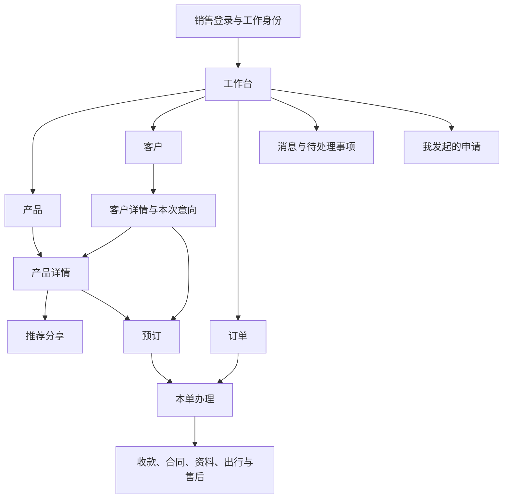
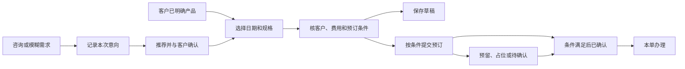
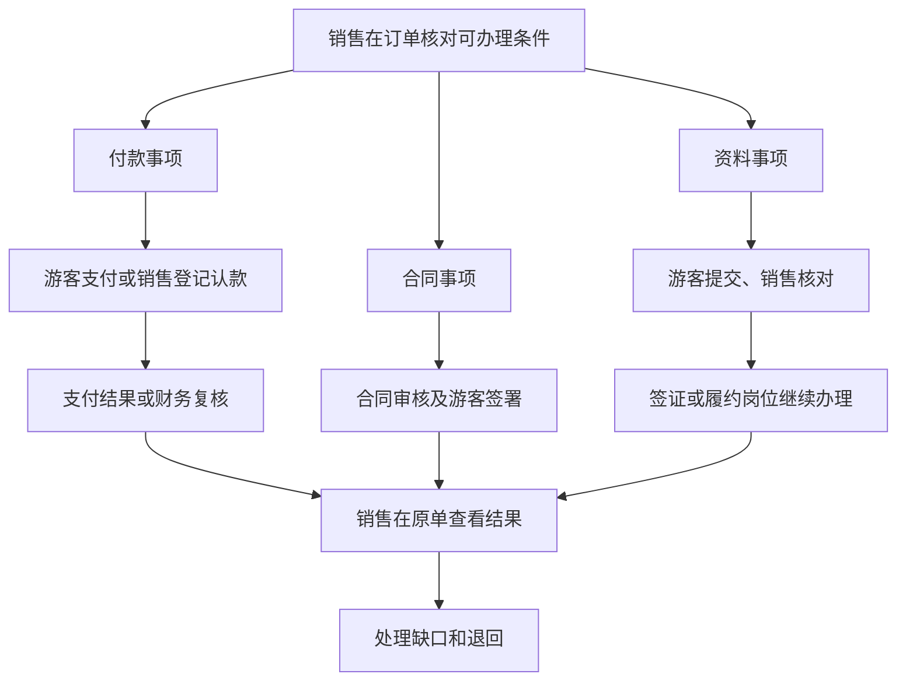

# 销售移动小程序页面与操作流程设计

日期：2026-09-28。状态：页面清单、业务操作、正常／异常场景设计完成；未实施HTML页面，未进行浏览器业务验收。

依据用户“执行”，落实[基于merchant销售流程的独立规划](销售移动小程序功能规划-基于merchant销售流程-20260928.md)指定的下一步。仅从商户端销售岗位、现有业务页面及当前流程规则推导，不引用既有销售移动原型作为布局或功能边界。本次交付可直接用于原型制作。

## 一、使用角色、业务范围与交付尺度

主要使用者为普通销售顾问，包括按相同岗位获授权的直营／加盟店员、电销顾问。销售处理本人或明确授权的客户和订单；游客完成本人或获授权人员的付款、签署、资料提交；产品岗位提供已发布产品及价格，计调确认资源及服务，业务审批人审批价格变更，财务核实到账并执行退转款。

上游：咨询、已分配线索、客户历史、可售产品及具体日期规格。销售高频任务：查产品、发推荐、记录需求、预订、核资料、发起申请、看结果。下游：同一订单的款项、合同、资料、履约与售后办理。每次提交都必须留下本次记录、明确下一办理岗位，并允许从原事项继续。

本文“应收”指订单确认后客户按约应付的金额；“实收”指已经确认收到并对应本单的款项。“待复核”表示款项资料已提交、尚未核实通过，其金额不能计入实收。原收款、已执行退款和转款分别保留，资金变化不能通过覆盖原记录表达。

本设计覆盖四个一级入口、18个销售逻辑页面和7个游客逻辑页面。逻辑页面是用户完成一项任务的完整视图，不要求对应25个HTML文件；页内分区、步骤和结果态按下表复用。页面编号仅用于设计与验收，不进入业务界面。

首个代表业务采用国内参团游。外部分销商账号与结算、主管团队管理、完整企业项目编制及其他品类的专用预订另按范围推进；本次明确其承接方向，不记为已覆盖。真实微信登录分享、支付和合同服务不作为原型交付条件。

## 二、导航和页面清单

### 2.1 一级入口

四个一级入口显示底部导航。二级业务页使用返回栏，表单离开前保留草稿或确认放弃。账号、消息、本人业务查看放工作台；我发起的申请为汇总入口，办理仍回原申请。AI在需求整理、产品比较和订单解释中按需出现，不设置必须经过的聊天步骤。

### 2.2 销售端页面

| 编号／页面 | 从哪里进入 | 首屏要判断的信息 | 主操作和下一步 |
|---|---|---|---|
| S01 登录与工作身份 | 首次进入、账号切换 | 当前员工、公司、门店、可用岗位；无授权原因 | 登录后进入S02；有多个工作范围才选择，单一范围直接带入 |
| S02 工作台 | 登录、底栏 | 临期及退回事项、今日回访、继续草稿；本人业务简要结果 | 点事项进入对应需求、订单或原申请；快捷查产品、接待客户 |
| S03 产品列表 | 底栏、客户意向推荐 | 名称、具体可售日期范围、价格起点、出发地与销售状态；日期／预算／余位筛选 | 查看S04；客户上下文存在时持续显示本次推荐给谁 |
| S04 产品详情 | S03、客户候选产品 | 先显示日期规格、实际报价、余位、即时或二次确认；再看行程、费用、退改与材料要求 | 进入S05推荐分享或S09预订；未选日期允许分享产品介绍，不能输出确定报价 |
| S05 推荐分享 | S04、已授权素材 | 对客预览、分享内容类型、日期人数和价格是否明确、顾问联系方式 | 生成本次推荐内容，打开G01预览并复制／分享；留下推荐记录，不直接形成订单 |
| S06 客户列表 | 底栏、工作台接待 | 姓名、联系方式、归属；客户／意向切换及待回访筛选 | 新增客户、打开S07或S08；新客查重在登记过程中完成 |
| S07 客户详情 | S06、已有客户搜索 | 联系方式、常用同行人、出行偏好、当前意向和历史订单 | 新建本次需求到S08、直接选产品到S03、打开历史订单S11 |
| S08 意向详情 | S07、咨询待办、意向列表 | 本次日期或时间范围、人数、预算、目的地、阶段、跟进记录、推荐和关联订单 | 编辑需求、记录跟进／回访、关闭恢复、推荐产品或进入S09；同一客户可有多次意向 |
| S09 预订 | S04、S08、工作台快捷入口 | 当前产品、日期规格、客户、人数、费用、付款计划与确认条件 | 单页三步核对；保存草稿或按条件提交；结果进入S11 |
| S10 订单列表 | 底栏、工作台订单查询 | 订单号、客户、产品、出发日期、一个主状态；按需显示待收或资料缺口弱文本 | 进入S11；状态筛选与异常筛选分开，销售归属按权限限定 |
| S11 订单详情 | S10、工作台本单事项、提交结果 | 客户和出行摘要、主状态、应收或预计金额、已确认收款、待收与当前缺口 | 当前状态适用动作＋收款／合同／资料／出行／售后分区；进入S12—S16、S18 |
| S12 认款办理 | S11收款分区、认款退回事项 | 本单、收款公司、付款方、原流水或凭据、可认金额、已有认款及退回原因 | 新申请／原申请补充／查看结果共用本页；提交后显示待复核，不增加已确认收款 |
| S13 合同办理 | S11合同分区、合同退回事项 | 适用合同、覆盖游客、签署人、签约公司、金额、附件、审核及逐方签署结果 | 核资料、预览、提交审核或按条件发起签署；生成获授权签署入口到G05 |
| S14 游客资料办理 | S11资料分区、资料缺口事项 | 每位游客必要资料、已提交／待核对／退回情况和截止日 | 选择游客补资料、核对游客提交内容、提供G06采集入口；按业务要求维护 |
| S15 服务与金额变更 | S11费用或服务分区 | 原项目及金额、拟增减内容、涉及游客、服务可供情况、客户依据 | 收费／免费／待报价分别填写；交计调或业务审批；原申请退回后补充重提 |
| S16 售后办理 | S11售后分区、售后退回事项 | 原订单、涉及游客／项目、原款、目标日期、资源扣损和已处理记录 | 按改期、退订、退款、转款分表单办理；申请详情展示当前岗位和结果 |
| S17 我发起的申请 | S02 | 申请类型、关联客户订单、申请状态、当前办理岗位和退回原因 | 查看后进入原S12／S13／S15／S16，避免再建一套申请编辑入口 |
| S18 出行资料 | S11出行分区 | 已确认交通酒店、签证结果、已发布通知、集合和领队；版本与发布时间 | 预览文件或生成本单游客查看入口G07；未发布时展示当前状态与负责岗位 |

S06、S07中的客户登记和编辑，S08中的跟进、关闭原因，S04中的日期规格选择，S05中的分享方式选择，均作为当前页表单或底部选择面板，不增加中间选择页。删除、取消、放弃未保存内容等使用简短确认；复杂业务表单使用独立返回页。

### 2.3 游客端页面

| 编号／页面 | 进入条件与可见范围 | 游客操作 | 销售收到的业务结果 |
|---|---|---|---|
| G01 产品／推荐详情 | 公开可售介绍可浏览；指定客户报价仅向对应客户提供；只含对客内容 | 看行程、日期价格、费用退改，联系顾问或进入G02 | 推荐来源可追溯；仅浏览或打开不记为客户已确认购买 |
| G02 咨询需求 | 从G01进入，保留推荐产品及顾问来源 | 填联系信息、出行需求和允许顾问联系的选择；可日期待定 | 形成待接待咨询；成功后显示受理顾问或待分配状态，不能生成已成交订单 |
| G03 本单办理 | 验证为本单联系人、游客或授权代办人后，按其权限显示 | 查看本单必要摘要、付款／合同／资料各自进度，进入对应事项 | 销售查到各项办理结果；某一项完成不自动完成其他项 |
| G04 本单付款 | 核对订单、收款公司、本次付款节点及金额；第三方代付依本单允许条件 | 确认付款、查看处理中／成功／失败／结果待核对，回G03 | 成功且已获得有效确认才增加实收；处理中和未知结果保留待核对 |
| G05 合同签署 | 验证为当前版本规定的签署人，查看本份合同及附件 | 阅读核对、身份确认、签署或提出资料有误；回看本人结果 | 逐方签署状态与我方签章分别返回，满足完成条件后才记本份合同已签署 |
| G06 游客资料填写 | 仅显示本人或获授权代办的游客资料 | 按清单填写、上传、暂存、提交；被退回后查看原因并修改 | 已提交待核对，核对通过再进入业务资料；不覆盖其他游客或已确认历史 |
| G07 出行资料 | 获授权查看本单已发布资料，不含其他订单游客明细 | 查看最新集合安排、交通酒店、领队联系方式和附件 | 留本版查看情况供参考；查看不等于承诺、同意变更或业务完成 |

身份验证作为各页必要的进入状态，不另立普通业务菜单。失效或越权链接只说明无法办理及联系顾问的方式，不展示他人订单。不得要求游客进入销售账号操作。游客自助下单、会员商城和分销商首页不属于本次页面清单。

## 三、核心操作流程

### 3.1 产品分享与客户咨询

1. 销售从S03找产品，S04查看当前日期、报价与确认方式。可选择“产品介绍”或“具体出行推荐”；后者须明确日期、人数及规格。
2. S05只使用已发布行程、对客价格和授权素材。产品介绍的起价明确是起价；具体推荐展示对应报价、费用、退改及有效时间。有客户上下文时绑定本次需求，没有时记录本次推荐的顾问来源。
3. 销售预览客户将看到的G01，再发分享或复制内容。游客端不出现供货价、成本、佣金、其他客户或后台操作。
4. 客户在G01联系顾问或进G02留需求。提交形成咨询记录及受理状态；如来源顾问仍具备受理资格，进入其待接待事项，否则进入待分配并保留原分享来源，不随意改派到固定演示员工。
5. 销售在S02接待：先查是否已有客户；已有本人客户则建立新意向或追加当前意向，新客则登记后建立本次需求。其他顾问名下客户按授权转交规则处理，不自动改归属或暴露其完整档案。
6. 需求明确且客户决定购买，进入S09；需求不明确，在S08继续跟进。分享来源、客户维护归属、最终订单销售归属分别保留，不能用最后一次点击覆盖前两者。

旧分享遇到调价、停售、日期过期或余位变化时，G01应说明当前情况并引导重新核对；原推荐内容可以查历史，但不能按旧条件直接承诺可订。重复分享来源的最终业绩分配待业务确认，原型先展示事实，不自动发佣金。

### 3.2 两条成交入口汇入同一预订

S09三步为：①出行选择；②客户与必要预订资料；③费用和提交核对。

- 出行选择：日期、人数结构、房型等规格以及本产品提供的附加服务。根据当前选择核可用数量和价格，儿童占床等规则按产品条件显示。
- 客户与资料：选现有客户或快速登记；订单联系人与游客区分；能复用同行人；预订所必需的资料与出发前可后补资料分别提示。本人公司／门店／销售默认带入，有授权才可变更。
- 费用与提交：列基础价、附加项、符合条件的优惠、应付合计、付款计划及适用退改；显示签约、收款公司等当前需要核对的责任。未批准的额外优惠走申请，不直接改公开价。

保存草稿仅保留本客户本次预订，不形成有效订单或资源占用。提交前重新核产品授权、日期、余位、价格及确认条件；发生变化回到对应步骤核对，不静默接受新价格。草稿按客户与本次出行分别保存，重复点击提交仍只保留本次结果。

| 提交结果 | 本页显示什么 | 销售下一步 |
|---|---|---|
| 草稿 | 未提交、待补项、所选产品；不显示占位成功 | 从S02继续，或从客户本次需求恢复 |
| 预留／占位 | 本单允许的保留截止、占用数量、预计金额及确认条件 | S11按状态延期、释放或转确认；已有款项、合同或确认资源时核保护条件 |
| 待确认 | 预计金额、待确认项目、负责岗位；实际占用依本单规则显示，不默认占位 | 等计调／资源结果；无位、补差、替代方案回原单处理 |
| 已确认 | 确认依据、费用、应收及付款计划 | 进入付款、合同和资料办理；应收随业务确认生效，不另交财务批准价格 |
| 条件未配置／失效 | 明确缺少保留期限、付款条件或其他哪项依据 | 可保存草稿；只有业务允许才进入待确认，不能任意设24小时或固定定金比例 |

意向在有本次提交形成的有效订单依据后关联订单；“已转订单”只说明已经形成订单，不代表订单已确认或已完成。客户已经明确产品时不强制先建完整意向档案。

### 3.3 订单形成后的并行办理

并行不意味着忽略门槛。是否允许签署、是否需要付款才能确认、哪些资料必须先齐，均按本产品及公司规则判断。页面展示具体未满足条件及处理入口，不把“已付款”设成所有合同、所有资料的统一前置条件。

**付款与认款：** 销售从S11选择当前可收节点，核对金额和收款公司，向客户提供G04入口。付款处理中或结果未知时查原笔进度，不另发一笔同额付款要求；明确失败后按当前条件重新办理。客户银行转账后，销售在S12选择已到账流水或提交待核凭据，填写付款方、金额和必要代付依据。提交为待复核；退回时在原申请补充，保留原金额、理由和历史。财务确认后才更新已确认收款。确认前真实订金按预收记录承接，不伪造应收已生效或订单已确认。预收是已收到但还需按业务确认安排归属的款项。

**合同：** S13按业务匹配合同，先核签约公司、费用、覆盖游客、签署人关系及附件。需要审批的先提交审核，退回补正；通过后按权限发起签署。G05以本份当前版本指定签署人办理，部分签署、平台结果未知、我方尚未签章分别展示；不得因销售点击“发起”或第一位游客签完就变全单已签。一单分多份合同时，逐份核覆盖游客与完成情况，所有必要主合同完成后才显示本单合同齐全。入口失效时按原合同取得新入口；结果未知先核原请求，不重复建合同。已经签署后变更使用有业务依据的新版本或补充协议，原合同保留。

**资料：** S14依据国内、出境等实际要求组织必填资料。销售可代填，也可给游客G06入口；游客资料暂存、提交、销售核对、业务审核分别显示。退回原因定位到对应游客和材料，补正后仅更新本次材料；联系人不能默认读取或修改全单所有成年人证件。国内样例使用相应身份证明，不强制护照英文名；资料齐全与签证通过、出票完成分别表达。

### 3.4 销售持续查结果、变更与售后

S11聚合本单办理结果；S02显示有明确期限、数据缺口或退回依据的事项；S17汇总本人发起的申请。三个入口都回到同一原记录。已读消息不会清除待处理事项；资料核对通过、申请重提或后续岗位完成后，按真实结果更新待处理。

服务或金额变化从S15办理：收费项目列原值、拟改值、差额、原因和客户依据；涉及资源先取得计调确认，业务审批决定金额生效。免费服务显示金额0并交计调确认，不自动成为已安排；待报价表示金额尚未知，不当作免费。审批通过前订单原应收不变，批准金额变化不自动改实收或退款。

S16按诉求分表单：改期／转团选目标日期与涉及游客；退订选游客及服务并核扣损；退款选择原款及依据；转款选择原款、目标订单和关系。提交后依次查看业务、资源、合同及资金处理结果，不把申请获批当退款成功。未产生后续影响时按权限撤回；已执行的结果不能以撤回抹除。跨公司转款不能按普通同公司转款提交，需转适用业务流程或提示政策待确认。

S18仅展示已经发布的出行资料，变更后保留版本和发布时间；客户查看G07时先显示最新有效版本。销售可以解释和提出变更需求，不能代替计调编辑已确认资源或发布团期通知。

## 四、办理前后需要连续保留的信息

| 从哪里来 → 到哪里 | 必须带入的业务资料 | 何时可改变／不能推断什么 |
|---|---|---|
| S04 → S05 → G01 | 产品、所选日期规格、对客价格依据、有效时间、推荐顾问及联系信息 | 后续变化提示重新核对；推荐记录不证明库存已锁或客户已接受 |
| G02 → S08 | 客户提交的联系与需求、原推荐、提交时间、受理状态 | 查重后建立或关联客户；分享来源不覆盖已有客户责任人 |
| S07／S08／S04 → S09 | 本次客户／意向、联系人、日期人数、选择规格 | 销售可核对修改，切换客户后重新确认资料；旧需求与历史不被覆盖 |
| S09 → S11 | 成交选择、确认方式、价格及优惠依据、销售归属、付款安排 | 只有提交形成订单；确认前后金额性质清楚，不能把预计应收算实收 |
| S11 → S12／G04 | 本单、本笔金额、收款公司、付款节点、已有处理情况 | 金额或节点变化需重新核对；截图不证明到账 |
| S13 → G05 | 本份合同、当前版本、签署人、游客范围、金额和附件 | 必须按指定人签署；旧版本入口不能签新约定 |
| S14 → G06 → S14 | 指定游客、所需材料、截止日、已有提交及退回理由 | 本人或授权代办范围内填写；提交不直接替代原已确认业务资料 |
| S15／S16 → S11 | 原项目／原款、本次申请、客户依据、批准或执行结果 | 申请不覆盖原单；确认资源、批准金额、实收和退款各自按负责岗位结果改变 |
| S18 → G07 | 本单可见的已发布文件、版本、集合及联系信息 | 查看不等于同意业务变更；旧文件可保留但提示当前有效版本 |

## 五、页面布局与操作表达

1. 工作台先列最需要及时处理的事项，轻量显示本人业务；四个一级列表页采用紧凑卡片行，客户、产品、订单均以识别和处理为主。列表保留一个主状态，临期、缺资料和金额差异使用弱文本或筛选，不以待办名称任意改变行操作。
2. 产品详情在行程长文之前呈现可售日期、价格和确认方式；“推荐分享”和“预订”并列，其中预订为主操作。未选择日期分享产品介绍时显示起价；确定报价时必须核规格。
3. 订单列表默认整行进入本单；常见查单支持订单号、客户及产品。订单详情先见金额、状态、缺口，复杂办理进入独立页面；一次业务只有一个编辑主入口。
4. 表单使用顶部返回、分组字段、底部主操作。提交前可看完整核对摘要；错误留在原表单并定位字段，不清空已填内容。三步预订共用一笔草稿，返回上一步不丢失选择。
5. 游客端只展示当前任务所需资料和顾问联系入口，签约与付款先展示公司、金额、对象，再执行。对客报价和出行附件独立预览，敏感业务资料按角色可见范围呈现。
6. 页面至少设计加载、无记录、提交中、成功、失败、权限失效和业务条件变化等适用状态。手机键盘弹出时输入和主操作可达，长金额、编号、日期、按钮不裁切；需在320、390、430像素宽度验收。真实软键盘效果在实机验收时另记证据。

## 六、代表样例与金额核对

以下均为独立原型演示资料，不是公司统一价格、付款比例或财务制度。实际原型应明确本单有依据的条款；缺少正式政策时仍保留待确认。

### 6.1 正常成交样例

销售孙鹏服务客户李梅，同行人为张建国；产品“三亚亲子5日游”，2026-11-18出发，2成人、1间双人房，成人单价6,000元。订单总额12,000元。演示订单条款允许满足资源条件后确认，定金4,000元、尾款8,000元，尾款截止2026-11-08；这些只用于本单。

| 时点 | 应收 | 已确认收款 | 待复核 | 待收 | 正确页面结果 |
|---|---:|---:|---:|---:|---|
| 订单已确认、尚未付款 | 12,000 | 0 | 0 | 12,000 | 可按本单条件提供定金付款入口；合同与资料各自判断可办理 |
| 定金取得有效成功结果 | 12,000 | 4,000 | 0 | 8,000 | 定金记录已确认；尾款仍待收，合同和资料不自动完成 |
| 尾款转账凭据已提交 | 12,000 | 4,000 | 8,000 | 8,000 | 待收仍为8,000，另示认款待复核；防止同笔重复申请 |
| 尾款认款被退回补代付依据 | 12,000 | 4,000 | 0 | 8,000 | 原申请保留8,000及退回原因；只补依据，不要求客户再次付款 |
| 原申请补充并经财务确认 | 12,000 | 12,000 | 0 | 0 | 显示两笔已确认收款；合同未签或资料未齐时仍保留对应缺口 |

本正常样例没有退款或转款，待收按应收减已确认收款展示；是否还能新发起一笔认款还需核原流水、已有申请占用及本次业务条件，不能因待收仍为8,000就重复认同一笔款。提交中的8,000仅为待复核金额，不算实收。发生退转款后，原收款与已执行的退转分别核对，不沿用无退转样例掩盖净收款变化。

### 6.2 独立变更样例

- 收费变更：从应收12,000、实收4,000的原单新增500元服务。未批准前应收12,000、待收8,000；批准后应收12,500、实收仍4,000、待收8,500。服务能否安排由计调确认，不能用批准售价代替资源确认。
- 免费服务：原单新增免费接送，金额0、待计调确认。确认前资源不显示已安排，确认后服务结果更新；应收、实收均不变。
- 多收退款：另一条样例从应收12,000、实收12,000出发，经业务批准减收1,000，应收11,000、多收1,000；财务退款前实收仍12,000。按原收款办理1,000退款成功后，累计原收款12,000、已退款1,000、净收款11,000分别可核；不把原收款历史改为11,000。
- 部分退订：选择李梅一人退订，另一位游客继续出行。提交及业务审核阶段保留两人原记录，标明本次影响一人；游客、资源、合同和退款按后续结果分别处理，不直接取消全单。扣损和应退金额必须有计调及审批依据。

## 七、正常与异常验收清单

以下是完整设计的36项验收标准。2026-09-28已实施首条国内参团游原型；逐项覆盖和未完范围见[首条原型实施验收](销售移动小程序首条业务原型实施验收-20260928.md)第五节，不将本轮代表场景通过视为36项全部完成。

| 编号 | 场景与页面 | 必须得到的结果 |
|---|---|---|
| 验01 | 本人工作范围，S01／S02／S10 | 登录后只见本人或授权业务，切换范围重新核可见对象；无授权给出原因 |
| 验02 | 明确产品直接成交，S04→S09→S11 | 不强制先填写完整意向；客户、规格和费用核对后形成当前订单 |
| 验03 | 模糊需求，G02→S08 | 日期／预算待定仍可记录；不是已成交，不占名额 |
| 验04 | 同客多次出行，S07／S08 | 两次意向、推荐和预订分别保存，常用同行人可复用 |
| 验05 | 产品介绍与具体报价，S05／G01 | 前者明确起价，后者对应日期人数规格和有效条件 |
| 验06 | 分享调价／停售，G01／S09 | 保留原推荐事实并提示变化，不能按旧条件直接确认 |
| 验07 | 分享越权或内部价格，S05／G01 | 对客内容无供货价、成本及其他客户；无权产品不生成新推荐 |
| 验08 | 多顾问来源，G02／S08 | 分享事实、客户责任、订单归属分别记录，未定规则不自动抢客户或计佣 |
| 验09 | 推荐顾问停用，G02 | 咨询有受理或待分配结果，保留来源；不进入停用顾问的可办理范围 |
| 验10 | 预订草稿与返回，S09／S02 | 不占资源、不计成交；不同客户草稿可恢复，离开有保存保护 |
| 验11 | 预订售罄／价格变化，S09 | 提交前拦截并定位修改项，原填写保留；重复点击不重复形成订单 |
| 验12 | 预留条件完整／未定，S09／S11 | 完整示例显示截止与占用；未定时不擅定时长，按允许条件保存或待确认 |
| 验13 | 二次确认及拒绝，S11 | 未收到资源确认不显示已确认；无位／补差保留回复和下一处理入口 |
| 验14 | 已有资金或合同的释放，S11 | 不能按普通未成交占位直接清空，进入适用变更或售后处理 |
| 验15 | 客户定金成功，G04／S11 | 仅本笔有效结果更新4,000实收，尾款仍8,000；不自动完成签约资料 |
| 验16 | 支付处理中／未知／失败，G04 | 原笔可查询，未知不鼓励重复支付；失败不算收款成功 |
| 验17 | 确认前真实订金，S11／S12 | 按预收承接，订单状态和预计金额不伪装确认应收 |
| 验18 | 尾款凭据待复核，S12／S11 | 已确认仍4,000、待复核8,000、待收8,000，原款重复申请受保护 |
| 验19 | 认款退回，S12 | 同一申请补代付依据和重提；保留退回历史，不要求重新付款 |
| 验20 | 错公司／超额／付款人不符，S12／G04 | 定位不一致并阻断不合法提交；可补依据的交复核，不直接认款 |
| 验21 | 合同门槛与审核，S13 | 依本单条件放行，缺签署资料或附件可补；不统一要求收全款 |
| 验22 | 多人签署与我方签章，G05／S13 | 一人签完仅更新其结果，其他签署或签章未完时本份合同不记全完成；一单多份时还须核所有必要主合同 |
| 验23 | 合同结果未知／入口失效，G05／S13 | 核原请求或更新原合同入口，不重复建合同；旧版本不可签成新版本 |
| 验24 | 国内资料与出境要求，S14／G06 | 本代表国内样例不强制护照；按业务要求呈现不同材料，其他品类仅作规则设计核对 |
| 验25 | 游客资料代办范围，G06 | 只见本人或获授权游客；越权入口不给其他成年人完整证件 |
| 验26 | 资料暂存／提交／退回，G06／S14 | 暂存可继续、提交待核、退回定位材料；修改不误覆他人或历史确认资料 |
| 验27 | 免费与待报价服务，S15 | 免费金额0但待计调，待报价金额未知；两者不混为已安排免费服务 |
| 验28 | 收费变更批准，S15／S11 | 批准前12,000，批准后12,500；实收4,000不变，差额与依据保留 |
| 验29 | 减收后多收款，S15／S16／S11 | 多收1,000需另办退款或转款，原收款记录不被改写 |
| 验30 | 部分游客退订，S16 | 只影响所选游客，其他人继续；原单、合同、资源与资金进度分别呈现 |
| 验31 | 转团无位／转款跨公司，S16 | 不直接确认目标资源，不按普通同公司转款处理；原单保留 |
| 验32 | 售后批准但财务未执行，S16／S11 | 显示待财务处理，不能显示已退款；失败和退回有原记录可继续 |
| 验33 | 出团通知未发布／已更新，S18／G07 | 未发布不能伪造文件；已发布展示当前版本、集合及联系信息，旧版可辨识 |
| 验34 | 待办和申请汇总，S02／S17 | 待办进入本次原事项，已读不算已办；处理后不出现重复申请入口 |
| 验35 | 游客链接失效／身份不符，G03—G07 | 可联系顾问，不能进入他人业务；本次已填资料按授权与保存规则处理 |
| 验36 | 320／390／430宽度和表单 | 四入口、详情、三步预订和游客办理无横向溢出；金额、编号、按钮完整，键盘后关键操作可达 |

## 八、来源、规则冲突和待确认项

### 8.1 本次核对来源

- [商户导航](../shared/nav-merchant.js)、[销售角色工作台](../merchant/dashboard-group.html)：本人业务、查线路、预订、意向及辅助AI。
- [产品预订](../merchant/sales/sales-product-quote.html)、[预订填写](../merchant/sales/booking.html)、[客户档案](../merchant/customer/detail.html)、[意向订单](../merchant/sales/orders-intent.html)、[电销意向](../merchant/sales/call-center/intents.html)：产品条件、客户和预订承接。
- [订单详情](../merchant/sales/orders-detail.html)、[认款](../merchant/sales/payment-claim.html)、[售后](../merchant/sales/orders-after-sales.html)、[合同规则](../shared/contract-workflow-model.js)、[应收与服务调整](../shared/order-amendment-model.js)：动作、状态和负责岗位。
- [素材中心](../merchant/marketing/miniapp-assets.html)、[发券中心](../merchant/marketing/issue-center.html)：后台已发布内容与权益来源；个人推荐分享及游客采集页面属于本次设计建议。
- [销售业务流程](销售流程01-订单合同收款售后流程-业务确认稿.md)、[销售培训](sales-department-system-training.md)、[直营与加盟需求对照](直营与加盟销售需求对照及原型增改方案-20260926.md)、[合同业务规则](电子合同模块需求说明书-流程状态与业务规则-20260924.md)。

### 8.2 冲突处理

1. 预订源码保留部分规则待配置，这是业务条件缺失，不作为统一禁止所有手机预订的设计结论；原型用条件完整与待确认两种明确样例验收，不替公司制定制度。
2. 旧电销转预订会提前记成单、旧意向保存主要提示成功。手机按实际提交订单依据区分咨询、意向、草稿和订单，不沿用错误状态。
3. 培训中旧合同状态及财务复核业务应收的说法，不覆盖最新合同模型和2026-09-26销售流程；财务核实收，业务审批金额，计调确认服务。
4. 后台存在素材管理、分销佣金和财务对账，不代表普通销售有这些管理权限，也不表示手机分享、身份验证及支付已经接通。

### 8.3 待确认及本次处理

| 事项 | 影响 | 当前设计处理 |
|---|---|---|
| 实际公司／门店／顾问权限 | 可售、客户、订单、代办范围 | 按本人及明确授权表达；保留越权和停用场景 |
| 多顾问分享及客户归属 | 分配、订单业绩归属 | 留来源事实及冲突，按明确规则办理，不自动改归属或发佣金 |
| 预留、占位、定金及释放政策 | 提交与确认条件 | 完整样例和待确认样例并列；不写统一时长比例 |
| 签约与收款公司、先签后收条件 | 付款入口和合同放行 | 本单明确核对，条件缺失时提示对应缺项 |
| 游客资料代办和签署关系 | 对客可见范围 | 依已有合同与业务授权核对，联系人不默认全权 |
| 外部分销商是否纳入 | 新身份、机构价格、货款／佣金及对账 | 本次不做分销登录与结算页，保留独立规划中的扩展范围 |
| 其他品类和主管范围 | 专用规格、复杂名单、团队经营 | 本轮不宣称覆盖，按确定范围另做代表场景 |

上述事项不阻塞普通销售代表场景的原型设计；未定政策不因用户授权本次设计而变成正式公司规则。

## 九、交付结论与唯一下一步

已交付：25个逻辑页面的角色与入口、分享／咨询及两条成交入口、并行办理流程、原单变更与售后、逐环节资料承接、手机布局原则、正常及变更金额样例、36项待实施验收。已核页面编号、场景覆盖、金额样例和本地来源引用；这属于文档设计检查，不是页面业务通过。

2026-09-28实施更新：首条国内成人参团游可操作原型已在独立 `sales/` 交付，涵盖推荐咨询、预订、付款／认款、本人资料、逐人签署及销售查结果，见[实施验收](销售移动小程序首条业务原型实施验收-20260928.md)。旧移动端未作为本轮设计来源，原型没有真实接口或跨系统回写。

唯一下一步：S15服务与金额变更，先在原单发起收费／免费／待报价服务，区分计调确认与业务金额审批，完成原申请退回补充及12,000→12,500、实收4,000不变的核对。随后再接S16售后；外部分销和未定政策不自动纳入。
