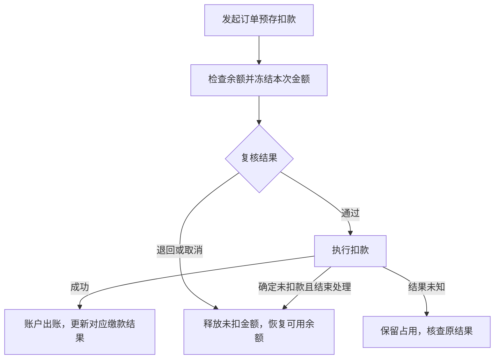
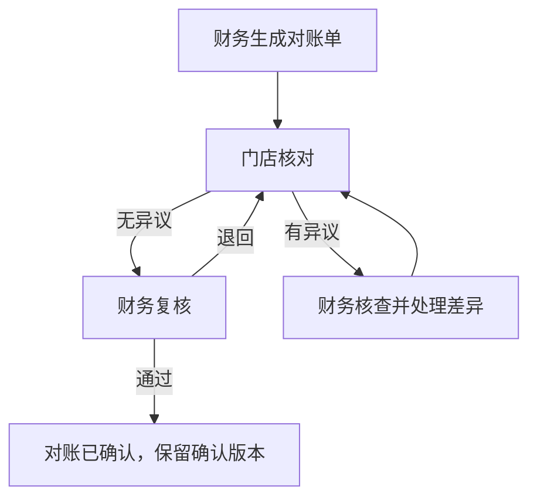

# 门店模块开发问题与产品答复

更新日期：2026-09-14

本文结合项目整体业务流程和现有HTML原型，直接回答门店开发涉及的16个产品问题。回答说明功能应该怎样组织、由谁处理、前后环节如何衔接；原型中的金额、时限等示例不作为已确定的业务规则。

## 1. 一个门店的档案审批、销售授权、财务配置、营业状态怎样关联？

门店只维护一份档案，档案准入、销售授权、财务配置分别审核，审批统一进入审批中心。

新建门店为“待开通”，可以补资料、保存订单草稿。档案准入通过并到达开通日后，合作状态转为“正常”。具体能做什么，还要看相应配置：销售授权生效才能正式预订；资源及付款条件满足才能确认订单；签约公司和合同条件满足才能发合同；财务配置生效后才能使用对应收款方式。

门店详情集中展示这些审核结果和缺少的条件。某一项退回，只补充这一项，不能把其他已通过的内容全部重置，也不能因档案通过就放开所有功能。具体准入材料和审批岗位由门店运营、销售及财务分别提供。

## 2. 档案、销售授权、收款账户变更如何审批、生效及保留旧资料？未来日期遇到审批延迟怎么处理？

变更从门店详情发起，展示修改前后内容、原因和期望生效日期。提交后先形成变更申请，不能直接覆盖当前有效资料；退回后可补充重提，撤回后可修改。

新版必须“审批通过且到达生效时间”才启用。如果原定15日生效、18日才批准，就从18日生效，不自动追溯修改15日至17日的业务。选择“下账期生效”时，页面要显示具体日期。

审批期间继续使用仍有效的旧资料；旧资质已经到期，不因续签在审自动延长。历史订单和已发合同保留当时采用的资料，确需修改时走订单或合同变更。资质提前多久提醒、到期有无宽限期及限制哪些动作，仍需运营和法务确定。

## 3. 暂停、恢复如何作用于产品预订、合同、售后、账户及对账？

**暂停只停止新增业务，历史业务必须有人继续处理。** 合作状态、员工账号和资金账户分别控制。

| 操作  | 产品需求                                                                      |
| --- | ------------------------------------------------------------------------- |
| 暂停  | 禁止新订单和新增名额占用。历史订单仍可查询，必要的补收款、补签合同、售后、退款和对账由有权限的负责人处理；暂停期间不允许通过增加人数等变更扩大业务 |
| 恢复  | 检查资质、销售授权和财务条件，批准后恢复新业务。资金账户若另有冻结，需要单独解冻                                  |

门店详情保留未完订单、待处理退款和对账等入口；原负责人无法处理时，指定接手人。暂停不取消已有合同、不清零余额，也不关闭资金账户；恢复后已有订单继续按原记录处理。

## 4. 门店可售范围如何控制？销售授权调整后是否影响已有订单？

门店只销售获授权且当前允许销售的产品。销售配置保留可售产品范围，不能超出所属公司的授权范围；未发布、已停售的产品不能因为曾经授权就继续新售。

销售授权审批生效后用于新预订。下单时检查门店是否正常、产品是否仍可售及是否在授权范围内，不符合条件时说明原因。

调整授权不自动取消已有订单，也不改变原合同和已确认金额。已有订单继续办理履约、收款和售后；增加人数或新增产品时，重新检查当前授权和产品可售情况。

## 5. 预留、占位、确认、合同、收款和主体复核的顺序及相互限制是什么？

草稿不占名额；预留和人工占位在成功保留数量后开始计时。下单页和门店设置使用同一套规则，不能一处写48小时、另一处写永不释放。

订单确认前，检查销售授权、资源以及本单的付款条件。**订单已确认表示业务成立，不等于已收全款。** 收款截图、待认款和预存冻结都不算已支付。

“主体复核”拆成实际事项：计调或资源方确认资源，销售负责人核对销售授权，财务核对收款结果。订单详情直接显示缺哪一项、交给谁处理。

合同分为草稿、发起签署、签署完成。发起签署时检查适用模板、签约公司及付款等条件；合同与订单不能设置相互等待的前置条件。

到期时，普通未确认订单按规则释放；已付款、签署中、已签合同或已出票等情况交负责人处理，不直接取消或释放。名额已释放后才到账，要重新确认余位，不能直接变成已确认订单。

**这里仍需业务确定：** 保留时长、自动还是人工释放、延期规则、“先交团费”指全款还是定金，以及发合同的付款条件。由销售、计调、财务和法务确定各自负责的条件，订单流程使用统一确认后的规则执行。

## 6. 预存、单单结、月结是什么关系？支付商户及收款账户由哪里维护？

结算安排和付款方式分开设置：

| 设置   | 含义                                  |
| ---- | ----------------------------------- |
| 结算安排 | 单单结按订单核对结算，月结按月汇总核对；具体付款节点按已确认的规则执行 |
| 付款方式 | 转账、扫码、现金、预存抵扣等，决定使用什么方式支付           |

预存是先把款存入账户，再用于订单抵扣，可以与结算安排分别配置。选择月结不代表可以跳过订单付款条件；预存不足时，先补足余额或使用获准的其他付款方式。具体结算周期、付款节点由财务确定。

公司收付款账户和支付商户统一放在财务“资金管理”维护，补齐账户和商户配置入口。门店只选用获准的账户；门店向公司打款、门店代收客户款、门店接收分润或退款的账户分别标明用途。

默认账户变更审批生效后用于新交易。原收款继续保留原公司、账户和商户，退款仍按原交易处理；停用账户时停止新增收款，同时保留历史核对和退款承接。切换默认账户不能改变原合同或原收款责任。

## 7. “已有员工”从哪里取得？门店成员如何调整组织归属，停用影响多大？

员工统一来自**集团 admin 端的“集团统一组织架构”**。取消门店成员页“添加员工／添加已有员工”按钮，不在这里创建员工，也不通过手填姓名、手机号另建人员。

人员调整针对统一组织架构中的已有员工办理：选定人员后核对当前公司、部门和门店，调整目标组织归属及生效日期，按统一组织调整流程生效。门店成员名单随有效组织归属更新，不再单独维护另一份人员档案；该员工在门店的操作权限按角色另行控制。

停用某门店成员只撤销本店权限；全局离职或账号停用才影响全部门店。停用时列出其在办订单和客户，指定接手人；紧急停权后由公司负责人接管未交接事项。

交接只改变当前服务人，原订单的销售人员和历史业绩归属保留，不能随交接自动改成新员工的业绩。

## 8. 谁创建预存账户、何时给账号？整户冻结和金额冻结怎样区分？

门店在门店中心申请，财务审核开通；门店端和财务端使用同一个账户。开户内容若已在财务配置审批中完整核准，可沿用审批结果，不重复审批。正式账户号在开通成功时生成，申请阶段使用申请号。

账户要明确余额属于谁、由哪家公司负责、什么币种和用途。同一账户不能在两端各建一份。客户预存、门店预存、保证金和待结分润分别管理，不能直接加成一个可用余额。

**整户冻结**限制账户操作，但保留查询和对账，余额不清零；财务按冻结原因设置充值、退款、扣款等限制范围。**金额冻结**只占用某一笔金额，其余金额在账户正常时仍可使用。解除整户冻结，不代表同时释放订单已占用的资金。

账户恢复需解除对应限制；关闭前必须处理余额、冻结、在途申请及争议。关闭后保留历史，再次使用需重新办理开通。

## 9. 充值申请、真实流水、财务确认之间怎样关联？如何防止重复入账？

流程是：**门店提交充值申请 → 财务找到实际到账流水 → 核对并分配金额 → 确认充值 → 增加账户余额。** 提交申请或上传截图都不增加可用余额。

银行、支付渠道流水统一由财务到账模块接入、导入或登记。一笔流水可以分配给多次充值，也可以用多笔流水完成一次充值，但分配总额不能超过实际到账；订单认款和充值要共用同一笔款的剩余可分配金额。跨门店分配或他人代付，先由财务确认款项归属和允许范围。

少到账不能按申请全额入账，多到账的剩余部分留待认领。重复导入同一流水不新增到账；实际打了两次款则保留两笔，由财务决定分配或退款。被退回的申请在原单补充重提，保留原因和历史；已经确认入账的部分只能更正，不能撤回后抹掉。

## 10. 订单扣款怎么连接预存、收款记录和库存？取消、改单、失败如何恢复？

采用“先占用金额，再复核扣款”的流程。需要人工复核的交财务；符合已批准自动处理规则的，由系统检查后执行同一流程。

冻结只减少可用金额，正式扣款才减少账面余额并形成缴款结果。扣的是门店结算款，就更新门店缴款，不能因此把客户应付标成已收齐；预存抵扣也不新增第二笔银行到账。

取消时，未扣金额直接释放，已扣金额走退款。涨价只补差额，降价先释放未扣差额，已扣超额再退回。重复操作不能多扣；结果不明时先查清，不能先释放后又收到扣款成功结果。

名额占用和资金冻结分别处理。资金退款不代表已出票等资源也能直接退回库存。

**这里仍需财务和销售确定：** 在哪个订单节点发起扣款，扣定金、全款还是门店结算金额，以及哪些情况免人工复核。

## 11. 退款转预存与管理费分别由谁发起、何时改变余额？

这两件事分开处理。

**退款转预存：** 从原订单售后发起，说明原收款、可退金额、拟退去向及留存同意依据。审批通过后由财务执行；转预存在实际完成入账时增加余额，现金退款在实际支付完成时标记已退。申请通过不能直接显示退款完成。

退款去向要看原付款和款项权益，不能因为订单来自门店，就把客户自己支付的钱转成门店余额。同一金额不能既退现金又转预存；转预存没有新的银行到账。

**管理费：** 依据门店收费协议按期生成收费单，再由财务扣预存或列为门店应缴。余额不足时保留未收金额，后续补扣、减免都关联原收费单，不直接修改账户余额，也不重复生成同一期费用。

**尚需业务给出：** 财务和售后确认允许转预存的情形及同意依据；门店运营和财务确定管理费金额、扣费日、首尾月算法、暂停期是否收费及不足时的补扣方式。原型中的费用示例不能直接使用。

## 12. 两端门店对账是否同一张单？生成、异议、复核、结账、补记怎么衔接？

同一门店、公司、币种、期间和对账类型，两端使用同一张单、同一份明细。门店负责核对，财务负责生成、处理差异和最终复核。

预存账户对账核对余额和出入账；订单结算核对订单结算金额、收款和门店承担费用。两类内容可以关联查看，但订单销售额不能直接算成账户入账。

支持按期自动生成和人工补生成，不能生成重复有效单。未完成充值、待扣款、退款在途单独附列，不提前算成实际收支。异议要定位到明细；金额变化先更正来源，再请门店核对新版。确认后发现漏记，保留原单，通过更正或补充对账处理。

对账完成只表示双方核对一致，不自动结清欠款、支付分润、关闭财务期间或生成财务凭证。现有原型“确认对账即生成凭证”的行为需要取消。

**尚需财务确定：** 对账周期和截止时间、未完成事项是否阻断最终确认，以及确认后的漏记计入本期还是后续期间。

## 13. 已批准的角色权限如何在门店、订单、合同、财务等模块保持一致？

使用统一角色和数据范围，不能由各页面分别判断。权限同时决定“能看谁的数据、能做什么、能看哪些金额”，页面、详情和导出保持一致。

功能分工如下，具体人员按批准的角色授权：

| 角色         | 主要功能                               |
| ---------- | ---------------------------------- |
| 门店运营、公司管理员 | 门店档案、销售配置、成员管理和交接，不因管理员身份自动取得资金确认权 |
| 店长         | 获授权的本店订单、成员及经营管理                   |
| 店员、销售顾问    | 本人负责或获授权订单的报价、合同、认款和售后申请           |
| 客服         | 已分配客户和订单的服务处理                      |
| 门店财务联系人    | 本店充值申请、账户查询及对账核对                   |
| 公司财务       | 按岗位处理到账确认、扣款复核、退款执行和财务对账           |

组织归属调整生效后引用相应门店角色权限，个人例外单独授权并设有效期；离岗或停用后及时失效。审批权单独配置，不能因能编辑一张单就能审批它。

业务只需补充尚未批准的具体授权，例如店员能否看全店订单、谁能看资金明细和利润、申请人能否审批自己的申请；跨模块如何保持一致由系统按上述方式实现。

## 14. 门店、成员、变更单、预存账户、充值单、扣款单、对账单的状态怎么统一？

每类对象用自己的主状态，不把业务阶段、审批结果和风险提示混成一组。各页面统一名称和含义，主要状态如下：

| 对象   | 主要状态与处理                                         |
| ---- | ----------------------------------------------- |
| 门店   | 待开通、正常、暂停；恢复是从暂停回到正常                            |
| 门店成员 | 待生效、正常、已停用；组织归属和角色变更的审批另看申请记录                   |
| 变更单  | 草稿、审批中、已退回、已撤回、待生效、已生效；退回或撤回可修改重提，已生效内容通过新变更调整  |
| 预存账户 | 正常、冻结、已关闭；余额不足、充值中只作提醒，不替代账户状态                  |
| 充值单  | 待核对、待补充、部分已确认、已确认；未入账可以撤销，已入账通过更正处理             |
| 扣款单  | 待复核、待执行、执行中、已扣款；退回、撤销和确定失败释放未扣金额，结果未知保留“待核查”    |
| 对账单  | 草稿、待门店确认、异议处理中、待财务复核、财务退回、已确认；金额变化重新核对，已确认单保留历史 |

“审批通过”与“实际处理成功”分开。例如扣款已批准但尚未执行，不能显示已支付。即时生效按批准时间，指定日期需同时满足已批准和日期已到，下账期生效要显示具体日期。

## 15. 余额、可用、冻结、在途、欠款怎样计算？营业额、实收和顾问业绩从哪里来？

账户资金与经营业绩分开显示，门店端和财务端使用同一组资金明细。

| 金额   | 产品定义                                     |
| ---- | ---------------------------------------- |
| 账面余额 | 期初余额＋已确认入账－已确认出账，包含被冻结的部分                |
| 冻结金额 | 已被订单扣款、账户退款等有效占用，暂时不能另用的金额               |
| 可用余额 | 账面余额－冻结金额；整户冻结限制使用，但不把账面数清零              |
| 在途金额 | 尚未完成的充值、退款、扣款分别列示，不提前计入已完成收支，也不重复扣减已冻结金额 |
| 欠款   | 应缴金额扣除已确认缴款和批准调整；超过付款到期日的未缴部分列为逾期        |

例如余额1,000元，冻结300元后可用700元；扣款成功后余额700元、冻结0元；如果退回，则余额仍1,000元、冻结0元、可用恢复1,000元。当前原型退回只减冻结的逻辑需要修正。

账户月度收支按入出账确认时间统计，申请时间、银行实际到账时间另保留。门店营业额和顾问业绩引用系统共同订单报表，回团业绩引用实际完成记录；原销售归属与当前服务人分开。订单支付中客户款和门店结算款分别核对，预存抵扣不重复计算银行收款。

充值不是营业额，收款也不能直接当作利润。有效订单范围、退款冲减期间及业绩考核日期沿用财务和销售统一规则，尚未确认的口径由相应负责人确定，门店不另算一套。

## 16. 支付商户、银行流水、收款账户、合同模板、员工、产品库存由哪个模块维护？门店操作后要更新什么？

资料在所属模块维护，门店引用，不重复建另一套。

| 资料或业务         | 负责模块与门店使用方式                                                  |
| ------------- | ------------------------------------------------------------ |
| 公司、组织、员工及组织归属 | 统一引用集团 admin 端“集团统一组织架构”；人员操作仅调整已有员工的组织归属，生效后更新门店成员名单，不创建新员工 |
| 门店档案及合作关系     | 门店中心维护；订单、财务、权限共用同一门店资料                                      |
| 产品内容          | 产品模块维护；门店在授权范围内销售                                            |
| 团期、可售名额、资源确认  | 履约中心的团期管控或资源调度负责；门店查询和申请占用                                   |
| 合同模板          | 系统设置的合同模板入口维护，由法务或授权人员审核；订单使用适用版本                            |
| 公司收付款账户、支付商户  | 财务资金管理维护；门店选用获准账户和方式                                         |
| 银行、支付流水       | 财务到账模块统一取得；订单认款和充值共同引用                                       |
| 审批            | 审批中心处理；来源页面展示结果，并执行相应生效动作                                    |
| 预存、收退款、对账     | 财务确认和执行；门店查询、申请及核对                                           |
| 门店经营数据        | 数据中心共同报表提供；门店只看有权限的范围                                        |

充值确认后更新账户余额；订单扣款成功后更新账户及对应缴款结果；退款完成后更新原收款和退款去向；对账确认只更新对账结论。各详情页保留关联单据和处理记录，方便追查。

某一步未成功，要显示处理中或失败及处理入口；已经完成的资金操作不能因另一页面没更新而再执行一次。
