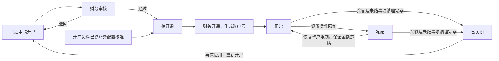

# 门店预存账户第四批原型验收记录

> 2026-09-15撤回说明：门店预存、财务预存两页已恢复改造前版本；相关审批改动保留。本文相关验收仅为历史证据，当前状态见[八页撤回记录](门店指定八页撤回记录-20260915.md)。

日期：2026-09-14。范围：缺口清单第8组，门店与财务两端的预存账户开户、整户冻结、恢复及关闭。

## 本批解决了什么

门店负责人从已核准的门店财务资料发起开户，公司财务负责人审核，公司财务执行开通。账户用于承接后续门店充值、订单预存扣款及余额退款；实际资金办理仍在财务模块。门店可以查看进度、限制及历史记录，不能直接冻结、恢复或关闭财务账户。

原门店页把充值中、扣款复核中和余额不足当成账户状态；财务页把金额冻结与整户冻结混用，并存在冻结金额归零就恢复账户的代码。本批将账户主状态统一为正常、冻结、已关闭，申请进度与账户状态分开，删除金额归零自动恢复和余额不足改变账户状态的逻辑。

## 页面与操作

| 页面／入口 | 本批功能 | 开发应理解的结果 |
|---|---|---|
| 门店 → 预存余额 → 申请开户 | 选择已有门店，带入余额归属方、负责公司、币种和用途；填写开户资料说明；保存草稿、提交、撤回、退回补充及重提 | 提交后仅产生申请号。相同余额归属方、公司、币种、用途已有有效账户或在途申请时不能重复提交 |
| 两端 → 开户申请 | 展示申请状态、核准记录和开户结果；未开通时不显示正式账户号 | 申请状态使用草稿、审批中、已退回、已撤回、待开通、已开通。与账户正常、冻结、已关闭分开 |
| 审批中心 → 预存账户开户 | 核对余额归属、公司、币种、用途、协议及资料；支持通过或退回 | 审核通过仅说明资料核准，后续交公司财务开通。已随财务配置完整核准的申请引用原记录，不重复审批 |
| 财务 → 预存账户 → 开户申请 → 开通账户 | 对待开通申请执行开通，生成新账户号和零余额账户，保留原申请号及核准依据 | 门店不能直接开通；审批中不能开通；同一申请不能重复开通 |
| 两端 → 预存账户 → 账户 | 展示归属、公司、币种、用途、账面余额、金额冻结、可用余额、整户限制及历史 | 两端相同门店使用相同账户号及金额。客户预存独立保留，保证金及待结收益不合并为门店可用余额 |
| 财务 → 账户 → 整户冻结／恢复账户 | 冻结时填写原因，选择限制充值、订单扣款、余额退款中的一项或多项；恢复时填写原因 | 仅改变整户限制，不改变账面余额、逐笔冻结或可用余额计算。恢复后原订单金额冻结仍有效 |
| 财务 → 账户 → 关闭账户 | 同时检查账面余额为零、金额冻结清零、在途申请处理完毕、争议事项结清 | 任一条件不满足不能关闭。通过后保留账户资料和处理记录，不能直接恢复为正常 |
| 门店 → 已关闭账户 → 重新申请开户 | 重新提交开户资料，使用新的申请号 | 原账户和历史号保留；再次开通生成新账户号 |



财务一级列表保留账户、类型、负责公司、可用余额、金额冻结和主状态；待处理项及最近变动放回交易明细，避免挤压账户号及主状态。操作列固定在右侧，窄屏在表格内横向滚动。

## 验收证据

- 6项规则测试通过：整户冻结不改资金、恢复保留占用、岗位及必填校验、关闭四项检查、核准后开通、防重复及关闭后重开。
- 16组Chrome浏览器检查通过，分别覆盖直接打开本地HTML及临时HTTP服务；包括开户草稿与重提、关闭历史、旧充值入口限制、审批中心、窄屏横向滚动和固定操作列。无页面脚本报错。
- 前一批收付款配置的9项规则测试、16组浏览器回归通过。未开展全站验收。
- 关键算例：泉州鲤城账户账面14,200元，金额冻结8,000元，可用6,200元；恢复整户限制后这三个金额不变。东海待开通申请开通后为零余额账户，满足四项检查后可关闭。

源码：

- [门店预存入口](../merchant/sales/store/predeposit.html)、[财务预存入口](../merchant/finance/finance-predeposit.html)、[审批中心](../merchant/approval/approvals.html)。
- [共同账户规则及示例](../shared/predeposit-control-model.js)、[账户与申请交互](../shared/predeposit-control.js)、[局部样式](../shared/predeposit-control.css)。
- [规则测试](../tests/predeposit-control.test.cjs)、[浏览器检查](../tests/predeposit-control-browser.cjs)。

复验命令（本机）：

```sh
node --test tests/predeposit-control.test.cjs tests/fund-account.test.cjs
NODE_PATH=/Users/qiu/.cache/codex-runtimes/codex-primary-runtime/dependencies/node/node_modules node tests/predeposit-control-browser.cjs
NODE_PATH=/Users/qiu/.cache/codex-runtimes/codex-primary-runtime/dependencies/node/node_modules node tests/fund-account-browser.cjs
```

截图及浏览器结果位于 `/private/tmp/caesar-predeposit-control-qa/`，包括账户列表、关闭详情、窄屏及 `results.json`；它们是本次本机验收文件，临时目录清理后可重跑生成。

## 原型边界与剩余问题

本批为页面内交互演示，刷新恢复示例。审批中心与来源页分别演示待审、退回和已核准场景，不进行跨页审批回写，不接真实账户、资金、附件存储或岗位权限服务。新提交的开户申请不会同步生成另一页面的真实审批单；原型通过预置的三份对应申请说明流程。开户资料说明不是实际文件上传成功的证明。

账户、公司及余额归属方均为演示资料，正式归属名单及财务核准材料需要财务提供；本批不新增待业务拍板的开户状态规则。恢复整户限制不等于解除门店销售暂停，两者作用对象不同。

旧交易明细、充值分配、扣款退回金额、退款留存、收费及完整账面流水计算仍按第9—14组实施。本批只统一开户与整户控制直接使用的账户资料和金额展示，不据此认定既有交易流水已经逐笔核平，不关闭第14组完整流水和确认日期缺口。未改报表办理或履约中心团期订单页面。

唯一下一步：第9组门店充值与财务复核，补到账流水选择、金额分配、部分确认及退回补充重提。
